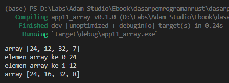
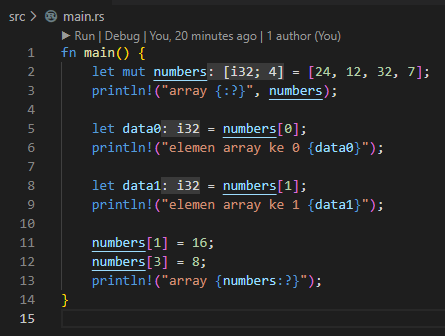
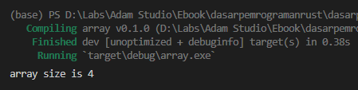
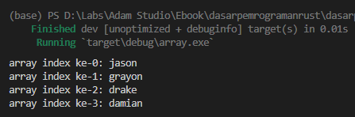

Pada chapter awal kita sudah mempelajari tipe data primitif jenis scalas. Selain *scalar types* ada juga tipe data primitif lainnya yaitu **compound types**. Compound types sendiri adalah jenis tipe data kolektif yang isinya banyak data. Kesemua data tersebut memiliki tipe data yang sama dan di-group menjadi satu.

Array adalah salah satu tipe data compound yang tersedia di Rust, dan pada chapter ini kita akan mempelajarinya.

## A.13.1. Pengenalan array

Menurut dokumentasi official Rust, array adalah:

> An array is a collection of objects of the same type T, stored in contiguous memory.
>
> A fixed-size array, denoted [T; N], for the element type, T, and the non-negative compile-time constant size, N.

Array (atau *fixed size array*) adalah kumpulan data dengan tipe sejenis, disimpan dalam 1 variabel. Array memiliki kapasitas yang nilainya ditentukan saat deklarasi/alokasi. Jumlah data dalam array pasti tidak boleh lebih dari kapasitas yang sudah ditentukan di awal. Data dalam array biasa disebut dengan *element* atau item.

Ada beberapa notasi deklarasi array yang bisa dipakai, kesemuanya akan dibahas pada chapter ini.

Ok, Sekarang kita mulai praktik dengan bermain-main terlebih dahulu dengan tipe data array ini. Silakan pelajari dan praktekan contoh berikut, sebuah program yang isinya menampilkan data array.

```rust
let mut numbers = [24, 12, 32, 7];
println!("array {:?}", numbers);

let data0 = numbers[0];
println!("elemen array ke 0 {data0}");

let data1 = numbers[1];
println!("elemen array ke 1 {data1}");

numbers[1] = 16;
numbers[3] = 8;
println!("array {numbers:?}");
```

Coba jalankan aplikasi, muncul dua baris output di console.



Selanjutnya mari kita bahas dengan detail contoh di atas.

### ◉ Deklarasi variabel array (*type inference*)

Variabel `numbers` dideklarasikan sebagai array *mutable* dengan metode deklarasi type inference, yang tipe datanya didapat langsung dari nilai.

Value dari `numbers` adalah `[24, 12, 32, 7]`, yang dimana artinya sebuah array dengan size 4, bertipe numerik, dengan isi `24`, `12`, `32`, `7`.

Sintaks `[24, 12, 32, 7]` adalah salah satu cara menulis literal array. Tulis saja data yang diinginkan dengan separator `,` dan diapit tanda kurung siku `[ ]`.

Contoh lain deklarasi array:

```rust
let mut alphabets = ["a", "b", "c", "d"];
let booleans = [true, false];
let floatingNumbers = [32.0000078, 3.14, 0.5];
```

O iya, penulisan literal array juga bisa dituliskan dalam multi-baris, contohnya seperti berikut:

```rust
let mut alphabets = [
    "a",
    "b",
    "c",
    "d"
];
let booleans = [
    true,
    false
];
```

### ◉ Pengaksesan elemen array

Pengaksesan elemen array dilakukan dengan menuliskan nama variabel array kemudian diikuti kurung siku yang mengapit angka indeks elemen yang diinginkan.

Indeks array dimulai dari 0. Pada contoh di atas, `numbers` size-nya adalah 4 elemen, berarti elemen array ada pada indeks ke 0, 1, 2, 3.

```rust
let data0 = numbers[0];
println!("elemen array ke 0 {data0}");

let data1 = numbers[1];
println!("elemen array ke 1 {data1}");
```

Array hanya bisa diakses elemennya sesuai size saat deklarasi. Sebagai contoh, variabel `numbers` yang size nya 4, jika dipaksa mengakses elemen indeks ke-7 maka akan menghasilkan error.

### ◉ Mengubah isi elemen array

Array bisa diubah isi elemen-nya jika variabel tersebut adalah `mutable`. Pada contoh yang sudah dibuat, variabel `numbers` dideklarasikan mutable dengan tipe data elemen adalah numerik. Dengan ini kita bisa merubah value elemen array dengan value baru bertipe data sama.

Bisa dilihat pada contoh yang sudah dipraktekan, elemen indeks ke-1 diubah nilainya menjadi `16`, dan elemen indeks ke-3 value-nya menjadi `8`

```rust
numbers[1] = 16;
numbers[3] = 8;
```

Array hanya bisa diubah elemen-nya sesuai size saat deklarasi. Sebagai contoh, variabel `numbers` yang size nya 4, jika dipaksa mengakses dan/atau mengubah elemen indeks ke-7 maka akan menghasilkan error.

Selain itu, operasi assignment atau pengubahan nilai pada elemen array hanya bisa dilakukan dengan tipe data yang sama. Pada contoh di atas `numbers` adalah array bertipe numerik, karenanya tidak akan bisa diubah nilai elemen-nya dengan tipe lain, dan jika dipaksa akan menghasilkan error.

### ◉ Formatted print `{:?}`

Formatted print `{:?}` berguna untuk memformat macam-macam tipe data ke bentuk string, yang salah satunya adalah tipe data array. Dengan menggunakan formatted print ini kita bisa menampilkan nilai elemen array dalam bentuk string.

```rust
println!("array {:?}", numbers);
```

### ◉ Formatted print `{namaVariabel:?}`

Formatted print `{namaVariabel:?}` kegunaannya sama seperti `{:?}`, dengan perbedaan: pada penggunaan formatted print `{namaVariabel:?}` tidak perlu menuliskan variabel yang ingin di-format sebagai argumen. Cukup ganti `namaVariabel` dengan nama variabel yang ingin di-format.

Silakan lihat contoh berikut. Keduanya adalah ekuivalen, menghasilkan nilai yang sama.

```rust
println!("array {:?}", numbers);
println!("array {numbers:?}");
```

## A.13.2. Notasi penulisan tipe data array

Pada contoh program yang sudah dipraktekan, variabel `number` tipe datanya adalah array numerik, terlihat saat deklarasinya *predefined value* diisi dengan literal elemen array bertipe `i32`.

Tipe data `i32` di sini adalah milik elemen array, sedang array `numbers` itu sendiri tipe datanya adalah `[i32; 4]`, yang artinya adalah **sebuah array dengan elemen bertipe `i32` dengan size `4`**.

Jika kawan-kawan menggunakan ekstensi VSCode `rust-analyzer`, akan terlihat informasi tipe data array-nya.



## A.13.3. Macam-macam deklarasi array

Array lebih mudah dideklarasikan dengan metode *type inference*. Namun tak menutup kemungkinan ada kebutuhan dimana array harus dideklarasikan dengan menuliskan tipe datanya secara eksplisit. Berikut adalah macam-macam cara mendeklarasikan array.

### ◉ Deklarasi array dengan metode *type inference*

```rust
let angka_integer = [24, 12, 32, 7];
println!("{angka_integer:?}");
// output: [24, 12, 32, 7]

let angka_float = [24.2, 12.5, 32.00002, 7.2];
println!("{angka_float:?}");
// output: [24.2, 12.5, 32.00002, 7.2]
```

### ◉ Deklarasi array dengan metode *manifest typing* disertai *predefined value*

```rust
let data_boolean: [bool; 2] = [false, true];
println!("{data_boolean:?}");
// output: [false, true]

let angka_unsigned_integer: [u32; 3] = [24, 0, 12];
println!("{angka_unsigned_integer:?}");
// output: [24, 0, 12]
```

### ◉ Deklarasi array dengan notasi penulisan `[T; N]`

Pada contoh berikut, `data_numerik1` dideklarasikan bertipe array dengan tipe data data elemen adalah `i32`, mempunyai size `10`, dengan *predefined value* untuk setiap elemen array adalah angka `0`.

```rust
let data_numerik1: [i32; 10] = [0; 10];
println!("{data_numerik1:?}");
// output: [0, 0, 0, 0, 0, 0, 0, 0, 0, 0]
```

Pada contoh ke-dua ini, `data_numerik2` dideklarasikan dengan *predefined value* adalah array yang size-nya `5` dan nilai default tiap elemen adalah angka `4`.

```rust
let data_numerik2 = [4; 5];
println!("{data_numerik2:?}");
// output: [4, 4, 4, 4, 4]
```

Tambahan penjelasan mengenai notasi penulisan `[T; N]`:

- Jika digunakan pada penulisan tipe data array saat deklarasi, `T` adalah tipe data elemen, dan `N` adalah lebar/size array. Contoh: `let data_numerik1: [i32; 10]`.
- Jika digunakan pada penulisan *predefined value*, `T` adalah nilai setiap elemen array, dan `N` adalah lebar/size array. Contoh: `[4; 2]`, yang artinya semua elemen array diisi dengan angka `4`.

## A.13.4. Melihat size array menggunakan method `len`

Array secara *default* properti tipe data **slice**, yang salah satunya adalah method bernama `len` yang berguna untuk melihat size dari sebuah array. Cara penggunaannya cukup dengan menuliskan `.len()` setelah variabel array. Contoh:

```rust
let names = ["jason", "grayon", "drake", "damian"];
let length = names.len();
println!("array size is {}", length);
```



> Lebih jelasnya mengenai slice dibahas pada chapter [Slice](/basic/slice)

## A.13.5. Iterasi array menggunakan `for in`

Pada contoh berikut, variabel `names` adalah array bertipe `[&str; 4]`, dideklarasikan dengan *predefined value*. Elemen array tersebut kemudian diiterasi menggunakan `for in` untuk di-print ke layar console value setiap elemennya.

```rust
let names: [&str; 4] = ["jason", "grayon", "drake", "damian"];
for name in names {
    println!("{name}");
}
```


Bisa juga dengan memanfaatkan *range syntax* dalam perulangan array. Benefitnya adalah pengaksesan indeks array lebih mudah.

```rust
let names: [&str; 4] = ["jason", "grayon", "drake", "damian"];
for i in 0..names.len() {
    println!("array index ke-{}: {}", i, names[i]);
}
```



Statement `names.len()` mengembalikan informasi size sebuah array, nilainya bisa dimanfaatkan dalam perulangan `for in` untuk iterasi indeks ke-0 hingga terakhir.

## A.13.6. Iterasi array menggunakan `while` dan `loop`

Contoh iterasi array menggunakan keyword `while`:

```rust
let names: [&str; 4] = ["jason", "grayon", "drake", "damian"];

let mut i = 0;
while i < names.len() {
    println!("array index ke-{}: {}", i, names[i]);
    i += 1;
}
```

Contoh iterasi array menggunakan keyword `loop`:

```rust
let names: [&str; 4] = ["jason", "grayon", "drake", "damian"];

let mut i = 0;
loop {
    if i >= names.len() {
        break;
    }

    println!("array index ke-{}: {}", i, names[i]);
    i += 1;
}
```

Iterasi array menggunakan `while` dan `loop` umumnya kurang praktis jika dibandingkan dengan `for in`. Tapi pastinya ada case dimana `while` dan/atau `loop` akan dibutuhkan.

## A.13.7. Iterasi array menggunakan `for in` dan *tuple*

Mengiterasi value sekaligus *counter* perulangan sebenarnya bisa juga dilakukan menggunakan `for in`, contohnya seperti yang sudah kita praktekan di atas yaitu `for i in 0..names.len()`.

Ada juga bentuk lain pemanfaatan `for in` untuk mengiterasi sebuah array. Caranya dengan menggunakan teknik tuple untuk menampung data *counter* sekaligus value tiap elemen. Lebih jelasnya silakan lihat dan praktekan contoh berikut:

```rust
let names: [&str; 4] = ["jason", "grayon", "drake", "damian"];

for (i, name) in names.iter().enumerate() {
    println!("array index ke-{i}: {name}");
}
```


Variabel `names` yang notabene bertipe data `[&str; 4]` perlu dikonversi ke tipe `Iterator` terlebih dahulu caranya lewat pemanggilan method `.iter()`. Kemudian dari tipe tersebut perlu dikonversi lagi ke tipe `Enumerate` dengan cara memanggil method `.enumerate()`.

Setelah mendapatkan objek bertipe `Enumerate`, keyword `for in` digunakan untuk menampung tiap elemen array dalam bentuk *tuple* `(i, name)`. Variabel `i` disitu berisi counter iterasi, dan `name` adalah value-nya.

> - Lebih jelasnya mengenai traits dibahas pada chapter [Traits](/basic/traits)
> - Lebih jelasnya mengenai `Enumerate` dibahas pada chapter [Trait → Iterator](/wip/trait-iterator)
> - Lebih jelasnya mengenai tuple dibahas pada chapter [Tuple](/basic/tuple)

## A.13.8. Append elemen ke array

Operasi menambahkan sebuah elemen ke array yang hasilnya melebihi kapasitas ... adalah tidak bisa. Karena array memiliki size fixed, tidak dinamis. Solusinya adalah menggunakan tipe data Vector. Nantinya array perlu dikonversi ke bentu Vector terlebih dahulu kemudian di-append, lebih jelasnya kita bahas pada chapter [Vector](/basic/vector).

## A.13.9. Nested array

Data nested array bisa dibuat dengan level kedalaman tanpa batas, tetapi harus mengikuti aturan tipe data array yaitu: fixed size dan elemen bertipe data sejenis.

Pada contoh berikut variabel `data_arr` didefinisikan sebagai sebuah array bersarang atau nested dengan kedalaman 2 level.

```rust
let data_arr = [
    ["salad", "fried rice"],
    ["apple", "coconut"],
    ["spinach", "jalapeno"],
];
for sub_arr in data_arr {
    for el in sub_arr {
        print!("{el}, ");
    }
    println!();
}

// salad, fried rice,
// apple, coconut,
// spinach, jalapeno,
```

Variabel `data_arr` pada contoh di atas bertipe data`[[&str; 2] 3]`, yang artinya adalah sebuah array dengan size 3, dengan isi elemen adalah juga array dengan size 2. Selalu ingat bahwa size array adalah fixed.

---

## Catatan chapter 📑

### ◉ Source code praktik

<pre>
    <a href="https://github.com/novalagung/dasarpemrogramanrust-example/tree/master/array">
        github.com/novalagung/dasarpemrogramanrust-example/../array
    </a>
</pre>

### ◉ Chapter relevan lainnya

- [Slice (Basic)](/basic/slice)
- [Tipe Data → Vector](/basic/vector)
- [Slice Memory Management](/basic/slice-memory-management)

### ◉ Referensi

- https://doc.rust-lang.org/std/primitive.array.html
- https://doc.rust-lang.org/std/primitive.slice.html
- https://doc.rust-lang.org/std/iter/index.html
- https://doc.rust-lang.org/std/iter/struct.Enumerate.html
- https://doc.rust-lang.org/std/iter/trait.Iterator.html
- https://doc.rust-lang.org/rust-by-example/trait/iter.html
- https://doc.rust-lang.org/rust-by-example/flow_control/for.html

---
