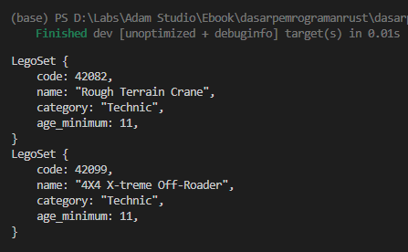
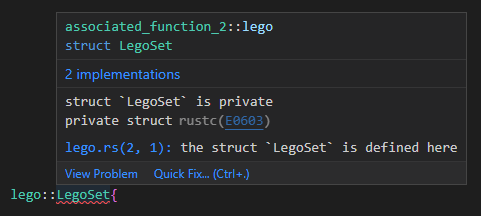

Chapter ini membahas tentang *associated function*. Kita akan belajar apa itu associated function dan apa perbedannya dengan fungsi biasa.

## A.24.1. *Associated item* & *associated function*

*Associated item* adalah item yang memiliki asosiasi/hubungan dengan struct atau trait. Item di sini bisa dalam banyak hal, bisa berupa fungsi atau lainnya.

Fungsi yang terhubung dengan suatu struct atau trait disebut dengan *associated function*. Fungsi jenis ini ekuivalen seperti fungsi biasa, perbedaannya adalah pada deklarasinya yang harus berada di dalam blok kode `impl`, dan pemanggilannya harus menggunakan notasi path `NamaStruct::nama_fungsi`.

> - Lebih jelasnya mengenai trait dibahas pada chapter [Traits](/basic/traits)
> - Lebih jelasnya mengenai macam-macam item dibahas pada chapter [Path & Item](/basic/path-item#a183-rust-items)

Ok, mari kita lanjut ke bagian praktik. Silakan tulis kode berikut terlebih dahulu.

```rust
#[derive(Debug)]
struct LegoSet {
    code: i32,
    name: String,
    category: String,
    age_minimum: i32,
}

fn main() {
    let rough_terrain_crane = LegoSet{
        code: 42082,
        name: String::from("Rough Terrain Crane"),
        category: String::from("Technic"),
        age_minimum: 11,
    };

    println!("{:#?}", rough_terrain_crane);
}
```

Sebuah struct bernama `LegoSet` didefinisikan memiliki 4 buah property. Di blok kode fungsi `main`, dibuat sebuah variabel bernama `rough_terrain_crane` yang merupakan object/instance dari struct `LegoSet`, kemudian object tersebut di-print.

> Object struct bisa di-print menggunakan macro `println` karena pada definisi struct ditambahkan attribute `#[derive(Debug)]`.
>
> Lebih detailnya mengenai attribute dibahas pada chapter [Attributes](/basic/attributes).

Selanjutnya kita siapkan dua buah fungsi yang berasosiasi dengan struct `LegoSet`.

## A.24.2. Keyword `impl`

Keyword `impl` digunakan untuk membuat *associated item*.

Pada konteks ini keyword tersebut digunakan untuk membuat *associated function* untuk struct `LegoSet`, sebuah fungsi bernama `new` dengan tugas adalah untuk membantu pembuatan object `LegoSet`.

Silakan tambahkan blok kode `impl` berikut setelah definisi struct `LegoSet`.

```rust
#[derive(Debug)]
struct LegoSet {
    code: i32,
    name: String,
    category: String,
    age_minimum: i32,
}

impl LegoSet {

    fn new(code: i32, name: String, category: String, age_minimum: i32) -> LegoSet {
        LegoSet { code, name, category, age_minimum }
    }
}
```

Notasi penulisan keyword `impl` bisa dilihat pada contoh di atas, cukup tulis saja keyword tersebut diikuti nama struct yang diinginkan, kemudian diikuti dengan blok kode berisi definisi fungsi.

Fungsi dalam blok kode `impl` adalah yang disebut dengan *associated function*. Pada contoh di atas, fungsi `new` memiliki asosiasi dengan struct `LegoSet`.

Lanjut, panggil fungsi `new` tersebut untuk membuat object baru bernama `xtreme_offroader` lalu print isinya.

```rust
fn main() {
    let rough_terrain_crane = LegoSet{
        code: 42082,
        name: String::from("Rough Terrain Crane"),
        category: String::from("Technic"),
        age_minimum: 11,
    };
    println!("{:#?}", rough_terrain_crane);
    
    let xtreme_offroader = LegoSet::new(
        42099, 
        String::from("4X4 X-treme Off-Roader"), 
        String::from("Technic"), 
        11,
    );
    println!("{:#?}", xtreme_offroader);
}
```



Bisa dilihat pada blok kode `main`, cara pemanggilan associated function adalah dengan menuliskan nama struct diikuti nama fungsi dengan notasi penulisan path.

```rust
NamaStruct::nama_fungsi();
NamaStruct::nama_fungsi(arg1, arg2, arg3, arg4);
LegoSet::new(arg1, arg2, arg3, arg4);
```

Jadi seperti itu, semoga cukup jelas. Silakan berkreasi dengan menambahkan *associated function* lainnya agar makin terbiasa. Contoh:

```rust
impl LegoSet {

    fn new(code: i32, name: String, category: String, age_minimum: i32) -> LegoSet {
        LegoSet { code, name, category, age_minimum }
    }

    fn what_is_lego() {
        println!("Lego is a line of plastic construction toys")
    }
}

fn main() {
    LegoSet::what_is_lego();

    let xtreme_offroader = LegoSet::new(
        42099, 
        String::from("4X4 X-treme Off-Roader"), 
        String::from("Technic"), 
        11,
    );
    println!("{:#?}", xtreme_offroader);
}
```

### ◉ Fungsi `LegoSet::new`

O iya, sedikit tambahan info saja, fungsi `new` di-atas didefinisikan menggunakan metode [field init shorthand](/basic/struct#-field-init-shorthand).

```rust
fn new(code: i32, name: String, category: String, age_minimum: i32) -> LegoSet {
    LegoSet { code, name, category, age_minimum }
}

// ... adalah ekuivalen dengan ...

fn new(code: i32, name: String, category: String, age_minimum: i32) -> LegoSet {
    LegoSet {
        code: code,
        name: name,
        category: category,
        age_minimum: age_minimum
    }
}
```

### ◉ *Naming convention* associated function

Sesuai anjuran di [halaman dokumentasi Rust](https://rust-lang.github.io/api-guidelines/naming.html), snake case digunakan dalam penamaan associated function. Contoh:

```rust
impl NamaStruct {

    fn nama_associated_func() {
        // ...
    }
}
```

## A.24.3. Tipe data `Self`

Tipe data `Self` (perhatikan huruf `S`-nya adalah kapital) merupakan representasi untuk tipe data struct atau trait dimana blok kode `impl` dideklarasikan.

> Tipe data `Self` hanya bisa digunakan dalam blok kode `impl`

Sebagai contoh, pada kode yang sudah dipraktikkan, keyword `impl` diterapkan dalam pembuatan *associated items* untuk struct `LegoSet`. Dalam blok kode tersebut, tipe data `LegoSet` bisa diganti dengan `Self`.

Silakan lihat contoh dibawah ini, ada 4 buah cara deklarasi fungsi `new` yang kesemuanya adalah ekuivalen.

```rust
impl LegoSet {
    fn new(code: i32, name: String, category: String, age_minimum: i32) -> LegoSet {
        LegoSet { code, name, category, age_minimum }
    }
}
```

```rust
impl LegoSet {
    fn new(code: i32, name: String, category: String, age_minimum: i32) -> LegoSet {
        Self { code, name, category, age_minimum }
    }
}
```

```rust
impl LegoSet {
    fn new(code: i32, name: String, category: String, age_minimum: i32) -> Self {
        LegoSet { code, name, category, age_minimum }
    }
}
```

```rust
impl LegoSet {
    fn new(code: i32, name: String, category: String, age_minimum: i32) -> Self {
        Self { code, name, category, age_minimum }
    }
}
```

## A.24.4. Associated function dalam module

Struct adalah salah satu dari beberapa item yang ada di Rust. Struct bisa saja berada dalam sebuah module, baik inline maupun *normal* module.

Sekarang, kode yang sudah dipraktikkan di atas akan kita refactor. Struct `LegoSet` beserta associated items-nya dipindah ke module file bernama `lego`, dengan itu maka pemanggilan struct tersebut harus menggunakan path `lego::LegoSet`.

Kurang lebih struktur package mendi seperti ini:

```bash title="package source code structure"
my_package
│─── Cargo.toml
└─── src
     │─── lego.rs
     └─── main.rs
```


Ada yang aneh, padahal pemanggilan struct `LegoSet` sudah diganti menjadi `lego::LegoSet`, tapi kenapa ada error di kode? Silakan *hover* baris kode yang ada highlight merah, atau jalankan saja program untuk melihat detail errornya.



Error muncul karena struct `LegoSet` adalah private. Solusinya cukup tambahkan keyword `pub` dalam definisi struct beserta *associated function*-nya.

> Untuk blok kode `impl` tidak perlu ditambahi keyword `pub`

Ok, setelah update diaplikasikan, coba lihat lagi. Sekarang error-nya berubah, bagian baris pengisian property struct yang jadi error.


Error ini terjadi karena property dari struct terdeteksi sebagai **private**. Solusi yang bisa dipergunakan ada 2:

- Tambahkan saja keyword `pub` pada definisi property struct.

    ```rust title="src/lego.rs"
    pub struct LegoSet {
        pub code: i32,
        pub name: String,
        pub category: String,
        pub age_minimum: i32,
    }
    ```

- Atau, tetap biarkan property struct sebagai **private**, namun pada semua statement pembuatan object menggunakan tipe tersebut harus selalu dilakukan via `lego::LegoSet::new()`.

    ```rust title="src/main.rs"
    let object = lego::LegoSet::new(
        42099, 
        String::from("4X4 X-treme Off-Roader"), 
        String::from("Technic"), 
        11,
    );
    ```

Opsi mana yang paling pas? Pertanyaan ini jawabannya adalah tergantung kebutuhan dan *case*. Jika memang property struct di-desain agar private (tidak perlu diakses secara publik), maka gunakan saja associated function dalam pembuatan object-nya.

Namun jika memang ada kebutuhan salah satu property atau kesemuanya harus bisa diakses secara publik, maka tambahkan keyword `pub` sesuai kebutuhan.

## A.24.5. Tuple struct associated function

Sama seperti struct, tuple struct juga bisa memiliki *associated items*. Cara deklarasi dan pemanggilan item-nya juga sama.

Pada contoh berikut, tuple struct `Color` memiliki 3 buah associated functions, yaitu `red`, `green`, dan `blue`.

```bash title="package source code structure"
my_package
│─── Cargo.toml
└─── src
     │─── model.rs
     └─── main.rs
```

```rust title="src/model.rs"
#[derive(Debug)]
pub struct Color(i32, i32, i32);

impl Color {

    pub fn red() -> Self {
        Self(255, 0, 0)
    }

    pub fn green() -> Self {
        Self(0, 255, 0)
    }

    pub fn blue() -> Self {
        Self(0, 0, 255)
    }
}
```

```rust title="src/main.rs"
mod model;

fn main() {
    let red = model::Color::red();
    let green = model::Color::green();
    let blue = model::Color::blue();

    println!("{:#?} {:#?} {:#?}", red, green, blue);
    
    let random_color = model::Color(12, 25, 47);
    println!("{:#?} ", random_color);
}
```

Hmm, ada yang aneh, karena suatu alasan statement `model::Color` dianggap error.


Error ini sebenarnya mirip dengan error praktik sebelumnya, ketika mencoba membuat object baru dari struct sedangkan property struct tersebut adalah private.

Pada kasus struct, solusinya cukup dengan tambahkan keyword `pub` atau siapkan *associated function* untuk pembuatan object. Pada tuple struct, solusinya juga mirip, ada dua opsi yang bisa dipilih.

- Tambahkan saja keyword `pub` pada definisi parameter tuple struct.

    ```rust title="src/model.rs"
    // before
    pub struct Color(i32, i32, i32);

    // after
    pub struct Color(pub i32, pub i32, pub i32);
    ```

- Atau, tetap biarkan parameter tuple struct sebagai **private**, namun siapkan *associated function* baru untuk pembuatan object struct tuple, seperti ini:

    ```rust title="src/model.rs"
    // ...

    impl Color {
        pub fn new(r: i32, g: i32, b: i32) -> Self {
            Self(r, g, b)
        }

        // ...
    }
    ```

    ```rust title="src/main.rs"
    fn main() {
        // ...

        let random_color = model::Color::new(12, 25, 47);
        println!("{:#?} ", random_color);
    }
    ```

> Lebih jelasnya mengenai visibility property dibahas pada chapter [Module System ➜ Visibility & Privacy](/basic/visibility-privacy)

---

## Catatan chapter 📑

### ◉ Source code praktik

<pre>
    <a href="https://github.com/novalagung/dasarpemrogramanrust-example/tree/master/associated_function">
        github.com/novalagung/dasarpemrogramanrust-example/../associated_function
    </a>
</pre>

### ◉ Chapter relevan lainnya

- [Function](/basic/function)
- [Method](/basic/method)
- [Module System ➜ Visibility & Privacy](/basic/visibility-privacy)

### ◉ Referensi

- https://doc.rust-lang.org/book/ch05-03-method-syntax.html
- https://doc.rust-lang.org/std/keyword.impl.html
- https://doc.rust-lang.org/std/keyword.SelfTy.html
- https://doc.rust-lang.org/rust-by-example/fn/methods.html
