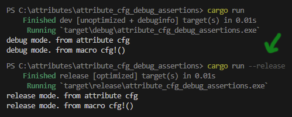

Kita telah beberapa kali menggunakan attributes pada chapter-chapter sebelumnya, contohnya seperti `#[derive(Debug)]`. Pada chapter ini kita akan bahas tentang attributes, macam-macam jenisnya, beserta kegunaannya.

## A.49.1. Konsep attributes

Attributes adalah metadata yang didefinisikan untuk suatu crate, module, atau module item. Kegunaan dari attributes sangat bermacam-macam.

Cara penerapan attributes adalah dengan menuliskannya tepat sebelum crate / module / module item, dengan notasi penulisan salah satu dari ketiga cara berikut (tergantung kebutuhannya).

- `#[attribute = "value"]`
- `#[attribute(key = "value")]`
- `#[attribute(value)]`

Contoh penerapan:

```rust
#[derive(Debug)]
struct LegoSet {
    code: i32,
    name: String,
    category: String,
    age_minimum: i32,
}
```

Pada kode di atas, attribute `derive` dengan trait `Debug` digunakan pada struct `LegoSet`. Dengan ini maka struct tersebut mengadopsi trait `std::fmt::Debug`. Efeknya, struct `LegoSet` bisa digunakan pada macro printing dan string formatting menggunakan `:#?`.

Rust mengenal beberapa jenis attributes, lebih jelasnya sikalan ikuti penjelasan berikut.

## A.49.2. Attribute `derive`

Attribute `derive` digunakan untuk mempermudah implementasi suatu trait ke tipe data.

Kita telah mempelajari cara implementasi trait pada chapter [Traits](/basic/traits) yaitu menggunakan keyword `impl` dan `for`, kemudian diikuti dengan method serta implementasinya.

Dengan memanfaatkan atribute `derive` kita tidak perlu menggunakan cara tersebut. Cukup tulis saja atribute `derive` beserta trait yang ingin diimplementasikan.

Agar lebih jelas, silakan pelajari contoh berikut:

```rust
const SuperheroSuperman: &str = "superman";
const SuperheroOmniMan: &str = "omniman";
const SuperheroHyperion: &str = "hyperion";

enum Superhero {
    Superman,
    OmniMan,
    Hyperion,
}

fn main() {
    let value: Superhero = Superhero::Superman;

    if value == Superhero::Superman {
        println!("hello superman!");
    }
}
```


Kode di atas menghasilkan error karena enum `Superhero` tidak mengadopsi trait `PartialEq` yang dimana trait ini diperlukan dalam seleksi kondisi menggunakan keyword `if` dan operator `==`.

Cara mengatasi error tersebut adalah dengan mengimplementasikan trait `PartialEq` secara eksplisit. Tambahkan kode berikut pada deklarasi enum `Superhero`, maka error akan hilang.

```rust
enum Superhero {
    Superman,
    OmniMan,
    Hyperion,
}

impl PartialEq for Superhero {

    fn eq(&self, other: &Self) -> bool {
        match (self, other) {
            (Superhero::Superman, Superhero::Superman) => true,
            (Superhero::OmniMan, Superhero::OmniMan) => true,
            (Superhero::Hyperion, Superhero::Hyperion) => true,
            _ => false,
        }
    }
}
```

Cara lain untuk mengatasi error di atas, selain menggunakan teknik implementasi trait secara eksplisit adalah dengan menggunakan atribute `derive` disertai trait `PartialEq`. Kurang lebih penulisan cara ini bisa dilihat di bawah ini. Cukup hapus block kode `impl` lalu tambahkan attribute pada deklarasi enum `Superhero`.

```rust
#[derive(PartialEq)]
enum Superhero {
    Superman,
    OmniMan,
    Hyperion,
}
```

Cukup mudah bukan?

Contoh lainnya, misalnya variabel `value` ingin di-print seperti pada kode berikut ini, pasti hasilnya error.

```rust
fn main() {
    let value: Superhero = Superhero::Superman;

    if value == Superhero::Superman {
        println!("hello superman!");
    }

    println!("{value} (via `Display` trait)");
    println!("{value:#?} (via `Debug` trait)");
}
```


Cara *resolve* error di atas adalah dengan mengimplementasikan trait `Display` dan `Debug` secara eksplisit. Atau, bisa juga menggunakan attribute `derive` yang pastinya lebih praktis.

Kabar buruknya, hanya trait `Debug` yang menyediakan fitur implementasi trait menggunakan attribute `derive`. Untuk trait `Display` kita perlu melakukan implementasi secara eksplisit.

> Untuk tau mana trait yang bisa di-*derive* atau tidak, cukup lihat saja *highlight* error yang muncul saat penulisan kode atau kompilasi.

Ok, kita implementasikan saja keduanya.

```rust
#[derive(PartialEq, Debug)]
enum Superhero {
    Superman,
    OmniMan,
    Hyperion,
}

impl std::fmt::Display for Superhero {

    fn fmt(&self, f: &mut std::fmt::Formatter<'_>) -> std::fmt::Result {
        write!(f, "{self:?}")
    }
}
```


Bisa dilihat, hasilnya program tereksekusi tanpa error. Enum `Superhero` kini mengadopsi 3 trait:

- Trait `PartialEq` via attribute `derive`
- Trait `Debug` via attribute `derive`
- Trait `Display` via implementasi eksplisit

## A.49.3. Attribute `cfg` / *configuration*

Attribute `cfg` digunakan untuk menentukan beberapa konfigurasi yang berhubungan dengan arsitekture hardware/prosesor.

Salah satu contoh penerapannya bisa dilihat pada kode berikut. Ada 2 buah modul yang namanya sama persis, perbedaannya adalah satu didefinisikan khusus untuk platform `linux`, dan satunya lagi untuk platform `windows`. Hal seperti ini bisa dilakukan menggunakan attribute `cfg` dengan key `target_os`.

```rust
#[cfg(target_os = "linux")]
mod util {

    pub fn say_hello() {
        println!("hello (from linux)")
    }
}

#[cfg(target_os = "windows")]
mod util {

    pub fn say_hello() {
        println!("hello (from windows)")
    }

    pub fn say_something() {
        println!("how are you")
    }
}
```

Bisa dilihat cara penulisannya adalah `cfg()` kemudian diisi key `target_os` dengan value adalah `windows` atau `linux`.

Dengan kondisi kode seperti di atas, ketika berada di sistem operasi `linux`, item `util::say_hello` bisa diakses. Sedangkan pada sistem operasi `windows`, item `util::say_hello` dan `util::say_something` bisa diakses.

Attribute `cfg(target_os)` juga bisa diterapkan pada block kode. Contohnya seperti pada kode berikut. Item `util::say_hello` dipanggil di fungsi `main`. Dan khusus untuk sistem operasi `windows`, block kode berisi pemanggilan `util::say_something` juga dipanggil.

```rust
fn main() {
    util::say_hello();

    #[cfg(target_os = "windows")]
    {
        util::say_something();
    }
}
```

Ada beberapa key yang tersedia pada attribute `cfg`, diantaranya:

### ◉ Configuration `target_os`

Digunakan untuk menandai bahwa item atau statement dibawah definisi attribute ini dikhususkan untuk sistem operasi tertentu.

```rust
#[cfg(target_os = "value")]
```

Opsi value yang tersedia:

- `windows`
- `macos`
- `ios`
- `linux`
- `android`
- `freebsd`
- `dragonfly`
- `openbsd`
- `netbsd`

### ◉ Configuration `target_arch`

Digunakan untuk menandai bahwa item atau statement dibawah definisi attribute ini dikhususkan untuk arsitektur CPU tertentu.

```rust
#[cfg(target_arch = "value")]
```

Opsi value yang tersedia:

- `x86`
- `x86_64`
- `mips`
- `powerpc`
- `powerpc64`
- `arm`
- `aarch64`

### ◉ Other configuration

Ada beberapa key konfigurasi lainnya yang tersedia. Lebih detailnya silakan lihat di https://doc.rust-lang.org/reference/conditional-compilation.html#set-configuration-options.

## A.49.4. Attribute *linting* & *diagnostic*

Ada beberapa attribute name yang bisa digunakan untuk meng-override *default linting* milik Rust ataupun menandai indikator *diagnostic* lainnya, seperti warning yang muncul karena ada kode yang tidak digunakan, atau *pattern matching* yang tidak meng-cover semua kemungkinan, dll; Hal-hal seperti ini bisa di-override menggunakan attribute.

Contoh kasus yang berhubungan dengan *linting* bisa dilihat pada kode berikut.


Kode di atas tidak menghasilkan error. Kode akan dieksekusi tanpa error. Namun ada 3 buah warning yang muncul karena beberapa baris kode tidak digunakan atau sia-sia.

Cara agar warning tidak muncul bisa dengan menggunakan attribute `#[allow(value)]`.

```rust
#[allow(unused_imports)]
use std::fmt::Display;

fn say_hello() {
    println!("hello")
}

#[allow(dead_code)]
fn say_something() {
    println!("how are you")
}

fn main() {
    #[allow(unused_variables)]
    let name = "noval agung";

    say_hello();
}
```

Pada kode di atas, attribute name `allow` digunakan pada 3 tempat:

- `#[allow(unused_imports)]` digunakan untuk antisipasi error yang muncul ketika module item di-import namun tidak digunakan.
- `#[allow(dead_code)]` digunakan untuk membolehkan kode yang tidak digunakan.
- `#[allow(unused_variables)]` digunakan untuk membolehkan variabel yang didefinisikan tapi tidak dimanfaatkan.

Dengan penambahan 3 attribute di atas program akan tereksekusi tanpa warning.



Ada beberapa attribute *key* yang bisa digunakan untuk override *lint* warning:

- `#[allow(lint_rule)]` untuk membolehkan suatu *lint rule*. List `lint_rule` bisa dilihat di https://doc.rust-lang.org/rustc/lints/listing/allowed-by-default.html.

- `#[warn(lint_rule)]` untuk memunculkan warning untuk suatu *lint rule* yang *default*-nya tidak memunculkan warning. List `lint_rule` bisa dilihat di https://doc.rust-lang.org/rustc/lints/listing/warn-by-default.html.

- `#[deny(lint_rule)]` atau `#[forbid(lint_rule)]` untuk melarang suatu *lint rule* yang *default*-nya adalah diperbolehkan. List `lint_rule` bisa dilihat di https://doc.rust-lang.org/rustc/lints/listing/deny-by-default.html.

Selain 3 attribute di atas, ada juga beberapa attribute lainnya untuk keperluan *diagnostic*, diantaranya:

- `#[deprecated]` digunakan untuk menandai bahwa kode dibawahnya adalah *deprecated*.
- `#[must_use]` digunakan untuk mendandai bahwa kode dibawahnya harus digunakan, jika tidak maka akan muncul error.

## A.49.5. Attribute *limit*


---

- https://doc.rust-lang.org/reference/attributes.html
- https://doc.rust-lang.org/reference/items/implementations.html
- https://doc.rust-lang.org/rustc/lints/index.html
- https://doc.rust-lang.org/reference/attributes/diagnostics.html
- 
