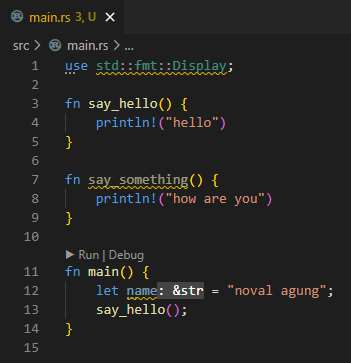
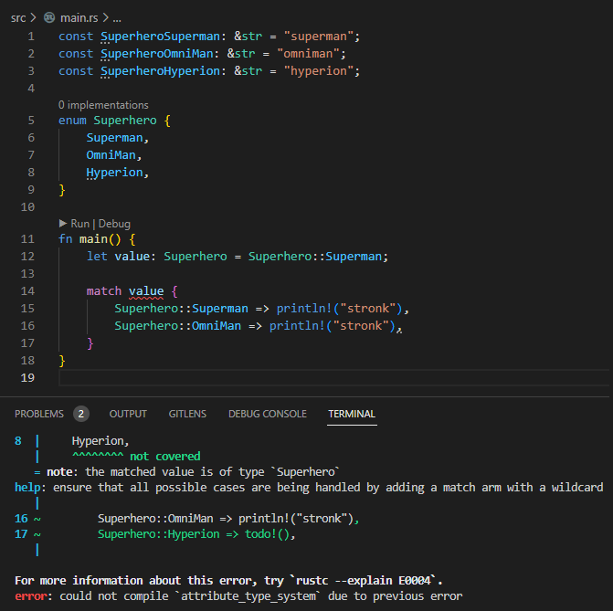
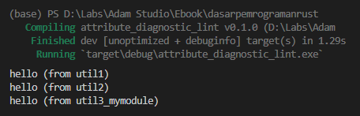

Kita telah beberapa kali menggunakan attributes pada chapter-chapter sebelumnya, contohnya seperti `#[derive(Debug)]`. Pada chapter ini kita akan bahas tentang apa sebenarnya attributes, macam-macam jenisnya, beserta kegunaannya.

## A.49.1. Konsep attributes

Attributes adalah metadata yang didefinisikan untuk suatu crate, module, atau module item. Kegunaan dari attributes berbeda satu sama lain, tergantung attribute apa yang dipakai (kita akan bahas satu per satu).

Attribute dikategorikan menjadi 2:

- Outer attributes
- Inner attributes

Keduanya memiliki kegunaan yang sama, pembedanya adalah posisi di mana attribute harus dituliskan.

Outer attribute dituliskan tepat sebelum target (crate, module, module item, atau lainnya) dengan notasi penulisan seperti berikut:

- `#[attribute = "value"]`
- `#[attribute(key = "value")]`
- `#[attribute(value)]`
- `#[attribute(not(key = "value"))]` untuk operasi **NOT**
- `#[attribute(not(value))]` untuk operasi **NOT**

Contoh penerapan:

```rust
#[derive(Debug)]
struct LegoSet {
    code: i32,
    name: String,
    category: String,
    age_minimum: i32,
}
```

Sedikit berbeda dengan inner attribute, penulisannya berada di dalam target (crate, module, module item, atau lainnya). Notasi penulisannya:

- `#![attribute = "value"]`
- `#![attribute(key = "value")]`
- `#![attribute(value)]`
- `#![attribute(not(key = "value"))]` untuk operasi **NOT**
- `#![attribute(not(value))]` untuk operasi **NOT**

Rust mengenal beberapa jenis attributes, dan kita akan membahasnya satu per satu.

## A.49.2. Attribute `derive`

Attribute `derive` digunakan untuk mempermudah implementasi suatu trait ke tipe data.

Kita telah mempelajari cara implementasi trait pada chapter [Traits](/basic/traits) yaitu menggunakan keyword `impl` dan `for`, kemudian diikuti dengan method serta implementasinya.

Dengan memanfaatkan attribute `derive` kita tidak perlu menggunakan cara tersebut. Cukup tulis saja attribute `derive` beserta trait yang ingin diimplementasikan.

Agar lebih jelas, silakan pelajari contoh berikut terlebih dahulu:

```rust
const SuperheroSuperman: &str = "superman";
const SuperheroOmniMan: &str = "omniman";
const SuperheroHyperion: &str = "hyperion";

enum Superhero {
    Superman,
    OmniMan,
    Hyperion,
}

fn main() {
    let value: Superhero = Superhero::Superman;

    if value == Superhero::Superman {
        println!("hello superman!");
    }
}
```


Kode di atas menghasilkan error karena enum `Superhero` tidak mengadopsi trait `PartialEq` yang mana trait ini diperlukan dalam seleksi kondisi menggunakan keyword `if` dan operator `==`.

Cara mengatasi error tersebut adalah dengan mengimplementasikan trait `PartialEq` secara eksplisit. Sekarang coba tambahkan kode berikut pada deklarasi enum `Superhero`, maka error akan hilang.

```rust
enum Superhero {
    Superman,
    OmniMan,
    Hyperion,
}

impl PartialEq for Superhero {

    fn eq(&self, other: &Self) -> bool {
        match (self, other) {
            (Superhero::Superman, Superhero::Superman) => true,
            (Superhero::OmniMan, Superhero::OmniMan) => true,
            (Superhero::Hyperion, Superhero::Hyperion) => true,
            _ => false,
        }
    }
}
```

Cara lain untuk mengatasi error di atas, selain menggunakan teknik implementasi trait secara eksplisit, adalah dengan menggunakan attribute `derive` disertai trait `PartialEq`. Kurang lebih penulisan cara ini bisa dilihat di bawah ini. Cukup hapus block kode `impl` lalu tambahkan attribute pada deklarasi enum `Superhero`.

```rust
#[derive(PartialEq)]
enum Superhero {
    Superman,
    OmniMan,
    Hyperion,
}
```

Cukup mudah bukan?

Contoh lainnya, misalnya variabel `value` ingin di-print seperti pada kode berikut ini, pasti hasilnya error.

```rust
fn main() {
    let value: Superhero = Superhero::Superman;

    if value == Superhero::Superman {
        println!("hello superman!");
    }

    println!("{value} (via `Display` trait)");
    println!("{value:#?} (via `Debug` trait)");
}
```


Cara *resolve* error di atas adalah dengan mengimplementasikan trait `Display` dan `Debug` secara eksplisit. Atau, bisa juga menggunakan attribute `derive` yang pastinya lebih praktis.

Kabar buruknya, hanya trait `Debug` yang menyediakan fitur implementasi trait menggunakan attribute `derive`. Untuk trait `Display` kita perlu melakukan implementasi secara eksplisit.

> Untuk tau mana trait yang bisa di-*derive* atau tidak, cukup lihat saja *highlight* error yang muncul saat penulisan kode atau kompilasi.

Ok, kita implementasikan saja keduanya.

```rust
#[derive(PartialEq, Debug)]
enum Superhero {
    Superman,
    OmniMan,
    Hyperion,
}

impl std::fmt::Display for Superhero {

    fn fmt(&self, f: &mut std::fmt::Formatter<'_>) -> std::fmt::Result {
        write!(f, "{self:?}")
    }
}
```


Bisa dilihat, hasilnya program tereksekusi tanpa error. Enum `Superhero` kini mengadopsi 3 trait:

- Trait `PartialEq` via attribute `derive`
- Trait `Debug` via attribute `derive`
- Trait `Display` via implementasi eksplisit

## A.49.3. Attribute `cfg` / *configuration*

Attribute `cfg` digunakan untuk operasi-operasi yang berhubungan dengan target arsitekture hardware/prosesor, misalnya seperti conditional compilation ketika OS adalah linux, dan lainnya.

Salah satu contoh penerapannya bisa dilihat pada kode berikut. Ada 2 buah module yang namanya sama persis, perbedaannya adalah satu didefinisikan khusus untuk platform `linux`, dan satunya lagi untuk platform `windows`. Hal seperti ini bisa dilakukan menggunakan attribute `cfg` dengan key `target_os`.

```rust
#[cfg(target_os = "linux")]
mod util {

    pub fn say_hello() {
        println!("hello (from linux)")
    }
}

#[cfg(target_os = "windows")]
mod util {

    pub fn say_hello() {
        println!("hello (from windows)")
    }

    pub fn say_something() {
        println!("how are you")
    }
}
```

Bisa dilihat cara penulisannya adalah `cfg()` kemudian diisi key `target_os` dengan value adalah `windows` atau `linux`.

Dengan kondisi kode seperti di atas, ketika berada di sistem operasi `linux`, item `util::say_hello` bisa diakses. Sedangkan pada sistem operasi `windows`, item `util::say_hello` dan `util::say_something` bisa diakses.

Attribute `cfg(target_os)` juga bisa diterapkan pada block kode. Contohnya seperti pada kode berikut. Item `util::say_hello` dipanggil di fungsi `main`. Dan khusus untuk sistem operasi `windows`, block kode berisi pemanggilan `util::say_something` juga dipanggil.

```rust
fn main() {
    util::say_hello();

    #[cfg(target_os = "windows")]
    {
        util::say_something();
    }
}
```

Ada beberapa key yang tersedia pada attribute `cfg`, di antaranya:

### ◉ Configuration `target_os`

Digunakan untuk menandai bahwa item atau statement di bawah definisi attribute ini dikhususkan untuk sistem operasi tertentu.

```rust
#[cfg(target_os = "value")]
```

Opsi value yang tersedia:

- `windows`
- `macos`
- `ios`
- `linux`
- `android`
- `freebsd`
- `dragonfly`
- `openbsd`
- `netbsd`

### ◉ Configuration `target_arch`

Digunakan untuk menandai bahwa item atau statement di bawah definisi attribute ini dikhususkan untuk arsitektur CPU tertentu.

```rust
#[cfg(target_arch = "value")]
```

Opsi value yang tersedia:

- `x86`
- `x86_64`
- `mips`
- `powerpc`
- `powerpc64`
- `arm`
- `aarch64`

### ◉ Macro `cfg!()` dan conditional compilation

Attribute `cfg` juga tersedia versi macro-nya, yaitu `cfg!()`. Macro ini kegunaannya sama seperti attribute `cfg`, perbedaannya macro `cfg!()` mengembalikan nilai boolean, yang darinya bisa dikombinasikan dengan seleksi kondisi untuk keperluan conditional compilation. Contoh penggunaan macro `cfg!()`:

```rust
fn main() {
    #[cfg(target_os = "linux")]
    {
        println!("hello linux. from attribute cfg")
    }

    #[cfg(target_os = "windows")]
    {
        println!("hello windows. from attribute cfg")
    }

    if cfg!(target_os = "linux") {
        println!("hello linux. from macro cfg!()");
    } else if cfg!(target_os = "windows") {
        println!("hello windows. from macro cfg!()");
    }
}
```

Penjelasan:

- Kode block `#[cfg(target_os = "linux")]` hanya dieksekusi ketika program dijalankan di Linux.
- Kode block `#[cfg(target_os = "windows")]` hanya dieksekusi ketika program dijalankan di Windows.
- Seleksi kondisi `cfg!(target_os = ...)` merupakan alternatif penulisan 2 kode sebelumnya yang digabung menjadi 1 rantai seleksi kondisi.
    - Kondisi `cfg!(target_os = "linux")` terpenuhi ketika program dijalankan di Linux
    - Kondisi `cfg!(target_os = "windows")` terpenuhi ketika program dijalankan di Windows

Output program ketika dijalankan di komputer penulis yang menggunakan Windows:


> Lebih detailnya mengenai macro akan dibahas di chapter terpisah.

### ◉ Configuration `debug_assertions`

By default, Rust menggunakan profil kompilasi **debug** saat eksekusi command `cargo run`. Di kode program, penanda apakah profil kompilasi debug digunakan atau tidak bisa dilihat dari nilai konfigurasi `#[cfg(debug_assertions)]` via attribute, dan `cfg!(debug_assertions)` via macro.

Nilai `cfg!(debug_assertions)` selalu bernilai `true` kecuali command yang digunakan saat eksekusi program adalah `cargo run --release`. Flag `--release` saat eksekusi program membuat nilai `debug_assertions` menjadi `false`.

Contoh penerapan:

```rust
fn main() {
    #[cfg(debug_assertions)]
    {
        println!("debug mode. from attribute cfg")
    }

    #[cfg(not(debug_assertions))]
    {
        println!("release mode. from attribute cfg")
    }

    if cfg!(debug_assertions) {
        println!("debug mode. from macro cfg!()");
    } else  {
        println!("release mode. from macro cfg!()");
    }
}
```

Output eksekusi program menggunakan command `cargo run` vs `cargo run --release`.


Pada profil release, kode program dikompilasi sekaligus dioptimisasi. Penggunaan profil ini dianjurkan untuk distribusi production binary. 

> Di beberapa bahasa pemrograman lain deteksi profile dilakukan mengunakan kombinasi keyword `if` dan nilai environment variable (`ENV`). Dari situ bisa dilihat apakah environment yang digunakan adalah production, staging, atau local.

### ◉ Other configuration

Ada beberapa key konfigurasi lainnya yang tersedia. Lebih detailnya silakan lihat di https://doc.rust-lang.org/reference/conditional-compilation.html

## A.49.4. Attribute *linting* & *diagnostic*

Ada beberapa attribute name yang bisa digunakan untuk meng-override *default linting* milik Rust ataupun menandai indikator *diagnostic* lainnya, seperti warning yang muncul karena ada kode yang tidak digunakan, dll; Warning sejenis ini bisa di-override menggunakan attribute.

Contoh kasus yang berhubungan dengan *linting* bisa dilihat pada kode berikut.



Kode di atas tidak menghasilkan error. Kode akan dieksekusi tanpa error. Namun ada 3 buah warning yang muncul karena beberapa baris kode tidak digunakan atau sia-sia.

Cara agar warning tidak muncul bisa dengan menggunakan attribute `#[allow(value)]`.

```rust
#[allow(unused_imports)]
use std::fmt::Display;

fn say_hello() {
    println!("hello")
}

#[allow(dead_code)]
fn say_something() {
    println!("how are you")
}

pub mod m1 {
    #[allow(missing_docs)]
    pub fn undocumented_one() -> i32 { 1 }

    #[warn(missing_docs)]
    pub fn undocumented_too() -> i32 { 2 }

    // #[deny(missing_docs)]
    // pub fn undocumented_end() -> i32 { 3 }
}

fn main() {
    #[allow(unused_variables)]
    let name = "noval agung";

    say_hello();
}
```

Pada kode di atas, ada beberapa attribute yang digunakan:

- `#[allow(unused_imports)]` digunakan untuk antisipasi error yang muncul ketika module item di-import namun tidak digunakan.
- `#[allow(dead_code)]` digunakan untuk membolehkan kode yang tidak digunakan.
- `#[allow(unused_variables)]` digunakan untuk membolehkan variabel yang didefinisikan tapi tidak dimanfaatkan.
- `#[allow(missing_docs)]` membolehkan kode di bawahnya untuk tidak memiliki komentar/dokumentasi.
- `#[warn(missing_docs)]` memunculkan warning jika kode di bawahnya tidak memiliki komentar/dokumentasi.
- `#[deny(missing_docs)]` memunculkan error jika kode di bawahnya tidak memiliki komentar/dokumentasi. Kode ini sengaja di-remark agar eksekusi program tidak menghasilkan error.

Dengan penambahan 3 attribute di atas program akan tereksekusi tanpa warning.


Ada beberapa attribute *key* yang bisa digunakan untuk override *lint* warning:

- `#[allow(lint_rule)]` untuk membolehkan suatu *lint rule*.<br />List `lint_rule` bisa dilihat di https://doc.rust-lang.org/rustc/lints/listing/allowed-by-default.html.

- `#[warn(lint_rule)]` untuk memunculkan warning untuk suatu *lint rule* yang *default*-nya tidak memunculkan warning.<br />List `lint_rule` bisa dilihat di https://doc.rust-lang.org/rustc/lints/listing/warn-by-default.html.

- `#[deny(lint_rule)]` untuk melarang suatu *lint rule* yang *default*-nya adalah diperbolehkan.<br />List `lint_rule` bisa dilihat di https://doc.rust-lang.org/rustc/lints/listing/deny-by-default.html.

- `#[forbid(lint_rule)]` untuk melarang suatu *lint rule* yang *default*-nya adalah diperbolehkan **dengan catatan kode beserta isi yang dituju lint tersebut tidak bisa diubah menjadi *lint rule*-nya menjadi `allow` lagi**. Penjelasan detailnya ada di https://doc.rust-lang.org/reference/attributes/diagnostics.html

    Contoh penerapan:

    ```rust
    #[forbid(missing_docs)]
    pub mod m3 {
        #[allow(missing_docs)]
        pub fn undocumented_too() -> i32 { 2 }
    }
    ```

    Attribute `#[forbid(missing_docs)]` pada module `m3` menjadikan seluruh isi block module tersebut harus memiliki dokumentasi, mirip seperti penggunaan `#[deny(missing_docs)]`.
    
    Penggunaan `allow` di dalam block tersebut membuat eksekusi program menghasilkan error, karena meskipun attribute tersebut ditujukan untuk fungsi `undocumented_too()` pada parent block (yaitu module `m3`) sudah ditentukan aturannya menggunakan `forbid`.


Selain 3 attribute di atas, ada juga beberapa attribute lainnya untuk keperluan *diagnostic*, di antaranya:

- `#[deprecated]` digunakan untuk menandai bahwa kode di bawahnya adalah *deprecated*.
- `#[must_use]` digunakan untuk mendandai bahwa kode di bawahnya harus digunakan, jika tidak maka akan muncul error.

Selain itu ada juga attribute `forbid`.

Pada kode sebelumnya silahkan tambahkan kode berikut di bagian paling atas:
```rust
#![forbid(unsafe_code)]
//...
```

Lalu di main function nya tambahkan juga kode berikut:
```rust
fn main() {
    //...

    #[allow(unsafe_code)]
    unsafe{};
}
```
pada kode di atas, attribute `forbid` di gunakan pada 2 tempat:
- `#![forbid(unsafe_code)]` inner attribute, digunakan untuk semua crate tidak boleh menggunakan unsafe block (unsafe block akan dibahas di chapter: [Safe & Unsafe](#/wip/safe-unsafe)).
- `#[allow(unsafe_code)]` outer attribute, disini kita mencoba untuk meng**ignore** aturan `forbid`.

dengan `forbid` kita bisa membuat kode yang melanggar aturan lint tersebut menjadi error dan tidak bisa di `allow` atau dengan kata lain `forbid` tidak bisa di **ignore**.

Maka kode di atas akan menghasilkan error.


## A.49.5. Attribute *type system*

Ada sebuah attribute bernama `non_exhaustive` gunanya untuk mem-*bypass* error yang muncul karena ada pattern matching yang tidak meng-cover semua kondisi, atau untuk mengantisipasi error yang muncul saat deklarasi variabel bertipe struct tapi value property-nya tidak diisi.

Salah satu contoh error yang dimaksud bisa dilihat pada kode berikut. Error ini muncul karena enum `Superhero::Superhero` tidak ter-cover dalam pattern matching.



Solusi untuk mengatasi error di atas bisa dengan cukup menambahkan case kondisi yang belum ter-cover:

```rust
match value {
    Superhero::Superman => println!("stronk"),
    Superhero::OmniMan => println!("stronk"),
    Superhero::Hyperion => println!("stronk"),
}
```

Atau dengan memanfaatkan kondisi *other* atau `_`:

```rust
match value {
    Superhero::Superman => println!("stronk"),
    Superhero::OmniMan => println!("stronk"),
    _ => println!("stronk"),
}
```

Atau, bisa dengan menggunakan attribute `non_exhaustive`:

```rust
#[non_exhaustive]
pub enum Superhero {
    Superman,
    OmniMan,
    Hyperion,
}

fn main() {
    let value = Superhero::Superman;

    match value {
        Superhero::Superman => println!("stronk"),
        Superhero::OmniMan => println!("stronk"),
    }
}
```

Sayangnya dalam penggunaan attribute `non_exhaustive` ini, efeknya **hanya bisa dirasakan jika digunakan pada enum atau struct yang berbeda crate**.

Pada contoh di atas, tempat di mana enum dideklarasikan dan digunakan adalah masih dalam satu crate yang sama, jadi kode tetap menghasilkan error.

> Attribute `non_exhaustive` ini jika digunakan pada struct efeknya saat deklarasi variabel boleh tidak menuliskan value property.

## A.49.6. Attribute *modules*

Aturan manajemen di Rust cukup ketat, dan sudah dibahas secara mendetal pada chapter [Module System ➜ Module](/basic/module-basic), yang intinya adalah ada dua cara pembuatan module:

- Cara ke-1: dengan mendefinisikan module pada file bernama `nama_module.rs`
- Cara ke-2: dengan mendefinisikan module pada file bernama `nama_module/mod.rs`

Rust memiliki sebuah attribute bernama `path` yang berguna untuk meng-override 2 aturan di atas secara paksa. Dengan memanfaatkan attribute ini kita bisa menulis module dengan nama sesuka hati.

Mari kita praktekan agar lebih jelas. Silakan buat package baru dengan struktur seperti berikut:

```bash title="package source code structure"
my_package
│─── Cargo.toml
└─── src
     │─── main.rs
     │─── util1.rs
     │─── util2
     │    └─── mod.rs
     └─── util3_mymodule.rs
```

```rust title="util1.rs"
pub fn say_hello() {
    println!("hello (from util1)")
}
```

```rust title="util2/mod.rs"
pub fn say_hello() {
    println!("hello (from util2)")
}
```

```rust title="util3_mymodule.rs"
pub fn say_hello() {
    println!("hello (from util3_mymodule)")
}
```

```rust title="main.rs"
mod util1;
mod util2;

#[path = "util3_mymodule.rs"]
mod util3;

fn main() {
    util1::say_hello();
    util2::say_hello();
    util3::say_hello();
}
```

Pada kode di atas bisa dilihat, module `util1` dan `util2` patuh mengikuti aturan deklarasi module system. Berbeda dengan `util3` yang sebenarnya dideklarasikan dengan nama `util3_mymodule` (karena filename-nya adalah `util3_mymodule.rs`). Nama module satu ini diubah menjadi `util3` lalu dengan memanfaatkan attribute `path` kita arahkan isi module `util3` adalah berada di `util3_mymodule.rs`.

Jialankan program, harusnya tidak ada error.



## A.49.7. Attribute *testing*

Lebih detailnya mengenai attribute testing dibahas pada chapter [Testing](#/wip/testing).

## A.49.8. Attribute *macros*

Lebih detailnya mengenai attribute macros dibahas pada chapter [Macro](#/wip/macro).

## A.49.9 Attribute lainnya

Rust memiliki cukup banyak attribute yang list-nya bisa dilihat pada link ini https://doc.rust-lang.org/reference/attributes.html.

---

## Catatan chapter 📑

### ◉ Source code praktik

<pre>
    <a href="https://github.com/novalagung/dasarpemrogramanrust-example/tree/master/attributes">
        github.com/novalagung/dasarpemrogramanrust-example/../attributes
    </a>
</pre>

### ◉ Chapter relevan lainnya

- [Module System ➜ Module](/basic/module-basic)
- [Enum](/basic/enum)
- [Pattern Matching](/basic/pattern-matching)
- [Traits](/basic/traits)

### ◉ Referensi

- https://doc.rust-lang.org/reference/attributes.html
- https://doc.rust-lang.org/reference/items/implementations.html
- https://doc.rust-lang.org/rustc/lints/index.html
- https://doc.rust-lang.org/reference/attributes/diagnostics.html
