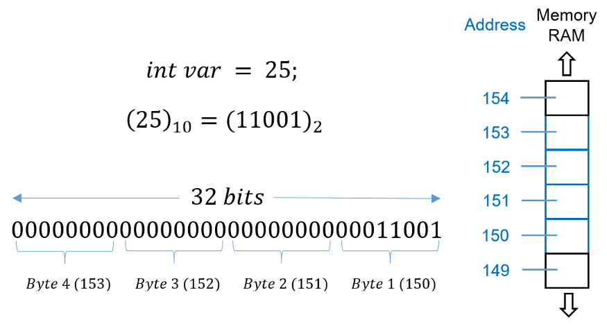
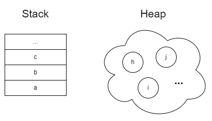
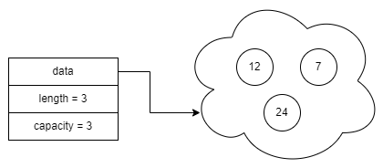

Pada chapter ini kita akan belajar tentang salah satu hal penting dalam topik pemrograman secara general, yaitu *memory management* yang mencakup pembahasan tentang alamat memori, pointer, heap, stack, dan juga error-error yang terjadi karena kesalahan dalam manajemen memori.

Di bahasa pemrograman high-level biasanya topik tersebut jarang disentuh, tetapi di Rust yang notabene adalah system programming, hal di atas wajib untuk dipelajari.

> Penulis tekankan bahwa mungkin pembelajaran pada bagian ini akan terasa seperti *oversimplified* karena tujuannya adalah untuk para pembaca yang masih dalam proses belajar atau malah belum mengenal sama sekali tentang manajemen memori.

## A.32.1. Memory management

Semua bahasa pemrograman memiliki caranya sendiri dalam melakukan pengelolaan memory atau memory management. Ada beberapa macam metode manajemen memori yang diterapkan pada bahasa pemrograman, di antaranya adalah berikut:

### ◉ Garbage collection (GC)

GC adalah metode manajemen memori otomatis pada bahasa pemrograman. GC memiliki suatu unit yang disebut dengan *garbage collector*. Collector tersebut aktif memonitor program, dan pada periode atau event tertentu ia akan berusaha untuk mengambil kembali (reclaim) memory yang sebelumnya telah dialokasikan dengan catatan memori tersebut sudah tidak lagi digunakan. Proses ini disebut dengan dealokasi memory.

Proses dealokasi pada GC terjadi di belakang layar secara asynchronous.

Beberapa bahasa pemrograman yang menerapkan GC di antara adalah Java, C#, Go, Lisp, dan banyak bahasa lainnya.

### ◉ Automatic reference counting (ARC)

ARC adalah metode manajemen memori yang diterapkan pada bahasa Objective-C dan Swift. Cara ARC me-manage memory adalah dengan mencatat *reference* object dan segala aktifitas yang terjadi pada object tersebut.

Di ARC, ada satuan yang disebut dengan *retain count* yang merupakan representasi jumlah banyaknya variabel atau object yang memegang suatu *reference*. Ketika *reference* sudah pindah ke luar scope atau dihapus isinya dan dilihat pada catatan rupanya tidak ada variabel yang memegang *reference* tersebut, maka dilakukan proses dealokasi memory.

Dalam bahasa yang menerapkan ARC, programmer dianjurkan untuk perhatian dan bijak dalam pengalokasian variabel beserta nilainya. Mana data yang diperlukan untuk di-retain secara *strong* dan mana yang tidak, harus pas sesuai dengan kebutuhan. Jika tidak hati-hati maka program mempunyai resiko lebih tinggi untuk menemui error *deadlocks* ataupun *memory leaks* (yang juga akan dibahas pada chapter ini).

### ◉ Manual memory management

Manual memory management berarti programmer dibebani secara penuh dalam hal manajemen memori, mengharuskan programmer untuk super hati-hati dalam pengalokasian memory, kapan waktunya, dimana alokasinya (apakah *heap* atau *stack*), dan kapan harus melakukan operasi dealokasi memory.

Metode manajemen memori ini dipakai dalam system programming contohnya bahasa C dan C++.

### ◉ Ownership rules

Manajemen memori yang dilakukan dengan menerapkan konsep *ownership* beserta aturan-aturannya. Metode manajemen memori ini adalah yang digunakan di Rust.

> Lebih jelasnya mengenai ownership rules pada Rust dibahas pada chapter selanjutnya, yaitu [Ownership](/basic/ownership). Untuk sekarang silakan selesaikan terlebih dahulu pembahasan chapter ini.

## A.32.2. Memory Address

Memory address atau alamat memori adalah sebuah lokasi spesifik di memori yang digunakan oleh software maupun hardware untuk menyimpan suatu data.

Pembahasan mengenai memory address ini sangatlah luas. Pada chapter ini kita tidak akan membahasnya secara menyeluruh, melainkan hanya poin penting yang perlu diketahui dan dibutuhkan dalam proses pembelajaran.

Ok lanjut ke contoh agar lebih jelas. Dimisalkan ada sebuah variabel bertipe data numerik `i32`, variabel tersebut akan membutuhkan sejumlah bit alokasi alamat memori untuk bisa menyimpan value-nya yang pada contoh ini adalah `32 bits` (karena tipenya `i32`) atau jika dikonversi ke bentuk *bytes* adalah `4 bytes`.

Alokasi memory address mengacu ke tipe data (bukan value), sebagai contoh pada data bertipe `i32` maka berapapun value data tersebut (entah `1`, `2`, `1999999`, atau lainnya) tetap membutuhkan `32 bits` alokasi alamat memori untuk menyimpan data tersebut.

Silakan perhatikan ilustrasi berikut agar lebih jelas. Gambar diambil dari post [medium.com/@luischaparroc](https://medium.com/@luischaparroc/integer-numbers-storage-in-computer-memory-47af4b59009).



Pada contoh di atas, variabel adalah bertipe data `i32`, maka di memory dialokasikanlah alamat memory dengan lebar 32 bit.

Nilai variabel tersebut adalah `25`, yang jika dikonversi ke bentuk binary adalah `11001`. Dengan ini maka pada 32 bit yang sudah dialokasikan, akan terisi dengan nilai `11001`. Penulisannya dari kanan dan jika ada slot kosong sebelah kiri maka terisi dengan `0`.

Hasilnya adalah angka biner berikut:

```rust
00000000000000000000000000011001
```

## A.32.3. Stack memory

Masih dalam topik manajemen memori, ada dua hal lagi yang sangat penting untuk diketahui, yaitu *stack* dan *heap*. Keduanya adalah bagian dari memory, tempat dimana alokasi dilakukan.

Data disimpan dalam stack memory dalam bentuk stack. Karakteristik dari stack:

- Di Rust programming, stack digunakan sebagai default tempat alokasi memori
- Data yang terakhir masuk adalah yang pertama akan keluar (LIFO)
- Data yang disimpan diketahui size/ukurannya, dan memiliki batas
- Alokasi bersifat lokal terhadap pemanggilan fungsi
- Kecepatan pengaksesan data sangat tinggi


Data untuk tipe primitif (seperti `i32`, `bool`, dll) disimpan di stack.

### ◉ Contoh ke-1

Selanjutnya kita akan pelajari secara garis besar tentang bagaimana sebuah data dialokasikan di stack. Silakan mulai dengan mempelajari kode sederhana berikut (tanpa perlu dipraktikkan), kemudian ikuti pembahasan setelahnya.

```rust
fn main() {
    let x = 24;
}
```

Fungsi `main` hanya berisi 1 buah data, yaitu variabel `x` dengan nilai `24`. Ketika fungsi tersebut dipanggil, maka data variabel `x` disimpan di stack (karena di Rust by default semua data disimpan di stack). Nilai `x` adalah numerik bertipe `i32`, maka compiler akan mengalokasikan 32 bits di stack memory untuk menyimpan nilai `24`.

Pada catatan karakteristik stack di atas, telah disinggung bahwa alokasi data di stack bersifat lokal terhadap pemanggilan fungsi, artinya apa? → Semua data dalam suatu blok fungsi akan disimpan dalam sebuah group yang disebut dengan *stack frame*.

Pada contoh di atas, ketika fungsi `main` dipanggil, sebuah stack frame terbuat, dan data variabel `x` disimpan dalam stack frame tersebut.

| No. | Variabel | Nilai | *Stack frame* |
|:-:|:-:|:-:|:-|
| 0 | x | 24 | milik fungsi `main()` |

> Kolom `No.` di atas merepresentasikan urutan data dalam stack agar lebih mudah dipahami

### ◉ Contoh ke-2

Ok, sekarang mari lanjut contoh ke-2 berikut ini agar makin jelas.

```rust
fn do_something() {
    let y = 13;
    let z = 11;
}

fn main() {
    let x = 24;
    do_something();
    let a = 4;
    let b = 18;
}
```

Program sederhana di atas memiliki dua buah fungsi, `main` dan `do_something`. Saat program dijalankan, lebih tepatnya saat fungsi `main` dipanggil maka sebuah stack frame dibuat dan data dalam fungsi tersebut dialokasikan pada stack frame.

Perlu diketahui bahwa eksekusi statement dalam fungsi adalah per baris, dimulai dari atas. Dengan ini maka data yang pertama dialokasikan ke memory adalah variabel `x`.

| No. | Variabel | Nilai | *Stack frame* |
|:-:|:-:|:-:|:-|
| 0 | x | 24 | milik fungsi `main()` |

Setelah itu, lanjut ke statement ke-2 yaitu pemanggilan fungsi `do_something`.

Kembali ke teori, bahwa alokasi data stack adalah bersifat lokal terhadap pemanggilan fungsi. Maka dibuatlah stack frame baru untuk pemanggilan fungsi `do_something` dengan isi adalah alokasi data `y` dan `z`.

| No. | Variabel | Nilai | *Stack frame* |
|:-:|:-:|:-:|:-|
| <span style={{color: '#2e8555'}}>**2**</span> | <span style={{color: '#2e8555'}}>**z**</span> | <span style={{color: '#2e8555'}}>**11**</span> | <span style={{color: '#2e8555'}}>**milik fungsi `do_something()`**</span> |
| <span style={{color: '#2e8555'}}>**1**</span> | <span style={{color: '#2e8555'}}>**y**</span> | <span style={{color: '#2e8555'}}>**13**</span> | <span style={{color: '#2e8555'}}>**milik fungsi `do_something()`**</span> |
| 0 | x | 24 | milik fungsi `main()` |

Setelah eksekusi blok kode do_something selesai maka stack frame pemanggilan fungsi `do_something` akan di-dealokasi, dikosongkan, dihapus.

> Sebenarnya tidak se-sederhana itu proses dealokasi memori, ada pengecekan ownership yang harus dilakukan terlebih dahulu. Namun agar makin tidak bingung, untuk sementara kita gunakan penjelasan di atas.
>
> Silakan selesaikan dulu pembahasan chapter ini, kemudian pada chapter selanjutnya kita akan bahas tentang apa itu [Ownership](/basic/ownership).

Ok, maka dari 2 stack yang sebelumnya ada, sekarang tinggal 1 stack frame saja yaitu milik pemanggilan fungsi `main`.

Dari yang sebelumnya ...

| No. | Variabel | Nilai | *Stack frame* |
|:-:|:-:|:-:|:-|
| <span style={{color: 'red'}}>~~2~~</span> | <span style={{color: 'red'}}>~~z~~</span> | <span style={{color: 'red'}}>~~11~~</span> | <span style={{color: 'red'}}>~~milik fungsi `do_something()`~~</span> |
| <span style={{color: 'red'}}>~~1~~</span> | <span style={{color: 'red'}}>~~y~~</span> | <span style={{color: 'red'}}>~~13~~</span> | <span style={{color: 'red'}}>~~milik fungsi `do_something()`~~</span> |
| 0 | x | 24 | milik fungsi `main()` |

... sekarang menjadi ...

| No. | Variabel | Nilai | *Stack frame* |
|:-:|:-:|:-:|:-|
| 0 | x | 24 | milik fungsi `main()` |

Ok, lanjut ke block fungsi `main` berikutnya, yaitu `let a = 4`. Saat dipanggil maka ada penambahan data baru pada stack frame pertama.

| No. | Variabel | Nilai | *Stack frame* |
|:-:|:-:|:-:|:-|
| <span style={{color: '#2e8555'}}>**3**</span> | <span style={{color: '#2e8555'}}>**a**</span> | <span style={{color: '#2e8555'}}>**4**</span> | <span style={{color: '#2e8555'}}>**milik fungsi `main()`**</span> |
| 0 | x | 24 | milik fungsi `main()` |

Kemudian sampai di statement terakhir fungsi `main`. Ketika `let b = 14` dipanggil maka ada penambahan data baru pada stack frame pertama.

| No. | Variabel | Nilai | *Stack frame* |
|:-:|:-:|:-:|:-|
| <span style={{color: '#2e8555'}}>**4**</span> | <span style={{color: '#2e8555'}}>**b**</span> | <span style={{color: '#2e8555'}}>**18**</span> | <span style={{color: '#2e8555'}}>**milik fungsi `main()`**</span> |
| 3 | a | 4 | milik fungsi `main()` |
| 0 | x | 24 | milik fungsi `main()` |

Setelah fungsi selesai dieksekusi, stack frame di-dealokasi.

Kurang lebih seperti itu sekilas peran dari stack dalam Rust programming. Selanjutnya kita bahas tentang heap memory.

## A.32.4. Heap memory

Heap adalah salah satu tempat alokasi memory selain stack. Karakteristik dari heap:

- Heap digunakan untuk alokasi data yang sifatnya dinamis, tidak diketahui size-nya, atau bisa berubah size-nya
- Data di heap tidak memiliki pattern tertentu
- Alokasi dan dealokasi data di heap bisa dilakukan kapanpun
- Kecepatan pengaksesan data di heap lebih lambat dibanding stack

Ilustrasi perbandingan stack dan heap:



Tipe data non-primitive di Rust data-nya disimpan di heap, contohnya seperti Vector, `String`, dan beberapa lainnya. Penulis tekankan, bahwa **yang disimpan di heap adalah data-nya saja, sedangkan atribut lainnya (seperti `length` dan `capacity`) tetap disimpan disimpan di stack**. Lebih jelasnya silakan lihat ilustrasi berikut:

```rust
let numbers = vec![12, 24, 7];
```



Heap, selain digunakan sebagai penyimpanan data dinamis, kita juga bisa manfaatkan sebagai penyimpanan data jenis lainnya (secara eksplisit) menggunakan tipe data `Box`.

Pembahasan Lebih jelasnya mengenai heap allocation ada pada chapter [String Custom Type vs `&str`](/basic/string-slice-vs-string-literal) dan juga [Box](#/wip/box). Namun untuk sekarang, penulis anjurkan untuk lanjut ke pembahasan berikutnya terlebih dahulu.

## A.32.5. Error memory management

Rust sangat disiplin dalam hal penulisan source code, terutama untuk kode-kode yang berhubungan dengan memory management. Hal ini dilakukan oleh Rust untuk meminimalisir munculnya error seperti memory leak dan sejenisnya.

Namun meski demikian, potensi error memory tetap ada, dan kita akan bahas itu nantinya setelah masuk chapter [Safe & Unsafe](#/wip/safe-unsafe).

Nantinya akan dibahas juga tentang beberapa error saat compile time yang error tersebut berhubungan dengan memory management, yaitu pada chapter [Ownership](/basic/ownership) dan [Borrowing](/basic/borrowing). Untuk sekarang, mari lanjut ke chapter berikutnya terlebih dahulu.

---

## Catatan chapter 📑

### ◉ Source code praktik

<pre>
    <a href="https://github.com/novalagung/dasarpemrogramanrust-example/tree/master/memory_management">
        github.com/novalagung/dasarpemrogramanrust-example/../memory_management
    </a>
</pre>

### ◉ Referensi

- https://doc.rust-lang.org/nomicon/ownership.html
- https://doc.rust-lang.org/book/ch04-01-what-is-ownership.html
- https://doc.rust-lang.org/1.22.0/book/first-edition/the-stack-and-the-heap.html
- https://doc.rust-lang.org/rust-by-example/std/box.html
- https://docs.swift.org/swift-book/LanguageGuide/AutomaticReferenceCounting.html
- https://docs.elementscompiler.com/Concepts/ARC/
- https://en.wikipedia.org/wiki/Memory_address
- https://en.wikipedia.org/wiki/Code_segment
- https://en.wikipedia.org/wiki/Automatic_Reference_Counting
- https://en.wikipedia.org/wiki/Garbage_collection_(computer_science)
- https://log2base2.com/C/pointer/computer-memory-address-basics.html
- https://quora.com/How-does-memory-management-work-in-Rust
- https://medium.com/the-legend/management-memori-pada-bahasa-pemrograman-a33772635aa5
- https://imam.digmi.id/post/belajar-rust-memahami-stack-dan-heap/
- https://javatpoint.com/rust-ownership
- https://stackoverflow.com/questions/24158114
