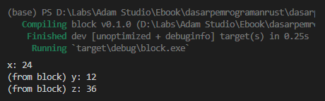
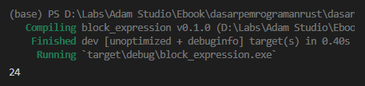

Pada chapter ini kita akan belajar tentang block expression.

## A.30.1. Konsep dan penerapan block

Block expression (atau cukup block), adalah salah satu control flow yang ada di Rust yang berguna untuk isolasi items, variabel, ataupun proses dalam sebuah scope yang sifatnya *anonymous*.

Block expression berbeda jika dibandingkan block kode `if` (yang berarti dia adalah milik `if`) atau block kode fungsi (yang dia adalah milik fungsi), block expression tidak berasosiasi dengan keyword tertentu / *anonymous*.

> Pada ebook ini, penulis akan menggunakan istilah **block fungsi** untuk block fungsi, **block kode if** untuk block kode seleksi kondisi `if`, dan **block kode X** untuk X.
>
> Untuk block expression, penulis akan gunakan istilah **block expression** atau cukup **block** saja.

Cara penerapan block cukup dengan menuliskan kode program diapit di antara tanda `{` dan `}`. Contoh penerapannya:

```rust
fn main() {
    let x = 24;
    println!("x: {}", x);

    {
        println!("(from block) x: {}", x);

        let y = 12;
        let z = x + y;
        println!("(from block) y: {}", y);
        println!("(from block) z: {}", z);
    }
}
```



Pada contoh di atas, dalam fungsi `main` ada variabel `x` yang dideklarasikan kemudian di-print. Setelahnya diikuti statement block expression. Bisa dilihat seperti itu kurang lebih cara penulisannya.

Di dalam block, nilai `x` di-print. Operasi seperti ini bisa dilakukan, karena *by default* semua items pada scope di luar block adalah bisa diakses dari dalam block. Contohnya adalah variabel `x` yang deklarasinya berada di luar block, tapi diakses di dalam block.

Kemudian ada beberapa variabel baru yang didefinisikan di dalam block, yaitu `y` dan `z` yang variabel tersebut juga di-print. Variabel tersebut akan valid sampai eksekusi block selesai. Intinya semua statement dalam block expression ter-isolasi dalam anonymous scope tersebut. Setelah block kode selesai dieksekusi, jika kita berusaha memanggil items yang ada di dalam block dengan pemanggilan dari luar scope, hasilnya error.

Sebagai contoh, kode berikut menghasilkan error:

```rust
let x = 24;

{
    let y = 12;
    let z = x + y;
};

println!("z: {}", z); // <------ error
```

O iya, dalam penulisannya, statement block harus diikuti tanda semicolon `;` sebagai penanda akhir statement, dengan beberapa pengecualian yang akan ikut dibahas pada section setelah ini.

## A.30.2. Return value block

Sebuah block expression bisa memiliki return value, dengannya maka nilainya bisa ditampung dalam sebuah variabel. Cara penerapannya menggunakan notasi berikut:

```rust
let varOne = {
    // ...
    returnValue
};

let varTwo: tipeData = {
    // ...
    returnValue
};
```

Dalam block expression, tidak perlu menuliskan keyword `return` dan tidak perlu juga menuliskan tanda semicolon di akhir statement return value.

Berikut adalah contoh praktik return value block. Ada sebuah block yang nilai baliknya ditampung ke variabel `a`. Isi block sendiri adalah generate data numerik random, yang kemudian dikalikan dengan angka `2`, lalu dijadikan return value.

```rust
use rand::Rng;

fn main() {
    let a: i32 = {
        let n = rand::thread_rng().gen_range(0..100);
        n * 2
    };

    println!("a: {}", a);
}
```

## A.30.3. Nested block

Block bisa berada di dalam block. Contohnya seperti kode berikut, nested block dengan kedalaman 3 layer.

```rust
{
    let b = 12;
    let mut total = 0;

    {
        let c = 13;

        {
            let d = 14;
            total = b + c + d;
        }
    }

    println!("{total}")
}
```

Tidak ada yang istimewa tentang cara penulisan nested block. Langsung tulis saja block expression dalam block sesuai kebutuhan.

## A.30.4. Labeled block

Tak hanya perulangan, sebuah block expression juga bisa memiliki label. Cara penerapannya dengan menuliskan nama label (diawaili dengan tanda `'`), kemudian diikuti tanda `:` dan block expression. Silakan lihat notasi penulisan berikut agar lebih jelas:

```rust
'nama_label: {
    // ...
}
```

Mari coba terapkan. Pada kode berikut, ada block expression dengan nama `'append_with_even_number`.

Di dalam block itu, ada proses generate data numerik secara acak. Angka random tersebut kemudian di cek, jika ganjil maka block expression dihentikan secara paksa. Statement `break 'append_with_even_number` artinya menghentikan eksekusi block `'append_with_even_number`.

Jika angka genap, maka ditambahkan ke `total` kemudian di-print.

```rust
fn main() {
    {
        let mut total = 24;

        'append_with_even_number: {
            let n = rand::thread_rng().gen_range(0..100);

            if n % 2 == 1 {
                break 'append_with_even_number
            }

            total = n
        }

        println!("{total}");
    }
}
```



## A.30.5. Async block

Pembahasan mengenai asynchronous block ada pada chapter [Async](#/wip/async).

## A.30.6. *Unsafe* block

Pembahasan mengenai unsafe block expression ada pada chapter [Safe & Unsafe](#/wip/safe-unsafe).

## A.30.7 Manfaat penerapan block

Block biasa diterapkan untuk isolasi sebuah proses yang tidak perlu di-reuse. Jika proses adalah di-reuse, dianjurkan untuk menggunakan fungsi dalam penerapannya.

Di bahasa pemrograman lain juga ada block yang penerapannya kurang lebih adalah sama. Namun perlu diketahui, di Rust block memiliki berbedaan yang bisa dibilang signifikan, yaitu dalam hal manajemen memory.

Rust menerapkan konsep memory management bernama **ownership**. Setiap kali Rust selesai mengeksekusi block kode, baik itu fungsi, block expression, atau jenis block lainnya; akan dilakukan evaluasi pengecekan ownership yang ada dalam block tersebut. Untuk data yang owner-nya tidak berpindah ke luar scope, maka akan dilakukan proses dealokasi memory untuk data tersebut. Dengan approach ini penggunaan memory menjadi efisien.

- Lebih jelasnya mengenai memory management dibahas pada chapter [Memory Management](/basic/basic-memory-management)
- Lebih jelasnya mengenai ownership dibahas pada chapter [Ownership](/basic/ownership)

---

## Catatan chapter 📑

### ◉ Source code praktik

<pre>
    <a href="https://github.com/novalagung/dasarpemrogramanrust-example/tree/master/block_expression">
        github.com/novalagung/dasarpemrogramanrust-example/../block_expression
    </a>
</pre>

### ◉ Referensi

- https://doc.rust-lang.org/reference/expressions/block-expr.html

---

import Substack from '@site/src/components/Substack';

<Substack />
