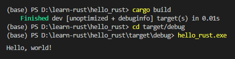

 
Pada chapter ini kita akan belajar lebih lanjut tentang command untuk proses build dan run dalam program Rust. Sebelumnya kita sudah belajar tentang `cargo new` dan `cargo run`, selain command tersebut ada juga command lain yaitu `cargo build` untuk proses kompilasi build kode program.

## A.2.1. Command `cargo build`

Di atas sedikit disinggung bahwa command `cargo build` berguna untuk mem-build kode program, dan command ini menghasilkan file binary. `cargo build` lebih sering digunakan saat proses build untuk distribution/deployment, yang umumnya binary hasil build kemudian distribusikan pengguna program.

Command tersebut juga bisa digunakan di lokal environment, silakan dicoba.

- Untuk pengguna Windows:

    ```bash
    cargo build
    cd target/debug
    hello_rust.exe
    ```

- Untuk pengguna non-Windows:

    ```bash
    cargo build
    cd target/debug
    ./hello_rust
    ```

Hasilnya:



## A.2.2. Optimized build

Catatan tambahan saja, command `cargo build` dan juga `cargo run` menghasilkan file binary yang *unoptimized* dan berisi beberapa informasi tambahan untuk proses debugging. Untuk distribution/production dianjurkan untuk generate *optimized* binary. Caranya dengan cukup menambahkan flag `--release` pada saat eksekusi command `cargo run`.

```bash
cargo build --release
```


Untuk release, file binary berada dalam path `target/release`. File binary nya adalah optimized, size nya lebih kecil. Mungkin untuk program `hello world` tidak akan signifikan bedanya, tapi untuk project real sangat dianjurkan untuk menggunakan optimized build.

## A.2.3. Command `rustc`

Bagian ini merupakan tambahan informasi saja, bahwa selain command `cargo` ada juga command `rustc` yang bisa digunakan untuk kompilasi program.

Sebagai contoh, silakan buat file `hello.rs`, lalu tulis kode berikut:

```rust title="hello.rs"
fn main() {
    println!("Hello, world!");
}
```

Kemudian *compile* lalu jalankan file *executable*-nya, hasilnya adalah sama seperti eksekusi program menggunakan `cargo run`.

- MacOS, Linux, Unix, WSL

    ```bash
    rustc hello.rs
    ./hello
    ```

- Windows

    ```bash
    rustc hello.rs
    .\hello.exe
    ```

Pada ebook ini kita akan menggunakan `cargo` untuk manajemen dan juga eksekusi kode program Rust. Jadi tidak menggunakan `rustc` ya.

> Command `cargo run` dan `cargo build` dalam proses kompilasinya meng-*invoke* command `rustc`

---

## Catatan chapter 📑

### ◉ Referensi

- https://doc.rust-lang.org/book/ch01-03-hello-cargo.html

---
