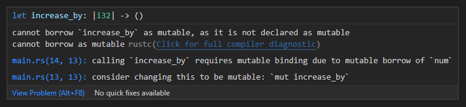
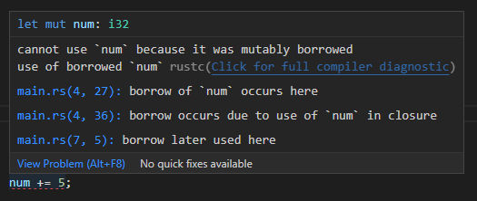
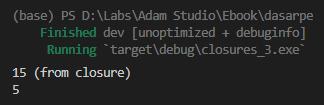
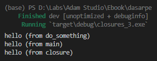
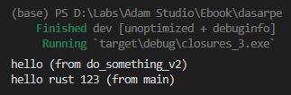
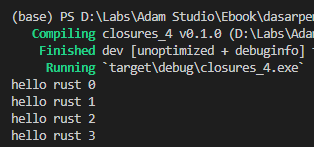
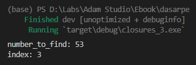

Chapter ini membahas tentang closures. Closures sendiri merupakan block fungsi anonimus (anonymous function) yang memiliki kelebihan bisa mengakses item-tem yang posisinya berada di luar block closure tersebut tetapi masih dalam current block scope.

Topik closures sangat erat hubungannya dengan [Trait ➜ Function](/basic/trait-function), namun pada chapter ini pembahasan hanya difokuskan pada bagian penerapan closures saja. Penulis anjurkan untuk lanjut ke chapter berikutnya setelah selesai dengan chapter ini.

## A.46.1. Konsep Closures

Cara penerapan closure sangat mirip seperti fungsi, perbedaannya ada pada notasi penulisan-nya. Agar lebih jelas silakan perhatikan program sederhana di bawah ini.

```rust
fn main() {
    let r = 10.0;
    let volume = calculate_circle_volume_v1(r);
    println!("{volume:.2}");
}

fn calculate_circle_volume_v1(e: f64) -> f64 {
    const PI: f64 = 3.14;
    let volume = 4.0 / 3.0 * PI * e.powi(3);
    volume
}
```

Fungsi `calculate_circle_volume_v1` akan kita refactor ke bentuk closure, hasilnya adalah berikut:

```rust
fn main() {
    let calculate_circle_volume_v2 = |e: f64| -> f64 {
        const PI: f64 = 3.14;
        let volume = 4.0 / 3.0 * PI * e.powi(3);
        volume
    };
    
    let r = 10.0;
    let volume = calculate_circle_volume_v2(r);
    println!("{:.2}", volume);
}
```

Silakan pelajari perbedaan dan juga kemiripannya.

Fungsi dideklarasikan menggunakan keyword `fn` dan memiliki nama. Closure tidak memiliki nama, namun bisa disimpan dalam variabel (yang disimpan adalah block closure-nya, bukan return value-nya). Contohnya variabel `calculate_circle_volume_v2` di atas.

Perbedaan minor lainnya ada pada notasi penulisan parameter. Pada fungsi tanda `()` digunakan sebagai penanda parameter, sedangkan pada closure tanda `||` digunakan.

### ◉ formatted print `{:.n}`

Notasi penulisan formatted print `{:.n}` digunakan untuk mem-format bilangan desimal di mana `n` adalah jumlah digit setelah tanda `.`.

Sebagai contoh, variabel `pi` berikut memiliki 0 digit angka dibelakang koma. Untuk menampilkan hanya 4 angka terdepan, bisa gunakan `{:.4}`. Perlu diketahui bahwa angka dibelakang koma yang muncul otomatis dibulatkan.

```rust
let pi = 3.1415926535;

println!("{:.4}", pi); // 3.1416
println!("{pi:.4}");   // 3.1416
```

## A.46.2. Notasi penulisan closure

Closure `calculate_circle_volume_v2` pada contoh di atas adalah salah satu contoh penulisan closure. Sebuah closure bisa memiliki parameter, bisa juga tidak, dan aturan tersebut juga berlaku pada return value.

Bebebrapa contoh lain penulisan closure bisa dilihat di bawah ini:

```rust
// closure dengan 2 parameter tanpa return value
let do_something_v1 = | a: i32, b: String | {
    // ...
};

// closure dengan 2 parameter dan return value bertipe tuple
let do_something_v2 = | a: i32, b: String | -> (i32, bool) {
    // ...
};

// closure tanpa parameter dan return value bertipe Vec<String>
let do_something_v3 = || -> Vec<String> {
    // ...
};

// closure tanpa parameter dan tanpa return value
let do_something_v4 = || {
    // ...
};
```

Jika tipe return value tidak dideklarasikan secara eksplist, maka Rust menganggap tipe return value adalah sesuai dengan tipe data pada statement terakhir.

Untuk closure yang isinya hanya 1 baris statement, boleh tidak dituliskan block kurung kurawal-nya (`{}`).

Tambahan contoh, satu fungsi dan tiga buah closures berikut adalah ekuivalen.

```rust
fn pow_v1(x: i32) -> i32 {
    x.pow(2)
}

let pow_v2 = |x: i32| -> i32 {
    x.pow(2)
};

let pow_v3 = |x: i32| {
    x.pow(2)
};

let pow_v4 = |x: i32| x.pow(2);
```

Ok, sekarang bagaimana dengan closure yang tidak memiliki parameter dengan isi hanya return value saja? Penulisannya seperti ini:

```rust
let get_pi = || 3.14;

println!("{:?}", get_pi());
```

## A.46.3. Mutable closure

Tidak ada yang spesial mengenai cara mengakses item yang berada di luar block closure. Caranya cukup dengan panggil saja item seperti biasanya.

```rust
let num = 5;
let display = || println!("{num}");

println!("{num}");  // 5
display();          // 5
```

Beda lagi jika data di luar block closure adalah diubah (di-mutate) nilainya dari dalam closure, jika seperti itu maka ada beberapa hal yang perlu diperhatikan.

Sebagai contoh, pelajari kode berikut.

```rust
let mut num = 5;

let increase_by = |x: i32| {
    num += x
};

increase_by(10);
println!("{num}"); // 15
```



Solusi untuk menghilangkan error di atas adalah dengan menambahkan keyword `mut` pada variabel closure `increase_by`.

```rust
// before
let increase_by = |x: i32| {
    num += x
};

// after
let mut increase_by = |x: i32| {
    num += x
};
```

Keyword `mut` wajib ditambahkan ke variabel penampung closure ketika di dalamnya terdapat operasi perubahan data terhadap variabel yang posisinya di-luar closure. Contohnya bisa dilihat di atas, variabel `num` nilainya di-mutate atau diubah dari dalam closure, karena inilah variabel `increase_by` harus didefinisikan mutable.

## A.46.4. Borrowing pada closure

**Semua variabel di luar block closure ketika digunakan di dalam closure maka terjadi operasi borrowing pada variabel tersebut**. Variabel di luar block closure dipinjam agar bisa digunakan di dalam closure.

Sebagai contoh, kode sederhana berikut menghasilkan error, karena variabel `num` adalah dipinjam oleh closure `increase_by` untuk dipergunakan di dalam block-nya.

```rust
let mut num = 5;
let mut increase_by = |x: i32| num += x;

num += 5;
increase_by(10);

println!("{num}"); // 20
```



Error muncul di statement setelahnya, yaitu `num += 5` karena `num` statusnya masih dipinjam oleh closure `increase_by`.

Variabel `num` dipinjam dengan mode peminjaman adalah *mutable borrow* karena closure didefinisikan mutable. Salah satu aturan pada borrowing: bahwa dalam waktu yang sama, ketika sudah terjadi mutable borrow, maka tidak boleh ada borrowing lainnya. Itulah alasan kenapa statement `num += 5` menghasilkan error.

Solusi dari masalah di atas ada beberapa, yang pertama adalah menggunakan block expression untuk meng-isolasi closure, agar peminjaman pada closure tersebut dan statement `num += 5` tidak terjadi dalam waktu yang sama.

```rust
let mut num = 5;
num += 5;

{
    let mut increase_by = |x: i32| num += x;
    increase_by(10);
}

println!("{num}"); // 20
```

Solusi di atas efektif untuk menghilangkan error borrowing yang sebelumnya muncul, tapi setelah d-refactor kode menjadi tidak sesuai spesifikasi awal. Pada kode yang baru di atas, deklarasi closure `increase_by` terjadi di dalam block expression, artinya closure ini hanya akan bisa digunakan pada block kode tersebut saja, tidak bisa di-reuse di luar block.

Solusi yang lebih baik pada kasus di atas adalah dengan tidak menggunakan default borrowing (yang terjadi di dalam block closure ketika mengakses variabel yang posisinya berada di luar closure), melainkan gunakan saja borrowing pada parameter closure. Kita ubah lagi kodenya menjadi seperti ini:

```rust
let mut num = 5;
let increase_by = |num: &mut i32, x: i32| *num += x;

num += 5;
increase_by(&mut num, 10);

println!("{num}"); // 20
```

Pada contoh di atas, closure `increase_by` ditambahi parameter baru. Sekarang ada 2 parameter, yaitu `num` yang tipe-nya adalah pointer `&mut i32` dan parameter `x`. Di dalam block closure, `num` di-dereference (menggunakan operator `*`) kemudian diubah nilainya. Setelah eksekusi statement selesai, data pinjaman tersebut langsung dikembalikan ke pemilik. Inilah kenapa kode di atas tidak menghasilkan error.

> Pengaksesan variabel yang berada di luar scope closure tanpa via parameter berarti adalah borrowing, maka dalam penerapannya wajib untuk memperhatikan aturan yang berlaku pada ownership dan borrowing.

## A.46.5. Keyword `move`

Telah dijelaskan di atas bahwa variabel di luar closure, jika diakses dari dalam closure maka terjadi borrowing. Ada cara agar variabel tersebut ownership-nya berpindah ke dalam closure (*move semantics*), yaitu menggunakan keyword `move`.

Contohnya bisa dilihat berikut ini:

```rust
let mut num = 5;
let mut increase_by = move |x: i32| {
    num += x;
    println!("{num} (from closure)"); // 15
};

increase_by(10);
println!("{num}"); // 5
```

Closure `increase_by` di atas memiliki keyword `move` dalam pendefinisiannya. Dengan ini maka semua variabel di luar scope closure jika diakses dari dalam closure, maka variabel tersebut berpindah owner-nya (*move semantics*).

Lalu bagaimana dengan nasib variabel `num` yang berada di luar closure setelah owner-nya berpindah? Pada kondisi normal jawaban pertanyaan ini adalah tergantung tipe data-nya, jika *by default* variabel adalah mengadopsi *move semantics* maka variabel tersebut menjadi invalid. Namun pada contoh di atas `num` bertipe data `i32` yang mengadopsi *copy semantics*, maka variabel `num` tersebut masih bisa digunakan di luar closure.



Bisa dilihat dari gambar di atas, statement `print` dari dalam block closure hasilnya adalah benar, yaitu `5 + 10 = 15`. Dan variabel `num` di luar block closure tidak berubah nilainya.

## A.46.6. Closure sebagai return type

### ◉ Praktik ke-1

Fungsi bisa memiliki nilai balik bertipe closure. Caranya dengan menggunakan `impl Fn()` sebagai tipe data nilai balik. Contoh penerapannya:

```rust
fn do_something() -> impl Fn() {
    println!("hello (from do_something)");

    return || {
        println!("hello (from closure)");
    };
}
```

Tipe `impl Fn()` adalah ekuvalen dengan closure `|| { }`.

```rust
fn main() {
    let my_closure = do_something();
    println!("hello (from main)");
    my_closure();
}

fn main() {
    let my_closure = do_something_v2();
    let message = my_closure(123, "hello rust".to_owned());
    println!("{message} (from main)");
}
```



Bisa dilihat, fungsi `do_something` di atas mengembalikan closure yang menampilkan string `hello (from closure)`. String tersebut hanya muncul ketika closure dipanggil.

Sedangkan fungsi `do_something` sendiri juga menampilkan pesan string lainnya, yaitu `hello (from do_something)`, yang pesan ini adalah muncul langsung saat pemanggilan fungsi `do_something`. Berbeda dengan pesan `hello (from closure)` yang hanya muncul ketika closure dieksekusi.

### ◉ Praktik ke-2

Pada contoh di atas, closure yang dikembalikan fungsi memiliki skema sangat sederhana, tanpa parameter dan argument. Mari coba praktik dengan contoh yang lebih kompleks.

```rust
fn do_something_v2() -> impl Fn(i32, String) -> String {
    println!("hello (from do_something_v2)");

    return |a: i32, b: String| -> String {
        let message = format!("{b} {a}");
        message
    };
}
```

Pada kode di atas fungsi `do_something_v2` mengembalikan closure dengan skema `Fn(i32, String) -> String`, yang artinya:

- Parameter pertamanya bertipe `i32`
- Parameter keduanya bertipe `String`
- Mengembalikan nilai bertipe `String`

Di dalam closure tersebut, data parameter digabung menjadi sebuah pesan string yang kemudian dijadikan nilai balik.

Sekarang jalankan fungsi `do_something_v2` di atas, kemudian lihat hasilnya.

```rust
let my_closure = do_something_v2();
let message = my_closure(123, "hello rust".to_owned());
println!("{message} (from main)");
```



## A.46.7. Closure sebagai parameter fungsi

### ◉ Praktik ke-1

Pengaplikasian closure sebagai parameter fungsi banyak dilakukan di Rust, hal ini bisa dilakukan dengan memanfaatkan generic parameter. Silakan perhatikan kode berikut untuk contoh penerapannya.

```rust
fn run_x_times<F>(x: i32, my_closure: F)
where
    F: Fn(i32),
{
    for i in 0..x {
        my_closure(i)
    }
}
```

Fungsi `run_x_times` dibuat dengan tugas mengeksekusi closure `my_closure` sebanyak `x` kali. Parameter closure harus selalu memiliki tipe data generic, contohnya `my_closure` di atas yang tipe data-nya adalah `F`.

Fungsi yang memiliki parameter closure wajib menggunakan keyword `where` yang keyword ini digunakan untuk mendaftarkan skema closure yang nantiya bisa diterima saat pemanggilan fungsi. Tipe generic `F` di daftarkan dengan notasi `Fn(i32)`, artinya dalam pemanggilan fungsi `run_x_times`, parameter `my_closure` harus diisi dengan closure yang skema-nya adalah `Fn(i32)` yang jika di ilustrasikan dalam bentuk closure adalah `|param1: i32| { }`.

Sekarang mari kita test fungsi di atas. Panggil fungsi `run_x_times` kemudian pada bagian parameter closure isi dengan block closure yang memiliki skema sesuai requirement, contohnya `|i: i32| { println!("hello rust {i}") }`.

```rust
run_x_times(4, |i: i32| {
    println!("hello rust {i}");
});
```



O iya, closure di atas juga bisa dituliskan dalam bentuk seperti ini. Bebas, pilih sesuai preferensi dan/atau kesepakatan team perihal code convention.

```rust
run_x_times(4, |i: i32| println!("hello rust {i}"));
```

### ◉ Praktik ke-2

Ok, sekarang mari kita coba praktikkan contoh yang lebih kompleks.

Pada praktik ini kita akan buat sebuah fungsi yang tugasnya melakukan pencarian indeks slice dengan kondisi pencarian didapat dari eksekusi closure.

```rust
fn find_index<T, F>(data: &[T], cond_fn: F) -> i32
where
    F: Fn(&T) -> bool,
{
    for i in 0..data.len() {
        if cond_fn(&data[i]) {
            return i as i32
        }
    }

    return -1
}
```

Fungsi `find_index` memiliki 2 parameter generic, yaitu:

- `T` yang digunakan sebagai tipe data element slice `data`.
- `F` yang digunakan sebagai tipe data closure `cond_fn` dengan skema `Fn(&T) -> bool`, yang jika diilustrasikan dalam bentuk closure adalah `|param1: &T| -> bool { }`.

Di dalam fungsi tersebut, data slice di-loop, kemudian tiap elemen-nya digunakan sebagai parameter pemanggilan closure `cond_fn`.

Jika nilai balik pemanggilan closure adalah `true` maka `i` dikembalikan dalam bentuk `i32` (ada proses casting). Dan jika tidak diketemukan, maka indeks `-1` dikembalikan.

> Keyword `as` digunakan untuk casting tipe data. Lebih jelasnya dibahas pada chapter [Type Alias & Casting](/basic/type-alias-casting) dan [Trait ➜ Conversion (From & Into)](#/wip/trait-conversion-from-into)

Jalankan program tersebut.

```rust
let numbers = [24, 13, 2, 53, 3];
let number_to_find = 53;
let index = find_index(&numbers, |e: &i32| -> bool {
    if *e == number_to_find {
        true 
    } else {
        false
    }
});

println!("number_to_find: {number_to_find}");
println!("index: {index}");
```



Bisa dilihat program berjalan sesuai harapan.

> Keyword `Fn` merupakan salah satu trait function yang ada di Rust. Lebih jelasnya perihal keyword tersebut dibahas pada chapter selanjutnya, yaitu [Trait ➜ Function](/basic/trait-function)

---

## Catatan chapter 📑

### ◉ Source code praktik

<pre>
    <a href="https://github.com/novalagung/dasarpemrogramanrust-example/tree/master/closures">
        github.com/novalagung/dasarpemrogramanrust-example/../closures
    </a>
</pre>

### ◉ Chapter relevan lainnya

- [Function](/basic/function)
- [Generics](/basic/generics)
- [Borrowing](/basic/borrowing)
- [Trait ➜ Function (Fn, FnMut, FnOnce)](/basic/trait-function)

### ◉ Referensi

- https://doc.rust-lang.org/book/ch13-01-closures.html
- https://doc.rust-lang.org/beta/rust-by-example/fn/closures.html
