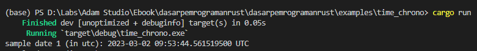
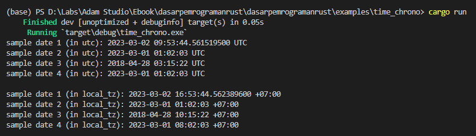
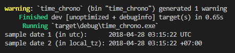
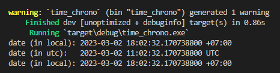
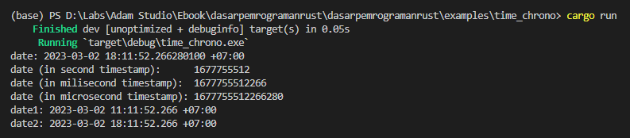

Pada chapter ini kita akan mempelajari tentang tipe data datetime yang ada di Rust programming.

Rust menyediakan cukup banyak API untuk keperluan pengolahan datetime, tersedia dalam Standard Library crate. Namun pada chapter ini kita tidak akan menggunakannya, karena yang akan dipakai adalah [`chrono` crate](https://crates.io/crates/chrono) (dianjurkan untuk menggunakan crate ini karena fiturnya lebih banyak).

## A.51.1. Persiapan

Sebelum memulai pembelajaran, siapkan satu project baru, kemudian tambahkan care `crono` dalam `Cargo.toml`.

```toml
[package]
name = "time_chrono"
version = "0.1.0"
edition = "2021"

[dependencies]
chrono = "0.4.23"
```

## A.51.2. Tipe data `DateTime`

`crono` menyediakan cukup banyak tipe data untuk merepresentasikan informasi tanggal dan waktu, tetapi yang paling penting untuk diketahui dan dipahami ada dua, yaitu:

- `DateTime<Utc>` dan `DateTime<Local>`
- `NaiveDateTime`

### ◉ Tipe `DateTime<Utc>`

`DateTime<Utc>` (gabungan dari tipe data `chrono::datetime::DateTime` dan generic `chrono::offset::utc::Utc`) adalah representasi untuk tipe data datetime dengan timezone offset **UTC** (atau **GMT+0**).

### ◉ Tipe `DateTime<Local>`

`DateTime<Local>` (gabungan dari tipe data `chrono::datetime::DateTime` dan generic `chrono::offset::local::Local`) adalah representasi untuk tipe data datetime dengan **timezone offset sesuai dengan di mana program dijalankan**.

Sebagai contoh, penulis berlokasi di Jawa Timur, maka ketika ada suatu data bertipe `DateTime<Local>` artinya timezone offset-nya adalah WIB (atau GMT+7).

### ◉ Tipe `NaiveDateTime`

Tipe `chrono::naive::datetime::NaiveDateTime` merupakan tipe data datetime yang tidak menyimpan informasi timezone. Nanti akan kita bahas apa kegunaan dari tipe ini.

## A.51.3. Pembuatan objek `DateTime`

### ◉ Via `Utc::now()`

Ada banyak cara untuk membuat date time, dan kita akan bahas satu-per-satu.

Cara yang pertama, mari kita pelajari sambil praktek. Isi file program `main.rs` dengan kode berikut, lalu jalankan.

```rust
use chrono::prelude::*;
use std::time::{UNIX_EPOCH, Duration};

fn main() {
    let sample_date1_in_utc: DateTime<Utc> = Utc::now();
    println!("sample date 1 (in utc): {sample_date1_in_utc}");
}
```



Contoh sederhana di atas adalah salah satu cara membuat object datetime dengan isi adalah informasi waktu sekarang (waktu ketika baris kode tersebut dieksekusi).

Statement `Utc::now()` mengembalikan informasi waktu sekarang dalam timezone UTC (representasi tipe data-nya adalah `DateTime<Utc>`).

Module item `Utc` sendiri harus diimport terlebih dahulu agar bisa digunakan. Itulah kenapa ada statement `use chrono::prelude::*`.

### ◉ Via `Utc.with_ymd_and_hms()`

Pembuatan object datetime dengan isi informasi waktu spesifik bisa dilakukan menggunakan `Utc.with_ymd_and_hms()`. Fungsi ini mewajibkan developer untuk mengisi 6 parameternya dengan segment waktu (tahun, bulan, dan lainnya).

```rust
let sample_date2_in_utc = Utc.with_ymd_and_hms(2023, 3, 1, 1, 2, 3).unwrap();
println!("sample date 2 (in utc): {sample_date2_in_utc}");
// output: sample date 2 (in utc): 2023-03-01 01:02:03 UTC
```

Statement di atas menghasilkan data datetime dengan isi `2023-03-01 01:02:03 UTC`.

### ◉ Via `DateTime::<Utc>::from()`

Cara ini pas digunakan pada situasi di mana kita perlu membuat object datetime dari sebuah [UNIX timestamp](https://en.wikipedia.org/wiki/Unix_time).

```rust
let sample_date3_in_utc = DateTime::<Utc>::from(UNIX_EPOCH + Duration::from_secs(1524885322));
println!("sample date 3 (in utc): {sample_date3_in_utc}");
// output: sample date 3 (in utc): 2018-04-28 03:15:22 UTC
```

Statement `DateTime::<Utc>::from()` di atas menghasilkan data datetime `2018-04-28 03:15:22 UTC`, karena nilai `1524885322` adalah representasi UNIX time untuk waktu tersebut.

### ◉ Via String method `parse()`

Tipe data string bisa langsung dikonversi ke bentuk datetime menggunakan method `parse()` yang dikombinasikan dengan `DateTime<Utc>` sebagai generic parameter.

```rust
let sample_date4_in_utc = "2023-03-01 01:02:03 UTC".parse::<DateTime<Utc>>().unwrap();
println!("sample date 4 (in utc): {sample_date4_in_utc}");
// output: sample date 4 (in utc): 2023-03-01 01:02:03 UTC
```

Statement parsing di atas menghasilkan data datetime `2023-03-01 01:02:03 UTC`, sesuai dengan isi data string.

O iya, perlu diketahui bahwa tidak semua string bisa di-parse ke bentuk `DateTime`. Jika data string memiliki format yang tidak sesuai dengan aturan parsing di Rust, maka proses parsing menggunakan method `parse()` pasti menghasilkan error.

Penerapan method `parse::<DateTime<Utc>>()` sebenarnya mengembalikan tipe data `Result<DateTime<Utc>, ParseError>`, itulah kenapa pada contoh perlu di chain lagi dengan method `unwrap`.

> Lebih detailnya mengenai tipe data `Result` dibahas pada chapter [Tipe Data ➜ Result](/basic/result-type)

### ◉ Cara lainnya

Ada beberapa cara lain yang bisa digunakan untuk pembuatan object datetime, dan kita akan bahas juga sebentar lagi.

## A.51.4. `Utc` vs `Local`

Kesemua cara yang sudah dipelajari di atas juga bisa diterapkan dalam pembuatan object date time dengan timezone offset `Local`. Penerapannya kurang lebih sama, cukup ganti `Utc` menjadi `Local`.

Jika disandingkan, akan seperti ini kodenya:

```rust
let date1_in_utc: DateTime<Utc> = Utc::now();
let date2_in_utc = Utc.with_ymd_and_hms(2023, 3, 1, 1, 2, 3).unwrap();
let date3_in_utc = DateTime::<Utc>::from(UNIX_EPOCH + Duration::from_secs(1524885322));
let date4_in_utc = "2023-03-01 01:02:03 UTC".parse::<DateTime<Utc>>().unwrap();

println!("sample date 1 (in utc): {date1_in_utc}");
println!("sample date 2 (in utc): {date2_in_utc}");
println!("sample date 3 (in utc): {date3_in_utc}");
println!("sample date 4 (in utc): {date4_in_utc}");

// vs

let date1_in_local_tz: DateTime<Local> = Local::now();
let date2_in_local_tz = Local.with_ymd_and_hms(2023, 3, 1, 1, 2, 3).unwrap();
let date3_in_local_tz = DateTime::<Local>::from(UNIX_EPOCH + Duration::from_secs(1524885322));
let date4_in_local_tz = "2023-03-01 01:02:03 UTC".parse::<DateTime<Local>>().unwrap();

println!("sample date 1 (in local_tz): {date1_in_local_tz}");
println!("sample date 2 (in local_tz): {date2_in_local_tz}");
println!("sample date 3 (in local_tz): {date3_in_local_tz}");
println!("sample date 4 (in local_tz): {date4_in_local_tz}");
```



Semoga cukup jelas.

Dari contoh di atas, sebenarnya ada 2 variabel yang menarik untuk dibahas, yaitu `sample_date1_in_utc` dan `sample_date1_in_local_tz`. Dua variabel tersebut berisi informasi waktu sekarang, perbedaannya hanya pada timezone offset saja. Namun, meski timezone offset-nya berbeda, kedua datetime tersebut sejatinya adalah merepresentasikan waktu yang sama (ekuivalen).

Agar lebih jelas, silakan perhatikan contoh berikut:

```bash
sample date 1 (in utc):        2023-03-02 09:53:44.561519500 UTC
sample date 1 (in local_tz):   2023-03-02 16:53:44.562389600 +07:00
```

Kedua datetime tersebut terpaku **7 jam** persis. Data `2023-03-02 09:53:44` UTC (atau GMT+0), jika dikonversi ke waktu lokal penulis (WIB atau GMT+7) maka akan menjadi `2023-03-02 16:53:44`. Selisihnya sesuai dengan timezone offset, yaitu 7 jam.

## A.51.5. Tipe `NaiveDateTime`

Rust memilik caranya sendiri dalam pengelolaan data datetime (yang menurut penulis cukup unik). Ada satu tipe data bernama `NaiveDateTime`, yang kegunaannya adalah untuk menampung tipe data datetime **tanpa spesifik timezone offset**.

Tipe data ini sangat berguna dibeberapa case yang kebanyakan adalah perihal konversi data ke bentuk `DateTime`.

Mari kita praktekan dengan contoh agar lebih jelas. Dimisalkan ada keperluan di mana data UNIX time perlu di konversi ke 2 bentuk `DateTime`, dengan timezone offset `Utc` dan `Local`. Pada kasus ini, cara ke-3 dari praktek sebelumnya bisa dilakukan untuk penyelesaian case ini.

```rust
let timestamp: u64 = 1524885322;
let date2_in_utc = DateTime::<Utc>::from(UNIX_EPOCH + Duration::from_secs(timestamp));
let date2_in_local_tz = DateTime::<Local>::from(UNIX_EPOCH + Duration::from_secs(timestamp));
```

Cara lain adalah dengan menggunakan `NaiveDateTime`, yang contoh penerapannnya kurang lebih seperti ini:

```rust
let timestamp_in_ms: i64 = 1524885322000;
let naive_date_time: NaiveDateTime = NaiveDateTime::from_timestamp_millis(timestamp_in_ms).unwrap();

let sample_date_in_utc = Utc.from_utc_datetime(&naive_date_time);
let sample_date_in_local_tz = Local.from_local_datetime(&naive_date_time).unwrap();

println!("sample date 1 (in utc):      {sample_date_in_utc}");
println!("sample date 2 (in local_tz): {sample_date_in_local_tz}");

// output:
// sample date 1 (in utc):      2018-04-28 03:15:22 UTC
// sample date 2 (in local_tz): 2018-04-28 03:15:22 +07:00
```

Statement `NaiveDateTime::from_timestamp_millis` berguna untuk mengkonversi data UNIX time (milisecond) ke bentuk `NaiveDateTime`. Kemudian, dari data tersebut dapat kita konversi lagi ke bentuk UTC dengan mudah menggunakan `Utc.from_utc_datetime()` dan local timezone menggunakan `Local.from_local_datetime()`.



Bisa dilihat pada output di atas, bahwa hasil data datetime berbeda untuk timezone UTC dan local.

> Jangan sampai bingung, 2 data datetime di atas tidak sama dan tidak ekuivalen meskipun informasi jam menit detiknya sama persis. Hal ini dikarenakan timezone offset-nya berbeda.

## A.51.6. Konversi datetime UTC ke local timezone, dan sebaliknya

Dalam bekerja dengan tipe data datetime, selalu memperhatikan timezone adalah hal yang sangat penting. Bisa saja dua buah datetime memiliki informasi tanggal dan waktu sama persis, tapi jika timezone-nya berbeda maka keduanya adalah berbeda!

Agar lebih jelas, silakan perhatikan kode berikut beserta outputnya:

```rust
let date1_in_local_tz: DateTime<Local> = Local::now();
println!("date (in local): {date1_in_local_tz}");

let date_in_utc = DateTime::<Utc>::from(date1_in_local_tz);
println!("date (in utc):   {date_in_utc}");

let date2_in_local_tz = DateTime::<Local>::from(date_in_utc);
println!("date (in local): {date2_in_local_tz}");

// output:
// date (in local): 2023-03-02 17:33:37.750279900 +07:00
// date (in utc):   2023-03-02 10:33:37.750279900 UTC
// date (in local): 2023-03-02 17:33:37.750279900 +07:00
```



Ketiga data datetime di atas adalah ekuivalen:

- Variabel `date1_in_local_tz` berisi informasi datetime waktu sekarang, dengan timezone GMT+7.
- Variabel `date_in_utc` adalah datetime yang ekuivalen dengan `date1_in_local_tz`, hanya saja direpresentasikan dalam timezone UTC.
- Variabel `date2_in_local_tz` juga ekuivalen dengan `date_in_utc` dan juga `date1_in_local_tz`.

Data `2023-03-02 10 UTC` jika ditambah 7 jam offset, maka menjadi `2023-03-02 17 GMT+7`.

## A.51.7. UNIX time

Cara konversi data `DateTime` ke bentuk UNIX time bisa dilakukan lewat 3 cara:

- menggunakan method `timestamp`, nilai baliknya dalam bentuk detik/second
- menggunakan method `timestamp_millis`, nilai baliknya dalam bentuk miliseconds
- menggunakan method `timestamp_micros`, nilai baliknya dalam bentuk microseconds

```rust
let date_in_local_tz: DateTime<Local> = Local::now();
println!("date: {date_in_local_tz}");
println!("date (in second timestamp):      {}", date_in_local_tz.timestamp());
println!("date (in milisecond timestamp):  {}", date_in_local_tz.timestamp_millis());
println!("date (in microsecond timestamp): {}", date_in_local_tz.timestamp_micros());
```

Sedangkan cara untuk mengkonversi data timestamp ke bentuk `DateTime` bisa dilakukan via `NaiveDateTime` ataupun `DateTime::from`.

```rust
// via NaiveDateTime
let naive_date_time = NaiveDateTime::from_timestamp_millis(date_in_local_tz.timestamp_millis()).unwrap();
let new_datetime1 = Local.from_local_datetime(&naive_date_time).unwrap();
println!("date1: {new_datetime1}");

// via DateTime::from
let new_datetime2 = DateTime::<Local>::from(UNIX_EPOCH + Duration::from_millis(date_in_local_tz.timestamp_millis().unsigned_abs()));
println!("date2: {new_datetime2}");
```

Output program di atas:



## A.51.8. Date formatting & parsing

Konversi datetime ke string (atau biasa disebut dengan date formatting) dilakukan menggunakan method `format` yang dalam penerapannya membutuhkan argument *datetime formatting syntax*.

Sedangkan konversi dari string ke datetime dilakukan via `Local.datetime_from_str` atau `Utc.datetime_from_str`.

Contoh pengaplikasian keduanya bisa dilihat pada kode berikut:

```rust
let date1: DateTime<Local> = Local::now();
println!("date1 (in local):  {}", date1);
// date1 (in local):  2023-03-02 18:13:39.954831600 +07:00

let str_from_date1 = date1.format("%Y-%m-%d %H:%M:%S %z").to_string();
println!("date1 (in string): {}", str_from_date1);
// date1 (in string): 2023-03-02 18:13:39 +0700

let date1_from_str = Local.datetime_from_str(&str_from_date1, "%Y-%m-%d %H:%M:%S %z").unwrap();
println!("date1 (in local):  {}", date1_from_str);
// date1 (in local):  2023-03-02 18:13:39 +07:00

let date2_from_str = Utc.datetime_from_str("03/01/2023 13:04 +0000", "%m/%d/%Y %H:%M %z").unwrap();
println!("date2 (in utc):    {}", date2_from_str);
// date2 (in utc):    2023-03-01 13:04:00 UTC

let str_from_date2 = date2_from_str.format("%Y-%m-%d %H:%M:%S %z").to_string();
println!("date2 (in string): {}", str_from_date2);
// date2 (in string): 2023-03-01 13:04:00 +0000
```

## A.51.9. DateTime formatting syntax

Berikut adalah tabel formatting syntax untuk tipe data datetime.

> Selengkapnya silakan cek https://docs.rs/chrono/latest/chrono/format/strftime/index.html

### ◉ Date specifiers

| Spec | Example | Description |
| :-: | :-: | :- |
| %Y | 2001 | The full proleptic Gregorian year, zero-padded to 4 digits. chrono supports years from -262144 to 262143. |
| %C | 20 | The proleptic Gregorian year divided by 100, zero-padded to 2 digits. 1 |
| %y | 01 | The proleptic Gregorian year modulo 100, zero-padded to 2 digits. 1 |
| %m | 07 | Month number (01–12), zero-padded to 2 digits. |
| %b | Jul | Abbreviated month name. Always 3 letters. |
| %B | July | Full month name. Also accepts corresponding abbreviation in parsing. |
| %h | Jul | Same as %b. |
| %d | 08 | Day number (01–31), zero-padded to 2 digits. |
| %e | 8 | Same as %d but space-padded. Same as %_d. |
| %a | Sun | Abbreviated weekday name. Always 3 letters. |
| %A | Sunday | Full weekday name. Also accepts corresponding abbreviation in parsing. |
| %w | 0 | Sunday = 0, Monday = 1, …, Saturday = 6. |
| %u | 7 | Monday = 1, Tuesday = 2, …, Sunday = 7. (ISO 8601) |
| %U | 28 | Week number starting with Sunday (00–53), zero-padded to 2 digits. 2 |
| %W | 27 | Same as %U, but week 1 starts with the first Monday in that year instead. |
| %G | 2001 | Same as %Y but uses the year number in ISO 8601 week date. 3 |
| %g | 01 | Same as %y but uses the year number in ISO 8601 week date. 3 |
| %V | 27 | Same as %U but uses the week number in ISO 8601 week date (01–53). 3 |
| %j | 189 | Day of the year (001–366), zero-padded to 3 digits. |
| %D | 07/08/01 | Month-day-year format. Same as %m/%d/%y. |
| %x | 07/08/01 | Locale’s date representation (e.g., 12/31/99). |
| %F | 2001-07-08 | Year-month-day format (ISO 8601). Same as %Y-%m-%d. |
| %v | 8-Jul-2001 | Day-month-year format. Same as %e-%b-%Y. |

### ◉ Time specifiers

| Spec | Example | Description |
| :-: | :-: | :- |
| %H | 00 | Hour number (00–23), zero-padded to 2 digits. |
| %k | 0 | Same as %H but space-padded. Same as %_H. |
| %I | 12 | Hour number in 12-hour clocks (01–12), zero-padded to 2 digits. |
| %l | 12 | Same as %I but space-padded. Same as %_I. |
| %P | am | am or pm in 12-hour clocks. |
| %p | AM | AM or PM in 12-hour clocks. |
| %M | 34 | Minute number (00–59), zero-padded to 2 digits. |
| %S | 60 | Second number (00–60), zero-padded to 2 digits. 4 |
| %f | 026490000 | The fractional seconds (in nanoseconds) since last whole second. 5 |
| %.f | .026490 | Similar to .%f but left-aligned. These all consume the leading dot. 5 |
| %.3f | .026 | Similar to .%f but left-aligned but fixed to a length of 3. 5 |
| %.6f | .026490 | Similar to .%f but left-aligned but fixed to a length of 6. 5 |
| %.9f | .026490000 | Similar to .%f but left-aligned but fixed to a length of 9. 5 |
| %3f | 026 | Similar to %.3f but without the leading dot. 5 |
| %6f | 026490 | Similar to %.6f but without the leading dot. 5 |
| %9f | 026490000 | Similar to %.9f but without the leading dot. 5 |
| %R | 00:34 | Hour-minute format. Same as %H:%M. |
| %T | 00:34:60 | Hour-minute-second format. Same as %H:%M:%S. |
| %X | 00:34:60 | Locale’s time representation (e.g., 23:13:48). |
| %r | 12:34:60 AM | Hour-minute-second format in 12-hour clocks. Same as %I:%M:%S %p. |

### ◉ Timezone specifiers

| Spec | Example | Description |
| :-: | :-: | :- |
| %Z | ACST | Local time zone name. Skips all non-whitespace characters during parsing. 6 |
| %z | +0930 | Offset from the local time to UTC (with UTC being +0000). |
| %:z | +09:30 | Same as %z but with a colon. |
| %::z | +09:30:00 | Offset from the local time to UTC with seconds. |
| %:::z | +09 | Offset from the local time to UTC without minutes. |
| %#z | +09 | Parsing only: Same as %z but allows minutes to be missing or present. |

### ◉ Date & time specifiers

| Spec | Example | Description |
| :-: | :-: | :- |
| %c | Sun Jul 8 00:34:60 2001 | Locale’s date and time (e.g., Thu Mar 3 23:05:25 2005). |
| %+ | 2001-07-08T00:34:60.026490+09:30 | ISO 8601 / RFC 3339 date & time format. 7 |
| %s | 994518299 | UNIX timestamp, the number of seconds since 1970-01-01 00:00 UTC. 8 |

### ◉ Special specifiers

| Spec | Description |
| :-: | :- |
| %t | Literal tab (\t). |
| %n | Literal newline (\n). |
| %% | Literal percent sign. |

---

## Catatan chapter 📑

### ◉ Source code praktik

<pre>
    <a href="https://github.com/novalagung/dasarpemrogramanrust-example/tree/master/datetime">
        github.com/novalagung/dasarpemrogramanrust-example/../datetime
    </a>
</pre>

### ◉ Chapter relevan lainnya

- [Tipe Data ➜ Result](/basic/result-type)
- [Generic](/basic/generics)

### ◉ Referensi

- https://doc.rust-lang.org/std/time/index.html
- https://docs.rs/time/latest/time/
- https://github.com/rust-lang/rust-wiki-backup/blob/master/Lib-datetime.md
- https://docs.rs/chrono/latest/chrono/
