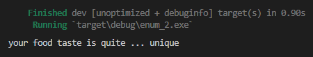
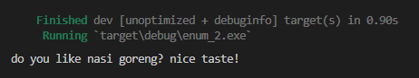
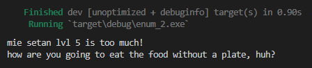
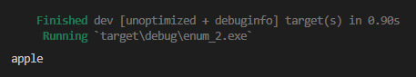

Enum atau *enumerated type* adalah sebuah tipe data yang digunakan untuk menampung nilai konstan. Pada chapter ini kita akan mempelajarinya.

Enum ada sedikit kemiripan dengan konstanta, bedanya ada pada nilai atau *underlying value*-nya. Jika di konstanta, yang didefinisikan adalah nama beserta value-nya, di enum yang didefinisikan adalah tipe data enum dan enum value. Enum value ini bentuknya seperti variabel tanpa nilai (lebih tepatnya nama dari enum value tersebut adalah nilainya). Lebih jelasnya silakan ikut pembahasan chapter ini.

## A.26.1. Keyword `enum`

Keyword `enum` digunakan untuk membuat *enumerated type*. Cara penulisannya seperti berikut:

```rust
enum NamaEnum {
    NilaiEnum1,
    Nilai2,
    NilaiEnumKe3,
    // ...
}
```

`NamaEnum` di atas adalah tipe data custom yang didefinisikan bertipe enum. Sedangkan `NilaiEnum1`, `Nilai2`, dan `NilaiEnumKe3` adalah yang disebut dengan enum value. Dengan itu maka ketiga enum values tersebut tipe datanya adalah sama, yaitu `NamaEnum`.

Mari kita lanjut praktik. Berikut ini adalah definisi konstanta yang menggunakan tipe data string untuk menampung nilai konstan-nya. Lalu dibawahnya ada lagi definisi nilai konstan tetapi menggunakan enum sebagai tipe data yang digunakan.

```rust
// definisi konstanta
const SuperheroSuperman: &str = "superman";
const SuperheroOmniMan: &str = "omniman";
const SuperheroHomelander: &str = "homelander";
const SuperheroHyperion: &str = "hyperion";

// definisi enum
enum Superhero {
    Superman,
    OmniMan,
    Homelander,
    Hyperion,
};
```

Di contoh bisa dilihat, `Superhero` adalah tipe data enum baru. Dari tipe data tersebut dibuat 4 buah enum values, yaitu `Superman`, `OmniMan`, `Homelander`, dan `Hyperion`.

Pada pembuatan konstanta, tipe data beserta value-nya harus ditentukan di awal. Pada enum, yang perlu didefinisikan adalah tipe data enum-nya (sebagai contoh `Superhero`) kemudian diikut dengan enum value yang dituliskan tanpa pengisian nilai.

- Definisi variabel dengan isi konstanta:

    ```rust
    let value1: &str = SuperheroSuperman;
    let value2 = SuperheroOmniMan;
    // ...
    ```

- Definisi variabel bertipe data enum `Superhero`:

    ```rust
    let value3: Superhero = Superhero::Superman;
    let value4 = Superhero::OmniMan;
    // ...
    ```

Notasi path digunakan dalam penulisan enum value dengan format `NamaEnum::EnumValue`

## A.26.2. *Naming convention* enum

Sesuai anjuran di [halaman dokumentasi Rust](https://rust-lang.github.io/api-guidelines/naming.html), upper camel case digunakan dalam penamaan Enum beserta value-nya.

Contoh:

```rust
enum Superhero {
    Superman,
    OmniMan,
    Homelander,
    Hyperion,
};
```

## A.26.3. Seleksi kondisi enum

Tipe data enum biasa dipakai pada seleksi kondisi, namun caranya sedikit berbeda. Default-nya keyword `if` tidak bisa digunakan pada tipe data enum.

Pada contoh berikut, statement seleksi kondisi `value3` menghasilkan error:

```rust
// seleksi kondisi pada konstanta
if value1 == SuperheroSuperman {
    println!("hello superman!");
}

// seleksi kondisi pada enum
if value3 == Superhero::Superman {
    println!("hello superman!");
}
```


> Error tersebut muncul karena tipe data enum `Superhero` tidak memiliki trait `PartialEq`. Lebih jelasnya mengenai trait dibahas pada chapter [Traits](/basic/traits).

Lalu bagaimana cara pengaplikasian seleksi kondisi pada tipe enum? Ada beberapa cara, namun yang paling praktis adalah keyword `match`.

## A.26.4. Keyword `match`

`match` adalah salah satu keyword untuk operasi seleksi kondisi di Rust. Penerapan keyword ini cukup luas, namun pada chapter ini hanya akan dibahas penerapannya yang relevan dengan topik enum.

Mari kita pelajarinya sembari praktik. Silakan buat package baru, lalu definisikan tipe enum `Food` berikut beserta 4 enum value-nya.

```rust
enum Food {
    PenyetanTerangBulan,
    PizzaNanas,
    EsKrimIkanMujaer,
    MiGorengKuah,
}
```

Lalu buat sebuah variabel bernama `makanan_favorit` untuk menampung salah satu nilai enum. Kemudian gunakan keyword `match` untuk menerapkan operasi seleksi kondisi dengan aksi menampilkan sebuah pesan sesuai dengan nilai yang cocok.

```rust
fn main() {
    let makanan_favorit: Food = Food::PenyetanTerangBulan;
    
    match makanan_favorit {
        Food::PenyetanTerangBulan => {
            println!("your food taste is quite ... unique");
        },
        Food::PizzaNanas => {
            println!("it's morally wrong to have pineaple on top of pizza");
        },
        Food::EsKrimIkanMujaer => {
            println!("I don't know what to say");
        },
        Food::MiGorengKuah => {
            println!("sometimes people do eat this, but it's ok");
        }
    }
}
```

Di atas bisa dilihat bagaimana cara penggunaan keyword `match` untuk penerapan seleksi kondisi pada tipe data enum.

Notasi penulisannya kurang lebih seperti ini:

```rust
 match variabel_enum {
    TipeEnum::ValueEnum1 => {
        // ...
    },
    TipeEnum::ValueEnum2 => {
        // ...
    },
    
    // ...
}
```

Kembali ke contoh program, variabel `makanan_favorit` dicek nilainya menggunakan keyword `match`.

- Jika nilainya adalah `Food::PenyetanTerangBulan`, muncul pesan:

    ```rust
    "your food taste is quite ... unique"
    ```

- Jika nilainya adalah `Food::PizzaNanas`, muncul pesan:

    ```rust
    "it is morally wrong to have pineaple on top of pizza"
    ```

- Jika nilainya adalah `Food::EsKrimIkanMujaer`, muncul pesan:

    ```rust
    "I don't know what to say"
    ```

- Jika nilainya adalah `Food::MiGorengKuah`, muncul pesan:

    ```rust
    "sometimes people do eat this, but it's ok"
    ```

Jalankan program untuk melihat hasilnya:



Keyword `match` ini sebenarnya tidak hanya digunakan untuk seleksi kondisi saja. Di Rust ada yang disebut dengan *pattern matching*. Metode *pattern matching* ini memahami *special syntax* yang kegunaanya lebih luas dibanding hanya sekedar seleksi kondisi biasa.

> Lebih jelasnya mengenai *pattern matching* dibahas pada chapter [Pattern Matching](/basic/pattern-matching)

## A.26.5. Enum value ➜ *tuple struct*-like

Enum value di struct bisa juga didesain seperti *tuple struct*. Sebagai contoh, enum `Food` di atas akan kita tambahi dengan satu enum value baru berbentuk *tuple struct*.

Silakan tambahkan enum value `MakananLainnya` berikut. Enum ini kita fungsikan untuk mengidentifikasi data makanan lainnya selain dari yang sudah ada di enum `Food`. Notasi penulisan *tuple struct* `MakananLainnya(String)` artinya enum value `MakananLainnya` didefinisikan untuk bisa menampung data property dalam bentuk `String`.

```rust
enum Food {
    PenyetanTerangBulan,
    PizzaNanas,
    EsKrimIkanMujaer,
    MiGorengKuah,
    MakananLainnya(String), // <---- enum value baru
}
```

Sekarang ubah isi variabel `makanan_favorit` dengan enum value baru yang sudah dibuat. Syntax `Food::MakananLainnya(nasi_goreng)` artinya enum value yang digunakan adalah `Food::MakananLainnya` dengan isi property didapat dari variabel `nasi_goreng`.

Tambahkan juga `Food::MakananLainnya` dalam blok kode `match`.

```rust
fn main() {
    // enum value MakananLainnya digunakan
    // dengan isi property adalah string "nasi goreng"
    let nasi_goreng = String::from("nasi goreng");
    let makanan_favorit = Food::MakananLainnya(nasi_goreng);
    
    match makanan_favorit {
        Food::PenyetanTerangBulan => {
            println!("your food taste is quite ... unique");
        },
        Food::PizzaNanas => {
            println!("it's morally wrong to have pineaple on top of pizza");
        },
        Food::EsKrimIkanMujaer => {
            println!("I don't know what to say. this should be illegal");
        },
        Food::MiGorengKuah => {
            println!("sometimes people do eat this, but it's ok");
        },
        Food::MakananLainnya(m) => { // <---- seleksi kondisi baru
            println!("do you like {m}? nice taste!");
        }
    }
}
```

Bisa dilihat ada keunikan dalam penulisan seleksi kondisi `Food::MakananLainnya` dalam blok kode `match`. Disitu ada parameter bernama `m` yang parameter tersebut akan berisi data property jika memang *match* dengan `makanan_favorit`.

Coba jalankan untuk melihat hasilnya:



O iya, jumlah property value enum berbentuk *tuple struct* ini tidak terbatas ya. Pada contoh di atas, `Food::MakananLainnya` hanya memiliki 1 property. Lebih dari satu juga bisa.

## A.26.6. Enum value ➜ *struct*-like

Enum value bisa juga didesain memiliki property seperti *struct*.

Mari kita terapkan pada kode sebelumnya. Tambahkan 1 buah enum value lagi dengan nama `MieSetan` yang ditulis dalam bentuk *struct*-like, dan memiliki 2 buah property.

```rust
enum Food {
    PenyetanTerangBulan,
    PizzaNanas,
    EsKrimIkanMujaer,
    MiGorengKuah,
    MakananLainnya(String),
    MieSetan { level_pedas: i32, pakek_piring: bool }
}
```

Setelah itu, isi variabel dengan nilai adalah enum value `Food::MieSetan`, level pedasnya 5, dan tanpa piring.

Tak lupa tambahkan seleksi kondisi untuk `Food::MieSetan` pada blok kode `match`.

```rust
fn main() {
    let makanan_favorit = Food::MieSetan { 
        level_pedas: 5,
        pakek_piring: false
    };
    
    match makanan_favorit {
        Food::PenyetanTerangBulan => {
            println!("your food taste is quite ... unique");
        },
        Food::PizzaNanas => {
            println!("it's morally wrong to have pineaple on top of pizza");
        },
        Food::EsKrimIkanMujaer => {
            println!("I don't know what to say. this should be illegal");
        },
        Food::MiGorengKuah => {
            println!("sometimes people do eat this, but it's ok");
        },
        Food::MakananLainnya(m) => {
            println!("do you like {m}? nice taste!");
        },
        Food::MieSetan { level_pedas, pakek_piring } => {
            if level_pedas > 3 {
                println!("mie setan lvl {} is too much!", level_pedas);
            } else {
                println!("mie setan lvl {} is perfect!", level_pedas);
            }

            if !pakek_piring {
                println!("how are you going to eat the food without a plate, huh?");
            }
        }
    }
}
```

Dalam seleksi kondisi `Food::MieSetan` bisa dilihat ada beberapa statement. Kurang lebih jika nilai dari variabel `makanan_favorit` adalah `Food::MieSetan` maka:

- Akan memunculkan pesan yang berbeda tergantung level pedasnya
- Dan jika terdeteksi tidak menggunakan piring, dimunculkan pesan tambahan



## A.26.7. Aturan *pattern matching* enum

Dalam blok kode `match`, semua enum value harus dituliskan. Jika tidak, pasti muncul error. Contohnya bisa dilihat di gambar berikut, beberapa seleksi kondisi enum value di-remark, hasilnya ada error.


Error tersebut sebenarnya bisa diantisipasi dengan menambahkan seleksi kondisi dengan penulisan seperti berikut:

```rust
match makanan_favorit {
    Food::PenyetanTerangBulan => {
        println!("your food taste is quite ... unique");
    },
    Food::PizzaNanas => {
        println!("it's morally wrong to have pineaple on top of pizza");
    },
    _ => {
        println!("never heard about that food");
    }
}
```

Menggunakan blok kode `match` di atas, jika nilai `makanan_favorit` adalah selain `Food::PenyetanTerangBulan` dan `Food::PizzaNanas`, maka pesan `never heard about that food` adalah yang muncul di layar.

Selain variabel `_` bisa juga menggunakan nama variabel apapun, misalnya `some_var`. Namun jika variabel tersebut tidak digunakan dalam blok kode, akan muncul warning.

## A.26.8. Enum module & visibility

Mari kita coba cek perihal visibility dari enum. Siapkan package baru dengan struktur seperti berikut:

```bash title="package source code structure"
my_package
│─── Cargo.toml
└─── src
     │─── constants.rs
     └─── main.rs
```

Pada file `constants.rs`, tambahkan enum `Company` berikut. Pastikan enum adalah publik dengan menambahkan keyword `pub` pada deklarasinya.

```rust title="src/constants.rs"
pub enum Company {
    Apple,
    Microsoft,
    Google,
    Github
}
```

Kemudian tambahkan kode berikut di `main.rs`.

```rust title="src/main.rs"
mod constants;

fn main() {
    let company = constants::Company::Apple;
    
    match company {
        constants::Company::Apple => {
            print!("apple")
        },
        _ => {
            print!("other than apple")
        }
    }
}
```

Jalankan, hasilnya tidak error, karena `Company` didefinisikan publik.



Coba lakukan modifikasi dengan menghilangkan keyword `pub` saat definisi enum, hasilnya pasti error.

> Pada tipe data enum, keyword `pub` cukup ditambahkan pada definisi enum type, tidak perlu ditambahkan satu persatu di tiap enum values.

## A.26.9. Generic pada enum

Pembahasan mengenai generic pada enum ada pada chapter [Generics](/basic/generics#a368-generics-enum).

## A.26.10. Pembahasan lanjutan *pattern matching*

Pembahasan yang lebih mendetail tentang keyword `match` dan *pattern matching* ada pada chapter [Pattern Matching](/basic/pattern-matching).

---

## Catatan chapter 📑

### ◉ Source code praktik

<pre>
    <a href="https://github.com/novalagung/dasarpemrogramanrust-example/tree/master/enum">
        github.com/novalagung/dasarpemrogramanrust-example/../enum
    </a>
</pre>

### ◉ Work in progress

- Pembahasan tentang associated function dan method pada enum

### ◉ Referensi

- https://doc.rust-lang.org/book/ch06-01-defining-an-enum.html
- https://doc.rust-lang.org/rust-by-example/custom_types/enum.html
- https://doc.rust-lang.org/reference/items/enumerations.html
- https://doc.rust-lang.org/book/ch06-02-match.html
- https://doc.rust-lang.org/std/keyword.enum.html
