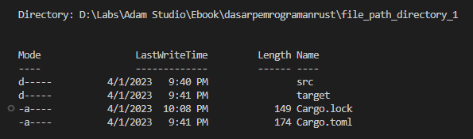

Pada chapter ini kita akan belajar tentang beberapa API milik Rust yang disediakan untuk manajemen path dan file system.

> Penulis anjurkan untuk mengikuti pembelajaran chapter per chapter secara berurutan. Nantinya pada chapter [Recoverable Error & Error Handling](/basic/recoverable-error-handling) kita akan banyak menerapkan API yang dipelajari di chapter ini.

## A.53.1. File path (`std::path::Path`)

`"/home/novalagung/Desktop/my text.txt"` adalah salah satu contoh file path. Di Rust, file path bisa direpresentasikan sebagai string (seperti yang sudah dicontohkan), atau menggunakan tipe data `Path`.

Tipe data `Path` tersedia dalam module `std::path`. Cara penggunaannya cukup mudah, sebagai contoh, beberapa filepath berikut menghasilkan path yang sama:

```rust
use std::path::Path;

let filepath_1 = "/home/novalagung/Desktop/my text.txt";
let filepath_2 = Path::new("/home/novalagung/Desktop/my text.txt");
let filepath_3 = Path::new("/home/novalagung/Desktop").join("my text.txt");
let filepath_4 = Path::new("/home/novalagung").join("Desktop").join("my text.txt");
let filepath_5 = Path::new("/home").join("novalagung/Desktop/my text.txt");

println!("{:?}", filepath_1);
// output => "/home/novalagung/Desktop/my text.txt"

println!("{:?}", filepath_2);
// output => "/home/novalagung/Desktop/my text.txt"
```

> Ketika path di-print, yang muncul adalah sesuai dengan string yang ditulis. Dengan pengecualian jika method `.join()` digunakan disitu, maka separator file yang digunakan relatif terhadap OS. Jika Windows maka `\`, dan `/` untuk non-Windows.

## A.53.2. Method filepath

### ◉ Associated function `Path::new()`

Digunakan untuk membuat object `Path` dari suatu string. Contoh penerapan:

```rust
Path::new("/home/novalagung/Desktop/my text.txt");
```

### ◉ Method `join()`

Digunakan untuk menggabungkan segment filepath. Contoh penerapan:

```rust
Path::new("/home/novalagung").join("Desktop").join("my text.txt");
```

Hasil dari operasi di atas adalah path:

```
/home/novalagung/Desktop/my text.txt
```

### ◉ Method `exists()`

Digunakan untuk mengecek apakah suatu filepath ada atau tidak.

```rust
if Path::new(&path).exists() {
    // path exists
}
```

### ◉ Method `is_file()` & `is_dir()`

Method `is_file()` digunakan untuk mengecek apakah suatu filepath berisi file.

```rust
if Path::new(&path).is_file() {
    // path is a file
}
```

Sedangkan method `is_dir()` digunakan untuk mengecek apakah suatu filepath adalah folder/directory.

```rust
if Path::new(&path).is_dir() {
    // path contains directory
}
```

### ◉ Method `is_absolute()` & `is_relative()`

Method `is_absolute()` digunakan untuk mengecek apakah suatu filepath adalah *absolute path*.

```rust
if Path::new(&path).is_absolute() {
    // path is an absolute path
}
```

Sedangkan method `is_relative()` digunakan untuk mengecek apakah suatu filepath adalah *relative path*.

```rust
if Path::new(&path).is_relative() {
    // path is a relative path
}
```

## A.53.3. Module `std::fs` (file system)

`std::fs` merupakan module yang disediakan Rust untuk pengolahan file system. Di dalamnya berisinya banyak sekali fungsi untuk keperluan seperti pembuatan file, modifikasi konten file, dan lainnya.

Sebagai contoh, untuk membuat suatu directory bisa menggunakan `fs::create_dir`. Isi argument pemanggilan fungsi dengan path dalam bentuk string (atau `std::path::Path` juga boleh).

```rust
use std::fs;

fn main() {
    let path = "./files";
    let res = fs::create_dir(&path);
    println!("{:?}", res);
    // output => Ok(())
}
```

Fungsi `fs::create_dir` mengembalikan value bertipe `Result<(), Error>`. Gunakan pattern matching `match` untuk mengecek hasil operasi apakah sukses atau tidak.

```rust
match fs::create_dir("./files") {
    Err(err) => {
        println!("error on creating directory! {}", err);
    },
    _ => {
        println!("directory created");
    },
}
```

> - Lebih detailnya mengenai tipe data `Result` dibahas pada chapter [Tipe Data ➜ Result](/basic/result-type).
> - Lebih detailnya mengenai pattern matching dibahas pada chapter [Pattern Matching](/basic/pattern-matching).

## A.53.4. Manajemen file system

### ◉ Pembuatan folder (`fs::create_dir`)

Fungsi `fs::create_dir` digunakan untuk membuat folder. Contoh penerapannya sudah dibahas di sesi [A.53.3. Module std::fs (file system)](/basic/file-path-directory#a523-module-stdfs-file-system) di atas.

### ◉ Menulis konten file (`fs::write`)

Fungsi `fs::write` digunakan untuk membuat folder. Contoh penerapan:

```rust
let path = Path::new("./files").join("target.txt");
let content = "hello rust!";
let res = fs::write(&path, &content);

match res {
    Err(err) => {
        println!("error on writing file {}! {}", path.to_str().unwrap_or_default(), err);
    },
    _ => {
        println!("file created");
    },
}
```

Fungsi `fs::write` melakukan penulisan konten pada variabel `content` ke path `path`. Mode penulisannya adalah *overwrite* (bukan *append*), yang artinya konten lama pada filepath akan di-*replace* total dengan konten baru.

Jika file tidak ada pada `path` tujuan, maka otomatis dibuatkan file baru. Namun jika folder/directory di mana file akan dibuat/ditulis tidak ada, maka muncul error.

### ◉ Membaca isi file ke bentuk string (`fs::read_to_string`)

Fungsi `fs::read_to_string()` digunakan untuk membaca isi file dalam bentuk string. Contoh penerapannya:

```rust
let path = Path::new("./files").join("target.txt");
let res = fs::read_to_string(&path);

match res {
    Err(err) => {
        println!("error on reading file {}! {}", path.to_str().unwrap_or_default(), err);
    },
    Ok(content) => {
        println!("file {:?} content is: {:?}", path, content);
    },
}
```

### ◉ Membaca isi file ke bentuk vector (`fs::read`)

Fungsi `fs::read()` melakukan operasi baca file dan mengembalikan nilainya dalam bentuk vector `Vec<u8>`. Umumnya, fungsi ini dikombinasikan dengan fungsi `std::str::from_utf8()` agar konten file bisa dimunculkan dalam format encoding tertentu (misalnya UTF-8).

```rust
let path = Path::new("./files").join("target.txt");
let res = fs::read(&path);

if res.is_err() {
    println!("error on reading file");
    return;
}

let content = res.unwrap_or_default();
match std::str::from_utf8(&content) {
    Err(err) => {
        println!("error on reading file! Invalid UTF-8 sequence. {}", err);
    },
    Ok(content) => {
        println!("file {:?} content is: {:?}", path, content);
    },
};
```

### ◉ Menghapus file (`fs::remove_file`)

Fungsi `fs::remove_file` digunakan untuk menghapus file pada suatu path. Contoh penerapan:

```rust
let path = Path::new("./files").join("target.txt");
let res = fs::remove_file(&path);

match res {
    Err(err) => {
        println!("error on deleting file {}! {}", path.to_str().unwrap_or_default(), err);
    },
    _ => {
        println!("file deleted");
    },
}
```

### ◉ Menghapus folder (`fs::remove_dir`)

Fungsi `fs::remove_dir` digunakan untuk menghapus folder/directory. Contoh penerapan:

```rust
let path = Path::new("./files");
let res = fs::remove_dir(&path);

match res {
    Err(err) => {
        println!("error on deleting directory {}! {}", path.to_str().unwrap_or_default(), err);
    },
    _ => {
        println!("directory deleted");
    },
}
```

### ◉ List items dalam folder

Fungsi `fs::read_dir` digunakan untuk menampilkan list items suatu folder (baik subfolder ataupun file). Fungsi ini mengmbalikan nilai bertipe `Result<ReadDir, Error>`, untuk mengakses list items bisa menggunakan teknik pattern matching, atau boleh juga langsung di `unwrap()` (dengan resiko program bisa panic ketika ada error).

```rust
let path = Path::new("D:\\Labs\\Adam Studio\\Ebook\\dasarpemrogramanrust\\file_path_directory_1");
let paths = fs::read_dir(&path).unwrap();

for path in paths {
    let item = &path.unwrap();
    println!("file name: {:?}, file path: {:?}", item.file_name(), item.path().display())
}
```

Pada contoh di atas, penulis menggunakan testing path yang isinya 4 buah item:



Output program bisa dilihat pada gambar berikut:


Tipe data variabel `paths` di atas adalah `ReadDir` yang merupakan tipe data iterator. Jika digunakan pada keyword `for`, maka variabel element perulangan `path` akan bertipe data `Result<DirEntry, Error>`. Dari tipe ini kita bisa mengakses file name maupun file path.

---

## Catatan chapter 📑

### ◉ Source code praktik

<pre>
    <a href="https://github.com/novalagung/dasarpemrogramanrust-example/tree/master/file_path_directory">
        github.com/novalagung/dasarpemrogramanrust-example/../file_path_directory
    </a>
</pre>

### ◉ Work in progress

- Pembahasan tentang append content file (https://stackoverflow.com/questions/30684624/what-is-the-best-variant-for-appending-a-new-line-in-a-text-file)

### ◉ Chapter relevan lainnya

- [Tipe Data ➜ Result](/basic/result-type)
- [Pattern Matching](/basic/pattern-matching)

### ◉ Referensi

- https://doc.rust-lang.org/std/path/struct.Path.html
- https://doc.rust-lang.org/rust-by-example/std_misc/path.html
- https://doc.rust-lang.org/rust-by-example/std_misc/fs.html
