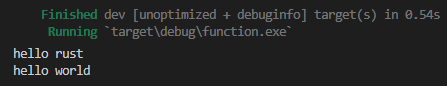
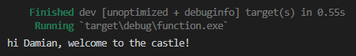
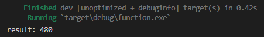
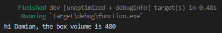
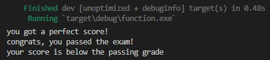
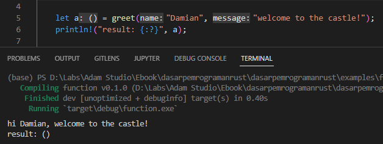

Pada chapter ini kita akan belajar tentang *function* atau fungsi.

> Definisi fungsi dalam programming secara terminologi adalah sebuah modul atau sub-program kecil yang digunakan untuk mengeksekusi sebuah perintah, dan bisa di-*reuse* dalam penggunaannya.

## A.17.1. Keyword `fn`

Fungsi di Rust dibuat menggunakan keyword `fn`. Salah satu contoh penerapan keyword ini dalam pembuatan fungsi sudah kita praktikkan berulang kali pada definisi fungsi `main`, yang merupakan fungsi utama atau entrypoint sebuah program.

```rust
fn main() {

}
```

Fungsi `main` ini spesial, ketika program dijalankan maka `main` otomatis dipanggil atau dieksekusi.

Pembuatan fungsi lainnya-pun juga didefinisikan dengan notasi penulisan yang sama. Pada contoh berikut kita akan buat fungsi bernama `greet` yang tugasnya adalah menampilkan message ke layar output.

```rust
fn greet() {
    println!("hello world");
}
```

Panggil fungsi tersebut di `main`, lalu run program.

```rust
fn main() {
    println!("hello rust");
    greet();
}
```



Bisa dilihat ada 2 message muncul, yang pertama adalah pesan `hello rust` yang muncul hasil eksekusi statement `println!("hello rust")`, lalu diikuti `hello world` yang statement print untuk menampilkan message tersebut ada dalam fungsi `greet`.

O iya, definisi fungsi tidak mengenal urutan ya. Sebagai contoh fungsi `greet` dan `main` di atas, bebas mana yang ditulis lebih dulu.

```rust
fn greet() {
    // ..
}

fn main() {
    // ..
}
```

... atau ...

```rust
fn main() {
    // ..
}

fn greet() {
    // ..
}
```

## A.17.2. *Naming convention* fungsi

Sesuai anjuran di [halaman dokumentasi Rust](https://rust-lang.github.io/api-guidelines/naming.html), aturan penulisan nama fungsi di Rust adalah menggunakan **snake case**. Nama fungsi dituliskan dalam huruf kecil dengan separator tanda garis bawah atau underscore (`_`). Contohnya seperti: `main`, `greet_message`, `get_report_Status`, dll.

## A.17.3. Parameter fungsi dan argumen fungsi

Fungsi bisa didefinisikan dengan disertai parameter, dengan itu bisa menyisipkan data saat pemanggilan fungsi.

Parameter dituliskan di statement pendefinisian fungsi dengan notasi seperti berikut:

```rust
fn func_name(param_a: int32) {
    // ...
}

fn func_name(param_a: int32, param_b: bool) {
    // ...
}

fn func_name(param_a: int32, param_b: bool, param_c: &str) {
    // ...
}

// ...
```

Kembali ke praktik, pada bagian ini kita akan buat sebuah fungsi bernama `greet_custom_message`. Fungsi ini tugasnya masih sama seperti seperti `greet` hanya saja pesan yang ditampilkan adalah sesuai dengan value parameter fungsi.

```rust
fn greet_custom_message(name: &str, message: &str) {
    println!("hi {name}, {message}");
}
```

Ada dua parameter yang didefinisikan:

- `name`, tipe datanya string literal
- `message`, tipe datanya juga string literal

Kedua nilai parameter tersebut di-*combine* lalu di-print menggunakan macro `println`.

Ok, sekarang panggil fungsi tersebut dalam `main`, sisipkan argumen pertama `Damian` yang ditampung parameter `name`, dan argumen ke-2 `welcome to the castle!` untuk parameter `message`

```rust
fn main() {
    greet_custom_message("Damian", "welcome to the castle!");
}
```

Jalankan program. Output bisa dilihat di gambar berikut.



O iya, parameter bisa memiliki tipe data apa saja selama di-*support* oleh Rust, jadi tidak hanya string literal `&str`.

> Secara terminologi, parameter adalah variabel yang didefinisikan di fungsi, sedangkan argumen adalah nilai yang disisipkan pada parameter saat pemanggilan fungsi.
>
> Seiring berjalannya waktu, terjadi [sedikit perubahan](https://doc.rust-lang.org/book/ch03-03-how-functions-work.html#parameters) mengenai makna untuk istilah `parameter` dan `argumen`. Sekarang kedua istilah tersebut lebih sering dimaknai sama.

## A.17.4. Nilai balik fungsi (*return value*)

Sebuah fungsi bisa di-desain memiliki nilai balik. Caranya dengan menambahkan tanda `->` diikuti tipe data dari nilai balik pada pendefinisian fungsi.

Pada contoh berikut, sebuah fungsi dibuat dengan nama `calculate_box_volume1`, memiliki 3 buah parameter bertipe numerik (`width`, `height`, dan `length`), dan nilai balik bertipe data `i32`. Tugas dari fungsi `calculate_box_volume1` adalah melakukan operasi matematika perhitungan volume terhadap data yang didapat dari parameter, yang kemudian hasil kalkulasinya dijadikan nilai balik.

Keyword `return` (diikuti dengan data) digunakan untuk menentukan nilai balik suatu fungsi. Pada contoh berikut, variabel `volume` adalah nilai balik fungsi.

```rust
fn calculate_box_volume1(width: i32, height: i32, length: i32) -> i32 {
    let volume = width * height * length;
    return volume;
}
```

Selanjutnya siapkan beberapa variabel yang nantinya digunakan saat pemanggilan `calculate_box_volume1`. Lalu panggil fungsi tersebut kemudian tampilkan *return value*-nya.

```rust
let width = 5;
let height = 8;
let length = 12;

let res1 = calculate_box_volume1(width, height, length);
println!("result: {res1}");
```

Jalankan program, hasilnya adalah sesuai harapan. Volume dari persegi panjang dengan data `5 x 8 x 12` adalah `480`.



### ◉ Keyword `return` untuk penentuan nilai balik

Salah satu hal yang unik yang ada di Rust adalah beberapa variasi cara penulisan nilai balik fungsi. Cara pertama adalah menggunakan keyword `return` seperti yang sudah dipraktikkan.

```rust
fn calculate_box_volume1(width: i32, height: i32, length: i32) -> i32 {
    let volume = width * height * length;
    return volume;
}
```

Untuk cara ini penulis rasa cukup jelas.

### ◉ *Return value* tanpa keyword `return`

Cara ke-2 kita langsung praktikkan menggunakan kode berikut, silakan tulis lalu jalankan program:

```rust
fn calculate_box_volume2(width: i32, height: i32, length: i32) -> i32 {
    let volume = width * height * length;
    volume
}

fn main() {
    let name2 = "Damian";
    let res2 = calculate_box_volume2(width, height, length);
    println!("hi {name2}, the box volume is {res2}");
}
```

Hasilnya kurang lebih sama, hanya di-bagian outputnya beda karena pada contoh ini pesan yang ditampilkan diubah.



Sekarang kita fokus ke kode yang sudah ditulis. Fungsi `calculate_box_volume2` kurang lebih struktur dan isinya sama seperti `calculate_box_volume1`, bedanya hanya pada dua hal:

- Fungsi `calculate_box_volume2` nilai baliknya dituliskan tanpa keyword `return`
- Fungsi `calculate_box_volume2` pada statement terakhir tidak diakhir tanda akhir statement `;`

Kedua poin tersebut merupakan syarat untuk penerapan *return value* tanpa keyword `return`. Caranya kurang lebih adalah dengan menuliskan data nilai balik dengan tanpa keyword `return` dan di akhir statement tidak ditambahi tanda semicolon `;`.

> Statement terakhir sebuah blok kode fungsi yang ditulis tanpa semicolon `;` disebut sebagai `tail` atau `body tail`.

### ◉ Statemen sebagai *return value* tanpa keyword `return`

Cara selanjutnya yang akan kita bahas ini sebenarnya sama seperti sebelumnya, hanya saja bedanya di sini tidak menggunakan nama variabel sebagai nilai balik, melainkan langsung statement, yang hasil eksekusi statement tersebut dijadikan nilai balik fungsi.

Langsung saja kita praktikkan. Siapkan fungsi `calculate_box_volume3` berikut:

```rust
fn calculate_box_volume3(width: i32, height: i32, length: i32) -> i32 {
    width * height * length
}

fn greet_custom_message(name: &str, message: &str) {
    println!("hi {name}, {message}");
}
```

Panggil fungsi tersebut, tampung nilai baliknya ke variabel `res3`. Lalu siapkan `message3` yang isinya adalah sebuah pesan string literal yang dibuat menggunakan macro `format`. Terakhir tampilkan pesan tersebut menggunakan fungsi `greet_custom_message`.

```rust
fn main() {
    let res3 = calculate_box_volume3(width, height, length);
    let message3 = format!("the box volume is {}", res3);

    greet_custom_message("Damian", message3.as_str());
}
```

Bisa dilihat hasilnya sama seperti pada program sebelumnya.


### ◉ Macro `format` untuk membuat *formatted* string

Bagian ini adalah penjelasan tambahan dari kode program yang baru saja dipraktikkan.

Macro `format` digunakan untuk *formatting* sebuah string. *Formatting* di sini maksudnya adalah pembuatan string dengan menggunakan teknik penyusunan isi string dalam format tertentu, mirip seperti yang dilakukan menggunakan macro `print` atau `println`, bedanya hanya pada macro `format` hasilnya bukan sebuah output ke console output, melainkan sebagai nilai balik.

```rust
// 2 bari statements berikut ...
let message3 = format!("the box volume is {}", res3);
println!("{}", message3.as_str());

// ... adalah sama dengan statement berikut ...
println!("the box volume is {}", res3);
```

Satu hal yang penting diketahui dari macro `format`. Nilai balik macro ini bukanlah string literal `&str`, tetapi tipe `String`. **Dua tipe tersebut adalah berbeda**.

Pada contoh di atas, method `as_str` milik tipe data `String` digunakan untuk mengambil data string literal-nya. Method `as_str` ini menghasilkan data bertipe `&str` dari sebuah `String`.

## A.17.5. *Conditional return value*

Kapan harus menggunakan keyword `return` dalam penentuan nilai balik dan kapan tidak? Jawabannya mungkin adalah preferensi, tapi di luar itu ada juga case dimana keyword `return` harus digunakan, yaitu pada fungsi yang memiliki nilai balik terkondisi. Contoh:

```rust
fn get_score_message(score: f32) -> &'static str {
    if score == 100.0 {
        return "you got a perfect score!"
    }
    
    if score > 76.0 {
        return "congrats, you passed the exam!"
    }

    "your score is below the passing grade"
}

fn main() {
    println!("{}", get_score_message(100.0));
    println!("{}", get_score_message(98.2));
    println!("{}", get_score_message(33.12));
}
```



Teknik penentuan nilai balik tanpa keyword `return` hanya bisa dipergunakan di akhir blok kode, contohnya pada fungsi `get_score_message` statement terakhir blok kode adalah string literal `"your score is below the passing grade"`.

**Jika pada selain akhir blok ada kondisi dimana nilai balik harus ditentukan, maka wajib menggunakan keyword `return`**. Bisa dilihat pada fungsi yang sudah ditulis, `return` statement dalam blok kode seleksi kondisi `if` dipergunakan.

## A.17.6. Nilai balik fungsi bertipe string literal `&str`

Khusus untuk beberapa jenis tipe data, seperti `&str`, jika digunakan sebagai tipe data *return value* fungsi harus ditambahi keyword `static` dengan penulisan `&'static str`. Contoh penerapan:

```rust
fn get_score_message(score: f32) -> &'static str {
    return "you got a perfect score!"
}
```

Agar tidak makin bingung, pembahasannya dipisah pada chapter lain, yaitu [Static](/basic/static) dan [Lifetime](/basic/lifetime).

## A.17.7. *Default return value*

Tambahan info saja, bahwa di Rust, semua fungsi itu memiliki nilai balik, yep semuanya. Untuk fungsi yang tidak didefinisikan nilai baliknya maka nilai baliknya adalah tuple kosong `()`. Sebagai contoh fungsi `greet_custom_message` yang sudah ditulis, coba saja tampung nilai baliknya dan print. Outputnya adalah *empty tuple* atau tuple kosong `()`.

```rust
let a = greet_custom_message("Damian", "welcome to the castle!");
println!("result: {:?}", a);
```



## A.17.8. Pembahasan lanjutan

Ada beberapa topik lainnya yang relevan dengan function, yaitu:

- **Associated function**, pembahasannya ada di chapter [Associated Function](/basic/associated-function)
- **Method**, pembahasannya juga di chapter terpisah, yaitu [Method](/basic/method)

Selain itu nantinya juga ada pembahasan mengenai topik yang cukup advance yang berhubungan dengan fungsi, yaitu:

- **Unsafe function**, pembahasannya ada di chapter [Safe & Unsafe](/wip/safe-unsafe)
- **Async function**, pembahasannya ada di chapter [Async](/wip/async)
- **Constant function**, pembahasannya ada di chapter [Constant Evaluation](/wip/constant-evaluation)
- **Trait → Function**, pembahasannya ada di chapter [Trait → Function](/basic/trait-function)

Untuk sekarang silakan lanjut ke pembahasan chapter berikutnya terlebih dahulu, jangan langsung loncat ke chapter di atas.

---

## Catatan chapter 📑

### ◉ Source code praktik

<pre>
    <a href="https://github.com/novalagung/dasarpemrogramanrust-example/tree/master/function">
        github.com/novalagung/dasarpemrogramanrust-example/../function
    </a>
</pre>

### ◉ Work in progress

- Pembahasan tentang diverging function (`() -> !`)

### ◉ Referensi

- https://doc.rust-lang.org/book/ch03-03-how-functions-work.html
- https://doc.rust-lang.org/std/keyword.fn.html
- https://doc.rust-lang.org/std/keyword.return.html
- https://doc.rust-lang.org/std/keyword.static.html
- https://doc.rust-lang.org/rust-by-example/fn.html
- https://rust-lang.github.io/api-guidelines/naming.html

---
