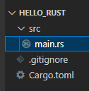
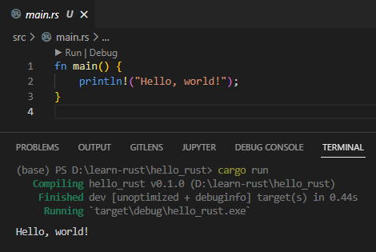

Seperti pada umumnya bahasa pemrograman, belajar membuat program pasti diawali dengan aplikasi `Hello World`, dan pada chapter ini kita akan melakukannya. Kita akan buat program bernama `Hello Rust` menggunakan pemrograman Rust.

## A.1.1. Pembuatan project/package

Pembuatan project baru di Rust bisa dilakukan dengan 2 cara, dengan `cargo` atau tanpanya. Di sini kita akan skip bagian pembuatan project tanpa `cargo`, karena akan butuh effort lebih banyak nantinya dalam mengelola package dan manajemen build.

> Di Rust istilah project lebih dikenal dengan **package**, dan pada ebook ini maknanya adalah sama.

Ok langsung saja, buat project baru dengan mengeksekusi command berikut:

```bash
cargo new hello_rust
cd hello_rust
```

Command di atas menghasilkan sebuah folder baru bernama `hello_rust` dengan isi beberapa file:

- `Cargo.toml`
- `.gitignore`
- `src/main.rs`



File `src/main.rs` adalah file penting dalam pemrograman Rust. File `main.rs` merupakan file pertama yang dipanggil saat proses build program Rust (yang kemudian di-run). Source code program harus berada dalam folder `src`.

> Pembahasan detail mengenai file `Cargo.toml` nantinya ada pada chapter [Module System → Package & Crate](/basic/package-crate). Untuk sekarang penulis anjurkan untuk mengikuti pembelajaran tiap chapter secara urut.

## A.1.2. Run project `Hello Rust`

Sebelum membahas isi kode program dalam `main.rs`, ada baiknya kita run terlebih dahulu program ini untuk melihat hasilnya. Jalankan command berikut untuk run program.

```bash
cargo run
```



Bisa dilihat pada gambar di atas pesan `Hello, world!` yang ada dalam file `main.rs` muncul, menandakan proses eksekusi program sukses.

Command `cargo run` digunakan untuk menjalankan aplikasi saat proses development. Perlu diingat bahwa Rust merupakan bahasa pemrograman yang kategorinya `compiled language` yang artinya kode program akan dikompilasi terlebih dahulu untuk menghasilkan file binary, dan kemudian file binary itulah yang dijalankan.

Command `cargo run` merupakan shorthand untuk memperpendek proses kompilasi dan eksekusi. Dalam command tersebut, kode program akan di-compile terlebih dahulu, dan hasilnya adalah file executable binary bernama `hello_rust.exe` (karena penulis menggunakan windows). File binary tersebut berada dalam project dalam path `hello_rust/target/debug/hello_rust.exe`. Setelah proses kompilasi, file binary tersebut dijalankan, dan hasilnya adalah pesan `Hello, world!` yang muncul di layar

> Untuk pengguna windows, file binary akan ber-ekstensi `.exe` seperti pada contoh yaitu `hello_rust.exe`. Sedangkan untuk non-windows, file tidak mempunyai ekstensi, `hello_rust`.

Command `cargo run` akan sering kita pakai dalam proses development.

## A.1.3. Penjelasan blok kode `main.rs`

Berikut adalah isi (default) dari file `main.rs`, dan kita akan bahas setiap barisnya (hanya 3 baris).

```rust title="src/main.rs"
fn main() {
    println!("Hello, world!");
}
```

### ◉ Notasi pendefinisian fungsi

Pembuatan fungsi di Rust menggunakan keyword `fn` dengan notasi penulisan sebagai berikut, contoh:

```bash
fn namaFungsi() {

}
```

`namaFungsi` di atas adalah nama fungsi. Pada program yang sudah kita buat, fungsi bernama `main`. Penulisan nama fungsi diikuti dengan `()` kemudian kurung kurawal `{ }`.

- Sintaks `()` nantinya bisa diisi dengan definisi parameter. Pada contoh ini tidak ada parameter yang ditulis.
- Sintaks `{}` dituliskan dalam baris berbeda, isinya adalah kode program.

### ◉ Notasi pemanggilan fungsi

Notasi penulisan pemanggilan fungsi adalah cukup dengan menuliskan nama fungsinya kemudian diikuti dengan `()`, seperti berikut:

```bash
namaFungsi();
```

Jika ada argument parameter yang perlu disisipkan saat pemanggilan fungsi, dituliskan di antara kurung `()`. Contoh pemanggilan `sebuahFungsi` dengan argument berupa string `"sebuah argument"`.

```bash
sebuahFungsi("sebuah argument");
```

Ok, sampai sini penulis rasa cukup jelas. Sekarang kita fokus ke `println`, ada yang aneh dengan pemanggilan fungsi ini. Kenapa `println` tidak dituliskan dalam bentuk `println("Hello, world!")` melainkan `println!("Hello, world!")`?

Sekadar informasi saja, berdasarkan versi Rust terbaru, tidak ada fungsi bernama `println`, yang ada adalah macro bernama `println`.

### ◉ Macro `println`

Agar pembaca tidak bertambah bingung, setidaknya untuk sekarang pada chapter awal ini anggap saja macro adalah fungsi ... tapi sedikit berbeda. Yang paling terlihat bedanya secara sintaktis adalah tanda `!`. Pemanggilan macro pasti diikuti tanda `!` sebelum `()`. Contoh:

```rust
println!("Hello, world!");
```

Macro `println` digunakan untuk menampilkan string atau pesan ke console output (`stdout`) dan diikuti oleh baris baru (newline/enter). Agar lebih jelas jalankan kode berikut:

```rust title="src/main.rs"
fn main() {
    println!("Hello, world!");
    println!("How");
    println!("are");
    println!("you?");
}
```


Bisa dilihat, setiap pesan yang ditampilkan menggunakan macro `println` muncul di baris baru.

### ◉ Notasi penulisan statement

Di Rust, statement harus diikuti dengan tanda `;` atau titik koma. Wajib hukumnya. Tanpa tanda `;` maka beberapa statement akan dianggap 1 baris dan kemungkinan menghasilkan error jika sintaks dianggap tidak valid. Tanda `;` adalah penanda akhir statement. Contoh `println!("Hello, world!");`.

### ◉ Indentation

Mengacu ke keterangan pada dokumentasi Rust, standar indentasi untuk kode program Rust adalah `4 space characters` atau 4 karakter space.

---

Ok, penulis rasa cukup untuk program pertama ini, semoga tidak membingungkan. Silakan diulang-ulang jika perlu. Jika sudah siap, kita akan lanjut ke pembahasan dasar pemrograman Rust pada chapter berikutnya.

Selamat! Anda telah menjadi programmer Rust!

---

## Catatan chapter 📑

### ◉ Source code praktik

<pre>
    <a href="https://github.com/novalagung/dasarpemrogramanrust-example/tree/master/hello_rust">
        github.com/novalagung/dasarpemrogramanrust-example/../hello_rust
    </a>
</pre>

### ◉ Referensi

- https://doc.rust-lang.org/book/ch01-03-hello-cargo.html
- https://doc.rust-lang.org/std/macro.println.html
- https://doc.rust-lang.org/rust-by-example/hello/print.html
