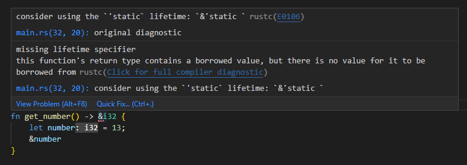
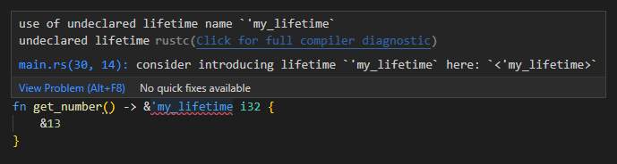
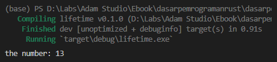
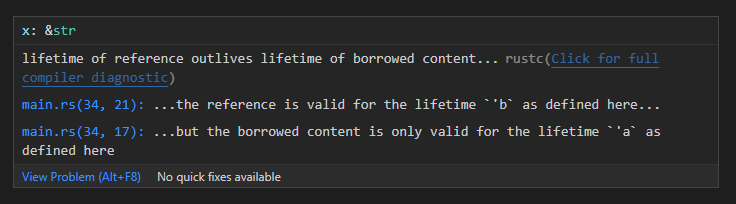
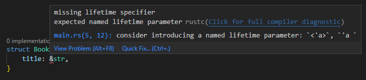
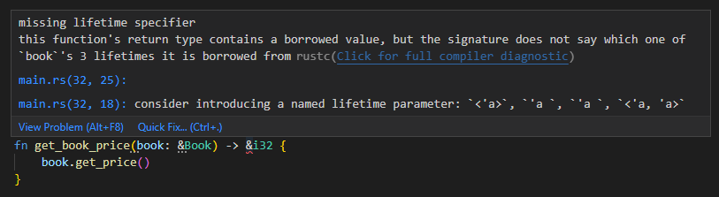
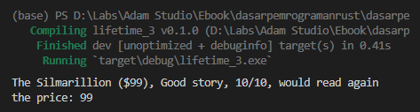

Pada chapter ini kita akan belajar tentang lifetime. Lifetime adalah yang digunakan oleh Rust compiler untuk memonitor umur dari references agar tetap dianggap valid.

Normalnya kita tidak perlu berurusan dengan lifetime, karena Rust-lah yang mengelola lifetime sebuah reference. Namun di luar itu, pada beberapa case kita bisa me-manage lifetime data dengan memanfaatkan *annotation*.

Ketika berurusan dengan data primitif maupun non-primitif tak perlu khawatir perihal urusan lifetime. Aspek lifetime hanya perlu diperhatikan sewaktu berurusan dengan data pointer/reference, apalagi kalau data tersebut keluar masuk block scope.

> Topik lifetime adalah salah satu yang paling membingungkan di Rust. Wajar jika membutuhkan waktu lebih lama untuk menguasainya. *Take your time*, pelajari pelan-pelan dan ulangi berkali-kali jika perlu.

## A.42.1. Konsep Lifetime

Lifetime adalah yang digunakan oleh Rust compiler untuk memonitor umur dari references agar tetap valid. Lifetime menempel di variabel, lebih tepatnya di reference variabel.

Rust menerapkan default lifetime dalam pengecekan reference. Beberapa aturan pada default lifetime sudah kita pelajari pada chapter sebelumnya, seperti variabel yang hanya akan valid di dalam block dan invalid di luar block dan data yang akan di-dealokasi ketika sudah tidak ada reference-nya.

> Rust mengidentifikasi default lifetime menggunakan **lifetime elision**, yang juga akan dibahas pada chapter ini.

Agar mudah memahami konsep default lifetime, mari mulai dengan kode sederhana berikut:

```rust
fn main() {
    let r;
    {
        let x = 5;
        r = &x;
    }
    println!("r: {}", r);
}
```

Kode di atas kalau di jalankan hasilnya error, karena `x` di-dealokasi ketika block expression selesai dieksekusi, meskipun data tersebut dipinjamkan pada `r` yang scope-nya berada di atasnya.

Kalau diilustrasikan, lifetime variabel `r` dan `x` kurang lebih seperti ini:

```rust
fn main() {
    let r;                // -----------+-- 'lf1
    {                     //            |
        let x = 5;        // -+-- 'lf2  |
        r = &x;           //  |         |
    }                     // -+         |
    println!("r: {}", r); //            |
}                         // -----------+
```

Setiap data memiliki default lifetime.

- Variabel `r` memiliki lifetime yang pada contoh di atas diilustrasikan sebagai `'lf1`.
- Variabel `x` memiliki lifetime yang pada contoh di atas diilustrasikan sebagai `'lf2`.
- Lifetime `'lf2` milik variabel `x` menjadikan umur variabel tersebut valid mulai variabel tersebut dideklarasikan, hingga block expression selesai.
- Lifetime `'lf2` sudah tidak valid di luar block expression. Inilah kenapa program di atas menjadi error.
- Lifetime `'lf1` milik variabel `r` menjadikan umur variabel tersebut valid mulai variabel tersebut dideklarasikan, hingga block fungsi `main` selesai.

Default lifetime bisa di-override menggunakan lifetime yang kita definisikan sendiri.

## A.42.2. Relasi antara lifetime dengan owner dan borrower

Lifetime menjadi salah satu hal yang wajib diperhatikan ketika bermain dengan references. Operasi seperti melempar reference ke luar scope, atau memasukan reference ke block scope baru berpotensi memunculkan error yang berhubungan dengan lifetime.

Setelah ini kita akan praktik penerapan pembuatan lifetime, namun sebelum itu mari pelajari dulu pembahasan pada section berikut agar tau kenapa dan kapan kita harus menerapkan lifetime yang kita buat sendiri.

```rust
fn main() {
    let message = String::from("darkspear is better than zandalari");
    print_mesage(&message)
}

fn print_mesage(m: &String) {
    println!("the message: {m}")
}
```

Program di atas menampilkan pesan string via fungsi `print_message`. Data string didapat dari parameter pointer `m` milik fungsi tersebut.

Pada fungsi `main`, ada string bernama `message`, niainya dipinjamkan sebagai argument pemanggilan fungsi `print_message`.

Setelah eksekusi fungsi `print_message` selesai, yang terjadi di block kode fungsi tersebut adalah data `m` di-dealokasi. Hasil dari dealokasi sendiri adalah nilai sebenarnya dikembalikan ke owner (pemilik aslinya). Sampai sini harusnya cukup jelas.

Sekarang lanjut ke contoh ke-2 berikut:

```rust
fn main() {
    let m: &String = get_message();
    println!("the message: {m}");
}

fn get_message() -> &String {
    let message = String::from("darkspear is better than zandalari");
    &message
}
```

Esensi program ke-2 ini sama seperti program sebelumnya, yaitu menampilkan pesan string yang sama persis. Perbedaannya, pesan string datanya ada di dalam fungsi `get_message`. Fungsi tersebut dipanggil kemudian reference dari pesan string dipinjamkan, maka dengan ini variabel `m` pada fungsi `main` nilainya adalah data pinjaman (borrowing).

Ketika di-run, hasilnya error.


Error tersebut muncul karena setelah eksekusi fungsi `get_message` selesai, semua data dalam fungsi tersebut di-dealokasi. Termasuk variabel `message` yang merupakan owner dari data yang dipinjamkan ke variabel `m`.

Ok, jadi owner-nya sudah di-dealokasi, lalu bagaimana nasib dari peminjam data (variabel `m`)? Variabel tersebut menjadi bermasalah, karena owner data aslinya sudah tidak ada di memory, dan itulah kenapa muncul error.

> Error ini disebut dengan **dangling reference**, muncul ketika data di-share ke variabel lain tapi owner-nya sudah tidak ada di-memory.
>
> Di pemrograman Rust, error jenis ini bisa di-identifikasi saat kompilasi.

Solusi pada error di atas, salah satunya adalah dengan tidak menggunakan tipe data pointer sebagai nilai balik. Gunakan saja tipe data `String`. Solusi ini aman, karena tipe data `String` owner-nya selalu berpindah saat ada operasi asignment, dengan ini maka manajemen memory menjadi efisien.

```rust
// ganti kode berikut ...
fn get_message() -> &String {
    let message = String::from("darkspear is better than zandalari");
    message
}

// ... menjadi ...
fn get_message() -> String {
    let message = String::from("darkspear is better than zandalari");
    message
}
```

Ok, bagaimana dengan tipe data lain yang mengadopsi *copy semantics*, misalnya ada kebutuhan untuk share reference data tersebut ke block lain. Mari kita coba.

```rust
fn main() {
    let n = get_number();
    println!("the number: {n}");
}

fn get_number() -> &i32 {
    let number = 13;
    &number
}
```



Bisa dilihat, ada error, karena kondisi tersebut menimbulkan dangling reference (sama seperti contoh sebelumnya). Namun pada contoh ini kita tidak bisa menerapkan solusi yang sama, karena variabel `number` mengadopsi *copy semantics*, bukan *move semantics*.

Di Rust error dangling reference diantisipasi saat kompilasi, menjadikan kode tidak bisa sukses dikompilasi.

Solusi yang bisa diambil adalah dengan menjadikan data tersebut tidak memiliki owner (atau owner-nya adalah program), caranya dengan langsung mengembalikan reference data tanpa perlu menampungnya terlebih dahulu ke variabel, seperti ini:

```rust
fn main() {
    let n = get_number();
    println!("the number: {n}");
}

fn get_number() -> &i32 {
    &13
}
```

Ok, tapi entah kenapa ketika dilihat masih muncul error.


Error tersebut muncul karena meskipun owner data `&13` adalah program, ketika eksekusi fungsi `get_number` selesai, data borrow tersebut langsung di-dealokasi, dan tidak ada variabel lain di-luar scope yang menampung reference data tersebut.

Agar tidak terjadi proses dealokasi, harus ada variabel yang menampung reference tersebut di-luar scope, tapi cara ini tidak bisa dilakukan karena data-nya saja baru dideklarasikan dalam block fungsi, tidak mungkin tiba-tiba ada yang menampung di-luar scope.

Solusi dari masalah ini adalah menggunakan lifetime `'static` (yang detailnya sudah dibahas pada chapter sebelumnya). Dengan ini maka data reference `&13` hidup lebih lama dari umur yang sebenarnya sudah ditakdirkan untuk data data tersebut.

```rust
fn get_number() -> &'static i32 {
    &13
}
```

Namun perlu diingat, bahwa data efek dari lifetime `'static` adalah data tidak akan pernah di-dealokasi. Data tersebut akan hidup selamanya di program hingga kecuali program dimatikan. Karena alasan itulah penggunaan `'static` pada contoh ini bisa disebut berlebihan.

Solusi yang lebih pas adalah dengan membuat lifetime sendiri dengan cara menerapkan **lifetime annotation** (tidak menggunakan lifetime `'static`).

## A.42.3. Lifetime annotation dan penerapannya pada return value

Lifetime dituliskan dengan notasi `'nama_lifetime`. Dengan notasi tersebut, kita bisa menciptakan lifetime baru misalnya `'a`, `'b`, `'ini_lifetime`, dst.

```rust
&i32        // => tipe data reference i32
&'a i32     // => tipe data reference i32 dengan lifetime 'a
&'a mut i32 // => tipe data mutable reference i32 dengan lifetime 'a
```

> Lifetime dan block label memiliki bentuk literal yang sama, keduanya diawali tanda kutip `'`. Yang membedakan hanya pada tempat dimana syntax tersebut ditulis.

Kegunaan dari lifetime annotation adalah untuk menginformasikan compiler agar reference tidak langsung didealokasikan setelah eksekusi block selesai. Agar lebih jelas mari kita langsung terapkan saja pada fungsi `get_number` yang sudah ditulis. Silakan tambahkan lifetime dengan nama bebas. Di sini penulis gunakan `'my_lifetime`.nnnn

```rust
fn get_number() -> &'my_lifetime i32 {
    &13
}
```



Meski sudah ditambahkan, error tetap muncul, karena lifetime tersebut tidak dikenal. Berbeda dengan lifetime `'static` yang memang sudah disediakan oleh Rust.

Step selanjutnya adalah mengenalkan lifetime tersebut, caranya dengan menambahkannya dalam notasi parameter generic fungsi, seperti ini:

```rust
fn get_number<'my_lifetime>() -> &'my_lifetime i32 {
    &13
}
```

Fungsi `get_number` sekarang tidak menghasilkan error, karena reference yang dikembalikan memiliki umur `'my_lifetime` yang membuatnya tetap valid sampai menjadi return value, meski eksekusi block fungsi-nya sendiri sudah selesai. Efeknya, data yang di-return bisa ditampung di luar scope fungsi `get_number`.



Tanpa adanya lifetime pada return value, maka data return value akan langsung di-dealokasi setelah block fungsi selesai dieksekusi. Tapi karena hal ini *by default* sudah di-handle Rust, maka kita tidak perlu memikirkannya.

## A.42.4. Lifetime pada parameter

Pada praktik ini kita akan bahas penerapan lifetime pada parameter.

Silakan perhatikan kode berikut:

```rust
fn do_something_v1(x: &str) -> &str {
    x
}
```

Kode di atas tidak menghasilkan error, karena kalau dilihat dari sudut pandang lifetime (sesuai dengan aturan lifetime elision), yang sebenarnya terjadi adalah kurang lebih seperti ini:

```rust
fn do_something_v2<'a>(x: &'a str) -> &'a str {
    x
}
```

Pada saat parameter `x` masuk ke fungsi, *by default* variabel tersebut memiliki lifetime (yang pada contoh di atas diilustrasikan dengan `'a'). Lifetime tersebut akan aktif hingga menjadi return value karena lifetime yang sama digunakan juga pada return value. Dengan ini nantinya setelah fungsi selesai dieksekusi, nilai baliknya tetap bisa ditampung.

Beda lagi jika lifetime lain digunakan pada nilai balik fungsi, misalnya:

```rust
fn do_something_v3<'a, 'b>(x: &'a str) -> &'b str {
    x
}
```



Error muncul dengan keterangan kurang lebih: data yang dijadikan return value pada block fungsi akan valid untuk lifetime `'b`, namun data yang dijadikan return value hanya valid untuk lifetime `'a`.

Dari sini bisa ditarik kesimpulan: data yang didapat dari luar scope (yang memiliki lifetime sendiri) ketika digunakan sebagai nilai balik, lifetime-nya harus sama.

Sekarang mari kita modifikasi lagi fungsi menjadi seperti ini:

```rust
fn do_something_v4<'a, 'b, 'c>(x: &'a str, y: &'b str) -> &'c str {
    "hello"
}
```

Fungsi di atas memiliki 2 buah lifetime, yaitu:

- Lifetime `'a`, digunakan pada parameter `x`
- Lifetime `'b`, digunakan pada parameter `y`
- Lifetime `'c`, digunakan pada return value

Karena yang dikembalikan ada data baru, yaitu string `hello`, maka kode di atas tidak error. Data tersebut lifetime-nya adalah `'c`, dan akan tetap valid setelah pemanggilan fungsi selesai.

Beda situasi jika yang dikembalikan adalah data dari parameter, misalnya, `x`. Jika seperti ini, maka lifetime yang sama dengan lifetime parameter `x` harus digunakan, yaitu lifetime `'b`. Contoh:

```rust
fn do_something_v5<'a, 'b, 'c>(x: &'a str, y: &'b str) -> &'b str {
    y
}
```

Pada kode di atas, lifetime `'c` tidak dipergunakan sama sekali, maka lifetime tersebut boleh dihapus dari fungsi. Silakan cukup definisikan lifetime yang hanya digunakan saja pada block parameter generic.

```rust
fn do_something_v6<'a, 'b>(x: &'a str, y: &'b str) -> &'b str {
    y
}
```

Dimisalkan ada seleksi kondisi, jadi return value bisa saja `x`, bisa juga `y`. Jika seperti ini, maka `x`, `y`, dan juga return value harus memiliki lifetime yang sama.

```rust
fn do_something_v7<'a>(x: &'a str, y: &'a str) -> &'a str {
    if x.len() < y.len() {
        x
    } else {
        y
    }
}
```

## A.42.5. Lifetime elision

Sampai section ini kita telah mempelajari kurang lebih 4 point berikut:

1. Setiap data, lebih tepatnya setiap reference memiliki lifetime.
2. Lifetime digunakan oleh Rust dalam penentuan kapan reference tersebut di-dealokasi.
3. Pada beberapa case, lifetime perlu di-urus secara eksplisit (contohnya seperti pada fungsi `do_something_vx` di atas).
4. Pengecekan lifetime terjadi saat kompilasi.

Rust memiliki sesuatu yang disebut dengan **lifetime elision**, isinya adalah aturan yang digunakan oleh Rust dalam menganalisa reference untuk menentukan lifetime *default*-nya.

Namun, bukan berarti Rust akan selalu tau lifetime tiap reference. Pada beberapa case, Rust membutuhkan bantuan kita selaku programmer untuk menginformasikan lifetime reference kode yang ditulis, contohnya seperti pada fungsi `do_something_v7` di atas.

Meskipun demikian, tak usah terlalu khawatir, karena pengecekan lifetime reference terjadi saat kompilasi, dan ketika ada reference yang perlu dikasih *annotication*, Rust akan menginformasikan ke kita via pesan error.

> Untuk sekarang, pembahasan detail mengenai lifetime elision tidak dibahas pada ebook ini. Silakan gunakan dokumentasi official Rust untuk [lifetime elision](https://doc.rust-lang.org/nomicon/lifetime-elision.html) jika berminat untuk pengkajian yang lebih dalam.

Jika kawan-kawan menggunakan `rust-analyzer` extension di VSCode, tak perlu meng-compiler program untuk memunculkan error-nya, karena langsung muncul saat penulisan kode program.

## A.42.6. Lifetime pada struct

Tak hanya pada parameter fungsi dan return value fungsi, lifetime juga bisa diterapkan pada (property) struct.

Ketika menggunakan tipe data reference sebagai tipe property struct, Rust langsung menginformasikan kita via error message jika tidak ada anotasi lifetime pada field tersebut.

Contohnya bisa dilihat pada kode di bawah ini. Pesan error muncul karena tipe data `&str` pada property struct tidak ada lifetime annotation-nya.

```rust
struct Book {
    title: &str,
}
```



Solusinya, tambahkan anotasi lifetime pada tipe data `&str`, dan juga daftarkan lifetime tersebut pada struct. Notasi penulisannya seperti ini:

```rust
// struct NamaStruct<'lifetime_annotication> {
//     field: &'lifetime_annotication tipe_data,
// }

struct Book<'abc> {
    title: &'abc str,
}
```

Contoh jika ada lebih dari 1 field dengan lifetime sama:

```rust
struct Book<'abc> {
    title: &'abc str,
    description: &'abc str,
}
```

Contoh jika ada beberapa field yang di antaranya memiliki lifetime berbeda (artinya ada lebih dari 1 lifetime):

```rust
struct Book<'abc, 'def> {
    title: &'abc str,
    description: &'abc str,
    price: &'def i32,
}

fn main() {
    let book = Book {
        title: "The Silmarillion",
        description: "Good story, 10/10, would read again",
        price: &99,
    };
}
```

## A.42.7. Lifetime pada method

Ada 2 hal yang perlu diketahui dalam penerapan lifetime pada method. Yang pertama, lifetime annotication harus ditulis pada block `impl` meskipun pada block method tidak digunakan secara langsung.

```rust
struct Book<'abc, 'def> {
    title: &'abc str,
    description: &'abc str,
    price: &'def i32,
}

impl<'abc, 'def> Book<'abc, 'def> {

    fn get_info(&self) -> String {
        let info = format!("{} (${}), {}", self.title, self.price, self.description);
        info
    }
}
```

Bisa dilihat statement block `impl<'abc, 'def> Book<'abc, 'def>`, lifetime annotation-nya sama persis dengan yang ada di struct. Jika ingin mengetes, silakan coba saja hapus syntax lifetime dari statement itu, pasti muncul error.

Hal ke-2 yang penting diketahui, pada block kode method, tidak perlu menuliskan lifetime annotation, karena sudah ditulis di block kode `impl`.

Sebagai contoh, dua method berikut tidak memunculkan error:

```rust
// ...

impl<'abc, 'def> Book<'abc, 'def> {

    fn get_info(&self) -> String {
        let info = format!("{} (${}), {}", self.title, self.price, self.description);
        info
    }

    fn get_price(&self) -> &i32 {
        self.price
    }
}
```

Bandingkan dengan fungsi `get_book_price` berikut, error muncul karena lifetime annotation tidak ditambahkan ke block fungsi (meskipun fungsi tersebut mengembalikan property `price` milik struct `Book` yang sudah memiliki lifetime sendiri). Hal ini karena data `&i32` yang dikembalikan statement `book.get_price()` langsung didealokasi setelah block fungsi `get_book_price` selesai dieksekusi.



Agar error tidak muncul, tambahkan lifetime:

1. ke return value (karena tipe data return value adalah reference)
1. lalu pada parameter `book` (karena di block fungsi return value berasal dari data milik property variabel `book`),
1. dan juga tak lupa daftarkan lifetime annotation pada block fungsi `get_book_price`.

Kurang kode menjadi seperti berikut:

```rust
// ...

fn get_book_price<'ghi>(book: &'ghi Book) -> &'ghi i32 {
    book.get_price()
}

fn main() {
    let book = Book {
        title: "The Silmarillion",
        description: "Good story, 10/10, would read again",
        price: &99,
    };

    println!("{}", book.get_info());
    println!("the price: {}", get_book_price(&book));
}
```

Run program, hasilnya sukses.



## A.42.8. Generic parameter + trait bounds + lifetime

Lalu bagaimana jika ada fungsi yang disitu ada penerapan trait bounds, ada juga generic parameter, dan lifetime annotation. Cara penulisannya seperti apa? Silakan lihat contoh berikut:

```rust
fn find_greater_number<'a, T>(
    x: &'a T,
    y: &'a T,
) -> &'a T
where
    T: std::cmp::PartialOrd,
{
    if x > y {
        x
    } else {
        y
    }
}
```

Fungsi `find_greater_number` di atas digunakan untuk mencari angka terbesar dari dua inputan parameter (`x` dan `y`), dengan tipe data yang digunakan adalah generic `T`. Dari sini maka nantinya fungsi ini bisa digunakan pada data bertipe `i32`, `f64`, dan data numerik lainnya.

Tipe `T` diasosiasikan dengan trait `std::cmp::PartialOrd` agar variabel dengan tipe tersebut bisa digunakan dalam seleksi kondisi `if` yang ada dalam block fungsi tersebut.

Ok, sampai sini semoga cukup jelas. Lalu bagaimana dengan lifetime annotation-nya? Karena lifetime annotation definisinya berada pada tempat yang sama dengan definisi tipe generic, maka langsung saja tulis disitu tanpa memperhatikan urutan. Sebagai contoh, dua definisi block fungsi berikut adalah ekuivalen.

```rust
fn say_hello_v1<'abc, T>()
fn say_hello_v2<T, 'abc>()
```

Sekarang kembali ke pembahasan di atas. Fungsi `find_greater_number` mengembalikan tipe data reference `&T` yang nilainya bisa saja dari `x` atau `y`. Dari sini maka wajib hukumnya untuk return value memiliki lifetime yang sama dengan `x` dan `y`. Itulah kenapa definisi fungsi `find_greater_number` agak panjang.

```rust
fn find_greater_number<'a, T>(x: &'a T, y: &'a T) -> &'a T
```

Lanjut, mari kita panggil fungsi tersebut pada dua block expression. Block pertama untuk pengecekan data numerik `i32`, dan yang kedua untuk tipe `f64`.

```rust
fn main() {

    {
        // i32 comparison test
        let x = 13;
        let y = 20;
        let result = find_greater_number::<i32>(&x, &y); // atau cukup `find_greater_number(&x, &y)`
        println!("result: {}", result);
    }
    
    {
        // f64 comparison test
        let x = 3.14;
        let y = 2.11;
        let result = find_greater_number::<f64>(&x, &y); // atau cukup `find_greater_number(&x, &y)`
        println!("result: {}", result);
    }
}
```

Jalankan program, hasilnya sesuai harapan, tidak ada error.


---

## Catatan chapter 📑

### ◉ Source code praktik

<pre>
    <a href="https://github.com/novalagung/dasarpemrogramanrust-example/tree/master/lifetime">
        github.com/novalagung/dasarpemrogramanrust-example/../lifetime
    </a>
</pre>

### ◉ Referensi

- https://doc.rust-lang.org/book/ch10-03-lifetime-syntax.html
- https://doc.rust-lang.org/nomicon/lifetimes.html
- https://dev.to/takaakifuruse/rust-lifetimes-a-high-wall-for-rust-newbies-3ap
- https://anooppoommen.medium.com/lifetimes-in-rust-7f2331be998b
- https://blog.logrocket.com/understanding-lifetimes-in-rust/
- https://educative.io/answers/what-are-generic-lifetime-parameters-in-a-rust-function

---

import Substack from '@site/src/components/Substack';

<Substack />
