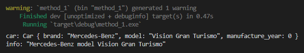
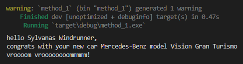
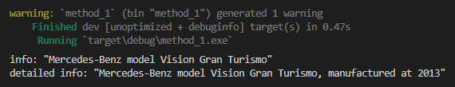

Pada chapter ini kita akan belajar tentang method beserta perbedaannya dengan *associated function*.

## A.25.1. Method vs *associated function*

Method adalah *associated item* yang hanya bisa diakses lewat instance/object, berbeda dengan *associated function* yang pengaksesan fungsinya via tipe data struct.

Silakan lihat ilustrasi kode berikut, lalu pelajari penjelasan dibawahnya untuk mencari tau perbedaan *associated function* vs method.

```rust
struct Car {
    // ...
}

impl Car {
    // ...
}

// associated function
let my_car: Car = Car::new();

// method
let info: String = my_car.info();
```

- Fungsi `new` disitu adalah *associated function* milik struct `Car`. Dengannya object baru bernama `my_car` bertipe `Car` dibuat.
- Object `my_car` adalah variabel bertipe `Car`. Via object tersebut method bernama `info` diakses.
- Method `info` tidak bisa diakses via struct `Car`. Dan *associated function* `new` juga tidak bisa diakses dari instance/object `my_car`.

> Di bahasa pemrograman lain, *associated function* disebut dengan **class method**, sedangkan method disebut dengan **instance method**

Pengaksesan *associated function* dilakukan menggunakan notasi path dengan separator `::`, contohnya seperti `Car::new()`. Sedangkan pengaksesan method menggunakan separator `.`, contoh: `my_car.info()`.

Agar lebih jelas, mari lanjut ke bagian praktik. Siapkan package dengan struktur seperti berikut:

```bash title="package source code structure"
my_package
│─── Cargo.toml
└─── src
     │─── main.rs
     └─── models.rs
```

Buka file `models.rs`, isi dengan deklarasi struct `Car` berikut diikuti dengan blok kode `impl` untuk associated items-nya.

```rust title="src/models.rs"
#[derive(Debug)]
pub struct Car {
    brand: String,
    model: String,
    manufacture_year: i32
}

impl Car {
    // ...
}
```

## A.25.2. Deklarasi method

Cara deklarasi method mirip dengan *associated function*, perbedaannya adalah parameter pertama harus diisi dengan `&self` pada deklarasi method. Parameter tersebut menjadi identifier apakah fungsi merupakan *associated function* atau *method*.

> Object `self` merupakan representasi dari *current instance* atau *current object*.
>
> Statement `&self` artinya kita melakukan operasi *borrowing* terhadap object `self`.
>
> Lebih jelasnya mengenai borrowing dibahas pada chapter terpisah.

Silakan tambahkan *associated function* bernama `new` dan method bernama `info` berikut. Tulis keduanya dalam blok kode `impl`.

```rust title="src/models.rs"
// ...

impl Car {
    
    pub fn new(brand: String, model: String) -> Self {
        Self { brand, model, manufacture_year: 0 }
    }

    pub fn info(&self) -> String {
        if self.manufacture_year == 0 {
            format!("{} model {}", self.brand, self.model)
        } else {
            format!(
                "{} model {}, manufactured at {}",
                self.brand,
                self.model,
                self.manufacture_year
            )
        }
    }
}
```

Bisa dilihat, deklarasi method adalah mirip dengan fungsi biasa, perbedaannya ada pada deklarasi parameter pertama fungsi yang diisi dengan `&self`.

Cara mengakses property milik *current object* dari dalam method adalah menggunakan keyword `self`, contohnya seperti `self.brand`, `self.model`, dan `self.manufacture_year`, pemanggilan ketiganya adalah mengarah ke value property milik *current object* (`self`).

Selanjutnya panggil keduanya di fungsi `main`.

```rust title="src/main.rs"
mod models;

fn main() {
    let car = models::Car::new(
        String::from("Mercedes-Benz"),
        String::from("Vision Gran Turismo")
    );
    println!("car: {:?}", car);

    let info = car.info();
    println!("info: {:?}", info);
}
```

Bisa dilihat, variabel `car` adalah instance dari struct `models::Car`, dibuat menggunakan *associated function* `models::Car::new`. Dari variabel tersebut kemudian diakses method `info`.

Jalankan program untuk melihat hasilnya.



### ◉ *Naming convention* method

Sesuai anjuran di [halaman dokumentasi Rust](https://rust-lang.github.io/api-guidelines/naming.html), snake case digunakan dalam penamaan method. Contoh:

```rust
impl NamaStruct {

    fn nama_method(&self) {
        // ...
    }
}
```

## A.25.3. Method parameter

Ok, penulis rasa sudah cukup jelas perihal perbedaan *associated function* dengan method. Sekarang, bagaimana dengan method yang ada parameternya? Cara deklarasinya adalah cukup dengan menuliskan parameter yang diinginkan setelah `&self`.

Lanjut ke praktik berikutnya. Silakan buat method baru bernama `congratulate` yang memiliki 1 buah parameter bertipe `String`, dengan tugas adalah menampilkan pesan selamat.

```rust title="src/models.rs"
// ...

impl Car {
    
    // ...
    
    pub fn congratulate(&self, name: String) {
        println!("hello {}", name);
        println!("congrats with your new car {}", self.info());
        println!("vroooom vroooooooommmmm!");
    }
}
```

Dalam method `congratulate` ada statement pemanggilan method `info`, yang return value-nya ikut di-print. Notasi `self.nama_method()` digunakan untuk pemanggilan method dari dalam method. Mirip seperti pemanggilan property yaitu `self.nama_property`.

Selanjutnya, panggil method `congratulate` di fungsi `main`. Isi argumen pemanggilan method dengan sebuah `String`.

```rust title="src/main.rs"
// ...

fn main() {
    let car = models::Car::new(
        String::from("Mercedes-Benz"),
        String::from("Vision Gran Turismo")
    );

    car.congratulate(String::from("Sylvanas Windrunner"));
}
```

Meskipun pada definisi method parameter pertama adalah `&self`, pada saat pemanggilan method yang menjadi parameter pertama adalah parameter setelah `&self` yaitu `name`.



## A.25.4. Struct property mutability via method

Nilai property struct bisa diubah dari dalam method. Pada bagian ini kita akan buat method baru untuk struct `Car` dengan nama `set_manufacture_year`. Method ini bertugas untuk melakukan perubahan nilai property `manufacture_year`.

Silakan tulis kode berikut:

```rust title="src/models.rs"
// ...

impl Car {
    
    // ...
    
    pub fn set_manufacture_year(&self, year: i32) {
        self.manufacture_year = year
    }
}
```


Hmm, tapi kenapa terdeteksi error? Penyebabnya error tersebut adalah karena **mutable reference** tidak digunakan dalam pengaksesan current object yang padahal ada operasi *mutable* atau perubahan nilai terhadap property disitu. Syntax `&self` artinya operasi peminjaman object `self` adalah *read only*.

Cara mengambil mutable reference dari object `self` adalah dengan menggunakan `&mut self`. Cara tersebut kurang lebih sama seperti pengambilan mutable reference dari variabel biasa.

Ok, sekarang kita coba modifikasi deklarasi method `set_manufacture_year` menjadi seperti berikut:

```rust title="src/models.rs"
// ...

impl Car {
    
    // ...
    
    pub fn set_manufacture_year(&mut self, year: i32) {
        self.manufacture_year = year
    }
}
```

Lalu panggil method `set_manufacture_year` di fungsi `main`.

```rust title="src/main.rs"
// ...

fn main() {
    let mut car = models::Car::new(
        String::from("Mercedes-Benz"),
        String::from("Vision Gran Turismo")
    );

    let info = car.info();
    println!("info: {:?}", info);

    car.set_manufacture_year(2013);
    let detailed_info = car.info();
    println!("detailed info: {:?}", detailed_info);
}
```

Jalankan program, lihat hasilnya.



Setelah `manufacture_year` di-set, method `info` mengembalikan pesan yang berbeda. Dari sini bisa disimpulkan bahwa method `set_manufacture_year` sukses menjalankan tugasnya untuk mengubah property `manufacture_year`.

## A.25.5. Generic pada method

Pembahasan mengenai generic pada method ada pada chapter [Generics](/basic/generics#a366-generics-method).

---

## Catatan chapter 📑

### ◉ Source code praktik

<pre>
    <a href="https://github.com/novalagung/dasarpemrogramanrust-example/tree/master/method">
        github.com/novalagung/dasarpemrogramanrust-example/../method
    </a>
</pre>

### ◉ Referensi

- https://doc.rust-lang.org/book/ch05-03-method-syntax.html
- https://doc.rust-lang.org/std/keyword.impl.html
- https://doc.rust-lang.org/std/keyword.SelfTy.html
- https://doc.rust-lang.org/std/keyword.self.html
- https://doc.rust-lang.org/rust-by-example/fn/methods.html

---
