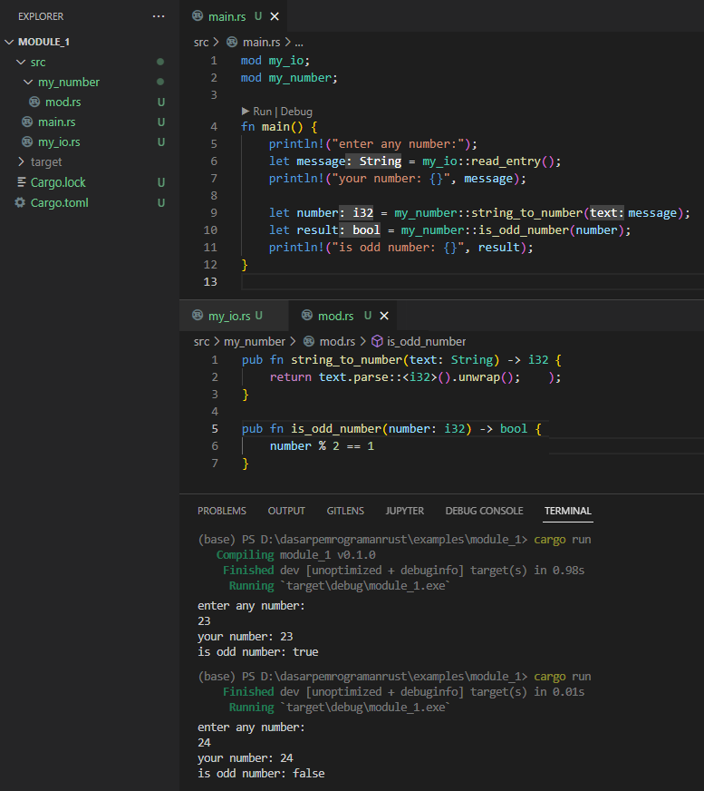

Module adalah salah satu chapter yang cukup penting dalam pemrograman Rust. Pada bagian ini kita akan mempelajari dasarnya.

## A.20.1. Rust module system

Setiap bahasa pemrograman memiliki caranya sendiri dalam hal pengelolahan struktur files dan folder dalam project. Project yang isinya ada sangat banyak hal diatur sedemikian rupa menjadi beberapa bagian dan/atau sub-bagian sesuai dengan fungsinya masing-masing.

Di Rust, module memiliki hirarki (biasa disebut dengan *module tree*) yang *root*/akarnya adalah file entrypoint crate, yaitu `main.rs` untuk *binary crate* dan `lib.rs` untuk *library crate*. Kedua file ini biasa disebut dengan *crate root file*.

> Di sini pembahasan akan fokus pada penerapan module dalam *binary crate*. Kita belum masuk ke pembahasan tentang *library crate*.

Rust memiliki 2 jenis modul, yaitu *normal module* dan *inline module*. Pembahasan dimulai dengan normal module terlebih dahulu.

Keyword `mod` digunakan untuk mendefinisikan/mendaftarkan sebuah module. Nama module menjadi path dimana isi module atau *module item* harus berada. Sebagai contoh:

- module yang didefinisikan dengan nama `my_number`, maka item-nya harus berada pada file `my_number.rs` atau `my_number/mod.rs`
- module yang didefinisikan dengan nama `my_io`, maka item-nya harus berada pada file `my_io.rs` atau `my_io/mod.rs`

Pendefinisian nama module sendiri berada pada file entrypoint *crate* yaitu `main.rs` (atau `lib.rs` untuk library crate). Jadi pendefinisian nama module dan isi/item-nya terpisah.

- Nama module ditulis di `main.rs` (atau `lib.rs` untuk library crate)
- Item atau isi module ditulis dalam file `nama_module.rs` atau `nama_module/mod.rs`

> Sebenarnya ada beberapa hal lainnya lagi yang masih relevan yang perlu dibahas di-awal, yaitu perihal sub-module. Akan tetapi agar tidak makin bingung, mari kita lanjut ke praktik terlebih dahulu.

## A.20.2. Praktik #1 - `nama_module.rs`

Mari buat program sederhana, yang isinya mencakup pembahasan tentang module. Pada program kecil ini, inputan user ditampung ke sebuah variabel, kemudian ditampilkan ke layar. Proses pembacaan inputan user akan di-split sebagai module.

Ok, langsung saja, buat package/project baru dengan nama bebas. Di sini penulis menggunakan nama package `module_1`.

```rust
cargo new module_1
```

Setelah itu siapkan 1 buah file bernama `my_io.rs`, letakan di dalam folder `src` (1 level dengan file `main.rs`). File ini difungsikan sebagai tempat definisi *module item* milik sebuah module bernama `my_io` (io di sini kependekan dari *input output*).

```bash title="package source code structure"
module_1
│─── Cargo.toml
└─── src
     │─── main.rs
     └─── my_io.rs
```

Lanjut, definisikan fungsi `read_entry` di file `my_io.rs`, isinya kurang lebih adalah kode untuk membaca inputan user lalu mengembalikannya dalam bentuk `String`.

```rust title="src/my_io.rs"
pub fn read_entry() -> String {
    let mut message = std::string::String::new();
    let stdin_reader = std::io::stdin(); 
    let reader_res = stdin_reader.read_line(&mut message);

    if reader_res.is_err() {
        println!("error! {:?}", reader_res.err());
    }

    message.trim().to_string()
}
```

Ok, kita telah menyiapkan satu item milik module `my_io` yaitu sebuah fungsi bernama `read_entry`. 1 hal yang sedikit berbeda pada definisi fungsi di atas adalah penambahan keyword `pub` yang ditulis sebagai prefix definisi fungsi.

Keyword `pub` digunakan untuk menjadikan suatu item menjadi **public**, agar bisa diakses dari luar module.

Fungsi `read_entry` ini berada dalam module `my_io`. Jika tidak ada keyword `pub` disitu, maka fungsi `read_entry` hanya bisa diakses dari dalam `my_io` saja, tidak bisa diakses dari luar module contohnya seperti dari `main.rs`. Dengan menjadikan `read_entry` sebagai fungsi yang public, maka fungsi tersebut bisa diakses dari `main.rs`.

> Lebih jelasnya mengenai keyword `pub` dibahas pada chapter [Module System → Visibility & Privacy](/basic/visibility-privacy)

Isi module sudah siap, selanjutnya lanjut ke pendefinisian modul. Umumnya pada bahasa pemrograman, definisi module adalah ada dalam file dimana isi module berada, namun tidak untuk Rust.

Di Rust, definisi sebuah module (sekali lagi bukan item/isinya ya, tapi definisi dari module itu sendiri) dituliskan pada file terpisah, yaitu di file entrypoint crate, yaitu `main.rs` atau `lib.rs`.

Lanjut, sekarang buka file `main.rs` dan tulis definisi modul `my_io` menggunakan statement `mod my_io`.

```rust title="src/main.rs"
// definisi module my_io
mod my_io;

// fungsi main
fn main() {
    // ...
}
```

Sekarang aplikasikan fungsi `read_entry` milik module `my_io` di fungsi `main` untuk membaca inputan user.

```rust title="src/main.rs"
mod my_io;

fn main() {
    println!("enter any number:");
    let message = my_io::read_entry();
    println!("your number: {}", message);
}
```

Jalankan program, masukan sebuah angka, lalu enter. Lihat hasilnya, program berjalan sesuai harapan.


Cara pengaksesan item dari sebuah module yang kita definisikan sendiri adalah sama seperti pengaksesan item dari crate lainnya, yaitu menggunakan *path*. Statement `my_io::read_entry()` artinya item `read_entry` yang merupakan fungsi dalam module `my_io` digunakan.

### ◉ Summary praktik #1

Pada praktik pertama ini kita telah belajar penerapan module dengan mengaplikasikan beberapa hal berikut:

- Penggunaan normal module dalam binary crate
- Pembuatan module dengan nama `my_io`, dengan isi/item ditulis pada file `my_io.rs`
- Penggunaan keyword `pub` untuk meng-export atau menjadikan item menjadi public, agar bisa diakses dari luar module
- Pengaksesan item milik module, yaitu: `my_io::read_entry`

### ◉ *Naming convention* module

Sesuai anjuran di [halaman dokumentasi Rust](https://rust-lang.github.io/api-guidelines/naming.html), aturan penulisan nama module adalah menggunakan snake case, contohnya `my_io`.

### ◉ Module item

Module item adalah apapun yang didefinisikan di dalam sebuah module. Pada contoh praktik ke-1 di atas, module `my_io` memiliki 1 buah item yaitu fungsi bernama `read_entry`.

Selain fungsi, module item bisa dalam bentuk lainnya, contohnya: konstanta, submodule, struct, dan lainnya.

> Lebih jelasnya tentang macam-macam item dibahas pada chapter [Module System → Path & Item](/basic/path-item)

## A.20.3. Praktik #2 - `nama_module/mod.rs`

Bagian ini merupakan kelanjutan dari praktik sebelumnya. Program sederhana yang sudah di-buat ditambahi beberapa hal. Data inputan user dikonversi ke bentuk angka untuk kemudian dicek apakah angka tersebut bilangan ganjil atau genap.

Fungsi untuk konversi string ke bentuk numerik dan juga untuk pengecekan bilangan ganjil genap, adalah dua buah item milik module bernama `my_number` yang akan kita definisikan sebentar lagi.

Definisi item module `my_io` menggunakan notasi penulisan file `nama_module.rs` (yaitu `my_io.rs`). Pada module `my_number` ini kita akan gunakan notasi penulisan `nama_module/mod.rs` (menjadi `my_number/mod.rs`) untuk menampung definisi item module `my_number`.

```bash title="package source code structure"
module_1
│─── Cargo.toml
└─── src
     │─── my_number
     │    └─── mod.rs
     │─── main.rs
     └─── my_io.rs
```

Ok, sekarang buat saja folder dan filenya, yaitu `my_number/mod.rs`. Lalu pada file `mod.rs` tulis 2 buah fungsi berikut:

- Fungsi untuk konversi string ke numerik `i32`

    ```rust title="src/my_number/mod.rs"
    pub fn string_to_number(text: String) -> i32 {
        return text.parse::<i32>().unwrap();
    }
    ```

- Fungsi untuk pengecekan bilangan ganjil

    ```rust title="src/my_number/mod.rs"
    // ...

    pub fn is_odd_number(number: i32) -> bool {
        number % 2 == 1
    }
    ```

Kemudian tulis definisi module `my_number` dalam file entrypoint crate, yaitu `main.rs`.

```rust title="src/main.rs"
// definisi module my_io
mod my_io;

// definisi module my_number
mod my_number;

// fungsi main
fn main() {
    // ...
}
```

Terakhir, aplikasikan dua buah fungsi yang sudah didefinisikan.

```rust title="src/main.rs"
fn main() {
    println!("enter any number:");
    let message = my_io::read_entry();
    println!("your number: {}", message);

    let number = my_number::string_to_number(message);
    let result = my_number::is_odd_number(number);
    println!("is odd number: {}", result);
}
```

Jalankan program, lihat hasilnya.



### ◉ Summary praktik #2

Hingga praktik ke-2 ini, kita telah belajar penerapan module dengan mengaplikasikan beberapa hal berikut:

- Penggunaan normal module dalam binary crate
- Pembuatan module dengan nama `my_io`, dengan isi/item ditulis pada file `my_io.rs`
- Pembuatan module dengan nama `my_number`, dengan isi/item ditulis pada file `my_number/mod.rs`
- Penggunaan keyword `pub` untuk meng-export atau menjadikan item menjadi public, agar bisa diakses dari luar module
- Pengaksesan item milik module, yaitu: `my_io::read_entry`, `my_number::string_to_number`, dan `my_number::is_odd_number`

> Penerapan notasi penulisan isi module `nama_module.rs` dan `nama_module/mod.rs` bisa diterapkan dalam satu package

### ◉ Konversi string ke numerik

Rust mengenal beberapa jenis konversi antar tipe data. Teknik konversi yang kita praktikkan pada chapter ini menggunakan method `.parse()`, cara ini bisa dilakukan untuk konversi tipe data dari custom types ke primitive. Contohnya seperti di atas, dari `String` ke `i32`.

Penggunaannya cukup mudah, akses saja method `.parse()` kemudian sisipkan tipe data sebagai parameter generic. Lalu chain dengan method `unwrap` (yang method tersebut merupakan item milik tipe data *generic result type* atau `Result<T, E>`).

Contoh lain untuk konversi dari tipe primitif lainnya bisa dilihat berikut:

```rust
let data_number = "24".parse::<i32>().unwrap();
let data_bool = "true".parse::<bool>().unwrap();
let data_float = "3.14".parse::<f64>().unwrap();
```

Method `parse` menghasilkan data bertipe *generic result type* atau `Result<T, E>`. Tipe ini memiliki method bernama `unwrap` yang berguna untuk mengambil nilai.

> - Lebih jelasnya mengenai casting dibahas pada chapter [Type Alias & Casting](/basic/type-alias-casting) dan [Trait → Conversion (From & Into)](#/wip/trait-conversion-from-into)
> - Lebih jelasnya mengenai generic dibahas pada chapter [Generics](/basic/generics)
> - Lebih jelasnya mengenai result type dibahas pada chapter [Tipe Data → Result](/basic/result-type)

## A.20.4. Submodules

Sampai bagian ini kita telah belajar tentang module beserta 2 macam cara penerapannya.

Sebuah module bisa saja memiliki module dibawahnya (biasa disebut submodule), dan hal ini adalah konsep yang umum dalam bahasa pemrograman. Di Rust, aturan dalam pembuatan submodule masih sama seperti module, perbedaannya adalah tempat dimana submodule didefinisikan. Jika pada root module definisi ada pada file `main.rs` atau `lib.rs`, maka pada submodule definisi ada pada file dimana *parent module* berada.

Sebagai contoh jika pada program sebelumnya kita tambahkan module `my_number` yang sudah dibuat, jika ada submodule dengan nama `conversion_utility`, maka definisi module berada di `my_number/mod.rs` dan itemnya di `my_number/conversion_utility/mod.rs`.

```bash title="package source code structure"
my_package
│─── Cargo.toml
└─── src
     │─── main.rs
     │─── my_io.rs
     └─── my_number
          │─── mod.rs              // <----- definisi submodule conversion_utility
          └─── conversion_utility
               └─── mod.rs         // <----- definisi item/isi conversion_utility
```

Atau definisi module tetap di `my_number/mod.rs` namun itemnya di `my_number/conversion_utility.rs`.

```bash title="package source code structure"
my_package
│─── Cargo.toml
└─── src
     │─── main.rs
     │─── my_io.rs
     └─── my_number
          │─── mod.rs                // <----- definisi submodule conversion_utility
          └─── conversion_utility.rs // <----- definisi item/isi conversion_utility
```

> Penerapan notasi penulisan `nama_module.rs` biasanya dalam case ketika module tersebut tidak memiliki submodule.
>
> Untuk module yang memiliki submodule, parent module harus menerapkan notasi penulisan `nama_module/mod.rs`, hal ini karena pendefinisian submodule berada pada file `mod.rs` dalam parent module tersebut.

Lalu bagaimana jika sebuah submodule memiliki submodule yang memiliki submodule ... dst, aturannya tetap sama seperti aturan submodule.

Mari lanjut praktik agar tidak bingung. Kita akan modifikasi program sebelumnya. Item `string_to_number` yang sebelumnya adalah item milik `my_number` kita pindah ke sebuah module baru bernama `conversion_utility` yang merupakan submodule dari `my_number`. Silakan buat file baru `my_number/conversion_utility/mod.rs`, kemudian isi dengan fungsi berikut:

```rust title="src/my_number/conversion_utility/mod.rs"
pub fn string_to_number(text: String) -> i32 {
    return text.parse::<i32>().unwrap();
}
```

Fungsi `string_to_number` yang sebelumnya ada di `my_number/mod.rs` silakan dihapus.

Kemudian pada file `my_number/mod.rs`, tambahkan definisi submodule `conversion_utility`. Isi file tersebut kurang lebih menjadi seperti berikut:

```rust title="src/my_number/mod.rs"
pub mod conversion_utility;

pub fn is_odd_number(number: i32) -> bool {
    number % 2 == 1
}
```

O iya, karena submodule merupakan sebuah item milik module, maka harus ditambahkan juga keyword `pub`, agar submodule bisa diakses dari luar scope-nya. Contoh penerapannya bisa dilihat di atas.

Terakhir, pada `main.rs`, ubah pemanggilan fungsi `string_to_number` dari ...

```rust title="src/main.rs"
let number = my_number::string_to_number(message);
```

... menjadi ...

```rust title="src/main.rs"
let number = my_number::conversion_utility::string_to_number(message);
```

Kurang lebih strukturnya menjadi seperti berikut:


Jalankan program untuk mengetest hasilnya.

### ◉ Summary praktik #3

Hingga pembahasan pada praktik submodule, kita telah belajar penerapan module dengan mengaplikasikan beberapa hal berikut:

- Penggunaan normal module dalam binary crate
- Pembuatan module dengan nama `my_io`, dengan isi/item ditulis pada file `my_io.rs`
- Pembuatan module dengan nama `my_number`, dengan isi/item ditulis pada file `my_number/mod.rs`
- Pembuatan submodule dengan nama `my_number/conversion_utility`, dengan isi/item ditulis pada file `my_number/conversion.rs` yang di-import menggunakan `path` attribute.
- Penggunaan keyword `pub` pada fungsi agar bisa diakses dari luar module
- Penggunaan keyword `pub` pada submodule agar bisa diakses dari luar parent module
- Pengaksesan item milik module, yaitu: `my_io::read_entry`, `my_number::conversion_utility::string_to_number`, dan `my_number::is_odd_number`

> Penerapan notasi penulisan isi module `nama_module.rs` dan `nama_module/mod.rs` bisa diterapkan dalam satu package

## A.20.5. Penerapan keyword `use`

Keyword `use` bisa digunakan untuk meng-import module atau item tertentu, dan dengannya pengaksesan item menjadi lebih pendek. Contohnya:

```rust
my_number::conversion_utility::string_to_number(message);
```

... bisa dituliskan menjadi ...

```rust
use my_number::conversion_utility::string_to_number;
string_to_number(message);
```

> Lebih jelasnya mengenai keyword `use` dibahas pada chapter [Module System → Use](/basic/use)

## A.20.6. Module `path` attribute

Selain menggunakan dua teknik definisi module item di atas yang fokusnya ada pada penamaan file, ada juga cara lain pendefinisian module item, yaitu dengan memanfaatkan `path` attribute.

Mari kita praktikkan, silakan ubah struktur package yang sudah dibuat dari ...

```bash title="package source code structure"
my_package
│─── Cargo.toml
└─── src
     │─── main.rs
     │─── my_io.rs
     └─── my_number
          │─── mod.rs                // <----- definisi submodule conversion_utility
          └─── conversion_utility.rs // <----- definisi item/isi conversion_utility
```

... menjadi ...

```bash title="package source code structure"
my_package
│─── Cargo.toml
└─── src
     │─── main.rs
     │─── my_io.rs
     └─── my_number
          │─── mod.rs        // <----- definisi submodule conversion_utility
          └─── conversion.rs // <----- definisi item/isi conversion_utility
```

Yang telah kita lakukan adalah me-rename file `conversion_utility.rs` menjadi `conversion.rs`. Efeknya akan muncul error dalam pengaksesan module item, karena submodule `my_number/conversion_utility` isi/item-nya harus berada pada file `my_number/conversion_utility.rs` atau `my_number/conversion_utility/mod.rs`. Sedangkan file `conversion.rs` tidak memenuhi kriteria tersebut.

Sekarang buka isi file `my_number/mod.rs`, lalu ubah statement pendefinisian submodule dari ...

```rust title="src/my_number/mod.rs"
pub mod conversion_utility;
```

... menjadi ...

```rust title="src/my_number/mod.rs"
#[path = "conversion.rs"]
pub mod conversion_utility;
```


Lalu run, dan program akan jalan normal tanpa error.

Statement `#[path = "conversion.rs"]` di atas merupakan contoh penerapan dari Rust path attributes. Dengannya kita bisa menempatkan isi sebuah module pada file yang namanya bebas (pada contoh di atas, file bernama `conversion.rs`).

### ◉ Summary praktik #4

Hingga pembahasan pada praktik module `path` attribute, kita telah belajar penerapan module dengan mengaplikasikan beberapa hal berikut:

- Penggunaan normal module dalam binary crate
- Pembuatan module dengan nama `my_io`, dengan isi/item ditulis pada file `my_io.rs`
- Pembuatan module dengan nama `my_number`, dengan isi/item ditulis pada file `my_number/mod.rs`
- Pembuatan submodule dengan nama `my_number/conversion_utility`, dengan isi/item ditulis pada file `my_number/conversion_utility/mod.rs`
- Penggunaan keyword `pub` pada fungsi agar bisa diakses dari luar module
- Penggunaan keyword `pub` pada submodule agar bisa diakses dari luar parent module
- Pengaksesan item milik module, yaitu: `my_io::read_entry`, `my_number::conversion_utility::string_to_number`, dan `my_number::is_odd_number`

## A.20.7. Pembahasan lanjutan

Pembahasan topik module dilanjutkan pada beberapa chapter lain. Pada chapter [Module System → Inline Module](/basic/module-inline) kita akan bahas secara mendetail mengenai apa itu inline module dan perbedaannya dibanding normal module. Lalu nantinya di cahpter [Module System → Visibility & Privacy](/basic/visibility-privacy) akan dibahas secara lengkap mengenai keyword `pub` dan kontrol privasi lainnya di pemrograman Rust.

---

## Catatan chapter 📑

### ◉ Source code praktik

<pre>
    <a href="https://github.com/novalagung/dasarpemrogramanrust-example/tree/master/module">
        github.com/novalagung/dasarpemrogramanrust-example/../module
    </a>
</pre>

### ◉ Referensi

- https://doc.rust-lang.org/book/ch07-02-defining-modules-to-control-scope-and-privacy.html
- https://doc.rust-lang.org/std/keyword.pub.html
- https://doc.rust-lang.org/std/keyword.mod.html
- https://doc.rust-lang.org/rust-by-example/mod.html
- https://aloso.github.io/2021/03/28/module-system.html
- https://stackoverflow.com/questions/69275034/what-is-the-difference-between-use-and-pub-use

---

import Substack from '@site/src/components/Substack';

<Substack />
