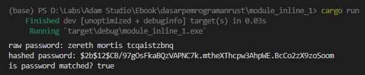
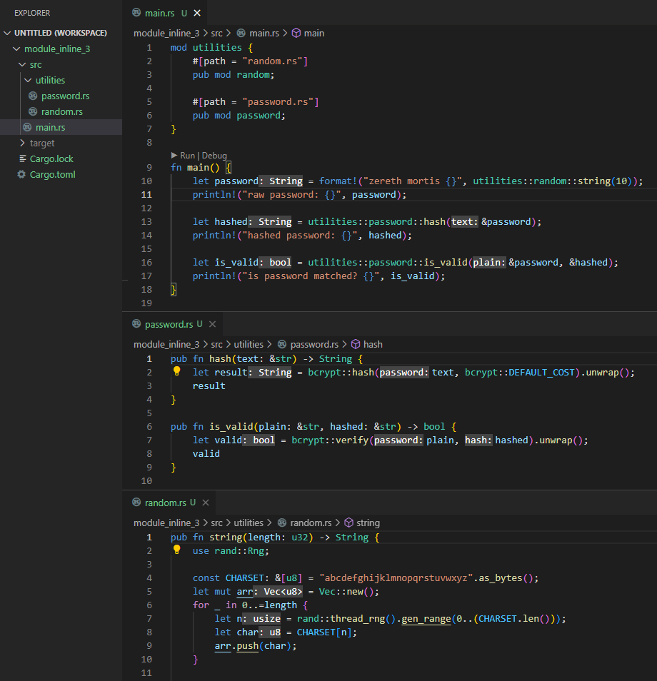
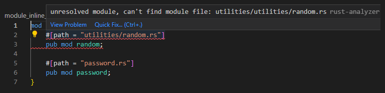

Pada chapter sebelumnya kita telah belajar cara manajemen module. Pembahasan tersebut dilanjut pada chapter ini, yaitu tentang inline module.

## A.21.1. Inline Module

Inline module adalah cara lain dalam pendefinisian module beserta item-nya, caranya dengan tetap menggunakan keyword `mod` hanya saja isi/item ditulis didalam blok kode keyword `mod` tersebut. Agar lebih jelas silakan lihat penerapan inline module berikut:

```rust
mod module_a {

    pub fn fungsi_satu() {
        // ...
    }

    pub mod submodule_b {

        pub const PI: u32 = 3.14;

        pub fn fungsi_dua() {
            // ...
        }
    }
}
```

Inline module cukup mudah diterapkan, yang sebelumnya module dan submodule di-manage dengan mengacu ke penamaan file, dalam inline module cukup tulis saja sebagai blok kode definisi module.

Pada contoh di atas, `module_a` memiliki beberapa item:

- Item berupa fungsi `module_a::fungsi_satu`
- Item berupa submodule `module_a::submodule_b`
- Item berupa konstanta `module_a::submodule_b::PI`
- Item berupa fungsi `module_a::submodule_b::fungsi_dua`

Aturan definisi submodule dan item pada inline module masih sama seperti pada *normal module*, salah satunya adalah agar item bisa diakses dari luar module maka perlu menggunakan keyword `pub`.

## A.21.2. Praktek inline module

Mari lanjut proses pembalajaran dengan praktek. Kita akan buat program sederhana yang didalamnya ada proses generate random string, yang kemudian di-hash.

Silakan buat package baru menggunakan `cargo new`. Penulis disini memilih nama `inline_module_1` sebagai nama package. Setelah itu, siapkan fungsi main dan juga module bernama `utilities` dengan penulisan kode menerapkan inline module. O iya, tulis keduanya (`module utilities` dan fungsi `main`) dalam satu file yang sama yaitu `main.rs`.

```rust title="src/main.rs"
mod utilities {

    pub mod random {

        pub fn string(length: u32) -> String {
            // ... isi fungsi string milik module utilities::random
        }
    }

    pub mod password {

        pub fn hash(text: &str) -> String {
            // ... isi fungsi hash milik module utilities::password
        }

        pub fn is_valid(plain: &str, hashed: &str) -> bool {
            // ... isi fungsi is_valid milik module utilities::password
        }
    }
}

fn main() {
    // ... isi fungsi main
}
```

- Item `utilities::random::string` adalah fungsi nantinya digunakan untuk generate data random string
- Item `utilities::password::hash` adalah fungsi untuk melakukan proses hashing password menggunakan [bcrypt](https://en.wikipedia.org/wiki/Bcrypt)
- Item `utilities::password::is_valid` adalah fungsi untuk pengecekan apakah password sama dengan data setelah di-hash

Ketiga fungsi tersebut kemudian diterapkan pada program kecil yang logic-nya ditulis dalam fungsi `main`.

> Pada contoh di atas, semua item dan sub-item milik `utilities` didefinisikan public menggunakan keyword `pub` agar bisa diakses dari module.
>
> Sedangkan module `utilities` sendiri tidak wajib di-expose menggunakan keyword `pub`, karena definisi module-nya berada dalam satu file yang sama dengan fungsi `main`, yaitu file `main.rs`.
>
> Lebih jelasnya mengenai keyword `pub` dibahas pada chapter [Module System → Visibility & Privacy](/basic/visibility-privacy)

Sebelum lanjut proses koding, silakan tambahkan dulu beberapa dependencies berikut pada `Cargo.toml`, kemudian jalankan `cargo build` di-download.

```rust title="Cargo.toml"
[package]
name = "module_inline_1"
version = "0.1.0"
edition = "2021"

[dependencies]
bcrypt = "0.13"
rand = "0.8.5"
```

- Package [`bcrypt`](https://crates.io/keywords/bcrypt) adalah crate yang isinya banyak fungsi untuk kebutuhan enkripsi bcrypt
- Package [`rand`](https://crates.io/keywords/rand) berisi item untuk keperluan generate data random. Kita sudah beberapa kali menggunakan crate ini.

Ok, sekarang kembali ke source code. Tulis isi fungsi `utilities::random::string` berikut:

```rust title="src/main.rs"
mod utilities {

    pub mod random {

        pub fn string(length: u32) -> String {
            use rand::Rng;
            
            const CHARSET: &[u8] = "abcdefghijklmnopqrstuvwxyz".as_bytes();
            let mut arr = Vec::new();
            for _ in 0..=length {
                let n = rand::thread_rng().gen_range(0..(CHARSET.len()));
                let char = CHARSET[n];
                arr.push(char);
            }

            std::str::from_utf8(&arr[..]).unwrap().to_string()
        }
    }

    // ...
}
```

> Di atas adalah salah satu contoh penerapan generate random string dengan lebar *parameterized*.
>
> Cara tersebut sebenarnya bukan yang paling efisien, namun karena jumlah topik yang kita pelajari masih belum terlalu banyak, penulis menghindari penerapan beberapa hal yang sifatnya baru dan bikin tambah bingung.

Lanjut, silakan tulis kode untuk hashing password dan juga untuk validasi password berikut:

```rust title="src/main.rs"
mod utilities {

    // ...

    pub mod password {

        pub fn hash(text: &str) -> String {
            let result = bcrypt::hash(text, bcrypt::DEFAULT_COST).unwrap();
            result
        }

        pub fn is_valid(plain: &str, hashed: &str) -> bool {
            let valid = bcrypt::verify(plain, hashed).unwrap();
            valid
        }
    }
}
```

Dalam enkripsi menggunakan bcrypt ada dua hal yang penting diketahui, yang pertama adalah data yang akan di-hash (pada contoh di atas adalah `text`), dan *cost* atau biaya enkripsi dalam bentuk numerik. Pada praktek ini, `bcrypt::DEFAULT_COST` digunakan sebagai cost enkripsi.

Pengecekan apakah data terenkripsi adalah sama dengan data asli dilakukan menggunakan fungsi `bcrypt::verify`.

Kedua fungsi `bcrypt::hash` dan `bcrypt::verify` menghasilkan data bertipe *generic result type* atau `Result<T, E>`. Tipe ini memiliki method bernama `unwrap` yang berguna untuk pengambilan result atau nilai.

> Lebih jelasnya tentang result type dibahas pada chapter [Tipe Data → Result](/basic/result-type)

Oke, sekarang fungsi utility sudah siap, mari implementasikan semua fungsi tersebut pada `main`.

Silakan tulis kode berikut. Sebuah variabel bernama `password` dibuat, diisi dengan kombinasi dari string dan juga random string. Lalu data password tersebut di-hash kemudian dicek nilainya.

```rust title="src/main.rs"
fn main() {
    let password = format!("zereth mortis {}", utilities::random::string(10));
    println!("raw password: {}", password);

    let hashed = utilities::password::hash(&password);
    println!("hashed password: {}", hashed);

    let is_valid = utilities::password::is_valid(&password, &hashed);
    println!("is password matched? {}", is_valid);
}
```

Jalankan program untuk melihat hasilnya.



Statement `utilities::random::string(10)` menghasilkan random string dengan lebar `10`, sesuai kebutuhan. Hasil dari pemanggilan fungsi tersebut di-concat dengan text kemudian ditampung variabel `password`.

Variabel `password` kemudian di-hash menggunakan `utilities::password::hash`, kemudian dibandingkan hasil hash-nya apakah cocok dengan text aslinya menggunakan `utilities::password::is_valid`.

## A.21.3. Inline module item

Module item dalam inline module masih sama seperti pada module normal, yaitu adalah apapun yang didefinisikan didalam sebuah module. Bisa berupa fungsi, konstanta, submodule, dan lainnya. Pada contoh di atas ada beberapa item didefinisikan:

- Item `utilities::random` yang merupakan sebuah submodule (inline module).
- Item `utilities::random::string` yang merupakan sebuah fungsi.
- Item `utilities::password` yang merupakan sebuah submodule (inline module).
- Item `utilities::password::hash` yang merupakan sebuah fungsi.
- Item `utilities::password::is_valid` yang merupakan sebuah fungsi.

> Lebih jelasnya tentang macam-macam item dibahas pada chapter [Module System → Path & Item](/basic/path-item)

## A.21.4. Inline module file `nama_module.rs` atau `nama_module/mod.rs`

Dalam *real project* hampir tidak mungkin semua kode ditulis di file `main.rs`. Pastinya kode akan di-split menjadi banyak module sesuai kebutuhan.

Kode sebelumya, akan kita refactor. Module `utilities` yang berada di `main.rs` perlu dipindah ke file baru yang sesuai dengan aturan penulisan module, yaitu `nama_module.rs` atau `nama_module/mod.rs`. Di sini penulis memilih `nama_module.rs`, jadi silakan buat file bernama `utilities.rs`, lalu pindah isi itemnya kesana (statement definisi inline module `utilities` tidak perlu ikut dipindah, hanya isinya saja, seperti normalnya definisi module).

O iya, jangan lupa untuk menambahkan statement `mod utilities` pada `main.rs`, agar module terdaftar dan bisa digunakan.


Jalankan program untuk melihat hasilnya.

Pada contoh ke-2 ini modul `utilities` didefinisikan menggunakan cara biasa, sedang isi dari module tersebut didefinisikan menggunakan teknik inline module.

## A.21.5. Inline module `path` attribute

`path` attribute bisa digunakan dalam manajemen inline module. Silakan utak-atik kode yang sudah dibuat dengan mengikuti step berikut:

1. Buat file baru bernama `utilities/password.rs`, kemudian pindah isi definisi module `password` ke file tersebut.
1. Buat file baru bernama `utilities/random.rs`, kemudian pindah isi definisi module `random` ke file tersebut.
1. Hapus file `utilities.rs`, pindah definisi module `utilities` ke file `main.rs`, hasilnya kurang lebih seperti ini:

    ```rust title="src/main.rs"
    mod utilities {
        #[path = "random.rs"]
        pub mod random;

        #[path = "password.rs"]
        pub mod password;
    }

    fn main() {
        // ...
    }
    ```



Jalankan program untuk melihat hasilnya.

Pada kode di atas, `path` yang digunakan bukan `utilities/random.rs` melainkan `random.rs`, hail ini dikarenakan `path` attribute dipanggil **di dalam module `utilities`**, menjadikan current path pada blok kode tersebut menjadi `utilities/`.

Silakan coba ubah isi `path` attribute menjadi `utilities/random.rs`, hasilnya adalah error. Rust akan menggunakan gabungan dari current path (`utilities/`) dan path pada `path` attribute (`utilities/random.rs`) dalam lookup, jadinya yang di-lookup adalah `utilities/utilities/random.rs`, dan hasilnya error karena tidak ada file disana.



Module system di Rust merupakan topik yang cukup membingungkan (menurut penulis) karena desain-nya yang cukup unik jika dibandingkan dengan bagaimana bahasa pemrograman lain mengelola module-nya. Penulis anjurkan untuk mencoba praktek membuat program lainnya yang menerapkan module system, agar cepat terbiasa.

---

## Catatan chapter 📑

### ◉ Source code praktek

<pre>
    <a href="https://github.com/novalagung/dasarpemrogramanrust-example/tree/master/module_inline">
        github.com/novalagung/dasarpemrogramanrust-example/../module_inline
    </a>
</pre>

### ◉ Referensi

- https://doc.rust-lang.org/book/ch07-02-defining-modules-to-control-scope-and-privacy.html
- https://doc.rust-lang.org/std/keyword.mod.html
- https://doc.rust-lang.org/rust-by-example/mod.html
- https://aloso.github.io/2021/03/28/module-system.html
- https://stackoverflow.com/questions/69275034/what-is-the-difference-between-use-and-pub-use

---
