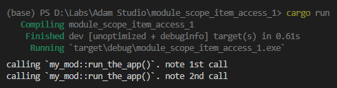
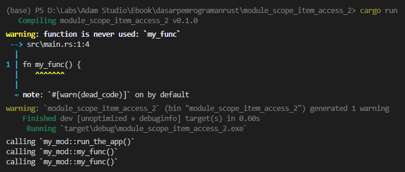
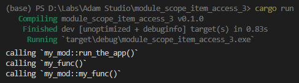
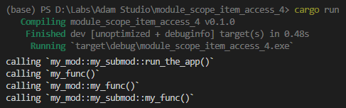

Pembahasan chapter ini masih dalam lingkup module system, yaitu tentang scope dan pengakesan module item.

## A.22.1. Scope

Scope bisa diartikan dengan: representasi dimana kode berada. Apapun yang ditulis dalam blok kode (ditandai dengan diapit tanda kurung kurawal `{ }`) berarti dalam satu scope yang sama.

Agar lebih jelas, lihat kode berikut kemudian pelajari penjelasan dibawahnya:

```rust
const PI: f64 = 3.14;

fn main() {
    my_func();
}

fn my_func() {
    let nama = "Sylvanas Windrunner";
    let occupation = "ex-Warchief of the Horde";

    // ...
}
```

- Konstanta `PI`, fungsi `main`, dan juga fungsi `my_func` di definisikan satu level dan berada di scope terluar (yang pada ebook ini disebut sebagai *root*).
- Statement pemanggilan fungsi `my_func()` berada dalam scope blok kode fungsi `main`.
- Variabel `nama` dan `occupation` berada pada scope blok kode fungsi `my_func`.

> Sebenarnya pembahasan mengenai `scope` harus diiringi dengan pembahasan tentang [Block expression](/basic/block-expression), namun karena kita belum mempelajarinya, chapter ini pembahasan hanya akan fokus pada penerapan scope yang berhubungan dengan **module scope**.

## A.22.2. Module Scope

Module scope adalah scope untuk module. Apa bedanya dengan scope secara umum? Silakan perhatikan kode berikut terlebih dahulu:

```rust
mod my_module {

    const event_one: &str = "Siege of Ogrimmar";

    mod my_submodule {
        
        const event_two: &str = "Battle for Azeroth";

        fn func_two() {
            const event_three: &str = "Sepulcher of the First Ones";
        }
    }
}
```

Pada kode di atas:

- Konstanta `event_one` berada dalam module scope `my_module`.
- Module `my_submodule` adalah sebuah inline module yang berada dalam module scope `my_module`. Module `my_submodule` berada dalam satu scope yang sama dengan variabel `event_one`.
- Konstanta `event_two` berada dalam module scope `my_submodule`.
- Fungsi `func_two` berada dalam module scope `my_submodule`.
- Konstanta `event_three` **scope**-nya adalah dalam blok fungsi `func_two`. Sedangkan **module scope**-nya adalah dalam module scope `my_submodule`. Jadi kelihatan ya bedanya.

Pemahaman tentang module scope ini penting karena akan berhubungan dengan apa yang akan dipelajari di *section* berikutnya.

## A.22.3. Keyword `self` dan *crate root*

Keyword `self` merepresentasikan current module scope. Dengannya kita bisa mengakses item yang deklarasinya ada pada module scope yang sama.

> Sebenarnya selain penjelasan di atas, keyword `self` juga digunakan untuk hal lain yaitu sebagai receiver method.
>
> Pembahasan tentang penerapan keyword `self` sebagai receiver method dibahas pada chapter [Method](/basic/method)

Selanjutnya, apa itu *crate root*? **Crate root** adalah apapun yang didefinisikan di file entrypoint crate (yaitu `src/main.rs` untuk binary crate, dan `src/lib.rs` untuk library crate). **Crate root** adalah module scope yang berada di root (paling atas). Apapun yang berada di *crate root* berarti berada dalam module scope yang sama.

Sebagai contoh, pada kode program berikut, module `my_mod` dan fungsi `main` dideklarasikan di *crate root* `src/main.rs`. Artinya kedua item tersebut berada dalam satu module scope yang sama, yaitu di *crate root*.

```rust
mod my_mod {
    pub fn run_the_app(note: &str) {
        println!("calling `my_mod::run_the_app()`. note {}", note);
    }
}

fn main() {
    my_mod::run_the_app("1st call");
    self::my_mod::run_the_app("2nd call");
}
```



Pada fungsi `main`, ada dua statement pemanggilan module item `my_mod::run_the_app`. Kedua statement tersebut adalah mirip, pembedanya ada pada statement ke-2, yaitu keyword `self` digunakan di segment path sebagai prefix.

Keyword `self` menginstruksi program bahwa item yang dipanggil adalah item yang module scope-nya sama.

Pada contoh di atas, module `my_mod` berada dalam satu scope yang sama dengan fungsi `main`, yaitu di *crate root*. Karena itu, `my_mod` bisa diakses dengan menggunakan keyword `self`, atau lansung panggil saja nama module seperti biasanya, `my_mod()`.

Bisa dibilang keyword `self` ini opsional dalam penggunaannya, boleh ikut dituliskan dan boleh juga tidak.

```rust
my_mod::run_the_app("1st call");
self::my_mod::run_the_app("2nd call");
```

## A.22.4. Keyword `self` pada module scope

Lanjut ke praktik berikutnya. Masih tentang keyword `self`, kita akan gunakan keyword ini untuk mengakses item dalam module.

Silakan tulis kode berikut kemudian jalankan.

```rust
fn my_func() {
    println!("calling `my_func()`");
}

mod my_mod {
    
    pub fn my_func() {
        println!("calling `my_mod::my_func()`");
    }
    
    pub fn run_the_app() {
        println!("calling `my_mod::run_the_app()`");
        my_func();
        self::my_func();
    }
}

fn main() {
    my_mod::run_the_app();
}
```

Pada contoh bisa dilihat ada dua buah fungsi dideklarasikan dengan nama yang sama persis, yang satu berada di *crate root*, satunya lagi merupakan item milik `my_mod`.

Di dalam `my_mod::run_the_app` ada 2 kali pemanggilan fungsi `my_func`, satunya menggunakan keyword `self` dan satunya tidak. Fungsi `my_func` manakah yang dipanggil? Hasilnya bisa dilihat pada gambar dibawah ini.



Kedua statement `my_func()` dan `self::my_func()` dalam `my_mod::run_the_app` adalah mengarah ke fungsi yang sama, yaitu `my_mod::my_func`.

Jadi kesimpulan dari penerapan keyword `self` dalam module item adalah sama seperti penerapannya pada *crate root*, yaitu boleh dipakai boleh tidak. Keyword `self` adalah opsional.

Lalu bagaimana cara memanggil `my_func` yang berada di *crate root*, dengan pemanggilan adalah dari dalam module item? Caranya adalah menggunakan keyword `crate`.

## A.22.5. Keyword `crate` pada module scope

Keyword ini digunakan untuk mengakses apapun yang ada di *crate root*.

Pada contoh di atas, fungsi `my_func` yang berada di *crate root* bisa dipanggil dari fungsi `main` dengan statement `my_func()` atau `self::my_func()`. Untuk bagian ini penulis rasa sudah cukup jelas.

Beda cerita kalau fungsi tersebut dipanggil dari dalam module item `run_the_app`. Kedua statement `my_func()` dan `self::my_func()` mengarah ke `my_mod::my_func`, bukan ke fungsi `my_func` di *crate root*. Hal ini karena **current module scope** dalam statement `run_the_app` adalah module `my_mod`, maka pemanggilan `my_func` tanpa `self` atau dengannya mengarah ke fungsi yang sama yaitu `my_mod::my_func`.

Pada *section* ini kita akan belajar tentang keyword baru, yaitu `crate`. Keyword tersebut digunakan untuk mengakses apapun yang berada di *crate root*. Kita bisa memanfaatkannya untuk mengakses `my_func` yang berada di *crate root* dengan pengaksesan dari dalam module item.

Silakan ubah kode di atas menjadi seperti berikut. Perubahannya ada pada statement dalam fungsi `run_the_app`.

```rust
fn my_func() {
    println!("calling `my_func()`");
}

mod my_mod {
    
    pub fn my_func() {
        println!("calling `my_mod::my_func()`");
    }
    
    pub fn run_the_app() {
        println!("calling `my_mod::run_the_app()`");
        crate::my_func();
        self::my_func();
    }
}

fn main() {
    my_mod::run_the_app();
}
```

Jalankan program, hasilnya berbeda dengan eksekusi program sebelumnya. Statement `crate::my_func()` dalam fungsi `run_the_app` mengarah ke fungsi `my_func` di root, sedangkan `self::my_func` mengarah ke `my_mod::my_func`.



## A.22.6. Keyword `super`

Selain `self` dan `crate` ada juga keyword `super`, yang gunanya adalah untuk mengakses *parent* module scope atau 1 scope di atas *current* module scope. Agar lebih jelas silakan pelajari kode berikut:

```rust
fn my_func() {
    println!("calling `my_func()`");
}

mod my_mod {
    
    pub fn my_func() {
        println!("calling `my_mod::my_func()`");
    }
    
    pub mod my_submod {

        pub fn my_func() {
            println!("calling `my_mod::my_submod::my_func()`");
        }
        
        pub fn run_the_app() {
            println!("calling `my_mod::my_submod::run_the_app()`");
            crate::my_func();
            super::my_func();
            self::my_func();
        }
    }
}

fn main() {
    my_mod::my_submod::run_the_app();
}
```

Ada 3 buah fungsi `my_func` dideklarasikan:

- Fungsi `my_func` yang berada di *crate root*.
- Fungsi `my_func` yang merupakan module item milik `my_mod`.
- Fungsi `my_func` yang merupakan module item milik submodule `my_submod`.

Dalam fungsi `run_the_app`, ketiga fungsi dengan nama tersebut dipanggil.

- Statement `crate::my_func()` akan mengarah ke fungsi `my_func` yang ada di *crate root*.
- Statement `super::my_func()` akan mengarah ke fungsi `my_func` yang ada di parent module scope, yaitu `my_mod::my_func`.
- Statement `self::my_func()` akan mengarah ke fungsi `my_func` yang ada di current module scope, yaitu `my_mod::my_submod::my_func`.



Semoga cukup jelas ya. Silakan ulangi terus praktik di atas jika perlu, agar makin paham.

O iya, keyword `super` ini bisa digunakan banyak kali sesuai kebutuhan. Setiap kali keyword ditulis sebagai segment path, maka artinya 1 level parent module scope.

Jika mengacu ke contoh program di atas, maka kedua statement berikut adalah ekuivalen.

```rust
crate::my_func();
super::super::my_func();
```

## A.22.7. Praktik lanjutan

Agar pemahaman makin mantab, silakan pelajari program berikut.

```rust
fn my_func() {
    println!("call `my_func()`");
}

mod module_a {

    // path item ➜ `module_a::my_func`.
    pub fn my_func() {
        println!("call `module_a::my_func()`");
    }
}

mod module_b {

    // path item ➜ `module_b::submodule_b_one`.
    mod submodule_b_one {

        // path item ➜ `module_b::submodule_b_one::my_func`.
        pub fn my_func() {
            println!("call `module_b::submodule_b_one::my_func()`");
        }
    }

    // path item ➜ `module_b::submodule_b_two`.
    mod submodule_b_two {

        // path item ➜ `module_b::submodule_b_two::my_func`.
        pub fn my_func() {
            println!("call `module_b::submodule_b_two::my_func()`");

            // current module scope adalah module `submodule_b_two`.
            // keyword `super` di sini mengarah ke parent scope, yaitu `module`.
            //
            // statement `super::my_func()` berikut adalah
            // ekuivalen dengan `module_b::my_func()`
            // jika diakses dari crate root.
            super::my_func();
            //
            // statement `super::submodule_b_one::my_func()` berikut adalah
            // ekuivalen dengan `module_b::submodule_b_one::my_func()`
            // jika diakses dari crate root.
            super::submodule_b_one::my_func();
        }
    }
    
    // path item ➜ `module_b::my_func`.
    // fungsi ini tidak publik, jadi hanya bisa diakses dalam scope module `module_b` saja.
    fn my_func() {
        println!("call `module_b::my_func()`");
    }
    
    // path item ➜ `module_b::run_all_funcs`.
    pub fn run_all_funcs() {

        // semua fungsi yang didefinisikan akan di call dalam blok kode ini.
        print!("call `my::run_all_funcs()`");
        
        // keyword `self` merepresentasikan current module scope.
        // menjadikan dua statement berikut adalah ekuivalen:
        // `my_func()` adalah ekuivalen dengan `self::my_func()`.
        my_func();
        self::my_func();

        // current module scope adalah `module_b`.
        // keyword `super` di sini mengarah ke parent scope, yaitu root atau scope paling luar.
        //
        // statement `super::my_func()` berikut adalah
        // memanggil fungsi `my_func` yang ada di crate root,
        // yang deklarasinya satu level dengan fungsi `main`.
        super::my_func();
        //
        // statement `super::module_a::my_func()` berikut adalah
        // memanggil fungsi `my_func` milik module `module_a` yang ada di crate root.
        super::module_a::my_func();
        //
        // module `submodule_b_two` bisa diakses menggunakan self ataupun tidak
        // karena module tersebut merupakan item yang deklarasinya 1 scope dengan fungsi ini,
        // 1 level dengan `run_all_funcs`.
        submodule_b_two::my_func();
        self::submodule_b_two::my_func();
    }
}

fn main() {
    module_b::run_all_funcs();
}
```

---

## Catatan chapter 📑

### ◉ Source code praktik

<pre>
    <a href="https://github.com/novalagung/dasarpemrogramanrust-example/tree/master/module_scope_item_access">
        github.com/novalagung/dasarpemrogramanrust-example/../module_scope_item_access
    </a>
</pre>

### ◉ Referensi

- https://doc.rust-lang.org/book/ch07-02-defining-modules-to-control-scope-and-privacy.html
- https://doc.rust-lang.org/std/keyword.self.html
- https://doc.rust-lang.org/std/keyword.super.html
- https://doc.rust-lang.org/std/keyword.crate.html
- https://doc.rust-lang.org/rust-by-example/mod.html
- https://doc.rust-lang.org/rust-by-example/meta/doc.html
- https://aloso.github.io/2021/03/28/module-system.html
