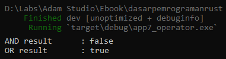

> This chapter is still under development

Chapter ini membahas mengenai operator pada pemrograman rust.

## A.8.1. Operator aritmatika

Berikut merupakan list operator untuk operasi aritmatika beserta contoh penerapannya di rust.

| Simbol | Kegunaan |
|:-:|-|
| `+` | penambahan |
| `-` | pengurangan |
| `*` | pengalian |
| `/` | pembagian |
| `%` | *modulus* atau sisa hasil bagi |

```rust
let (num1, num2) = (12, 4);

let value_addition = num1 + num2;
println!("{} + {} = {}", num1, num2, value_addition);
// output => 12 + 4 = 16

let value_sub = num1 - num2;
println!("{} - {} = {}", num1, num2, value_sub);
// output => 12 - 4 = 8

let value_mut = num1 * num2;
println!("{} * {} = {}", num1, num2, value_mut);
// output => 12 * 4 = 48

let value_div = num1 / num2;
println!("{} / {} = {}", num1, num2, value_div);
// output => 12 / 4 = 3

let value_mod = num1 % num2;
println!("{} % {} = {}", num1, num2, value_mod);
// output => 12 % 4 = 0
```

## A.8.2. Operator perbandingan

Operator perbandingan selalu menghasilkan nilai bertipe data `bool`.

Berikut merupakan list operator untuk operasi perbandingan beserta contoh penerapannya di rust.

| Simbol | Kegunaan untuk mengecek |
|:-:|-|
| `==` | apakah kiri sama dengan kanan? |
| `!=` | apakah kiri tidak sama dengan kanan? |
| `>` | apakah kiri lebih besar dari kanan? |
| `<` | apakah kiri lebih kecil dari kanan? |
| `>=` | apakah kiri lebih besar atau sama dengan kanan? |
| `<=` | apakah kiri lebih kecil atau sama dengan kanan? |

```rust
let number_a = 12;
let number_b = 24;

let res_one = number_a == number_b;
println!("res_one: {res_one}");

let res_two = number_a != number_b;
println!("res_two: {res_two}");

let res_three = number_a > number_b;
println!("res_three: {res_three}");

let res_four = number_a < number_b;
println!("res_four: {res_four}");

let res_five = number_a >= number_b;
println!("res_five: {res_five}");

let res_six = number_a <= number_b;
println!("res_six: {res_six}");
```

Pada contoh di atas, variabel di print menggunakan macro `println` tanpa disisipkan paramnya. Penjelasannya ada di bawah ini.

### ◉ *Named argument* macro `println`

Salah satu teknik *formatted print* macro `println` adalah dengan menerapkan *named argument*. Yang biasanya menggunakan `{}` atau `{1}`, `{2}`, dan seterusnya, diganti dengan nama variabel yang diapit tanda kurung kurawal, contohnya `res_one`. Dengan teknik ini maka jika variabel `res_one` ada, akan langsung mereplace argument `{res_one}` tanpa perlu menyisipkan variabel tersebut saat pemanggilan macro `println`.

```rust
let res_one = number_a == number_b;
println!("res_one: {res_one}");
// output => res_one: false

let res_two = number_a != number_b;
println!("res_two: {res_two}");
// output => res_one: true
```

## A.8.3. Operator negasi

Berikut merupakan list operator untuk operasi negasi beserta contoh penerapannya di rust.

| Simbol | Kegunaan | Catatan |
|:-:|-|-|
| `-` | negasi numerik | bisa digunakan pada tipe data integer dan float |
| `!` | logika `NOT` atau bitwise `NOT` | bisa digunakan pada tipe data integer dan bool |

```rust
let (value_left, value_right) = (12, -12);
let res_one = -value_left == value_right;
let res_two = !(value_left == value_right);
println!("{res_one} {res_two}");
// output => true true
```

Untuk menggunakan operator negasi pada tipe data numerik, caranya dengan langsung menambahkan prefix `-` pada angka atau variabel. Contohnya `-12` atau `value_left`.

Penggunaan operator logika `!` juga sama, tinggal tambahkan saja sebagai prefix dari data `bool` atau statement yang menghasilkan data `bool`, contohnya `!(value_left == value_right)`.

## A.8.4. Operator logika / `bool`

Berikut merupakan list operator untuk operasi logika `bool` beserta contoh penerapannya di rust.

| Simbol | Kegunaan |
|:-:|-|
| `&&` | logika `AND` |
| \|\| | logika `OR` |

```rust
let (bool_left, bool_right) = (false, true);
println!("AND result \t: {}", bool_left && bool_right);
println!("OR result \t: {}", bool_left || bool_right);
```

### ◉ *Whitespace character* tab `\t`

Rust mendukung karakter standar whitespace seperti `\t` yang kegunaannya adalah untuk horizontal tab. Contoh penerapannya seperti pada kode di atas, tulis saja `\t` dalam string literal, hasilnya bisa dilihat saat di-print.

```rust
println!("AND result \t: {}", bool_left && bool_right);
println!("OR result \t: {}", bool_left || bool_right);
```



## A.8.5. Operator reference dan dereference

Untuk jenis operasi ini ada 3 buah operator yang bisa dipergunakan yaitu `*`, `&` dan `&mut`. Untuk sekarang kita tidak akan membahas topik ini karena masih terlalu awal. Nantinya kita akan kupas tuntas di chapter [Pointer & References](/basic/pointer-references). Sementara kita pelajari chapter per chapter secara berurutan dulu.

## A.8.6. Operator bitwise

Rust mendukung operator bitwise standar yang ada di bahasa pemrograman.

| Simbol | Kegunaan |
|:-:|-|
| `&` | bitwise `AND` |
| <code>\|</code> | bitwise `OR` |
| `^` | bitwise `XOR` |
| `!` | bitwise `NOT` |
| `<<` | left shift |
| `>>` | right shift |

## A.8.7. Operator lainnya

Sebenarnya ada banyak lagi jenis operator di Rust programming, seperti type cast operator, reference/borrow operator, dll. Nantinya kita akan bahas operator tersebut satu per satu secara terpisah di chapter berbeda.

> - Type cast operator dibahas pada chapter [Type Alias & Casting](/basic/type-alias-casting)
> - Reference/borrow operator dibahas pada chapter [Pointer & References](/basic/pointer-references)

---

## Catatan chapter 📑

### ◉ Source code praktek

<pre>
    <a href="https://github.com/novalagung/dasarpemrogramanrust-example/tree/master/operator">
        github.com/novalagung/dasarpemrogramanrust-example/../operator
    </a>
</pre>

### ◉ Chapter relevan lainnya

- [Pointer & References](/basic/pointer-references)
- [Macro](/wip/macro)
- [Whitespace Token](/wip/whitespace-token)

### ◉ Referensi

- https://doc.rust-lang.org/reference/expressions/operator-expr.html
- https://doc.rust-lang.org/reference/whitespace.html
- https://doc.rust-lang.org/rust-by-example/hello/print.html

---
