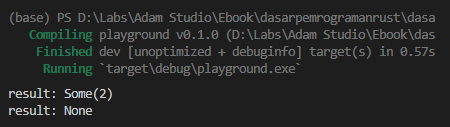
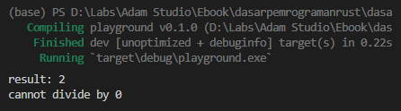

`Option` adalah salah satu tipe data penting pada Rust programming, digunakan untuk menampung data yang isinya bisa berpotensi kosong (`None`). Chapter ini membahas tentang tipe data tersebut.

## A.38.1. Konsep `Option`

Tipe data `Option` adalah enum dengan isi 2 buah enum value:

- `Option::Some<T>` (atau `Some<T>`), digunakan untuk menandai bahwa data memiliki value/nilai.
- `Option::None` (atau `None`), digunakan untuk menandai bawah data adalah tidak ada nilainya.

> - `None` bisa disamakan dengan nilai `null` atau `nil` pada bahasa pemrograman lain.
> - `T` merupakan parameter generic. Lebih jelasnya mengenai generic dibahas pada chapter [Generics](/basic/generics).

Tipe data `Option` memiliki notasi penulisan `Option<T>` dimana `T` adalah tipe data sebenarnya yang dibungkus oleh enum value `Some`.

Berikut adalah contoh cara penerapan `Option`.

```rust
fn divider(a: i32, b: i32) -> Option<i32> {
    if b == 0 {
        return None;
    }

    let result = a / b;
    return Some(result);
}

fn main() {
    let result1 = divider(10, 5);
    println!("result: {:?}", result1);

    let result2: Option<i32> = divider(10, 0);
    println!("result: {:?}", result2);
}
```

Fungsi `divider` di atas tugasnya adalah melakukan operasi aritmatika pembagian angka numerik `i32`, parameter `a` dibagi `b`.

Pada fungsi tersebut terdapat pengecekan apabila nilai `b` adalah `0`, maka yang dikembalikan adalah `None`, selainnya maka hasil operasi pembagian dikembalikan dibungkus dalam enum value `Some<i32>`. Bisa dilihat pada statement return value fungsi `divider`, nilai `result` dibungkus menggunakan tipe `Some`.

Fungsi `divider` nilai baliknya bertipe `Option<i32>`. Dari tipe data yang digunakan nantinya bisa diprediksi pasti akan ada 2 potensi value:

- Return value adalah enum value `None`, muncul ketika nilai `b` adalah `0`
- Return value adalah nilai hasil numerik yang dibungkus oleh enum value `Some<i32>`

Output program di atas saat di-run:



## A.38.2. Pattern matching pada tipe `Option`

Dalam penerapannya, ketika ada data bertipe `Option` artinya data tersebut berpotensi untuk berisi nilai `None` atau `Some<T>`, pasti antara 2 nilai tersebut.

Umumnya penggunaan tipe `Option` selalu diikuti dengan seleksi kondisi. Keyword `if` bisa digunakan dalam seleksi kondisi, namun dalam prakteknya lebih baik menggunakan keyword `match` karena memberikan kemudahan dalam pengaksesan nilai `T` milik `Some` (dimana `T` adalah data yang kita cari dibungkus dalam enum value `Some`).

Mari kita praktekan. Ubah isi fungsi `main` dengan kode berikut:

```rust
let result1 = divider(10, 5);
match result1 {
    None    => println!("cannot divide by 0"),
    Some(x) => println!("result: {x}"),
}

let result2 = divider(10, 0);
match result2 {
    None    => println!("cannot divide by 0"),
    Some(x) => {
        println!("result: {}", x)
    },
}
```



Bisa dilihat cara mengambil nilai `T` dari enum value `Some<T>` cukup mudah dengan menggunakan keyword `match`. Penerapan `match` untuk seleksi kondisi biasa disebut dengan **pattern matching** dan teknik ini sangat fleksibel dan advance.

Sebagai contoh, dengan penerapan match yang seperti ini kita bisa meng-handle 3 skenario seleksi kondisi:

```rust
let result1 = divider(10, 5);
match result1 {
    None    => println!("cannot divide by 0"),
    Some(2) => println!("the result is 2"),
    Some(x) => println!("result: {x}"),
}
```

- Kondisi ke-1: jika nilai adalah `None`, maka munculkan pesan `cannot divide by 0`
- Kondisi ke-2: jika nilai adalah `2`, maka munculkan pesan `the result is 2`
- Kondisi ke-1: jika nilai adalah `Some` selain dari `None` dan `Some(2)`, maka munculkan pesan `result: {x}`

### ◉ Tips pattern matching

Silakan perhatikan kode yang sudah kita praktekan berikut ini:

```rust
let result = divider(10, 5);
match result {
    None    => println!("cannot divide by 0"),
    Some(x) => println!("result: {x}"),
}
```

Penerapan pattern matching seperti contoh di atas memiliki konsekuensi, yaitu variabel `x` hanya bisa diakses pada block `Some(x)` saja.

Adakalanya kita butuh untuk mengeluarkan variabel `x` ke luar block. Hal seperti ini mudah untuk dilakukan, dan ada beberapa cara yang bisa dipilih, namun menurut penulis yang paling elegan adalah cara berikut ini:

```rust
fn main() {
    let result = match divider(10, 5) {
        None => {
            println!("cannot divide by 0");
            0
        },
        Some(x) => x,
    };

    println!("result: {:?}", result);
}
```

Statement `divider(10, 5)` mengembalikan data bertipe `Option<i32>`. Data tersebut digunakan pada keyword `match` seperti biasa. Namun pada contoh di atas ada yang berbeda, yaitu return value dari statement `match` ditampung ke variabel (`result`).

Isi dari pattern matching `match` sendiri ada dua:

- Ketika block `None` match, pesan error di-print kemudian nilai `0` dijadikan return statement `match`.
- Ketika block `Some` match, data `x` dijadikan return value statement `match`.

Dengan penerapan pattern matching seperti di atas, maka variabel `result` akan selalu berisi data hasil operasi `divider(10, 5)`. Dengan pengecualian ketika ada error, pesan errornya dimunculkan kemudian hasil operasi pembagian di-set sebagai `0`.

> Lebih jelasnya mengenai pattern matching dibahas pada chapter [Pattern Matching](/basic/pattern-matching)

## A.38.3. Method tipe data `Option`

### ◉ Method `unwrap`

Isi dari enum value `Some<T>` bisa diakses tanpa menggunakan keyword `match` dengan cara memanfaatkan method `unwrap` milik `Option<T>`.

```rust
let result1 = divider(10, 5);
if result1 != None {
    let number = result1.unwrap();
    println!("result: {}", number);
}
```

Penggunaan method tersebut sangat dianjurkan diiringi dengan seleksi kondisi untuk memastikan data `Option` tidak berisi `None`. Jika data ternyata adalah `None` dan method `unwrap` diakses, hasilnya adalah panic error. Contohnya bisa dilihat pada gambar berikut:


Selain method `unwrap` ada beberapa method sejenis lainnya yang bisa dimanfaatkan untuk pengambilan nilai `T`. Kita akan bahas satu per satu.

### ◉ Method `is_some` & `is_none`

Method `is_some` menghasilkan nilai `true` jika data isinya adalah enum value `Some<T>`. Sedangkan `is_none` bernilai `true` jika data berisi `None`.

Contoh penerapannya bisa dilihat pada program berikut. Kesemua seleksi kondisi pada konteks ini menghasilkan nilai `true`.

```rust
let result1 = divider(10, 5);

if result1 != None {
    let number = result1.unwrap();
    println!("result: {}", number);
}

if result1.is_some() {
    let number = result1.unwrap();
    println!("result: {}", number);
}

if !result1.is_none() {
    let number = result1.unwrap();
    println!("result: {}", number);
}
```

### ◉ Method `unwrap_or_default`

Method `unwrap_or_default` mengembalikan nilai `T` ketika data berisi `Some<T>`. Jika data ternyata isinya adalah `None`, maka nilai yang dikembalikan adalah *default value* dari tipe data `T`.

Sebagai contoh, pada kode berikut statement `divider(10, 0)` return type-nya adalah `Option<i32>`, sedangkan return value-nya adalah `None`. Pengaksesan method `unwrap_or_default` menghasilkan *default value* dari tipe data `i32`, yaitu `0`

```rust
let result2 = divider(10, 0);
let number = result2.unwrap_or_default();
println!("result: {}", number);
// result: 0
```

### ◉ Method `unwrap_or`

Method ini mengembalikan nilai `T` ketika data berisi `Some<T>`, namun jika data ternyata isinya adalah `None`, maka nilai yang dikembalikan adalah argument pemanggilan method tersebut.

```rust
let result2 = divider(10, 0);
let number = result2.unwrap_or(0);
println!("result: {}", number);
// result: 0
```

Pada contoh di atas argument pemanggilan method `unwrap_or` adalah angka `0`, artinya ketika `result2` isinya adalah `None` maka angka `0` adalah return value pengaksesan method `unwrap_or`.

### ◉ Method `unwrap_or_else`

Method ini mengembalikan nilai `T` ketika data berisi `Some<T>`, namun jika data isinya adalah `None`, maka nilai yang dikembalikan adalah hasil eksekusi closure yang disisipkan saat memanggil method `unwrap_or_else`. Contoh pengaplikasiannya:

```rust
let result2 = divider(10, 0);
let number = result2.unwrap_or_else(|| 0);
println!("result: {}", number);
// result: 0
```

Closure harus dalam notasi `FnOnce() -> T` dimana `T` pada konteks ini adalah `i32`.

> Closure `|| 0` adalah kependekan dari `|| -> i32 { 0 }`.
>
> Lebih jelasnya mengenai closure dibahas pada chapter [Closures](/basic/closures).

---

## Catatan chapter 📑

### ◉ Source code praktik

<pre>
    <a href="https://github.com/novalagung/dasarpemrogramanrust-example/tree/master/option_type">
        github.com/novalagung/dasarpemrogramanrust-example/../option_type
    </a>
</pre>

### ◉ Chapter relevan lainnya

- [Generics](/basic/generics)
- [Pattern Matching](/basic/pattern-matching)
- [Closures](/basic/closures)

### ◉ Referensi

- https://doc.rust-lang.org/book/ch18-03-pattern-syntax.html
- https://doc.rust-lang.org/std/option/index.html

---
