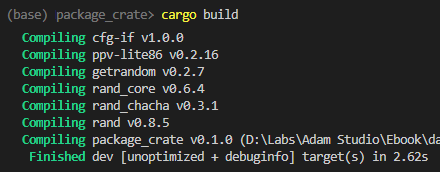
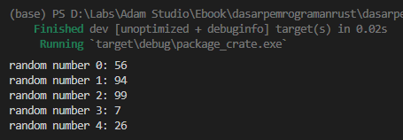

Chapter ini membahas mengenai konsep package dan path dalam Rust programming. Pembelajaran dimulai dari pembahasan mengenai konsep crate terlebih dahulu, kemudian masuk ke package.

## A.19.1. Rust Crate

**Crate** adalah satu unit kompilasi di Rust. Eksekusi command `cargo run`, `cargo build`, atau `rustc` men-*trigger* proses kompilasi, dan unit (yang di sini disebut dengan crate) akan di-compile.

Crate bisa berisi banyak *module*. Sebuah module definisinya bisa berada di banyak file. Agar lebih jelas silakan perhatikan contoh berikut:

- `XYZ` adalah sebuah crate, isinya ada dua module, yaitu module `Mod_ABC` dan module `Mod_DEF`.
- `Mod_ABC` adalah module yang didefinisikan dalam crate `XYZ`, source code-nya berada di file bernama `modul_a.rs`.
- `Mod_DEF` adalah module yang didefinisikan dalam crate `XYZ`, source code-nya berada di beberapa file `module_b_one.rs` dan `module_b_two.rs`.

Dari contoh di atas, crate `XYZ` adalah 1 unit kompilasi, yang dimana didalam crate tersebut ada dua modules yaitu `Mod_ABC` dan `Mod_DEF`

Rust mengkategorikan crate menjadi 2 jenis, *binary crate* dan *library crate*

### ◉ Binary crate

Binary crate adalah program yang dikompilasi ke bentuk *executable*, untuk kemudian dijalankan, seperti program-program yang sudah kita buat menggunakan `rago create` dan run menggunakan `cargo run` itu adalah contoh dari binary crate.

Binary crate berada dalam sebuah package yang dibuat menggunakan command `cargo create <nama_package>` atau `cargo create --bin <nama_package>`, kedua command ini menjalankan perintah yang sama.

Ciri khas dari binary crate adalah memiliki fungsi `main`, sebuah fungsi yang merupakan *entrypoint* program.

### ◉ Library crate

Library crate berbeda dengan binary crate. Library crate tidak di-compile ke bentuk *executable* dan tidak memiliki fungsi `main`. Library crate digunakan untuk mendefinisikan set *functionality* yang *reusable* atau bisa digunakan di banyak project/package.

> Library crate di-import/digunakan dalam binary crate. Dalam proses kompilasinya, yang di-compile adalah binary crate. Library crate juga akan ikut dalam kompilasi tersebut.

Sebagai contoh item `Duration` (yang sudah dipraktikkan pada chapter [Perulangan → while](/basic/perulangan-while)) dan `stdin` (pada chapter [Module System → Path & Item](/basic/path-item)) adalah dua buah item milik crate *Rust Standard Library* atau `std`. Crate `std` ini akan sangat sering kita gunakan dalam package/project, isinya banyak sekali functionality untuk keperluan standar dalam Rust programming.

> Di komunitas Rust, ketika ada kata *library* atau *crate* maka yang dimaksud biasanya adalah *library crate*

Kita bisa membuat library crate kemudian di-publish ke [crates.io](https://crates.io/) agar bisa digunakan banyak orang. Command `cargo new --lib <nama_package>` digunakan untuk membuat library crate.

> Lebih jelasnya mengenai library crate dibahas terpisah pada chapter [Library Crate](/wip/library-crate)

## A.19.2. Rust Package

Istilah package dalam Rust programming masih sama dengan package dalam pemrograman lain. Package adalah sebuah set yang berisi banyak *functionality*. Satu buah package bisa berisi satu atau banyak crates.

Package di-manage oleh Cargo, yang merupakan package manager Rust. Command `cargo new <nama_package>` digunakan untuk membuat package. Command tersebut menghasilkan beberapa file yaitu `src/main.rs` yang isinya adalah kode program, dan juga file `Cargo.toml` yang isinya adalah informasi mengenai package tersebut.

Ok, sekalian praktik mungkin lebih pas. Silakan jalankan command berikut, kemudian ikuti penjelasan selanjutnya.

```bash
cargo new belajar_package_crate
```

### ◉ *Naming convention* package

Khusus untuk penamaan package dan juga crate, tidak ada rekomendasi dari dokumentasi official Rust. Pada ebook ini penulis menggunakan *snake case* sebagai naming convention dalam pembuatan pcakage.

Referensi: https://rust-lang.github.io/api-guidelines/naming.html

### ◉ File `Cargo.toml`

File `Cargo.toml` menampung beberapa informasi penting milik package, diantaranya adalah nama package, versi package dan juga versi rust, serta *dependencies* atau *3rd-party* yang digunakan dalam package (dalam konteks Rust adalah *crate*).

Command yang sebelumnya di run menghasilkan file `Cargo.toml` berikut:

```toml title="Cargo.toml"
[package]
name = "belajar_package_crate"
version = "0.1.0"
edition = "2021"

# See more keys and their definitions at https://doc.rust-lang.org/cargo/reference/manifest.html

[dependencies]
```

Blok `package` berisi berisi 3 buah field:

- `name` isinya adalah nama package, sesuai dengan argument command `cargo new <nama_package>`.
- `version` default-nya selalu `0.1.0`, namun kita bisa ubah nilainya seiring berjalannya proses pengembangan aplikasi.
- `edition` di sini me-refer ke edisi rust yang dipakai. Di ebook ini, rust versi **1.65.0** digunakan, dan edisi untuk versi tersebut adalah `2021`.

Blok `dependencies` default-nya berisi kosong. Jika kita menambahkan external dependencies atau crates, maka detailnya tercatat pada blok `dependencies` ini.

### ◉ Website [crates.io](https://crates.io/)

**crates.io** merupakan official website dari Rust untuk pencarian dan juga *managing* dependency. Silakan manfaatkan website tersebut untuk mencari crates sesuai kebutuhan.

> https://crates.io/

### ◉ Menambahkan dependency atau external crate

proses pembelajaran akan dilanjutkan sambil praktik. Pada bagian ini kita akan buat program sederhana yang didalamnya memanfaatkan sebuah dependency atau external crate.

Pertama-tama buka [crates.io](https://crates.io/), lalu gunakan keyword `rand` dalam pencarian, hasilnya adalah dependency bernama `rand`.


`rand` merupakan crate yang isinya banyak fungsi untuk keperluan *generate* data random.

Sekarang buka file `Cargo.toml`, dan tambahkan dependency `rand`. Sesuaikan dengan versi yang muncul di layar masing-masing.

```toml title="Cargo.toml"
[package]
name = "package_crate"
version = "0.1.0"
edition = "2021"

# See more keys and their definitions at https://doc.rust-lang.org/cargo/reference/manifest.html

[dependencies]
rand = "0.8.5"
```

Jalankan command `cargo build` untuk memaksa Cargo agar mendownload depdency yang sudah ditambahkan ke file `Cargo.toml`.



Sukses! Sekarang dependency `rand` sudah bisa digunakan dalam package yang sudah dibuat.

> Jika pembaca menemui error `failed to authenticate when downloading repository`, jalankan beberapa command berikut secara berurutan:
>
> - `ssh-agent -s`
> - `ssh-add`
> - `cargo build`

Jadi kurang lebih seperti itu cara menambahkan dependency di Rust. Seiring berjalannya proses pembelajaran penulis yakin pembaca akan terbiasa dengan flow dan juga command di atas.

## A.19.3. Praktek membuat program menampilkan angka random

Ok, sekarang kita lanjutkan praktik pembuatan program sederhana untuk menampilkan angka random.

Angka random di sini akan di-generate menggunakan fungsi yang ada dalam dependency `rand` yang sudah ditambahkan ke package.

Silakan tulis kode berikut ke file `src/main.rs`.

```rust
use rand::Rng;

fn generate_random_number() -> i32 {
    rand::thread_rng().gen_range(0..100)
}

fn main() {
    for i in 0..5 {
        println!("random number {}: {}", i, generate_random_number());
    }
}
```

Jalankan program, lalu lihat hasilnya. Sejumlah data angka random muncul di layar output.



Silakan coba untuk run beberapa kali, angka random berbeda setiap kali run.

### ◉ Fungsi `generate_random_number`

`generate_random_number` adalah fungsi yang kita buat, yang tugasnya mengembalikan sebuah nilai numerik bertipe `i32`. Angka tersebut berasal dari proses *generate random* hasil eksekusi statement `rand::thread_rng().gen_range(0..100)`.

### ◉ Statement `rand::thread_rng().gen_range(0..100)`

`rand::thread_rng().gen_range` digunakan untuk generate data random. Fungsi `gen_range` menerima argument bertipe range, dan angka random akan di-generate sesuai range tersebut. Sebagai contoh, range `0..100` menghasilkan angka random antara `0` hingga `99`.

O iya, penggunaan fungsi `gen_range` mewajibkan kita untuk import path `rand::Rng`. Itulah kenapa ada statement `use rand::Rng`.

### ◉ Fungsi `main`

Dalam blok kode `main`, isinya sebuah perulangan sederhana yang menampilkan angka random hasil eksekusi fungsi `generate_random_number` disetiap iterasinya.

```rust
for i in 0..5 {
    println!("random number {}: {}", i, generate_random_number());
}
```

## A.19.4. Pembahasan lanjutan

Sekian pembahasan mengenai package dan crate. Semoga membantu, silakan diulang-ulang jika perlu agar tidak bingung, **module system** merupakan salah satu hal yang sangat penting di Rust.

Masih dalam topik *module system*, penulis anjurkan untuk lanjut ke chapter berikutnya karena berkaitan.

---

## Catatan chapter 📑

### ◉ Source code praktik

<pre>
    <a href="https://github.com/novalagung/dasarpemrogramanrust-example/tree/master/package_crate">
        github.com/novalagung/dasarpemrogramanrust-example/../package_crate
    </a>
</pre>

### ◉ Referensi

- https://doc.rust-lang.org/book/ch07-01-packages-and-crates.html
- https://doc.rust-lang.org/rust-by-example/crates.html
- https://rust-lang.github.io/api-guidelines/naming.html
- https://aloso.github.io/2021/03/28/module-system.html
- https://github.com/rust-lang/cargo/issues/3381

---
