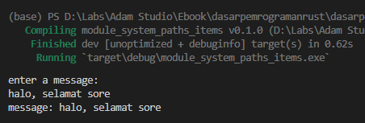

Chapter ini membahas tentang konsep *path* dan *item* dalam Rust programming.

## A.18.1. Rust *Paths*

Paths (atau Path) adalah notasi penulisan alamat sebuah item, contohnya `std::time::Duration`.

`std::time::Duration` adalah *path* untuk item yang isinya adalah `struct` bernama `Duration`. Item bisa berupa banyak jenis, bisa saja struct, atau *macro*, konstanta, atau lainnya. Lebih jelasnya silakan cek pada halaman dokumentasi `std::time::Duration`.

Sebuah path bisa memiliki banyak bagian (biasa disebut *segment*), sebagai contoh, path `std::time::Duration` memiliki 3 segmen yaitu `std`, `time`, dan `Duration`. Karakter `::` digunakan dalam penulisan path sebagai pembatas antar segmen (jika path memiliki lebih dari 1 segmen).

Dalam sebuah path, yang disebut dengan item adalah segment terakhir. Contohnya path `std::time::Duration`, maka item yang dituju adalah struct `Duration`.

> Rust paths mirip seperti konsep *filesystem* path di sistem operasi. Seperti `C:\Users\novalagung\Desktop` di windows, atau `/etc/nginx/conf.d/nginx.conf` di Unix/Linux.
>
> Di Rust, path tidak menggunakan `\` atau `/` sebagai separator, melainkan `::`.

Jika di-breakdown, berikut adalah penjelasan dari setiap kombinasi segmen path pada contoh `std::time::Duration`.

- Path `std` → adalah path untuk **crate** bernama [**Rust Standard Library**](https://doc.rust-lang.org/std/), isinya adalah sangat banyak item untuk keperluan umum di Rust programming. Lebih jelasnya akan dibahas pada chapter [Rust standard library](/wip/rust-standard-library).
- Path `std::time` → adalah path untuk **module** bernama [`time`](https://doc.rust-lang.org/std/time/index.html), isinya banyak item yang berhubungan dengan operasi waktu/time.
- Path `std::time::Duration` → adalah path untuk **struct** bernama [`Duration`](https://doc.rust-lang.org/std/time/index.html), yang merupakan representasi dari unit waktu.

> - Lebih jelasnya mengenai crate dibahas pada chapter [Module System → Package & Crate](/basic/package-crate)
> - Lebih jelasnya mengenai module dibahas pada chapter [Module System → Module](/basic/module-basic)
> - Lebih jelasnya mengenai struct dibahas pada chapter [Struct](/basic/struct)

## A.18.2. Absolute & relative paths

Rust mengenal dua jenis path:

- Absolute path → adalah path yang penulisannya lengkap dari root path, contohnya seperti `std::time::Duration`.
- Relative path → adalah path yang penulisannya relatif terhadap current path, contohnya seperti `self::my_func`, `super::my_mod::my_consntan`.

> Lebih jelasnya mengenai relative path dibahas pada chapter [Module System → Scope & Akses Item](/basic/module-scope-item-access).

## A.18.3. Rust *Items*

Seperti yang sudah dibahas bahwa path adalah notasi penulisan alamat untuk item. Lalu apa saja yang disebut dengan item? Di Rust ada banyak hal, yang kurang lebih list-nya bisa dilihat berikut:

- modules *(dibahas pada chapter [Module System → Module](/basic/module-basic))*
- extern crate declarations
- use declarations *(dibahas pada chapter [Module System → Use](/basic/use))*
- function definitions *(dibahas pada chapter [Function](/basic/function), [Associated Function](/basic/associated-function), dan [Method](/basic/method))*
- type definitions *(dibahas pada chapter-chapter tentang tipe data)*
- struct definitions *(dibahas pada chapter [Struct](/basic/struct))*
- enumeration definitions *(dibahas pada chapter [Enum](/basic/enum))*
- union definitions
- constant items *(dibahas pada chapter [Konstanta](/basic/konstanta))*
- static items *(dibahas pada chapter [Static Items](/basic/static))*
- trait definitions *(dibahas pada chapter [Traits](/basic/traits))*
- implementations *(dibahas pada chapter [Function](/basic/function), [Associated Function](/basic/associated-function), dan [Method](/basic/method))*
- extern blocks

## A.18.4. Penerapan paths dalam penggaksesan item

Pada bagian ini, kita akan coba terapkan path untuk mengakses beberapa item.

Dalam program sederhana berikut, inputan user ditampung sebagai string, kemudian ditampilkan.

```rust
fn main() {
    // tampilkan intro untuk user agar menginput sebuah pesan
    println!("enter a message:");

    // variabel yang akan menampung inputan user dalam string
    let mut message = std::string::String::new();

    // objek reader untuk membaca inputan user
    let stdin_reader = std::io::stdin(); 

    // proses pembacaan inputan user
    let reader_res = stdin_reader.read_line(&mut message);

    // pengecekan apakah ada error dalam pembacaan inputan.
    // jika iya, maka tampilkan error dan hentikan program
    if reader_res.is_err() {
        println!("error! {:?}", reader_res.err());
        return;
    }

    // tampilkan pesan inputan user
    println!("message: {}", message);
}
```

Jalankan program, lalu inputkan sebuah pesan, kemudian enter.



Bisa dilihat pesan ditampilkan sesuai inputan. Oke, sekarang kita akan bahas program di atas per-barisnya.

### ◉ `std::string::String::new()`

Variabel `message` adalah string yang dibuat menggunakan tipe data custom `String`. Salah satu cara pembuatan string bertipe data ini adalah menggunakan statement `std::string::String::new()`.

Bisa dilihat tanda `::` digunakan pada statement tersebut. Path tersebut jika dijabarkan per segment:

- Segment `std` adalah crate *Rust Standard Library*
- Pada path `std::string`, segment `string` adalah module
- Pada path `std::string::String`, segment `String` adalah struct String, yang biasa disebut dengan *custom type `String`*
- Pada path `std::string::String::new`, segment `new` adalah sebuah fungsi milik struct `String` yang mengembalikan data bertipe custom string `String`.
- Di segment terakhir, yaitu `new`, ditambahkan tanda pemanggilan fungsi `()`, yang menandakan bahwa fungsi `new` dipanggil. Dengan itu maka nilai baliknya (yang berupa `String`) ditampung oleh variabel `message`.

> Terkesan banyak sekali penjelasan dalam 1 baris kode, tapi tidak perlu dihafal, lama-kelamaan akan terbiasa.

Salah satu yang menarik dari create *Rust Standard Library* adalah, beberapa segmen otomatis di-import atau dipakai. Jadi tidak perlu menuliskan path secara full.

Pada contoh yang sudah dibuat, statement pembuatan data `String` bisa diubah dari ...

```rust
let mut message = std::string::String::new();
```

... menjadi cukup ...

```rust
let mut message = String::new();
```

### ◉ `std::io::stdin()`

Berbeda dengan `String`, path `std::io::stdin` tidak otomatis ter-import, jadi harus dituliskan secara full meskipun sama-sama dibawah crate *Rust Standard Library*.

Path `std::io` berisi module untuk keperluan I/O atau input output. Salah satu item yang ada dalam module ini adalah `stdin`, yang merupakan sebuah fungsi berguna untuk pembuatan objek handler untuk keperluan yang berhubungan dengan console (*stdin*). Objek tersebut ditampung oleh variabel `stdin_reader`.

> Secara terminologi, *stdin* (yang merupakan kependekan dari *standard input*) adalah sebuah input stream dimana data dikirim dan dibaca oleh program.

Variabel `stdin_reader` ini kemudian kita gunakan untuk berinteraksi dengan input stream, untuk menangkap inputan user.

### ◉ `stdin_reader.read_line(&mut message)`

Method `read_line` milik variabel `stdin_reader` berguna untuk menangkap inputan user. Variabel yang disisipkan sebagai argumen pemanggilan method tersebut menjadi penampung inputan user, yang pada contoh ini adalah `message`.

Perlu diperhatikan bahwa `message` disisipkan *mutable reference*-nya sebagai argumen pemanggilan fungsi.

> Lebih jelasnya mengenai pointer dan *mutable reference* dibahas pada chapter [Pointer & References](/basic/pointer-references)

Eksekusi dari statement `stdin_reader.read_line(&mut message)` adalah blocking, artinya program akan berhenti untuk sementara di baris tersebut, hingga ada inputan dari user dan tombol enter ditekan.

### ◉ Pengecekan error `stdin_reader`

Blok statement `if` pada contoh di atas bertugas melakukan pengecekan error. Jika ada error, maka `reader_res.is_err()` bernilai `true`, dan pesan error-nya dimunculkan.

```rust
if reader_res.is_err() {
    println!("error! {:?}", reader_res.err());
    return;
}
```

### ◉ Menampilkan isi `message`

Jika program berlajan sesuai harapan, tanpa error, pada baris terakhir data dalam `message` ditampilkan ke layar.

> Tipe data `String` ini tidak perlu di-konversi ke bentuk literal string `&str` untuk ditampilkan menggunakan `println`. Langsung saja sisipkan variabel `String` ke macro tersebut dan `println` akan tau harus menampilkan apa.

Oke, Penulis rasa sudah cukup jelas perihal bagaimana cara menggunakan path untuk mengakses item. Cukup tulis saja path-nya. Jika path-nya panjang? ya ditulis semua.

## A.18.5. Penggunaan keyword `use` untuk import path

Ada alternatif cara lain untuk memperpendek penulisan dan pengaksesan path, yaitu dengan menggunakan keyword `use`.

> Penggunaan `use` juga sempat dipraktikkan pada chapter sebelumnya, yaitu [Perulangan → while](/basic/perulangan-while).

Cara penerapannya bisa dilihat pada kode berikut:

```rust
let stdin_reader = std::io::stdin();

// ... atau ...

use std::io;
let stdin_reader = io::stdin();

// ... atau ...

use std::io::stdin;
let stdin_reader = stdin();
```

Dengan menggunakan `use` kita bisa memperpendek pengaksesan sebuah path.

O iya keyword ini bisa digunakan dimana saja, artinya tidak harus di luar fungsi `main`. Bisa saja di dalam fungsi, atau didalam blok kode seleksi kondisi atau lainnya.

## A.18.6. Pembahasan lanjutan

Kita sudah beberapa kali menerapkan path untuk mengakses item milik crate *Rust Standard Library*, lalu bagaimana penerapan path untuk internal item, pastinya pada proyek real dalam 1 program akan ada banyak item.

Jawabannya akan ada di beberapa chapter berikutnya. Untuk sekarang khusus pada bagian **module system** ini, penulis anjurkan untuk mengikuti urutan pembelajaran ebook terlebih dahulu.

---

## Catatan chapter 📑

### ◉ Source code praktik

<pre>
    <a href="https://github.com/novalagung/dasarpemrogramanrust-example/tree/master/path_item">
        github.com/novalagung/dasarpemrogramanrust-example/../path_item
    </a>
</pre>

### ◉ Referensi

- https://doc.rust-lang.org/book/ch07-03-paths-for-referring-to-an-item-in-the-module-tree.html
- https://doc.rust-lang.org/reference/paths.html
- https://doc.rust-lang.org/reference/items.html
- https://doc.rust-lang.org/std/keyword.use.html
- https://doc.rust-lang.org/edition-guide/rust-2018/path-changes.html

---
