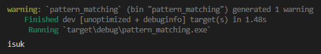

Chapter ini membahas tentang pattern matching, sebuah teknik yang lebih *advance* dibanding seleksi kondisi biasa.

Dalam pattern matching, pengecekan dilakukan dengan melihat kecocokan suatu pola/pattern.

## A.40.1. Keyword `match`

Keyword `match` digunakan untuk pattern matching. Contoh penerapan versi sederhananya bisa dilihat berikut:

```rust
let time = "morning";

match time {
    "morning"   => println!("isuk"),
    "afternoon" => println!("awan"),
    "evening"   => println!("bengi"),
    _           => println!("mbuh kapan"),
}
```



Pada contoh di atas, `time` dicek nilainya menggunakan keyword `match` dengan 4 buah klausul:

- Jika value-nya `morning`, tampilkan pesan `isuk`
- Jika value-nya `afternoon`, tampilkan pesan `awan`
- Jika value-nya `evening`, tampilkan pesan `bengi`
- Jika tidak ada yang cocok dari klausus di atas, maka tampilkan pesan `mbuh kapan`

Contoh di atas adalah ekuivalen dengan seleksi kondisi `if` berikut:

```rust
let time = "morning";

if time == "morning" {
    println!("isuk")
} else if time == "afternoon" {
    println!("awan")
} else if time == "evening" {
    println!("bengi")
} else {
    println!("mbuh kapan")
}
```

Ada satu syarat yang harus dipenuhi dalam penerapan pattern matching, yaitu semua kondisi yang memungkinkan harus ditulis, harus lengkap. Ibarat `if` yang harus ada block `else`-nya.

Variabel `_` digunakan sebagai else-nya block `match`. Tanpa adanya kondisi `_` maka besar kemungkinan block `match` error jika klausulnya tidak lengkap.


### ◉ Menampung nilai balik `match`

Block statement `match` bisa saja menghasilkan return value. Contohnya bisa dilihat berikut ini, hasil dari pattern matching ditampung ke variabel `time_but_in_javanese`.

```rust
let time = "morning";

let time_but_in_javanese = match time {
    "morning"   => "isuk",
    "afternoon" => "awan",
    "evening"   => "bengi",
    _           => "mbuh kapan",
};

println!("{time_but_in_javanese}");
```

## A.40.2. Pattern matching

Contoh di atas bisa dikategorikan sebagai seleksi kondisi biasa meskipun menggunakan keyword `match`. Setelah ini kita akan pelajari macam-macam pattern/pola yang di-support dalam pattern matching di Rust.

### ◉ Pengecekan nilai enum

Tipe data [Option](/basic/option-type) adalah salah satu enum yang paling sering dipakai pada pattern matching. Enum `Option` memiliki 2 enum value, `Some` yang merepresentasikan sebuah nilai, dan `None` yang berarti tidak ada nilai.

Pattern matching pada enum cukup mudah, caranya bisa dilihat pada contoh berikut:

```rust
let value: Option<i32> = Option::Some(5);

match value {
    Some(1) => println!("one"),
    Some(2) => println!("two"),
    Some(x) => println!("{x} greater than two"),
    _       => println!("none"),
}
```

Variabel `value` nilainya adalah `Some(5)`. Variabel tersebut dimasukkan ke block `match` dengan 4 buah kondisi pengecekan:

- Jika `value` nilainya `Some(1)`, tampilkan pesan `one`
- Jika `value` nilainya `Some(2)`, tampilkan pesan `two`
- Jika `value` nilainya `Some(x)`, tampilkan pesan `{x} greater than two`
- Jika tidak ada yang cocok dari klausus di atas, maka tampilkan pesan `none`

Tipe `Option` pasti berpotensi berisi `Some` atau `None`, tidak mungkin selainnya. Klausul terakhir di contoh di atas (`_ => println!("none")`) terpenuhi ketika nilai `value` adalah `None`. Pada konteks ini mengganti `_` dengan `None` menjadikan klausul pada pattern matching tetap lengkap.

```rust
match value {
    Some(1) => println!("one"),
    Some(2) => println!("two"),
    Some(x) => println!("{x} greater than two"),
    None    => println!("none"),
}
```

> Lebih jelasnya mengenai `Some` dan `None` dibahas pada chapter [Tipe Data → Option](/basic/option-type)

### ◉ Pattern `|` dan `..`

Klausul pattern matching bisa berisi operasi `OR` maupun `IN` caranya dengan memanfaatkan operator berikut:

- Operator `|` digunakan sebagai logika `OR`
- Operator `..` atau `..=` digunakan sebagai logika `IN`

Contoh penerapannya:

```rust
let value = 6;

match value {
    1 | 2 => println!("one or two"),
    3..=5 => println!("three through five"),
    6     => println!("six"),
    _     => println!("other number"),
}
```

- Jika `value` nilainya `1` atau `2`, tampilkan pesan `one or two`
- Jika `value` nilainya antara `3` hingga `5`, tampilkan pesan `three through five`
- Jika `value` nilainya `6`, tampilkan pesan `six`
- Jika tidak ada yang cocok dari klausus di atas, maka tampilkan pesan `other number`

Pattern di atas juga bisa diterapkan dalam variabel enum value, contohnya:

```rust
let value: Option<i32> = Some(5);

match value {
    Some(1 | 2) => println!("one or two"),
    Some(3..=5) => println!("three through five"),
    Some(6)     => println!("six"),
    Some(x)     => println!("{x} greater than six"),
    _           => println!("none"),
}
```

> Operator `|` memiliki 2 kegunaan:
>
> - Pada statement biasa, fungsinya adalah untuk **bitwise OR**.
> - Pada pattern matching, fungsinya untuk **OR**, kegunaannya sama seperti `||` pada statement biasa.
>
> Lebih jelasnya mengenai bitwise operator dibahas pada chapter [Bitwise Operation](#/wip/bitwise-operation)

### ◉ Match guard

Match guard adalah teknik menambahkan sub seleksi kondisi pada klausul `match`. Contoh:

```rust
let value = Some(4);

let message = match value {
    Some(x) if x % 2 == 0 => format!("number {} is even", x),
    Some(x)               => format!("number {} is odd", x),
    None                  => String::new(),
};

println!("{message}");
```

Klausul pertama di atas, yaitu `Some(x)` ditambahkan match guard `if x % 2 == 0`.

### ◉ Binding `@`

Operator `@` digunakan untuk menampung nilai klausul `match` yang default-nya tidak bisa ditampung. Agar lebih jelas, silakan pelajari pattern matching berikut:

```rust
let value = 3;
match value {
    1 | 2 => println!("one or two"),
    3..=5 => println!("three through five"),
    6     => println!("six"),
    _     => println!("other number"),
}
```

Klausul `1 | 2` dan `3..=5` nilai by default tidak bisa diakses. Kita hanya tau bahwa nilai pasti antara `1` dan `2` untuk klausul `1 | 2`, dan `3 / 4 / 5` untuk klausul `3..=5`.

Nilai pasti klausul tersebut bisa ditampung menggunakan operator `@`.

```rust
let value = 3;
match value {
    n @ (1 | 2) => println!("one or two ({})", n),
    n @ 3..=5   => println!("three through five ({})", n),
    6           => println!("six"),
    _           => println!("other number"),
}
```

> Khusus untuk penggunaan `@` binding pada operator `|`, pada penulisan klausul seleksi kondisinya harus diapit tanda `()`.

### ◉ `if let`

Untuk memahami pattern matching menggunakan keyword `if let`, silakan pelajari kode berikut terlebih dahulu.

```rust
let value: Option<i32> = Some(5);

match value {
    Some(1) => println!("one"),
    Some(x) => println!("{x} greater than two"),
    _       => println!("none"),
}
```

Pattern matching di atas cukup mudah dipahami, isinya ada 2 kondisi `Some` dan 1 buah else (menggunakan `_`). 

Block kode tersebut jika dikonversi ke bentuk `if` hasilnya seperti ini:

```rust
let value = Some(5);

if let Some(1) = value {
    println!("one");
} else if let Some(x) = value {
    println!("{x} greater than two");
} else {
    println!("none");
}
```

Dari sini cukup jelas kegunaan dari `if let`. Meskipun menggunakan operator `=` (bukan `==`) block kode seleksi kondisi di atas adalah pattern matching, yang isinya melakukan pengecekan sama persis seperti pattern matching pada kode sebelumnya.

Tambahan contoh, 2 block kode berikut adalah juga ekuivalen.

```rust
let value = 6;
match value {
    1 | 2 => println!("one or two"),
    3..=5 => println!("three through five"),
    6     => println!("six"),
    _     => println!("other number"),
}

// ... vs ...

let value = Some(5);
if let Some(1 | 2) = value {
    println!("one or two");
} else if let Some(3..=5) = value {
    println!("three through five");
} else if let Some(6) = value {
    println!("six");
} else {
    println!("other number");
}
```

## A.40.3. Destructuring assignment

### ◉ Struct destructuring

Operasi *destructuring* (menampung item suatu tipe) bisa dilakukan menggunakan pattern matching.

Pada kode di bawah ini, variabel `p` yang bertipe struct `Point { x: i32, y: i32 }` dimasukkan pada block pattern matching. Item dari struct tersebut di-*destructure* ke variabel `x` dan `y` masing-masing klausul pattern matching item-nya ditampung ke variabel `x` dan `y`.

```rust
struct Point {
    x: i32,
    y: i32,
}

let p = Point { x: 0, y: 7 };

match p {
    Point { x, y: 0 } => println!("x axis at {x}"),
    Point { x: 0, y } => println!("y axis at {y}"),
    Point { x, y }    => println!("axis: ({x}, {y})")
}
```

- Jika `p.y` nilainya `0`, tampilkan pesan `x axis at {x}`
- Jika `p.x` nilainya `0`, tampilkan pesan `y axis at {y}`
- Jika tidak ada yang cocok dari klausus di atas, maka tampilkan pesan `axis: ({x}, {y})`

Operasi destructuring hasilnya pasti sukses, karena alasan ini keyword `match` boleh tidak digunakan. Contohnya bisa dilihat pada kode berikut, variabel `p` di-*destructure* ke variabel baru yaitu `x` dan `y`.

```rust
let Point { x, y } = p;

println!("x: {x}");
println!("y: {y}");
```

### ◉ Enum destructuring

Destructuring juga bisa dilakukan pada tipe data enum caranya dengan menggunakan keyword `match` atau `if` (wajib menggunakan salah satu keyword tersebut).

```rust
enum Color {
    Black,
    White,
    Rgb(i32, i32, i32)
}

let color = Color::Rgb(0, 160, 255);

if let Color::Rgb(r, g, b) = color {
    println!("r: {r}");
    println!("g: {g}");
    println!("b: {b}");
}

match color {
    Color::Rgb(r, g, b) => println!("r: {r}, g: {g}, b: {b}"),
    _                   => println!("other color")
}
```

### ◉ Tuple destructuring

Tuple bisa di-destructure secara langsung tanpa menggunakan keyword `if` atau `match`.

```rust
let grades = ("A", "B", "C");

let (grade_a, grade_b, grade_c) = grades;
println!("grade_a: {grade_a}");
println!("grade_b: {grade_b}");
println!("grade_c: {grade_c}");

match grades {
    (grade_a, grade_b, grade_c) => {
        println!("grade_a: {grade_a}");
        println!("grade_b: {grade_b}");
        println!("grade_c: {grade_c}");
    }
}
```

### ◉ Variabel `_`

Variabel `_` bisa dimanfaatkan pada statement *destructuring* untuk menampung item yang tidak digunakan. Contoh penerapannya bisa dilihat di bawah ini. Tuple `numbers` di-destructure dan hanya diambil elemen ke-2-nya.

```rust
let numbers = (2, 4, 32);

let (_, second, _) = numbers;
println!("second number: {second}");
```

### ◉ Operator `..`

Operator `..` bisa digunakan untuk meng-exclude item dalam range tertentu. Sebagai contoh, tuple `numbers` di-destructure dan hanya diambil nilai elemen ke-1 dan terakhirnya.

```rust
let numbers = (2, 4, 8, 16, 32);

let (first, .., last) = numbers;
println!("first number: {first}");
println!("last number: {last}");
```

Opeartor `..` hanya bisa digunakan pada statement destructuring di posisi tengah, awal, atau akhir (pilih salah satu). Contoh:

```rust
let (first, .., last) = numbers;
println!("first number: {first}");
println!("last number: {last}");

let (first, ..) = numbers;
println!("first number: {first}");

let (.., last) = numbers;
println!("last number: {last}");
```

---

## Catatan chapter 📑

### ◉ Source code praktik

<pre>
    <a href="https://github.com/novalagung/dasarpemrogramanrust-example/tree/master/pattern_matching">
        github.com/novalagung/dasarpemrogramanrust-example/../pattern_matching
    </a>
</pre>

### ◉ Chapter relevan lainnya

- [Seleksi Kondisi → if, else if, else](/basic/seleksi-kondisi-if)
- [Tipe Data → Tuple](/basic/tuple)
- [Struct](/basic/struct)
- [Enum](/basic/enum)
- [Tipe Data → Option](/basic/option-type)

### ◉ Work in progress

- Pembahasan tentang `while let`

### ◉ Referensi

- https://doc.rust-lang.org/book/ch18-03-pattern-syntax.html
- https://doc.rust-lang.org/rust-by-example/flow_control/match.html

---
