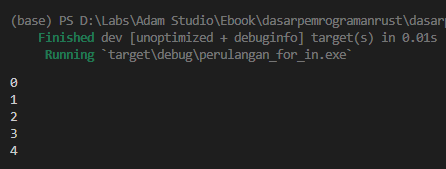
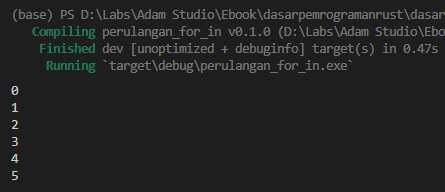
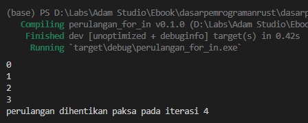
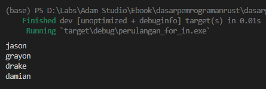

`for in` adalah salah satu keyword untuk operasi perulangan yang ada di Rust selain `loop` dan `while`. Pada chapter ini kita akan mempelajarinya.

## A.12.1. Keyword `for in`

`for in` adalah keyword perulangan yang paling sering dipakai untuk meng-iterasi data yang tipe data-nya mengimplementasikan trait `Iterator`. Ada banyak jenis tipe data dengan trait ini, salah satunya adalah tipe data **range** yang akan kita bahas pada chapter ini.

> - Lebih jelasnya mengenai traits dibahas pada chapter [Traits](/basic/traits)
> - Lebih jelasnya mengenai trait `Iterator` dibahas pada chapter [Trait → Iterator](/basic/trait-iterator)

Tipe data range dibuat dengan notasi penulisan `a..b`. Mari lanjut dengan praktik agar lebih jelas. Silakan coba kode sederhana berikut lalu jalankan.

```rust
for i in 0..5 {
    println!("{i}");
}
```



Keyword `for in` jika digunakan pada notasi iterator `a..b` maka akan menghasilkan sebuah perulangan dari angka `a` hingga angka dibawah `b`.

Pada contoh di atas, `0..5` artinya adalah objek iterator yang dimulai dari angka `0` hingga dibawah `5` (yaitu `4`). Object iterator tersebut kemudian diiterasi, dan ditiap perulangan di-print menggunakan `println!("{i}")`. Dengan ini, nilai `i` muncul di layar console dimulai angka `0` hingga `4`.

Jika ingin melakukan perulangan dari `a` ke `b` (bukan dari `a` ke angka dibawah `b`) gunakan notasi iterator `a..=b`. Contoh:

```rust
for i in 0..=5 {
    println!("{i}");
}
```



## A.12.2. Label perulangan

Penambahan label pada perulangan `for in` juga bisa dilakukan. Caranya dengan cukup menambahkan sintaks `'namaLabel: ` sebelum statement `for in`. Contohnya seperti berikut:

```rust
'perulangan: for i in 0..=5 {
    if i > 3 {
        println!("perulangan dihentikan paksa pada iterasi {i}");
        break 'perulangan;
    }

    println!("{i}");
}
```



Selain `break`, keyword `continue` juga bisa digunakan pada perulangan `for in`.

## A.12.3. Perulangan `for in` pada array

Perulangan menggunakan `for in` adalah yang paling praktis digunakan untuk mengiterasi elemen array. Contoh:

```rust
let array = ["jason", "grayon", "drake", "damian"];
for name in array {
    println!("{name}");
}
```



Perihal apa itu `array` akan dibahas pada chapter selanjutnya, yaitu [Array](/basic/array).

## A.12.4. Perulangan `for in` pada tipe iterator lainnya

Di Rust ada banyak cara membuat object iterator. Mengenai topik satu ini kita akan bahas seiring berjalannya proses pembelajaran. Akan berpotesi makin membingungkan jika dibahas terlalu detail pada chapter ini.

---

## Catatan chapter 📑

### ◉ Source code praktik

<pre>
    <a href="https://github.com/novalagung/dasarpemrogramanrust-example/tree/master/perulangan_for_in">
        github.com/novalagung/dasarpemrogramanrust-example/../perulangan_for_in
    </a>
</pre>

### ◉ Referensi

- https://doc.rust-lang.org/reference/expressions/loop-expr.html
- https://doc.rust-lang.org/std/keyword.in.html
- https://doc.rust-lang.org/std/keyword.for.html
- https://doc.rust-lang.org/rust-by-example/flow_control/for.html

---
