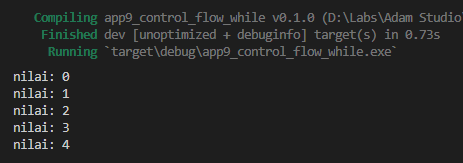
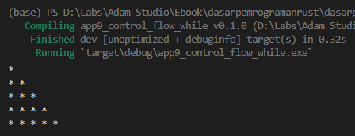

Di Rust ada beberapa cara untuk melakukan perulangan, salah satunya adalah dengan menggunakan keyword `while`, dan pada chapter ini kita akan mempelajarinya.

Perulangan sendiri merupakan teknik untuk mengulang-ulang eksekusi blok kode dengan kondisi tertentu. Perulangan akan terus menerus dieksekusi ketika kondisi perulangan nilainya `true`, dan hanya akan berhenti kita nilainya `false`.

## A.10.1. Keyword `while`

Perulangan menggunakan `while` mengharuskan kondisi perulangan dituliskan di awal dengan notasi penulisan sebagai berikut:

```rust
while kondisi {
    
}
```

Contoh berikut adalah penerapan `while` untuk operasi perulangan yang isinya menampilkan angka `i` dengan kondisi `i` dibawah `max`.

```rust
let mut i = 0;
let max = 5;

while i < max {
    println!("nilai: {i}");
    i += 1;
}
```



Variabel `i` pada contoh di atas menjadi penentu kapan perulangan berhenti. Didalam blok kode `while` (yang dimana akan dieksekusi setiap kondisi menghasilkan nilai `true`), nilai variabel `i` di-increment, membuat variabel `i` nilainya selalu bertambah 1 setiap kali perulangan. Perulangan akan berhenti ketika nilai `i` sudah tidak dibawah `i` lagi.

## A.10.2. Nested `while`

Penerapan nested while (atau `while` didalam `while`) cukup mudah, tulis saja statement `while` didalam `while` sesuai kebutuhan. Contoh bisa dilihat pada kode berikut, yaitu penerapan teknik nested while untuk print karakter `*` membuat bentuk segitiga.

```rust
let mut i = 0;
let max = 5;

while i < max {
    let mut j = 0;
    let max_inner = i;

    while j <= max_inner {
        print!("* ");
        j += 1;
    }
    
    println!();
    i += 1;
}
```



### ◉ Macro `print`

Macro `print` kegunaannya mirip dengan `println`, hanya saja tanpa *newline* atau baris baru. Jadi semua string yang di-print menggunakan macro `print` akan muncul menyamping ke kanan dan tidak di baris baru. Contoh:

```rust
print!("* ");
print!("* ");
print!("* ");
print!("* ");
```

Akan menghasilkan output:

```bash
* * * * 
```

## A.10.3. Keyword `while let`

Kita akan bahas keyword `while let` pada chapter [Pattern Matching](/basic/pattern-matching).

## A.10.4. Menambahkan delay dalam perulangan

Eksekusi statement perulangan pada program sangatlah cepat. Bisa jadi dalam 1 detik ada ribuan (atau bahkan jauh lebih banyak) statement dalam perulangan yang dieksekusi. Di-tiap eksekusinya, delay bisa saja ditambahkan, misalnya 1 detik, dan pada contoh di bawah ini kita akan coba mengaplikasikannya.

Silakan tulis kode program berikut:

```rust
use std::thread::sleep;
use std::time::Duration;

fn main() {
    let mut i = 0;
    let max = 5;

    while i < max {
        println!("nilai: {i}");
        i += 1;

        sleep(Duration::from_secs(1));
    }
}
```

Ada beberapa keyword baru dipergunakan pada source code di atas. Untuk sekarang coba jalankan terlebih dahulu program yang baru dibuat, kemudian stop. Text `nilai: {i}` akan muncul di console setiap satu detik, dan hanya akan berhenti ketika program di stop.

Selanjutnya kita akan beberapa sintaks baru di atas.

### ◉ Keyword `use` dan module dalam Rust

Keyword `use` memiliki banyak kegunaan. Pada contoh ini `use` difungsikan untuk *import module*, yang di bahasa Rust dikenal dengan istilah **import paths**.

Notasi penulisan *module path* di Rust dinotasikan dengan separator `::`, contohnya seperti `std::thread::sleep` dan `std::time::Duration`.

- Statement `use std::thread::sleep` artinya path `std::thread::sleep` digunakan dalam kode program. `sleep` adalah sebuah fungsi yang gunanya untuk menambahkan jeda dengan durasi sesuai keinginan, contohnya, 1 detik, 30 menit, dst.

- Statement `use std::time::Duration` artinya path `std::time::Duration` digunakan dalam kode program. `Duration` merupakan sebuah struct yang isinya banyak hal untuk keperluan yang berhubungan dengan waktu atau *duration*.

Pada contoh di atas, fungsi `sleep` dipanggil dalam blok kode perulangan agar ada jeda ditiap eksekusinya. Sedangkan durasi jedanya sendiri ditentukan oleh argument `Duration::from_secs(1)` yang artinya durasi `1 detik`. Dengan ini durasi delay adalah 1 detik.

Jika ingin jeda durasi yang lebih lama, ubah saja angka `1` pada `Duration::from_secs(1)`. Contoh: `Duration::from_secs(5)` berarti jeda 5 detik.

> - Lebih jelasnya perihal path dibahas pada chapter [Module System → Pach & Item](/basic/path-item)
> - Lebih jelasnya perihal keyword `use` dibahas pada chapter [Module System → Use](/basic/use)
> - Lebih jelasnya perihal fungsi dibahas pada chapter [Function](/basic/function)

---

## Catatan chapter 📑

### ◉ Source code praktik

<pre>
    <a href="https://github.com/novalagung/dasarpemrogramanrust-example/tree/master/perulangan_while">
        github.com/novalagung/dasarpemrogramanrust-example/../perulangan_while
    </a>
</pre>

### ◉ Referensi

- https://doc.rust-lang.org/book/ch03-05-control-flow.html
- https://doc.rust-lang.org/std/keyword.while.html
- https://doc.rust-lang.org/std/keyword.use.html
- https://doc.rust-lang.org/rust-by-example/flow_control/while.html
- https://doc.rust-lang.org/stable/std/time/struct.Duration.html
- https://doc.rust-lang.org/reference/expressions/while-expr.html
- https://doc.rust-lang.org/reference/paths.html

---
