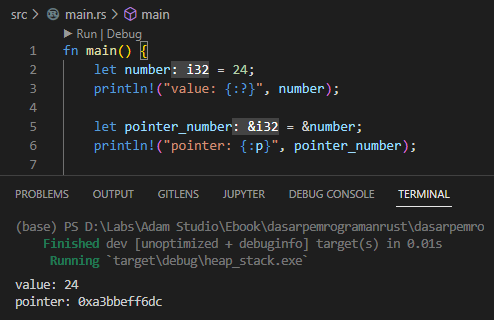
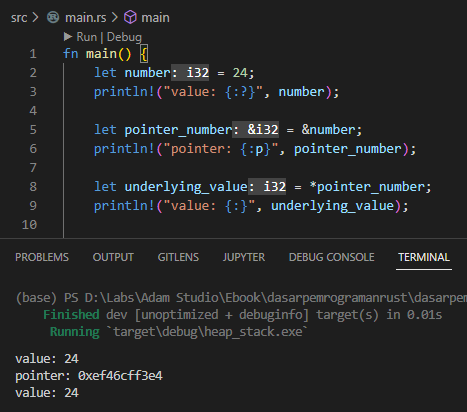
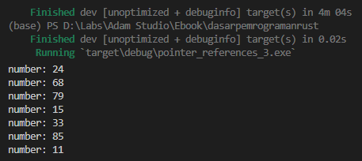

Chapter ini membahas tentang apa itu pointer, references, dan dereferences. Pembelajaran dimulai tentang konsep dan praktek dasar tentang ketiga topik tersebut, kemudian diikuti dengan pembahasan tentang karakteristik pointer & reference.

> Penulis tekankan bahwa **pada chapter ini, konsep reference yang dibahas adalah dalam konteks programming secara general.** Tidak dari sudut pandang ownership.

Reference pada Rust memiliki keunikan, tapi kita akan bahas itu secara terpisah pada chapter [Borrowing](/basic/borrowing). Untuk sekarang silakan ikuti terlebih dahulu pembahasan chapter-per-chapter secara berurutan.

## A.33.1. Pointer

Pointer artinya adalah alamat memori. Variabel pointer artinya adalah variabel yang berisi alamat memory (hanya alamat memory-nya saja, bukan value yang sebenarnya).

Di Rust, variabel pointer ditandai dengan adanya karakter `&` pada tipe data. Sebagai contoh `&i32` artinya adalah tipe data pointer `i32`. Contoh lain adalah `&bool` yang merupakan tipe data pointer `bool`.

> Ada dua jenis tipe pointer di Rust programming, yaitu smart pointer dan raw pointer. Pada chapter ini kita tidak membahasnya karena termasuk topik yang cukup advance. Pembahasan akan ada pada chapter terpisah [Smart Pointer vs Raw Pointer](/wip/smart-pointer-raw-pointer).

## A.33.2. Reference (operator `&`)

Ok, selanjutnya apa itu *reference*? Istilah ini sudah beberapa kali disinggung pada chapter sebelum-sebelumnya.

Reference artinya adalah pointer dari sebuah variabel atau data. Operasi pengambilan pointer dari variabel disebut dengan *referencing*, caranya dilakukan dengan menggunakan karakter `&`.

O iya, semua jenis variabel bisa diambil nilai pointernya. Contohnya bisa dilihat berikut ini:

```rust
let number: i32 = 24;
println!("value: {:?}", number);

let pointer_number: &i32 = &number;
println!("pointer: {:p}", pointer_number);
```

Pada contoh di atas, sebuah variabel dideklarasikan bernama `number` dengan tipe data adalah numerik dan value `24`. Variabel tersebut jika di-print akan muncul nilainya, yaitu `24`.

Ada satu lagi variabel yang dideklarasikan yaitu `pointer_number`, yang nilainya adalah *reference* dari variabel `number`. Cara pengambilan reference yabng dilihat pada contoh, yaitu dengan menambahkan operator `&` pada variabel yang ingin dimabil pointernya.

```rust
// variabel pointer_number nilainya adalah reference variabel number.
// contoh statement:
let pointer_number_1 = &number;
let pointer_number_2: &i32 = &number;
```

By default, ketika variabel pointer di print, yang muncul adalah *underlying value* atau nilai sebenarnya, yang pada contoh di atas adalah `24`. Untuk menampilkan alamat memory gunakan formatted print `{:p}`.

Coba jalankan program kemudian lihat hasilnya. Value muncul sesuai dengan yang ditulis, sedangkan pointer memunculkan data alamat memory yaitu `0xa3bbeff6dc`.



Seperti yang sudah dijelaskan di awal bahwa variabel pointer isinya adalah alamat memory. Penulisannya dalam notasi heksadesimal diawali dengan karakter `0x`. Contohnya adalah nilai `0xa3bbeff6dc` yang merupakan alamat memory, yang alamat tersebut adalah reference ke  pemilik data sebenarnya (yaitu variabel `number`).

> Di environment lokal masing-masing, alamat memory yang muncul sangat mungkin berbeda karena alokasi adalah random

## A.33.3. Dereference (operator `*`)

Kita sudah belajar cara mengambil data pointer dari sebuah variabel. Pada bagian ini kita belajar cara mengambil nilai sebenarnya atau underlying value dari sebuah pointer (istilahnya adalah *dereference*).

Cara melakukan operasi *dereferencing* adalah dengan menambahkan karakter `*` pada variabel pointer. Contohnya seperti berikut, silakan tambahkan kode ini ke program yang sudah ditulis.

```rust
// variabel underlying_value nilainya adalah nilai sebenarnya dari pointer pointer_number
let underlying_value = *pointer_number;
println!("value: {:}", underlying_value);
```



Bisa dilihat, nilai dari variabel `underlying_value` adalah nilai sebenarnya dari pointer `pointer_number`, yang pastinya adalah sama dengan nilai variabel `number`.

## A.33.4. Mutable References (operator `&mut`)

By default, reference sifatnya *read-only* atau *immutable*, artinya tidak bisa diubah *underlying-value*-nya.

Jika ada variabel (sebut saja X) yang merupakan underlying value dari reference variabel lain, maka perubahan value pada variabel X tersebut *default*-nya menghasilkan error.

```rust
let mut number = 24;
println!("number: {}", number);

let pointer_number = &number;
println!("pointer_number: {:p}", pointer_number);

*pointer_number = 12;

println!("*pointer_number: {}", *pointer_number);
println!("number: {}", number);
```


Pada gambar di atas bisa dilihat, variabel `pointer_number` merupakan reference dari variabel mutable `number`. Setelahnya ada statement `*pointer_number = 12`, yang artinya adalah underlying value dari variabel pointer `pointer_number` diakses kemudian di-isi nilainya dengan angka `12`.

> Statement `*pointer_number = 12` tidak menghasilkan error, dan statement ini berbeda dengan `pointer_number = 12`.
>
> Statement `pointer_number = 12` menghasilkan error karena `pointer_number` adalah variabel bertipe **pointer `i32` atau `&i32` (bukan `i32`)**. Jika ingin mengubah nilainya perlu mengakses dulu underlying value-nya menggunakan `*pointer_number`.

Ok, lalu kenapa muncul error? Di gambar terlihat ada garis merah dan popup pesan error muncul, padahal tidak ada yang salah dengan statement-nya.

Penyebab erronya bukan dari statement tersebut, tetapi pada baris statement pengambilan reference variabel `number`. Statement `&number` artinya adalah mengambil reference dari variabel `number`. Di atas sempat kita bahas bahwa *by default* sebuah reference tidak bisa diubah nilainya (*immutable*), dan ini adalah penyebab error yang dialami.

> Silakan perhatikan pesan di popup error message agar mudah untuk tau dimana sumber masalahnya.

Perubahan isi nilai variabel `number` tidak menghasilkan error, hal ini karena number adalah variabel `number` adalah mutable. Sedangkan operasi perubahan nilai variabel `*pointer_number` pada contoh di atas, dianggap sebagai error karena variabel `pointer_number` reference-nya adalah bukan mutable (meskipun reference diperoleh dari variabel `number` yang notabene mutable).

Solusi dari error di atas adalah menerapkan **mutable reference**. Mutable reference sama seperti reference biasa tetapi nilainya diperbolehkan untuk diubah (mutable). Caranya pengaksesan mutable reference dilakukan menggunakan operator `&mut`.

Ok, sekarang ubah statement berikut ini, lalu jalankan program:

```rust
// before
let pointer_number = &number;

// after
let pointer_number = &mut number;
```


Deklarasi variable pointer yang menampung mutable reference bisa via metode penulisan *manifest typing* atau *type inference*. Pada contoh berikut, variabel `pointer_number` tipe data-nya adalah mutable reference `i32`, maka penulisan tipe data adalah `&mut i32`.

```rust
// type inference
let pointer_number = &mut number;

// manifest typing
let pointer_number: &mut i32 = &mut number;
```

Pada contoh ini kita menggunakan tipe data primitif, lalu bagaimana dengan tipe data non-primitive seperti custom type struct atau `String`, apakah penerapan mutable reference juga sama? Jawabannya tidak. Ada beberapa perbedaan dan nantinya kita akan bahas secara detail pada chapter [Borrowing](/basic/borrowing). Untuk sekarang, dianjurkan mengikuti pembahasan chapter per chapter secara urut.

## A.33.5. Aturan Reference

Ada dua aturan penting yang harus dipatuhi dalam penerapan reference baik mutable atau immutable reference.

- Dalam waktu yang sama, hanya boleh ada satu mutable reference atau banyak immutable reference (keduanya tidak bisa bersamaan, harus salah satu).
- Reference harus selalu valid.

Mengenai penjelasan tentang dua aturan penting di atas akan bahas pada chapter [Borrowing](/basic/borrowing).

## A.33.6. Karakteristik pointer & reference

Kita sudah belajar tentang definisi beserta cara penerapan pointer, reference, dereference, dan mutable reference. Sekarang lanjut ke pembahasan tentang karakteristik dari pointer & reference.

Pointer merupakan variabel yang isinya adalah alamat memory (bukan nilai sebenarnya). Dan reference adalah alamat memory suatu data/variabel. Dengan menerapkan keduanya kita bisa menerapkan efisiensi penggunaan memory yang dampaknya sangat positif terhadap performa program.

Sekarang perhatikan statement berikut:

```rust
let number_one = 24;
let number_two = number_one;
```

Variabel `number_one` adalah data numerik bertipe `i32`, eksekusi statement tersebut menghasilkan alokasi memori selebar 32-bit.

Kemudian ada lagi statement `number_two`. Meskipun nilainya didapat dari variabel `number_one`, yang terjadi di balik layar adalah Rust akan mengalokasikan lagi alamat memory selebar 32-bit untuk menampung data `number_two` yang didapat dari hasil operasi **copy** dari variabel `number_one`.

> Semua variabel primitif di Rust mengadopsi *copy semantics*, yang artinya jika variabel tersebut digunakan dalam statement assignment, maka nilai akan di-duplikasi untuk kemudian ditampung pada variabel baru.
>
> Lebih jelasnya mengenai *copy semantics* dibahas pada chapter [Ownership](/basic/ownership#a334-copy-semantics-vs-move-semantics).

Selanjutnya, bandingkan dengan statement berikut:

```rust
let number_one = 24;
let number_two = &number_one;
```

Pada contoh di atas, variabel `number_one` datanya disimpan di memory dengan lebar 32-bit (masih sama seperti contoh sebelumnya). Namun ada yang berbeda dengan dengan variabel `number_two`, variabel ini adalah variabel pointer yang nilainya reference ke alamat memory data variabel `number_one`. Yang terjadi di belakang layar, Rust tidak mengalokasikan lagi memory selebar 32-bit untuk menampung data `number_two`, melainkan menggunakan alamat memory data `number_one` sebagai reference, menjadikannya sebagai alamat tujuan variabel pointer `number_two`.

Ok, lanjut. Per sekarang, reference variabel `number_one` dan `number_two` adalah sama. Dengan ini, jika dicontohkan isi data satu variabel diubah, maka variabel lainnya juga akan berubah, hal karena reference-nya adalah sama.

### ◉ Contoh ke-1

Contoh penerapannya bisa kita lihat pada chapter [Pointer & References](/basic/pointer-references#a315-karakteristik-pointer--reference) chapter ini, disitu bisa dilihat ada variabel mutable `number` dan `pointer_number` yang reference-nya adalah sama dengan variabel `number`. Ketika underlying value `pointer_number` diubah (dari `24` ke `12`), isi data variabel `number` juga berubah.


### ◉ Contoh ke-2

Agar makin familiar dengan cara penerapan pointer & reference, silakan lanjut dengan praktek program berikut:

```bash title="package source code structure"
my_package
│─── Cargo.toml
└─── src
     └─── main.rs
```

```rust title="Cargo.toml"
# ...

[dependencies]
rand = "0.8.5"
```

```rust title="main.rs"
use rand::Rng;

fn main() {
    let mut number = 24;
    println!("number: {}", number);

    for _ in 0..=5 {
        change_value(&mut number);
        println!("number: {}", number);
    }
}

fn change_value(n: &mut i32) {
    *n = generate_random_number()
}

fn generate_random_number() -> i32 {
    rand::thread_rng().gen_range(0..100)
}
```

Pada sederhana di atas, ada sebuah variable mutable bernama `number` yang dideklarasikan. Variabel tersebut kemudian diakses *mutable reference*-nya untuk dijadikan argumen statement pemanggilan fungsi `change_value`.

Di dalam fungsi `change_value`, disiapkan 1 buah angka random hasil pemanggilan fungsi `generate_random_number`, yang angka tersebut kemudian dijadikan sebagai nilai baru variable mutable reference yang mengarah ke `number`. Perubahan dalam fungsi `change_value` akan mempengaruhi data variabel `number`, karena reference-nya adalah sama.



## A.33.7. Reference & borrowing

Di Rust, reference (atau pengaksesan alamat memory suatu data) memiliki hubungan yang sangat erat dengan konsep **borrowing**.

Ketika kita mengambil reference suatu data, yang terjadi sebenarnya adalah kita meminjam data tersebut dari owner/pemilik sebenarnya.

Pada chapter ini kita tidak akan membahasnya lebih jauh lagi, karena akan ada chapter lain yang fokus mengulas topik tersebut secara detail, yaitu chapter [Borrowing](/basic/borrowing).

Untuk sekarang penulis anjurkan untuk lanjut ke chapter berikutnya secara urut.

---

## Catatan chapter 📑

### ◉ Source code praktek

<pre>
    <a href="https://github.com/novalagung/dasarpemrogramanrust-example/tree/master/pointer_references">
        github.com/novalagung/dasarpemrogramanrust-example/../pointer_references
    </a>
</pre>

### ◉ Referensi

- https://doc.rust-lang.org/book/ch04-02-references-and-borrowing.html
- https://doc.rust-lang.org/std/marker/trait.Copy.html
- https://en.wikipedia.org/wiki/Reference_(computer_science)
- https://progressivecoder.com/understanding-rust-ownership-and-borrowing-with-examples/
- https://os.phil-opp.com/heap-allocation/

---
