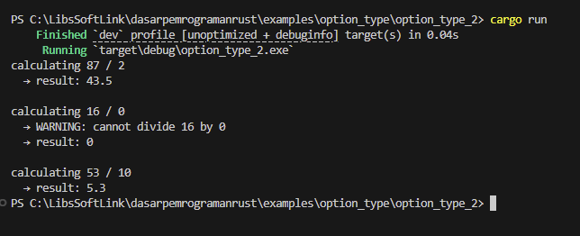
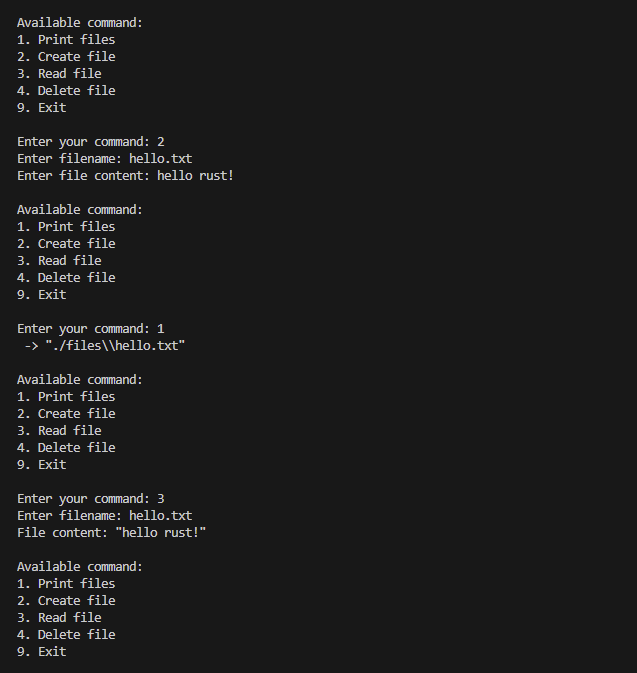
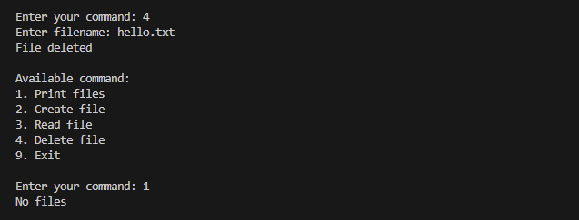
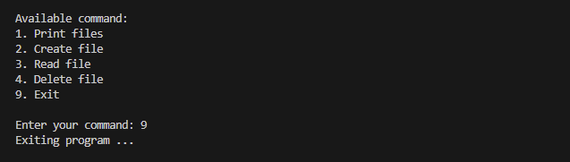

Chapter ini merupakan kelanjutan dari chapter sebelumnya tentang pembahasan topic error. Kali ini fokus kita lebih ke **recoverable error** dan penanganannya (*error handling* / *error propagation*).

Best practice penanganan error di Rust adalah dengan mengkombinasikan keyword `match` dengan tipe data `Result<T, E>`. Untuk penerapannya sendiri sebenarnya sudah cukup sering dipraktikan di chapter-chapter sebelumnya.

Pada chapter ini pembelajaran dilakukan dengan lebih banyak menulis kode (*coding*), dengan ini penulis harapkan pembaca bisa terbiasa dan nyaman dengan gaya penanganan error di Rust.

## A.55.1. Praktik membuat program **file manager**

Program yang akan dibuat skalanya lebih besar dibanding program pada praktik-praktik sebelumnya. Program **file manager** ini kita akan buat dari 0, kegunaannya adalah untuk mempermudah manajemen file seperti pembuatan file, pembacaan file, dan operasi file lainnya.

> Pastikan untuk mempelajari beberapa chapter berikut sebelum memulai pembelajaran
>
> - [Module System ➜ Module](/basic/module-basic)
> - [Tipe Data ➜ Result](/basic/result-type)
> - [Pattern Matching](/basic/pattern-matching)
> - [File, Path, Directory](/basic/file-path-directory)
> - [Error ➜ Unrecoverable Error / Panic](/basic/unrecoverable-panic-error)

Ok, sekarang siapkan sebuah package atau project terlebih dahulu, dengan struktur seperti ini:

```bash title="package source code structure"
file_manager
│─── Cargo.toml
└─── src
     │─── file_action_constant.rs
     │─── file_manager.rs
     │─── file_utility.rs
     └─── main.rs
```

- File `file_action_constant.rs` akan diisi dengan deklarasi konstanta base path, enum action/command, dan fungsi validasi command.
- File `file_manager.rs` akan diisi dengan *business process* program file manager.
- File `file_utility.rs` akan diisi dengan beberapa fungsi utilitas seperti operasi baca inputan user.
- File `main.rs` berisi kontrol alur eksekusi program.

### ◉ Deklarasi konstanta, command, dan validasi command

Deklarasikan beberapa hal berikut pada file `file_action_constant.rs`:

- Konstanta `FOLDER_BASEPATH`. Nantinya digunakan sebagai basepath operasi program file manager ini.
- Enum `Command`, berisi action yang tersedia seperti `PrintFiles`, `CreateFile`, dan lainnya.
- Fungsi validasi command.

```rust title="./src/file_action_constant.rs"
pub const FOLDER_BASEPATH: &str = "./files";

pub enum Command {
    PrintFiles,
    CreateFile,
    ReadFile,
    DeleteFile,
    ExitProgram,
}

pub fn validate_command(cmd: &str) -> Result<Command, &'static str> {
    match cmd {
        "1" => Ok(Command::PrintFiles),
        "2" => Ok(Command::CreateFile),
        "3" => Ok(Command::ReadFile),
        "4" => Ok(Command::DeleteFile),
        "9" => Ok(Command::ExitProgram),
        _ => Err("unrecognized command")
    }
}
```

Dari kode di atas terlihat bahwa program akan berisi setidaknya 5 buah action (termasuk `ExitProgram`).

### ◉ Fungsi utilitas pembacaan inputan user & flush stdout

Siapkan 2 fungsi I/O berikut:

- Fungsi `read_entry()` untuk membaca inputan user, lalu mengembalikannya dalam bentuk `Result<T, E>` dimana `T` berisi inputan user dan `E` berisi informasi error dalam bentuk `String` (jika ada error).
- Fungsi `stdout_flush()` untuk mem-flush output **stdout**. Ini penting karena *default*-nya Rust mem-*buffer* stdout.

```rust title="./src/file_utility.rs"
use std::io;
use std::io::Write;

pub fn read_entry() -> Result<String, String> {
    let mut message = String::new();
    let reader_res = io::stdin().read_line(&mut message);

    // error handling using guard method
    let content = match reader_res {
        Ok(_) => message.trim().to_string(),
        Err(err) => {
            return Err(err.to_string())
        }
    };

    return Ok(content)
}

pub fn stdout_flush() -> Result<(), String> {

    // error handling using basic implementation of keyword match
    match io::stdout().flush() {
        Err(err) => Err(err.to_string()),
        Ok(()) => Ok(())
    }
}
```

Di kode di atas kita sudah mulai mengimplementasikan operasi **error handling** di Rust, caranya cukup mudah bukan? Tinggal masukan saja data bertipe `Result<T, E>` ke keyword `match`. Untuk penerapan keyword tersebut bisa dilakukan dengan cara konvensional, metode guard, atau lainnya.

### ◉ Kontrol flow program

Lanjut ke bagian kontrol eksekusi alur program. Program didesain berjalan secara kontinyu (non-stop) sampai user memilih command `ExitProgram`. Di setiap perulangan, nantinya user bisa menentukan action apa yang dipilih.

Buka file `main.rs`, buat fungsi `run_program()`. Fungsi ini mengembalikan tipe data bernotasi `Result<(), String>`. Notasi ini penulis jadikan sebagai notasi utama untuk fungsi-fungsi yang berpotensi mengembalikan error.

Di dalam fungsi `run_program()`, terdapat perulangan dengan isi beberapa hal berikut secara berurutan.

1. Memunculkan output pilihan command
1. Flush stdout
1. Baca inputan user
1. Validasi inputan user
1. Eksekusi action/command
    - Command `PrintFiles`: munculkan semua file yang sudah dibuat.
    - Command `CreateFile`: program meminta inputan nama file dan kontennya, untuk kemudian dibuatkan filenya.
    - Command `ReadFile`: baca file sesuai inputan nama file.
    - Command `DeleteFile`: operasi hapus file.
    - Command `ExitProgram`: keluar program.

Source code lengkap `main.rs`:

```rust title="./src/main.rs"
mod file_action_constant;
mod file_manager;
mod file_utility;

fn run_program() -> Result<(), String> {
    println!("Welcome to file maker app!");

    loop {
        println!();
        println!("Available command:");
        println!("1. Print files");
        println!("2. Create file");
        println!("3. Read file");
        println!("4. Delete file");
        println!("9. Exit");

        println!();
        print!("Enter your command: ");

        // error handling using operator ?
        let _ = file_utility::stdout_flush()?;

        // error handling using guard method
        let user_entry = match file_utility::read_entry() {
            Err(err) => {
                println!("ERROR. unable to continue the program. {}", err);
                continue;
            },
            Ok(txt) => txt,
        };

        // error handling using basic implementation of keyword match
        let cmd_result = file_action_constant::validate_command(&user_entry);
        match cmd_result {
            Err(err) => {
                println!("ERROR. {}", err);
                continue;
            },
            _ => {}
        };
        let cmd = cmd_result.unwrap();

        // check command
        match cmd {
            file_action_constant::Command::PrintFiles => {
                // error handling using operator ?
                file_manager::print_files()?;
            },
            file_action_constant::Command::CreateFile => {
                // error handling using operator ?
                file_manager::create_file()?;
            },
            file_action_constant::Command::ReadFile => {
                // error handling using operator ?
                file_manager::read_file()?;
            },
            file_action_constant::Command::DeleteFile => {
                // error handling using operator ?
                file_manager::delete_file()?;
            },
            file_action_constant::Command::ExitProgram => {
                println!("Exiting program ...");
                return Ok(());
            },
        }
    }
}

fn main() {
    // error handling using basic implementation of keyword match
    match run_program() {
        Err(err) => panic!("ERRROR {:?}", err),
        Ok(_) => {}
    }
}
```

Bisa dilihat di kode di atas, ada beberapa metode error handling yang diterapkan.

- Error handling menggunakan metode guard diterapkan saat pembacaan inputan user.
- Error handling menggunakan implementasi standar keyword `match` dan tipe `Result` digunakan saat validasi command.
- Error handling menggunakan operator `?` digunakan saat flush stdout dan eksekusi command.

> Silakan mengintip kembali chapter [Operator ?](/basic/operator-tanda-tanya) jika diperlukan untuk mengingat kembali cara kerja operator `?`.

Metode error handling menggunakan operator `?` sengaja diterapkan pada bagian flush stdout dan eksekusi command. Karena di dalam domain tersebut, ketika ada error maka error-nya pasti berhubungan dengan I/O dan permission di level sistim operasi (OS) yang dimana kita tidak bisa menangani error tersebut dari level program yang sedang dibuat. Oleh karena itu operator `?` digunakan. Dengannya, maka error-error tersebut akan membuat eksekusi program terhenti secara total dan error dimunculkan sebelum program terhenti karena oleh panic error.

### ◉ Action `Command::PrintFiles`

Action `PrintFiles` melakukan pengecekan pembuatan folder `FOLDER_BASEPATH` (jika belum ada), dan menampilkan list file di dalam folder tersebut. Jika tidak ada file, pesan `No files` dimunculkan ke layar.

Tulis kode berikut di file `file_manager.rs`.

```rust title="./src/file_manager.rs"
use crate::file_action_constant;
use crate::file_utility;

use std::path::Path;
use std::fs;

pub fn print_files() -> Result<(), String> {
    let path = Path::new(file_action_constant::FOLDER_BASEPATH);

    // if files folder not exists, create it
    if !path.is_dir() {

        // error handling using basic implementation of keyword match
        match fs::create_dir(path) {
            Err(err) => {
                return Err(err.to_string());
            },
            Ok(_) => {},
        }
    }

    // error handling using guard method
    let dir = match fs::read_dir(path) {
        Err(err) => {
            return Err(err.to_string());
        },
        Ok(entry) => entry,
    };

    let mut count = 0;
    for file in dir {
        count = count + 1;

        // error handling using basic implementation of keyword match
        match file {
            Err(err) => {
                return Err(err.to_string());
            },
            Ok(entry) => {
                println!(" -> {:?}", entry.path());
            }
        }
    };

    if count == 0 {
        println!("No files");
    }

    Ok(())
}

// ...
```

Dari kode di atas terlihat operasi error propagation dilakukan 3 kali yaitu ketika:

- Pembuatan folder `FOLDER_BASEPATH` (ketika folder belum ada).
- Pembacaan isi folder.
- Menampilkan nama file dalam folder.

### ◉ Action `Command::CreateFile`

Masih di file yang sama (`file_manager.rs`) tambahkan kode untuk handle action pembuatan file berikut.

```rust title="./src/file_manager.rs"
// ...

pub fn create_file() -> Result<(), String> {
    let path = Path::new(file_action_constant::FOLDER_BASEPATH);

    print!("Enter filename: ");
    
    // error handling using operator ?
    let _ = file_utility::stdout_flush()?;

    // error handling using guard method
    let filename = match file_utility::read_entry() {
        Err(err) => {
            return Err(err.to_string());
        },
        Ok(txt) => txt,
    };

    print!("Enter file content: ");
    
    // error handling using operator ?
    let _ = file_utility::stdout_flush()?;

    // error handling using guard method
    let content = match file_utility::read_entry() {
        Err(err) => {
            return Err(err.to_string());
        },
        Ok(txt) => txt,
    };

    // error handling using basic implementation of keyword match
    match fs::write(path.join(filename), content) {
        Err(err) => {
            return Err(err.to_string());
        },
        Ok(()) => {},
    }
    
    Ok(())
}
```

Handler ini berisi interaksi I/O dengan user 2 kali:

1. Program meminta inputan user untuk dijadikan nama file.
2. Program meminta lagi inputan untuk isi konten file.

Perihal error handler-nya sendiri juga ada beberapa:

- Karena terdapat operasi I/O, maka flush stdout perlu dipanggil. Dalam pemanggilannya, metode error handler menggunakan operator `?` dipakai.
    ```rust
    let _ = file_utility::stdout_flush()?;
    ```
- Ketika baca inputan user untuk nama file dan konten file
    ```rust
    let filename = match file_utility::read_entry() { ... };
    let content = match file_utility::read_entry() { ... };
    ```
- Ketika file dibuat (operasi write file)
    ```rust
    match fs::write(path.join(filename), content) { ... }
    ```

### ◉ Action `Command::ReadFile`

Operasi baca file dilakukan dengan melibatkan I/O dengan user. User dimintai inputan nama file, kemudian file tersebut ditampilkan isinya. Jika ada error saat baca file (yang besar kemungkinan disebabkan oleh file yang dicari tidak ditemukan), pesan errornya kemudian dimunculkan.

```rust title="./src/file_manager.rs"
// ...

pub fn read_file() -> Result<(), String> {
    let path = Path::new(file_action_constant::FOLDER_BASEPATH);

    print!("Enter filename: ");
    
    // error handling using operator ?
    let _ = file_utility::stdout_flush()?;

    // error handling using guard method
    let filename = match file_utility::read_entry() {
        Err(err) => {
            return Err(err.to_string());
        },
        Ok(txt) => txt,
    };

    // error handling using guard method
    let content = match fs::read_to_string(path.join(filename)) {
        Err(err) => {
            println!("ERROR. {:?}", err.to_string());
            return Ok(());
        },
        Ok(txt) => txt,
    };

    println!("File content: {:?}", content);

    Ok(())
}
```

Bisa dilihat pada statement baca file, ketika terjadi error, `Err()` tidak dikembalikan, melainkan menggunakan `Ok()`. Ini penting karena jika `Err()` digunakan di situ, membuat eksekusi fungsi `run_program()` terhenti secara paksa karena fungsi `read_file()` (dan fungsi handler command lainnya) dipanggil dengan disertai operator `?`.

Yang kita lakukan disini adalah memunculkan pesan errornya ke layar secara *friendly*, agar program tetap bisa running sesuai flow.

### ◉ Action `Command::DeleteFile`

Operasi baca file juga melibatkan 1 kali interaksi I/O dengan user. File yang namanya di-input oleh user akan dihapus.

```rust title="./src/file_manager.rs"
// ...

pub fn delete_file() -> Result<(), String> {
    let path = Path::new(file_action_constant::FOLDER_BASEPATH);

    print!("Enter filename: ");
    
    // error handling using operator ?
    let _ = file_utility::stdout_flush()?;

    // error handling using guard method
    let filename = match file_utility::read_entry() {
        Err(err) => {
            return Err(err.to_string());
        },
        Ok(txt) => txt,
    };

    // error handling using basic implementation of keyword match
    match fs::remove_file(path.join(filename)) {
        Err(err) => {
            println!("ERROR. {:?}", err.to_string());
            return Ok(());
        },
        Ok(_) => {
            println!("File deleted");
        },
    };

    Ok(())
}
```

Error yang berpotensi muncul saat penghapusan file dimunculkan ke layar tanpa menandai pemanggilan fungsi sebagai error, agar flow program tetap berjalan.

### ◉ Action `Command::ExitProgram`

Handler command exit program sudah ditulis di blok fungsi `run_program()`.

## A.55.2. Test program

Ok, bagian tulis menulis kode sudah selesai. Lanjut ke fase testing. Jalankan program, pilih beberapa command, test keseluruhan fungsinya.

- Testing pertama, munculkan files menggunakan command `1 Print files`.

    

- Testing ke-2, buat file baru, cek keberadaan filenya, lalu munculkan isinya.

    

- Testing ke-3, hapus file yang telah dibuat, lalu cek lagi file yang ada.

    

- Testing ke-4, exit program.

    

Hasilnya, mantab.

---

## Catatan chapter 📑

### ◉ Source code praktik

<pre>
    <a href="https://github.com/novalagung/dasarpemrogramanrust-example/tree/master/recoverable_error_handling">
        github.com/novalagung/dasarpemrogramanrust-example/../recoverable_error_handling
    </a>
</pre>

### ◉ Chapter relevan lainnya

- [Module System ➜ Module](/basic/module-basic)
- [Tipe Data ➜ Result](/basic/result-type)
- [Operator ?](/basic/operator-tanda-tanya)
- [Pattern Matching](/basic/pattern-matching)
- [File, Path, Directory](/basic/file-path-directory)
- [Error ➜ Unrecoverable Error / Panic](/basic/unrecoverable-panic-error)

### ◉ Referensi

- https://doc.rust-lang.org/book/ch09-01-unrecoverable-errors-with-panic.html
- https://doc.rust-lang.org/book/ch09-03-to-panic-or-not-to-panic.html
