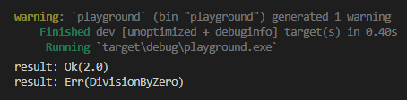
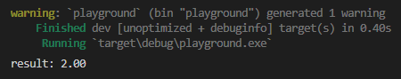
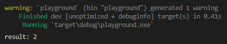

Chapter ini membahas tentang tipe data `Result`, yaitu tipe data yang digunakan untuk menampung nilai yang isinya bisa berupa penanda operasi sukses (`Ok`) dan data, atau error (`Err`) beserta keterangan errornya.

Rust menyediakan panic-level error, tapi penggunaannya untuk menandai operasi error sangat tidak dianjurkan. Selain itu, Rust tidak mengenal konsep *exception*.

Tipe `Result` ini adalah tipe yang paling umum dan direkomendasikan untuk digunakan dalam penanganan error.

> Lebih detailnya mengenai penanganan error dibahas di chapter [Error ➜ Recoverable Error & Error Handling](/basic/recoverable-error-handling)

## A.40.1. Konsep `Result`

Tipe data `Result` adalah enum dengan isi 2 buah enum value:

- `Result::Ok<T>` (atau `Ok<T>`), digunakan untuk menandai bahwa data isinya adalah kabar baik (oke / mantab / jos / sukses).
- `Result::Err<E>` (atau `Err<E>`), digunakan untuk menandai bawah data berisi kabar buruk (error).

> - `T` dan `E` merupakan parameter generic. Lebih jelasnya mengenai generic dibahas pada chapter [Generics](/basic/generics).

Tipe data `Result` memiliki notasi penulisan `Result<T, E>` yang mana `T` digunakan pada enum value `Ok<T>` dan `E` digunakan enum value `Err<E>`.

Cara penerapan tipe data ini bisa dilihat pada kode berikut:

```rust
#[derive(Debug)]
enum MathError {
    DivisionByZero,
    InfinityNumber,
    OtherError,
}

fn main() {
    let result1 = divider(10.0, 5.0);
    println!("result: {:?}", result1);

    let result2: Result<f64, MathError> = divider(10.0, 0.0);
    println!("result: {:?}", result2);
}

fn divider(a: f64, b: f64) -> Result<f64, MathError> {
    if b == 0.0 {
        return Err(MathError::DivisionByZero);
    }

    let result = a / b;
    return Ok(result);
}
```

Fungsi `divider` di atas tugasnya adalah melakukan operasi aritmatika pembagian angka numerik `f64`, parameter `a` dibagi `b`.

Pada fungsi tersebut terdapat pengecekan apabila nilai `b` adalah `0`, maka yang dikembalikan adalah `Err<E>` dengan `E` berisi pesan error, selainnya maka hasil operasi pembagian dikembalikan dibungkus dalam enum value `Ok<f64>`.

Fungsi `divider` nilai baliknya bertipe `Result<f64, MathError>`. Dari tipe data yang digunakan nantinya bisa diprediksi pasti akan ada 2 potensi value:

- Return value adalah enum value `Err<MathError>`, muncul ketika nilai `b` adalah `0`
- Return value adalah nilai hasil numerik yang dibungkus oleh enum value `Ok<f64>`

Output program di atas saat di-run:



## A.40.2. Pattern matching pada tipe `Result`

Dalam penerapannya, ketika ada data bertipe `Result` artinya data tersebut berpotensi untuk berisi nilai `Err<E>` atau `Ok<T>`, pasti antara 2 nilai tersebut.

Umumnya penggunaan tipe `Result` selalu diikuti dengan pattern matching menggunakan keyword `match`. Selain itu keyword `if` sebenarnya juga bisa diterapkan pada pattern matching tipe data ini, namun kurang dianjurkan.

Mari kita praktikkan. Ubah isi fungsi `main` dengan kode berikut:

```rust
let result = divider(10.0, 5.0);
match result {
    Err(m) => println!("ERROR! {:?}", m),
    Ok(r)  => println!("result: {r:.2}"),
}
```



Bisa dilihat pada kode di atas mudahnya pengambilan nilai `m` dari `Err(m)` dan juga `r` dari `Ok(r)`. Penerapan `match` untuk seleksi kondisi biasa disebut dengan **pattern matching** dan teknik ini sangat fleksibel dan advance.

Sebagai contoh, dengan penerapan match yang seperti ini kita bisa meng-handle 5 skenario seleksi kondisi:

```rust
let result = divider(10.0, 5.0);
match result {
    Err(MathError::DivisionByZero) => println!("ERROR! unable to divide number by 0"),
    Err(MathError::InfinityNumber) => println!("ERROR! result is infinity number (∞)"),
    Err(_)                         => println!("ERROR! unknown error"),
    Ok(2.0)                        => println!("the result is 2"),
    Ok(x)                          => println!("result: {x:.2}"),
}
```

- Kondisi ke-1: jika nilai adalah `Err(MathError::DivisionByZero)`, maka munculkan pesan `ERROR! unable to divide number by 0`.
- Kondisi ke-2: jika nilai adalah `Err(MathError::InfinityNumber)`, maka munculkan pesan `ERROR! result is infinity number (∞)`.
- Kondisi ke-3: jika nilai adalah `Err` selain dari `Err(MathError::DivisionByZero)` dan `Err(MathError::InfinityNumber)`, maka munculkan pesan `ERROR! unknown error`.
- Kondisi ke-4: jika nilai adalah `Ok(2.0)`, maka munculkan pesan `the result is 2`.
- Kondisi ke-5: jika nilai adalah `Ok` selain dari `Ok(2.0)`, maka munculkan pesan `result: {x:.2}`.

### ◉ Tips pattern matching

Silakan perhatikan kode yang sudah kita praktikkan berikut ini:

```rust
let result = divider(10.0, 5.0);
match result {
    Err(m) => println!("ERROR! {:?}", m),
    Ok(r)  => println!("result: {r:.2}"),
}
```

Penerapan pattern matching seperti contoh di atas memiliki konsekuensi, yaitu variabel `r` hanya bisa diakses pada block `Ok(r)` saja.

Adakalanya kita butuh untuk mengeluarkan variabel `r` ke luar block. Hal seperti ini mudah untuk dilakukan, dan ada beberapa cara yang bisa dipilih, namun menurut penulis yang paling elegan adalah cara berikut ini:

```rust
fn main() {
    let result: f64 = match divider(10.0, 5.0) {
        Err(m) => {
            println!("ERROR! {:?}", m);
            0.0
        },
        Ok(r) => r,
    };

    println!("result: {:?}", result);
}
```

Statement `divider(10.0, 5.0)` mengembalikan data bertipe `Result<f64, MathError>`. Data tersebut digunakan pada keyword `match` seperti biasa. Namun pada contoh di atas ada yang berbeda, yaitu return value dari statement `match` ditampung ke variabel (`result`).

Isi dari pattern matching `match` sendiri ada dua:

- Ketika block `Err(m)` match, error di-print kemudian nilai `0.0` dijadikan return statement `match`.
- Ketika block `Ok` match, data `r` dijadikan return value statement `match`.

Dengan penerapan pattern matching seperti di atas, maka variabel `result` akan selalu berisi data hasil operasi `divider(10.0, 5.0)`. Dengan pengecualian ketika ada error, pesan errornya dimunculkan kemudian hasil operasi pembagian di-set sebagai `0.0`.

> Lebih jelasnya mengenai pattern matching dibahas pada chapter [Pattern Matching](/basic/pattern-matching)

## A.40.3. Method tipe data `Result`

### ◉ Method `is_ok` & `unwrap`

Isi dari enum value `Ok<T>` bisa diakses tanpa menggunakan keyword `match` dengan cara memanfaatkan method `unwrap` milik `Result<T, E>`. Sebelum mengakses method tersebut sangat dianjurkan untuk mengecek apakah data berisi `Ok<T> atau tidak`, karena jika data adalah `Err<E>` pengaksesan method `unwrap` menghasilkan error.

Pengecekan nilai ok atau tidak bisa dilakukan menggunakan method `is_ok`.

```rust
let result = divider(10.0, 5.0);
if result.is_ok() {
    let number = result.unwrap();
    println!("result: {}", number);
    // result: 2
}
```



### ◉ Method `as_ref`

Method `as_ref` digunakan untuk mengakses reference `T` dan `E` pada `Result<T, E>`. Method ini sering kali dibutuhkan untuk menghindari terjadinya *move semantics* pada owner data bertipe `Result<T, E>`.

Method `as_ref` mengembalikan data dalam tipe `Result<&T, &E>`. Jadi reference yang dipinjam bukan milik `Result`-nya melainkan milik `T` dan `E`.

```rust
let result: Result<f64, MathError> = divider(10.0, 0.0);
let result_borrow: Result<&f64, &MathError> = result.as_ref();
```

> Lebih jelasnya mengenai *move semantics* dibahas pada chapter [Ownership](/basic/ownership#a334-copy-semantics-vs-move-semantics)

### ◉ Method `is_err` & `err`

Method `err` mengembalikan data dalam tipe `Err<E>`. Pada pengaksesan method ini, pastikan untuk mengecek apakah `Result` berisi data error atau ok dengan via method `is_err`. Selain itu, wajib untuk menggunakan method `as_ref` sebelum method `err` agar ownership data `Result` tidak berpindah (*move semantics*).

```rust
let result = divider(10.0, 0.0);
if result.is_err() {
    let err = result.as_ref().err();
    let message = err.unwrap();
    println!("error: {:?}", message);
    // error: DivisionByZero
}
```

### ◉ Method `ok`

Aturan yang sama juga berlaku pada pengaksesan method `ok` yang mengembalikan data `Ok<T>`. Method `as_ref` harus diakses terlebih dahulu sebelum memanggil method `ok` agar tidak terjadi *move semantics*.

```rust
let result = divider(10.0, 5.0);
if result.is_ok() {
    let data = result.as_ref().ok();
    let number = data.unwrap();
    println!("result: {:?}", number);
    // result: 2
}
```

### ◉ Method `unwrap_or_default`

Method `unwrap_or_default` milik `Result<T, E>` mengembalikan nilai `T` ketika data berisi `Ok<T>`, namun jika data berisi `Err<E>` maka yang dikembalikan adalah *default value* dari tipe data `T`.

```rust
let result = divider(10.0, 0.0);
let number = result.unwrap_or_default();
println!("result: {}", number);
// result: 0
```

### ◉ Method `unwrap_or`

Method `unwrap_or` milik `Result<T, E>` mengembalikan nilai `T` ketika data berisi `Ok<T>`, namun jika data ternyata isinya adalah `Err<E>` maka yang dikembalikan adalah argument pemanggilan method tersebut.

```rust
let result = divider(10.0, 0.0);
let number = result.unwrap_or(0.0);
println!("result: {}", number);
// result: 0
```

### ◉ Method `unwrap_or_else`

Method ini mengembalikan nilai `T` ketika data berisi `Ok<T>`, namun jika data isinya adalah `Err<E>` maka yang dikembalikan adalah hasil eksekusi closure yang disisipkan saat memanggil method `unwrap_or_else`. Contoh pengaplikasiannya:

```rust
let result = divider(10.0, 0.0);
let number = result.unwrap_or_else(|_| 0.0);
println!("result: {}", number);
// result: 0
```

Closure harus dalam notasi `FnOnce(E) -> T` yang mana `T` pada konteks ini adalah `f64`.

> Lebih jelasnya mengenai closure dibahas pada chapter [Closures](/basic/closures).

## A.40.4. Operator `?` pada tipe `Result`

Tipe data `Result` bisa digunakan pada operator `?`. Penjelasannya ada di chapter terpisah di [Operator ?](/basic/operator-tanda-tanya).

## A.40.5. Error handling

Tipe data `Result<T, E>` banyak digunakan pada fungsi-fungsi yang disediakan Rust standard library, selain itu tipe tersebut juga akan sering kita gunakan dalam *real life* project.

Tipe ini dimanfaatkan untuk error handling di Rust. Lebih jelasnya mengenai topik tersebut dibahas pada chapter [Error ➜ Recoverable Error & Error Handling](/basic/recoverable-error-handling).

## A.40.6. Tipe `Result<(), E>`

Di atas kita telah mempelajari dan mempraktekan fungsi `divider()` yang fungsi tersebut mengembalikan 2 informasi, yaitu:

- `T` berisi nilai hasil pembagian
- `E` berisi error saat operasi pembagian

Bentuk lain penerapan tipe data `Result` adalah dengan menggunakan notasi `Result<T, E>` dengan `T` diisi tipe data `()`. Tipe ini cukup sering digunakan pada fungsi yang memiliki potensi error tapi kita hanya butuh informasi errornya saja tanpa nilai balik lainnya.

Sebagai contoh, pada kode berikut dibuat fungsi baru bernama `divide_and_print()`. Dalam fungsi tersebut, operasi pembagian dilakukan. Jika sukses, nilainya langsung di-print; jika error, nilai errornya dikembalikan. Dari sini terlihat bahwa kita tidak membutuhkan fungsi tersebut untuk mengembalikan informasi selain error.

```rust
fn divide_and_print(a: f64, b: f64) -> Result<(), MathError> {
    let res = divider(a, b);
    match res {
        Err(m) => {
            println!("ERROR! {:?}", m);
            Err(m)
        },
        Ok(n) => {
            println!("result: {}", n);
            Ok(())
        },
    }
}

fn main() {
    let result = divide_and_print(10.0, 1.0);
}
```

Pada pemanggilan fungsi `Ok()` gunakan nilai `()` untuk memenuhi kriteria tipe data `Result<(), MathError>`.

## A.40.7. Tipe `Result<T>`

Notasi tipe data `Result` bawaan Rust Standard Library adalah `Result<T, E>`. Namun, pada pengembangan software yang melibatkan banyak sekali library/dependency, adakalanya pembaca akan menemui notasi tipe data `Result<T>`. Notasi tersebut dibuat oleh pengembang library/dependency untuk memperingkas tipe `Result<T, SomeErrorType>`. Jadi tidak usah bingung.

---

## Catatan chapter 📑

### ◉ Source code praktik

<pre>
    <a href="https://github.com/novalagung/dasarpemrogramanrust-example/tree/master/result_type">
        github.com/novalagung/dasarpemrogramanrust-example/../result_type
    </a>
</pre>

### ◉ Chapter relevan lainnya

- [Generics](/basic/generics)
- [Pattern Matching](/basic/pattern-matching)
- [Closures](/basic/closures)
- [Operator ?](/basic/operator-tanda-tanya)
- [Error ➜ Recoverable Error & Error Handling](/basic/recoverable-error-handling)

### ◉ Referensi

- https://doc.rust-lang.org/book/ch18-03-pattern-syntax.html
- https://doc.rust-lang.org/std/result/index.html
