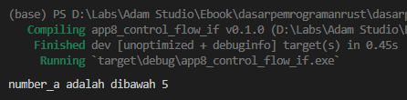
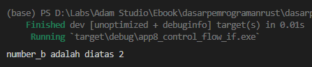
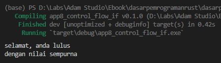
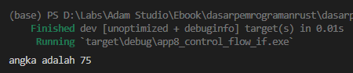

Pada chapter ini kita akan bahas tentang penerapan `if` untuk kontrol alur program.

Seleksi kondisi sendiri merupakan teknik untuk grouping blok kode yang eksekusinya tergantung hasil ekspresi seleksi kondisi.  Analoginya mirip seperti fungsi rambu lalu lintas di jalan raya. Kapan kendaraan diperbolehkan melaju dan kapan harus berhenti diatur oleh rambu tersebut. Seleksi kondisi pada program juga kurang lebih sama, kapan sebuah blok kode akan dieksekusi dikontrol.

## A.9.1. Keyword `if`

`if` adalah salah satu keyword untuk seleksi kondisi di Rust, penggunaannya sangat mudah, yaitu dengan cukup tulis keyword tersebut diikuti dengan data boolean (atau ekspresi logika yang hasilnya boolean), lalu diikuti blok kode. Notasi penulisan `if` seperti berikut.

```rust
if operasiLogika {
    // blok kode
}
```

Pada notasi di atas, `operasiLogika` bisa diisi dengan variabel yang bertipe `bool`, atau statement ekspresi perbandingan seperti `a == b`. Lebih jelasnya sekarang silakan perhatikan dan coba kode berikut.

```rust
let number_a = 3;
if number_a < 5 {
    println!("number_a adalah dibawah 5");
}

let result_a = number_a >= 5;
if result_a {
    println!("result_a adalah di atas atau sama dengan 5");
}
```



Pada kode di atas ada dua buah blok kode `if`. Yang pertama mengecek hasil ekspresi logika `apakah variabel number_a dibawah 5?`. Jika hasilnya benar atau `true` maka blok kode setelahnya yang diapit tanda kurung kurawal akan dieksekusi, hasilnya menampilkan tulisan `angka adalah dibawah 5`.

Blok kode `if` kedua adalah mengecek nilai `bool` variabel `result_a`. Variabel `result_a` sendiri isinya berasal dari ekspresi logika `apakah variabel number_a lebih besar atau sama dengan 5?`. Jika hasilnya `true` maka blok kode setelahnya (yang diapit tanda kurung kurawal) dieksekusi. Namun, pada contoh di atas, hasilnya adalah `false`, karena variabel `number_a` nilainya adalah tidak lebih besar atau sama dengan 5, dengan demikian blok kode tidak dieksekusi.

## A.9.2. Keyword `if`, `else if`, dan `else`

Jika seleksi kondisi lebih dari satu, gunakan `if` dan `else if` dan/atau `else`.

```rust
let number_b = 3;
if number_b == 2 {
    println!("number_b adalah 2");
} else if number_b < 2 {
    println!("number_b adalah dibawah 2");
} else {
    println!("number_b adalah di atas 2");
}
```

Pada contoh di atas, `number_b` yang nilainya `2` match dengan statement seleksi kondisi `number_b == 2`, maka statement dalam blok kode tersebut dieksekusi, text `number_b adalah 2` muncul.



Silakan bermain dengan nilai variabel `number_b` untuk coba-coba.

## A.9.3. Nested `if`

Sebuah blok kode `if` bisa saja berada didalam sebuah `if`, dan seperti ini umum terjadi di bahasa pemrograman. Di Rust penerapan nested `if` sama seperti pada bahasa lainnya, yaitu dengan langsung tuliskan saja blok kode `if` ke dalam blok kode `if`. Contoh:

```rust
let number_c = 10;
if number_c > 6 {
    println!("selamat, anda lulus");

    if number_c == 10 {
        println!("dengan nilai sempurna");
    } else if number_c > 7 {
        println!("dengan nilai baik");
    } else {
        println!("dengan nilai cukup");
    }
} else {
    println!("anda tidak lulus");

    if number_c < 4 {
        println!("belajar lagi ya");
    } else {
        println!("jangan malas belajar!");
    }
}
```



## A.9.4. Returning From `if`

*Returning from `if`* adalah salah satu cara unik penerapan `if`. Yang biasanya `if` digunakan untuk eksekusi statements dengan kondisi tertentu, pada case ini statement yang ada pada blok kode if ditampung sebagai *return value* atau nilai balik. Teknik ini mirip seperti operasi *ternary* hanya saja jumlah kondisinya bisa sebanyak yang kita inginkan.

Agar lebih jelas, silakan pelajari dulu kode berikut.

```rust
let number_d = 3;
let result_d: bool;

if number_d == 2 {
    result_d = true
} else {
    result_d = false
}

println!("result_d adalah {result_d}");
```

Blok seleksi kondisi pada contoh di atas menjadi penentu nilai variabel `result_d`. Dengan kebutuhan tersebut, kita bisa juga memanfaatkan `let if` untuk mendapatkan hasil yang ekuivalen.

Kode di atas jika dirubah ke bentuk `let if` hasilnya menjadi seperti ini:

```rust
let number_d = 3;
let result_d = if number_d == 2 {
    true
} else {
    false
};
println!("result_d adalah {result_d}");
```

Penulisannya cukup unik. Blok kode seleksi kondisi di tuliskan sebagai value dari statement `let result_d`. Dan isi blok kode nantinya akan menjadi value untuk variabel `result_d`, tergantung kondisi mana yang match.

Pada contoh di atas, karena `number_d` nilainya 3, maka `result_d` bernilai false. Blok kode `else` adalah yang dieksekusi.


> Dalam penggunakan kombinasi keyword `let` dan `if`, pastikan di akhir blok kode seleksi kondisi dituliskan tanda `;`.

O iya, beberapa orang lebih memilih memanfaatkan indentasi untuk mempermudah memahami statement `let if`. Contohnya seperti ini:

```rust
let number_d = 3;
let result_d = 
    if number_d == 2 {
        true
    } else {
        false
    };
println!("result_d adalah {result_d}");
```

## A.9.5. Kombinasi Keyword `let` dan `if`, Dengan Tipe Data Eksplisit

Ada situasi dimana dalam pemanfaatan `let if` kita perlu men-specify secara eksplisit tipe data variabel penampung. Caranya sama seperti statement deklarasi variabel beserta tipe data, langsung tulis saja tipe data yang diinginkan setelah nama variabel dan sebelum operator `=`.

Pada contoh berikut, variabel `result_e` saya definisikan tipenya adalah `string literal &str`.

```rust
let number_e = 3;
let result_e: &str = if number_e == 2 {
    "angka adalah 2"
} else if number_e < 2 {
    "angka adalah dibawah 2"
} else {
    "angka adalah di atas 2"
};
println!("angka adalah {result_e}");
```

Contoh lain:

```rust
let max = 100.0;
let string_f = "nilai minimum kelulusan";
let result_f: f64 = if string_f == "nilai maksimum kelulusan" {
    max
} else {
    max * 3.0 / 4.0
};
println!("angka adalah {result_f}");
```



## A.9.6. Keyword `if let`

Keyword `if let` berbeda dengan kombinasi `let` dan  `if`. Kita akan bahas topik ini secara terpisah pada chapter [Pattern Matching](/basic/pattern-matching).

---

## Catatan chapter 📑

### ◉ Source code praktik

<pre>
    <a href="https://github.com/novalagung/dasarpemrogramanrust-example/tree/master/seleksi_kondisi_if">
        github.com/novalagung/dasarpemrogramanrust-example/../seleksi_kondisi_if
    </a>
</pre>

### ◉ Referensi

- https://doc.rust-lang.org/book/ch03-05-control-flow.html
- https://doc.rust-lang.org/std/keyword.if.html
- https://doc.rust-lang.org/std/keyword.else.html
- https://doc.rust-lang.org/rust-by-example/flow_control/if_else.html

---
