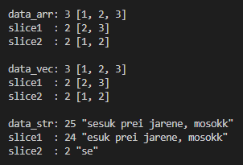
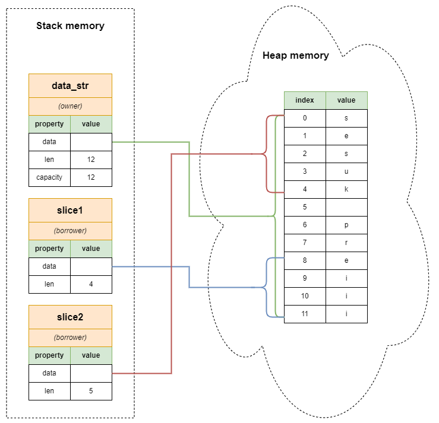
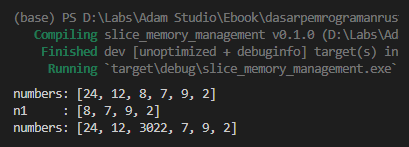

Kita telah mempelajari tipe data [Array](/basic/array) dan [Vector](/basic/vector), serta sudah beberapa kali menggunakan tipe data string slice (`String`). 3 tipe data itu memiliki kemiripan, yaitu kesemuanya termasuk dalam kategori tipe data slice.

> Ciri khas dari tipe data yang termasuk dalam kategori slice adalah jika diakses reference-nya menghasilkan data bertipe `&[T]` dimana `T` adalah tipe data elemen.

Pada chapter ini, kita akan bahas lebih dalam lagi tentang apa itu slice terutama bagian memory management-nya.

> Perbedaan chapter ini dengan chapter ini dengan chapter [Slice (Basic)](/basic/slice) adalah di sini fokusnya lebih banyak di memory management.

## A.43.1. Konsep slice

Slice adalah representasi *block of memory* berbentuk pointer dan memiliki size yang dinamis, dengan isi adalah koleksi element data. Slice merupakan reference atau data pinjaman (borrow).

Pada program berikut, beberapa variabel dideklarasikan menggunakan tiga tipe data di atas, kemudian masing-masing data dipinjam kemudian di-print.

```rust
let data_arr = [1, 2, 3];
println!("data_arr: {} {:?}", data_arr.len(), data_arr);
let slice1 = &data_arr[1..];
println!("slice1  : {} {:?}", slice1.len(), slice1);
let slice2 = &data_arr[..2];
println!("slice2  : {} {:?}", slice2.len(), slice2);

let data_vec = vec![1, 2, 3];
println!("data_vec: {} {:?}", data_vec.len(), data_vec);
let slice1 = &data_vec[1..];
println!("slice1  : {} {:?}", slice1.len(), slice1);
let slice2 = &data_vec[..2];
println!("slice2  : {} {:?}", slice2.len(), slice2);

let data_str = String::from("sesuk prei jarene, mosokk");
println!("data_str: {} {:?}", data_str.len(), data_str);
let slice1 = &data_str[1..];
println!("slice1  : {} {:?}", slice1.len(), slice1);
let slice2 = &data_str[..2];
println!("slice2  : {} {:?}", slice2.len(), slice2);
```



Terlihat kemiripan-nya, slice bisa terbentuk dari ketiga jenis data di atas.

Penulis ingatkan lagi, bahwa slice adalah tipe data reference yang berarti isi adalah data pinjaman (borrow). Tipe data slice selalu `&[T]` dimana `T` adalah tipe data element.

Karena slice adalah data borrow, maka operasi standar borrowing termasuk mutable borrowing bisa dilakukan di slice.

## A.43.2. Memory management pada slice

Sekarang lanjut ke pembahasan tentang bagaimana data bertipe slice di manage di-memory. Sebagai bahan belajar, kita perlu memilih satu dari 3 tipe data slice yang ada. Bebas sebenarnya mau pilih yang mana. Penulis memilih `String` untuk memulai pembahasan.

Silakan perhatikan statement sederhana berikut:

```rust
let data_str = String::from("sesuk preiii");
```

Ada sebuah data `String` dideklarasikan, value-nya adalah `sesuk preiii`, dan owner-nya adalah variabel `data_str`. Data variabel `data_str` disimpan di memory pada 2 tempat, yaitu **heap** dan **stack**.

Selanjutnya, 2 buah slice tercipta hasil operasi slicing pada variabel `data_str`.

```rust
let data_str = String::from("sesuk preiii"); // "sesuk preiii"
let slice1 = &data_str[8..];                 // "eiii"
let slice2 = &data_str[..5];                 // "sesuk"
```

Slice adalah data borrow, artinya jika ada beberapa variabel baru dibuat hasil dari operasi slicing, maka isi variabel tersebut merupakan reference yang mengarah ke data sebenarnya. Di heap memory tidak ada perubahan, namun di stack memory ada beberapa data baru. Lebih jelasnya silakan perhatikan ilustrasi berikut.



Sekarang di stack memory ada 3 buah metadata informasi disimpan, yaitu `data_str` (yang merupakan owner sebenarnya data), dan `slice1` & `slice2`. Sedangkan untuk data-nya sendiri tetap berada di heap memory tanpa ada perubahan.

Tiga variabel di atas kesemuanya mengakses reference yang sama, yang membedakan adalah elemen-nya saja. Owner (yaitu `data_str`) bisa mengakses seluruh data, selain itu juga tau informasi kapasitas data. Sedangkan borrower hanya bisa mengakses data yang dia pinjam sesuai dengan operasi slicing-nya. Borrower tidak mengetahui kapasitas data, namun ia tau size dari elemen yang ia pinjam.

## A.43.2. Mutable slice

Bagaimana dengan *mutability* pada slice, apa yang terjadi di belakang layar ketika elemen slice nilainya diubah?

Ok, mari kita bahas dengan contoh. Pada kode berikut ada sebuah data mutable array bertipe `[i32; 6]` dengan owner bernama `numbers`. Dari variabel tersebut, dilakukan operasi mutable borrowing untuk disimpan pada variabel `n1`.

```rust
let mut numbers = [24, 12, 8, 7, 9, 2];
println!("numbers: {:?}", numbers);
let n1 = &mut numbers[2..];
println!("n1     : {:?}", n1);
n1[0] = 3022;
println!("numbers: {:?}", numbers);
```



Salah satu elemen `n1` diubah nilainya, maka efeknya juga berpengaruh pada owner. Ketika variabel `numbers` di-print, element indeks `2` berubah nilainya dari yang sebelumnya `8` sekarang `3022`.

Visualisasi memory management-nya kurang lebih seperti ini:


Variabel `numbers` dan `n1` sama-sama mengarah ke reference yang sama. Itulah kenapa perubahan data pada peminjam membawa efek ke owner.

---

## Catatan chapter 📑

### ◉ Source code praktik

<pre>
    <a href="https://github.com/novalagung/dasarpemrogramanrust-example/tree/master/slice_memory_management">
        github.com/novalagung/dasarpemrogramanrust-example/../slice_memory_management
    </a>
</pre>

### ◉ Chapter relevan lainnya

- [Array](/basic/array)
- [Slice (Basic)](/basic/slice)
- [Vector](/basic/vector)
- [Basic Memory Management](/basic/basic-memory-management)
- [Tipe Data → String Custom Type](/basic/tipe-data-custom-type-string-slice)
- [String Literal (&str) vs. String Custom Type](/basic/string-slice-vs-string-literal)

### ◉ Referensi

- https://doc.rust-lang.org/book/ch04-03-slices.html
- https://users.rust-lang.org/t/why-rust-slice-has-not-ownership/27356
