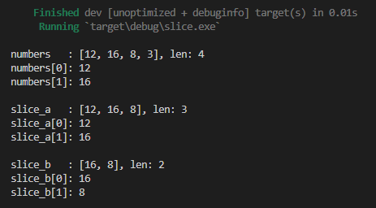
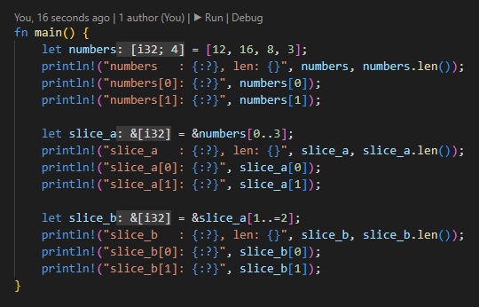
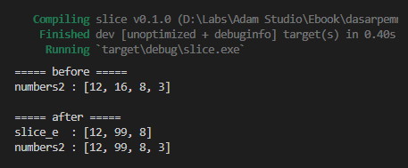
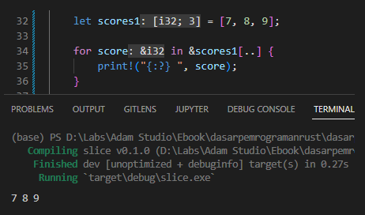

Pada bab ini kita belajar tentang apa itu slice, apa perbedaan slice dan array, *slicing* atau *borrowing* pada slice, dan juga slice mutability.

> Pada chapter ini kita akan bahas slice secara garis besar saja, tanpa menyinggung masalah memory management.
>
> Pembahasan lebih dalam perihal slice ada pada chapter terpisah ([Memory Management → Slice](/basic/slice-memory-management)), setelah kita mempelajari dasar-dasar memory management nantinya.

## A.14.1. Tipe data slice

Array adalah tipe data kolektif yang isinya bertipe sejenis. Contohnya `["a", "b", "c"]` adalah sebuah array dengan elemen bertipe string dan array tersebut memiliki size `3`.

Lalu apa itu slice? menurut laman dokumentasi Rust, slice adalah:

> A slice is a dynamically sized type representing a 'view' into a sequence of elements of type T. The slice type is written as [T]
>
> A dynamically-sized view into a contiguous sequence, [T]. Contiguous here means that elements are laid out so that every element is the same distance from its neighbors.
>
> Slices are a view into a block of memory represented as a pointer and a size.

Slice adalah representasi *block of memory* berbentuk pointer dan memiliki size yang dinamis (tidak fixed seperti array). Notasi tipe data slice adalah `&[T]` dimana `T` adalah tipe data element.

Slice bisa dibuat dari data array (atau dari tipe kolektif data lainnya) dengan menggunakan kombinasi operator `&` dan *range syntax* `..` dengan notasi penulisan seperti berikut:

```rust
let sliced_value1 = &data[start_index..end_index]
let sliced_value2 = &data[start_index..=end_index]
let sliced_value3 = &data[start_index..end_index]
...
```

> Slice juga bisa dibuat dari tipe data vector. Lebih jelasnya dibahas pada chapter [Vector](/basic/vector).

Silakan perhatikan contoh berikut dan praktikkan:

```rust
let numbers = [12, 16, 8, 3];
println!("numbers   : {:?}, len: {}", numbers, numbers.len());
println!("numbers[0]: {:?}", numbers[0]);
println!("numbers[1]: {:?}", numbers[1]);

let slice_a = &numbers[0..3];
println!("slice_a   : {:?}, len: {}", slice_a, slice_a.len());
println!("slice_a[0]: {:?}", slice_a[0]);
println!("slice_a[1]: {:?}", slice_a[1]);

let slice_b = &slice_a[1..=2];
println!("slice_b   : {:?}, len: {}", slice_b, slice_b.len());
println!("slice_b[0]: {:?}", slice_b[0]);
println!("slice_b[1]: {:?}", slice_b[1]);
```



Pada contoh di atas, variabel `numbers` didefinisikan bertipe `[i32; 4]`. Data pada variabel tersebut kemudian dipinjam ditampung pada variabel baru beranama `slice_a` yang merupakan slice bertipe `&[i32]`, dengan isi adalah element array `numbers` indeks ke `0` hingga sebelum `3` (yang berarti index ke-`2`). Dengan ini maka `slice_a` nilainya adalah `[12, 16, 8]` dengan size `3`.

Bisa dilihat pada statement print `slice_a[0]` dan `slice_a[1]`, nilai elemennya sesuai dengan dengan hasil peminjaman data array `numbers`.

> Data yang tipenya `&[T]` biasa disebut sebagai [*shared slice*](https://doc.rust-lang.org/reference/types/slice.html) atau cukup *slice*. Contohnya seperti `slice_a` dengan tipe data `&[i32]`.

Slice `slice_a` bukan merupakan pemilik sebenarnya data `[12, 16, 8]`, slice tersebut hanya meminjam datanya dari `numbers` yang notabene dalah owner data `[12, 16, 8]`.

Meminjam di sini artinya variabel baru `slice_a` memiliki data yang sama, dan alamat memori (atau pointer) data tersebut juga sama yaitu mengarah ke owner sebenarnya, yang pada contoh ini adalah `numbers`.

> Di Rust, proses meminjam data secara umum disebut dengan **borrowing**. Variabel atau data hasil dari borrowing biasa disebut dengan **reference**. Lebih jelasnya akan dibahas pada chapter [Pointer & References](/basic/pointer-references) dan [Borrowing](/basic/borrowing).
>
> Variabel pemilik data yang sebenarnya disebut dengan **owner**. Lebih jelasnya mengenai ownership dibahas pada chapter [Ownership](/basic/ownership)
>
> Dalam konteks slice, proses meminjam data (yg menggunakan teknik borrowing dan range syntax) disebut dengan **slicing**.

Dengan menggunakan VSCode `rust-analyzer` kita bisa melihat dengan mudah tipe sebuah slice.



Kembali ke pembahasan pada contoh di atas. Selain `slice_a`, ada juga slice `slice_b` yang isinya merupakan data pinjaman dari `slice_a`. Statement `&slice_a[1..=2]` artinya adalah *borrowing* slice `slice_a` mulai dari indeks ke-`1` hingga `2`. Dengan ini indeks ke-1 milik `slice_a` menjadi indeks ke-0 milik `slice_b`, ... dan seterusnya. Hasilnya, nilai `slice_b` adalah `[16, 8]` dengan size `2`.

Silakan juga cek penjelasan tambahan berikut, agar semakin paham tentang slice.

```rust
let numbers = [12, 16, 8, 3];
// variabel numbers isinya array [12, 16, 8, 3]

let slice_a = &numbers[0..3];
// meminjam data milik numbers elemen ke-0 hingga sebelum 3 (yaitu 2)
// hasilnya adalah [12, 16, 8]

let slice_b = &slice_a[1..=2];
// meminjam data milik slice_a elemen ke-1 hingga 2
// hasilnya adalah [16, 8]
```

## A.14.2. Size slice

Gunakan method `len` untuk mencari tau size dari slice.

```rust
let numbers = [12, 16, 8, 3];
println!("{}", numbers.len());
// output: 4

let slice_a = &numbers[0..3];
println!("{}", slice_a.len());
// output: 3

let slice_b = &slice_a[1..=2];
println!("{}", slice_b.len());
// output: 2
```

## A.14.3. Slice *range syntax*

Di bawah ini adalah range syntax yang bisa digunakan untuk slicing. Variabel `data` pada contoh berikut dijadikan sebagai bahan slicing.

```rust
let data = ["a", "b", "c", "d"];
```

- Notasi `&data[start_index..end_index]` untuk slicing data dari `start_index` hingga sebelum `end_index`

    ```rust
    let sliced_data = &data[1..3];
    println!("{:?}", sliced_data);
    // output => ["b", "c"]
    ```

- Notasi `&data[start_index..=end_index]` untuk slicing data dari `start_index` hingga `end_index`

    ```rust
    let sliced_data = &data[1..=3];
    println!("{:?}", sliced_data);
    // output => ["b", "c", "d"]
    ```

- Notasi `&data[..end_index]` untuk slicing data dari 0 hingga sebelum `end_index`

    ```rust
    let sliced_data = &data[..3];
    println!("{:?}", sliced_data);
    // output => ["a", "b", "c"]
    ```

- Notasi `&data[..=end_index]` untuk slicing data dari 0 hingga `end_index`

    ```rust
    let sliced_data = &data[..=2];
    println!("{:?}", sliced_data);
    // output => ["a", "b", "c"]
    ```

- Notasi `&data[start_index..]` untuk slicing data dari `start_index` hingga indeks terakhir

    ```rust
    let sliced_data = &data[1..];
    println!("{:?}", sliced_data);
    // output => ["b", "c", "d"]
    ```

- Notasi `&data[..]` untuk slicing semua elemen yang ada

    ```rust
    let sliced_data = &data[..];
    println!("{:?}", sliced_data);
    // output => ["A", "b", "c", "d"]
    ```

> Perihal apa itu borrowing dan kegunaan dari operator `&` yang ditulis di awal variabel dibahas lebih detail pada chapter [Pointer & References](/basic/pointer-references).

## A.14.4. Mutability pada slice

Ada dua jenis data hasil operasi *borrowing* (atau biasa disebut dengan data *reference*).

- Read only atau shared reference, operator yang digunakan adalah `&`.
- Mutable reference, operator yang digunakan adalah `&mut`.

Kita akan bahas garis besarnya saja pada chapter ini. Intinya, shared reference adalah data hasil peminjaman/borrowing yang hanya bisa dibaca. Sedangkan mutable reference adalah data hasil borrowing yang bisa diubah nilainya, yang jika ini dilakukan maka akan mengubah juga data pemilik sebenarnya.

Contoh berikut adalah salah satu penerapan `&mut`. Variabel slice `numbers2` dipinjam beberapa elemennya dengan operator `&mut` ke variabel baru bernama `slice_e`. Dengan operator tersebut maka borrowing menghasilkan data *mutable reference*, data yang nilainya diperbolehkan untuk diubah meskipun data pinjaman.

```rust
let mut numbers2 = [12, 16, 8, 3];
println!("===== before =====");
println!("numbers2 : {:?}", numbers2);

let slice_e = &mut numbers2[..=2];
slice_e[1] = 99;

println!("===== after =====");
println!("slice_e  : {:?}", slice_e);
println!("numbers2 : {:?}", numbers2);
```



Bisa dilihat, indeks ke-1 `slice_e` diubah nilainya yang sebelumnya adalah `16` menjadi `99`. Setelah itu di-print, di output nilai variabel `numbers2` juga ikut berubah. Hal ini karena perubahan data pada variabel mutable reference juga punya pengaruh ke variabel pemilik data sebenarnya (yaitu `numbers2`).

O iya, penggunaan operator `&mut` mengharuskan kita untuk tidak menuliskan keyword `mut` pada variabel yang menampung nilai borrowing.

```rust
// statement yang direkomendasikan
let slice_e = &mut numbers2[..=2];

// statement yang TIDAK DIREKOMENDASIKAN dan akan memunculkan warning.
let mut slice_e = &mut numbers2[..=2];
```

## A.14.5. Perulangan `for in` pada slice

Slice merupakan tipe data yang implement trait Iterator (seperti array), dan semua data yang memiliki trait tersebut bisa digunakan pada perulangan. Slice `&[T]` jika dipergunakan dalam `for in`, tipe data penampung iterasi perulangan adalah `&T`, bukan `T` yaa jadi jangan sampai keliru.

```rust
let scores1 = [7, 8, 9];

for score in &scores1[..] {
    print!("{:?} ", score);
}
```



> Sangat dianjurkan menggunakan `rust-analyzer` jika menggunakan VSCode, agar lebih mudah melihat tipe data variabel dan informasi penting lainnya yang berguna dalam proses coding atau development.
>
> - Lebih jelasnya mengenai traits dibahas pada chapter [Traits](/basic/traits)
> - Lebih jelasnya mengenai trait `Iterator` dibahas pada chapter [Trait → Iterator](/wip/trait-iterator)

## A.14.6. Perulangan `for in` pada mutable slice

Sama seperti penggunaan `for in` pada shared slice, pada contoh kasus mutable slice perbedaannya hanyalah pada tipe data penampung iterasi yaitu `&mut T`, bukan `&T`.

Pada contoh berikut kita coba eksperimen mengubah nilai elemen sebuah mutable slice yang data aslinya juga hasil dari peminjaman mutable slice.

```rust
let mut scores2 = [7, 8, 9];
println!("(before) scores2 : {:?}", scores2);

let slice_f = &mut scores2[..];

for score in &mut slice_f[..] {
    *score += 1;
}

println!("(after)  scores2 : {:?}", scores2);
```

Variabel `scores` dipinjam menggunakan `&mut` ke variabel baru bernama `slice_f`. Kemudian `slice_f` dipinjam juga sebagai mutable slice pada perulangan `for in`.

Setelah di-increment nilainya menggunakan `*score += 1` bisa dilihat hasil akhirnya juga mengubah nilai variabel `scores2` yang merupakan *owner* atau pemilik data sebenarnya.


Operasi increment pada `score` tidak bisa dituliskan dalam bentuk `score += 1` karena tipe data score adalah pointer mutable reference (ditandai dengan adanya `&mut`), untuk increment nilainya perlu di-*dereference* terlebih dahulu menggunakan operator `*`. Lebih jelasnya kita bahas pada chapter [Pointer & References](/basic/pointer-references).

## A.14.7. Append slice

Slice by default tidak mendukung operasi append. Sebenarnya bisa saja dilakukan tapi agak panjang caranya (silakan cari referensinya di Google untuk ini).

Perlu diketahui, jika kebutuhannya adalah untuk menampung jenis data yang size-nya bisa bertamah, penulis anjurkan untuk menggunakan [Vector](/basic/vector) yang beberapa bab lagi akan kita bahas.

## A.14.8. Memory management pada slice

Nantinya setelah selesai dengan pembahasan dasar memory management di Rust, kita akan bahas lagi topik slice tapi dari sudut pandang memory management pada chapter [Memory Management → Slice](/basic/slice-memory-management).

## A.14.9. Summary

Catatan ringkas perihal slice:

- Slice memiliki notasi `&[T]`
  - `&` disitu artinya adalah operasi borrowing/peminjaman
  - `T` adalah tipe data tiap elemen
- Slice bisa terbentuk dari hasil meminjam data array, vector, atau tipe data kolektif lainnya
- Data slice adalah selalu data pinjaman
- Slice memiliki lebar/size
- Slicing adalah cara pengaksesan slice menggunakan *range syntax*
- Slice bisa immutable, bisa juga mutable (menggunakan `&mut`)

---

## Catatan chapter 📑

### ◉ Source code praktik

<pre>
    <a href="https://github.com/novalagung/dasarpemrogramanrust-example/tree/master/slice">
        github.com/novalagung/dasarpemrogramanrust-example/../slice
    </a>
</pre>

### ◉ Referensi

- https://doc.rust-lang.org/book/ch04-03-slices.html#the-slice-type
- https://doc.rust-lang.org/std/primitive.slice.html
- https://doc.rust-lang.org/std/iter/trait.Iterator.html
- https://doc.rust-lang.org/reference/types/slice.html
- https://doc.rust-lang.org/nomicon/references.html
- https://doc.rust-lang.org/rust-by-example/primitives/array.html

---
