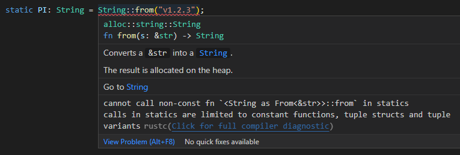

Pada chapter ini kita akan bahas tentang apa itu static item, dan perbedaanya dibanding konstanta.

Namun sebelum masuk ke inti pembahasan, mari kita sedikit belajar tentang apa itu *lifetime* dalam Rust programming.

## A.41.1. Sekilas tentang *lifetime*

Di Rust ada yang disebut dengan **lifetime**. Lifetime merupakan sebuah identifier yang digunakan compiler untuk memantau berapa lama reference valid.

Di balik layar, Rust compiler (lebih tepatnya Rust borrow checker) menggunakan sebuah anotasi dalam penerapan lifetime. Penulisan anotasinya diawali tanda petik satu `'`, contohnya `'a`, `'b`, dan `'c`.

Untuk sekarang, silakan dipahami bahwa sebuah syntax yang diawali dengan tanda `'` (contohnya seperti `'a`) adalah lifetime.

> Pembahasan detail mengenai lifetime dibahas pada chapter selanjutnya, yaitu [Lifetime](/basic/lifetime).

## A.41.2. Static item

Ok, sekarang kembali ke topik utama, yaitu static. Static adalah item yang mirip dengan [Konstanta](/basic/konstanta), tapi memiliki perbedaan yaitu alamat memory yang dialokasikan untuk menampung data static item adalah fix/jelas. Semua reference terhadap static item mengarah ke alamat memory yang sama.

Dengan karakteristik yang seperti itu, static tepat diterapkan pada data yang sifatnya shared atau bisa diakses secara global.

Ada dua cara membuat static item:

- Menggunakan keyword `static` pada pendefinisian konstanta
- Menggunakan lifetime `'static` pada tipe data string literal (`&str`)

## A.41.3. Keyword `static`

Ok, kita terapkan cara pertama, penerapan keyword `static` untuk pembuatan konstanta.

Pada deklarasi konstanta static, harus ditulis juga tipe datanya secara eksplisit.

```rust
static PI: f64 = 3.14;

fn main() {
    println!("PI: {:?}", PI);
}
```

Cukup mudah bukan?

> Konstanta static bisa saja didefinisikan mutable, tetapi dengan konsekuensi item tersebut akan menjadi *unsafe*.
>
> Lebih jelasnya mengenai topik ini akan dibahas nantinya pada chapter terpisah, yaitu [Safe & Unsafe](#/wip/safe-unsafe).

Ok, sekarang kita coba terapkan keyword static pada tipe lainnya, contohnya `String`.



Hmm, malah error.

Perlu diketahui bahwa keyword `static` bisa digunakan pada semua tipe data primitif. Selain itu bisa juga diterapkan dalam *constants function* (yang nantinya dibahas pada chapter [Constant Evaluation](#/wip/constant-evaluation)), [Tuple Struct](/basic/struct#a247-tuple-struct), dan juga variant [Tuple](/basic/tuple) lainnya, tetapi tidak bisa digunakan untuk custom type seperti `String`.

Lalu bagaimana jika ada kebutuhan membuat konstanta bertipe string? Solusinya dengan menggunakan tipe data `&'static str` yang sebentar lagi akan kita bahas.

## A.41.4. Lifetime `'static`

Lifetime `'static` digunakan untuk deklarasi reference sebagai static item. Data yang memiliki lifetime ini tidak akan pernah di-dealokasi kecuali eksekusi program selesai.

> Karena alasan di atas, ada baiknya data dengan lifetime static dideklarasikan secara global.
>
> Dimisalkan ada variabel dengan lifetime ini dideklarasikan dalam suatu block, variabel tersebut tidak akan di-dealokasi meskipun eksekusi block selesai nantinya.

Lifetime ini biasa dikombinasikan dengan tipe data pointer, contohnya seperti `&str` jika dikombinasikan dengan lifetime `'static` jadinya adalah `&'static str`.

```rust
const VERSION: &'static str = "v1.2.3";
```

Sebelumnya telah dijelaskan bahwa custom type `String` tidak bisa digunakan untuk menyimpan data string sebagai static item, dan cara di atas ini adalah solusinya.

Penulisannya agak kurang friendly memang (`&'static str`), namun kabar baiknya semenjak Rust versi 1.17 rilis di tahun 2017, by default semua item yang dideklarasikan menggunakan keyword `static` ataupun `const` otomatis memiliki `'static lifetime`. Jadi sekarang cukup tulis saja:

```rust
const VERSION: &str = "v1.2.3";
```

```rust
const VERSION: &'static str = "v1.2.3";
```

## A.41.5. Static item data literal

Pada chapter [Borrowing](/basic/borrowing#a347-owner-dan-borrower-data-literal) sempat kita bahas sedikit tentang siapa owner dan borrower data literal.

Tipe `&str` adalah salah satu tipe data yang tidak memiliki owner (atau boleh disimpulkan owner-nya adalah program). Pada variabel yang bertipe ini, yang ia tampung adalah data pinjaman, jadi variabel tersebut bukan owner. Contohnya pada kode berikut konstanta `VERSION` dan `BUILD_COUNTER` di atas adalah borrower.

```rust
const VERSION: &str = "v1.2.3";
const BUILD_COUNTER: &i32 = &15;
```

Yang penting untuk diperhatikan bukan siapa owner-nya, tapi bagaimana kita memastikan data pinjaman tersebut tidak di-dealokasi. Inilah kenapa lifetime `'static` dan/atau keyword `static` & `const` dipergunakan. Dengan adanya lifetime tersebut, data borrow tidak akan pernah di-dealokasi.

---

## Catatan chapter 📑

### ◉ Source code praktik

<pre>
    <a href="https://github.com/novalagung/dasarpemrogramanrust-example/tree/master/static_example">
        github.com/novalagung/dasarpemrogramanrust-example/../static_example
    </a>
</pre>

### ◉ Referensi

- https://doc.rust-lang.org/reference/items/static-items.html
- https://doc.rust-lang.org/beta/rust-by-example/custom_types/constants.html
- https://doc.rust-lang.org/rust-by-example/scope/lifetime/static_lifetime.html
- https://stackoverflow.com/questions/49684657/what-is-the-difference-between-str-and-static-str-in-a-static-or-const

---

import Substack from '@site/src/components/Substack';

<Substack />
