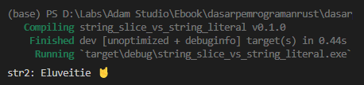
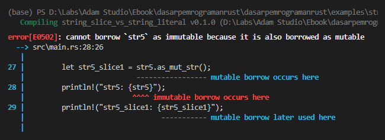

Pada chapter sebelumnya kita telah membahas tentang bagaimana data slice di-manage di memory. Ada beberapa tipe data yang masuk dalam kategori slice, yang salah satunya adalah string slice atau `String`.

Di chapter ini kita akan bahas apa perbedaan antara tipe data string slice (`String`) dan string literal `&str`.

Pembahasan mengenai topik ini sengaja dilakukan tidak di awal-awal ebook, karena ada banyak hal yang perlu dipahami sebelum mempelajarinya, contohnya seperti aspek management memory dan ownership. Dan karena topik tersebut sudah selesai dibahas, berarti ini adalah waktu yang tepat untuk membahas string slice.

> Silakan pelajari kembali pembahasan detail tentang tipe slice pada chapter sebelumnya jika diperlukan. Chapter [Slice Memory Management](/basic/slice-memory-management)

## A.46.1. String slice (`String`)

String slice atau custom type `String` merupakan tipe data bawaan Rust, dibuat via `struct`, kegunaannya untuk menampung data UTF-8 bytes yang dinamis (bisa berkembang isinya).

`String` masuk dalam kategori tipe data slice, isinya adalah data kolektif bertipe bytes, datanya disimpan di heap memory, dan metadata-nya di stack memory. Tipe data ini dikategorikan sebagai tipe data **owned**, yang artinya owner data bisa direpresentasikan oleh variabel. Sebagai contoh:

```rust
let str1 = String::from("Lisa Blackpink");
println!("str1: {str1}");
```

Variabel `str1` di atas merupakan owner dari string `Lisa Blackpink`. Dari string tersebut operasi borrow bisa dilakukan. Contohnya bisa dilihat pada kode berikut:

```rust
let str1 = String::from("Lisa Blackpink");
let slice1 = &str1[..];   // "Lisa Blackpink"
let slice2 = &str1[4..7]; // " Bl"
```

`slice1` adalah variabel baru yang datanya didapat dari borrowing seluruh elemen string milik `str1`. Sedangkan variabel `slice2` hanya meminjam elemen indeks ke-4 hingga elemen sebelum 7 (yaitu 6).

Karena `String` sebenarnya adalah UTF-8 bytes, maka kita bisa juga membuatnya menggunakan data Bytes. Tipe bytes (atau kadang disebut *chars*) di Rust direpresentasikan oleh tipe `[u8]`.

```rust
let bytes = vec![69, 108, 117, 118, 101, 105, 116, 105, 101, 32, 243, 159, 164, 152];
let str2 = String::from_utf8(bytes).unwrap();
println!("str2: {}", str2);
```

Pada contoh di atas, data bytes dipersiapkan dalam bentuk `Vec<u8>`. Data tersebut kemudian digunakan untuk membuat string menggunakan fungsi `String::from_utf8()`. Nilai balik fungsi tersebut adalah `Result<String, FromUtf8Error>`. Pemanggilan method `unwrap` di situ agar data `String`-nya di-return.



> Kita akan bahas tipe data `Result` pada chapter terpisah, [Tipe Data ➜ Result](/basic/result-type)

## A.46.2. String literal (`&str`)

Tipe data string literal atau `&str` adalah tipe yang menampung data kolektif UTF-8 bytes (seperti `String`) tetapi **immutable** dan disimpannya tidak di heap dan tidak juga di stack, melainkan di static storage.

String literal hanya bisa direpresentasikan dalam bentuk reference `&str` (pointer yang mengarah ke suatu bytes).

Tipe `&str` termasuk kategori tipe data yang **unowned** atau reference tanpa owner (atau boleh juga diartikan sebagai tipe data yang owner-nya adalah program).

Rust menjamin data string literal selalu valid. Kita juga bisa menentukan lifetime-nya secara eksplisit jike diperlukan, contohnya pada tipe `&'static str`.

Cara termudah membuat `&str` adalah menggunakan string literal.

```rust
let str3 = "Helena Iren Michaelsen Epica";
println!("str3: {str3}");
```

## A.46.3. Konversi data string

### ◉ Konversi `String` ke `&str`

Data bertipe `&str` juga didapat melalui operasi borrow dari data bertipe `String`, caranya dengan menggunakan method `as_str`.

```rust
let str4: String = String::from("Hiroyuki Sawano");
let str4_slice1: &str = str4.as_str();
println!("str4: {str4}");               // str4: Hiroyuki Sawano
println!("str4_slice1: {str4_slice1}"); // str4_slice1: Hiroyuki Sawano
```

Bisa juga menggunakan method `as_mut_str` untuk mutable borrow. Namun dalam penggunaannya, owner data diwajibkan mutable. Contohnya:

```rust
let mut str5: String = String::from("Hans Zimmer");
let str5_slice1: &mut str = str5.as_mut_str();
println!("str5: {str5}");
println!("str5_slice1: {str5_slice1}");
```



Hmm, error. Perlu diingat kembali aturan [Borrowing](/basic/borrowing) bahwa tidak boleh ada operasi borrow dan juga mutable borrow dalam satu waktu. Pada contoh di atas, `str5` dipinjam oleh `str5_slice1` menggunakan method `as_mut_str` (yang di dalamnya menjalankan operasi mutable borrow). Selain itu, operasi mutable borrow maksimal hanya boleh dilakukan 1x dalam satu waktu, inilah kenapa ketika kita berusaha menampilkan data `str5` hasilnya error, karena statement print data `str5` adalah operasi borrow.

Solusinya masalah di atas bisa menggunakan block expression:

```rust
let mut str5: String = String::from("Hans Zimmer");
{
    let str5_slice1: &mut str = str5.as_mut_str();
    println!("str5_slice1: {str5_slice1}");  // str5_slice1: Hans Zimmer
}
println!("str5: {}", str5);                  // str5_slice1: Hans Zimmer
```

Tipe data `String` bisa diakses mutable reference-nya karena memang tipe tersebut size-nya adalah dinamis.

### ◉ Konversi `&str` ke `String`

Masih dalam topik konversi tipe data string. Tipe `&str` memiliki method bernama `to_string` yang gunanya adalah untuk konversi data `&str` ke `String`.

```rust
let str6: &str = "John Towner Williams";
let str6_slice1: String = str6.to_string();
println!("str6: {str6}");               // str6: John Towner Williams
println!("str6_slice1: {str6_slice1}"); // str6_slice1: John Towner Williams
```

Konversi pada tipe data ini sedikit berbeda dibandingkan konversi `String` ke `&str`. Pada contoh di atas, yang terjadi adalah data `&str` di-copy sebagai data baru bertipe `String` yang kemudian ditampung variabel `str6_slice1` (yang juga berperan sebagai owner untuk data baru tersebut).

Method `to_string` melakukan operasi copy, bukan borrow. Artinya setelah dipanggil akan ada 2 data yang reference-nya sudah berbeda.

## A.46.4. String literal & string slice

Tipe `String` memiliki hubungan dekat dengan `&str`. Data bertipe `String` reference-nya bisa diakses dalam bentuk `&String`, maupun dalam bentuk `&str` (menggunakan method `as_str` atau `as_mut_str`). Data text pada string tersebut bisa dimodifikasi, ditambahi, dan juga dikurangi.

Berbeda dengan data bertipe `&str` **(di paragraph ini dan setelahnya yang kita bahas adalah data yang dari awal tipe-nya sudah `&str`, bukan data hasil operasi pinjam dari `String`)**, data bertipe `&str` adalah fixed dan immutable. Konversi data `&str` ke `String` menghasilkan data baru dengan owner baru. Bisa dibilang sangat terbatas apa yang bisa kita lakukan pada tipe data `&str`.

Meski demikian, tipe `&str` lebih cepat performa-nya dibanding `String` karena disimpan di static storage. Selain itu dijamin valid oleh Rust. Kekurangannya hanya pada ownership-nya. Tipe `&str` adalah **unowned**, operasi mutability tidak bisa dilakukan pada tipe ini.

Dalam case normal, sangat dianjurkan untuk menggunakan `&str`, kecuali memang yang dibutuhkan adalah **owned** string.

---

## Catatan chapter 📑

### ◉ Source code praktik

<pre>
    <a href="https://github.com/novalagung/dasarpemrogramanrust-example/tree/master/string_slice_vs_string_literal">
        github.com/novalagung/dasarpemrogramanrust-example/../string_slice_vs_string_literal
    </a>
</pre>

### ◉ Chapter relevan lainnya

- [Tipe Data ➜ String Literal (&str)](/basic/tipe-data-string-literal)
- [Slice Memory Management](/basic/slice-memory-management)
- [Tipe Data ➜ String Custom Type](/basic/tipe-data-custom-type-string-slice)

### ◉ Referensi

- https://doc.rust-lang.org/book/ch08-02-strings.html
- https://users.rust-lang.org/t/str-string-literals/29635
- https://www.quora.com/Why-does-Rust-have-two-different-string-types-static-str-and-String
- https://stackoverflow.com/questions/24158114/what-are-the-differences-between-rusts-string-and-str
- https://stackoverflow.com/questions/30154541/how-do-i-concatenate-strings
