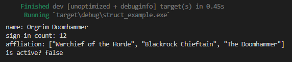
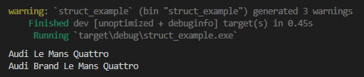
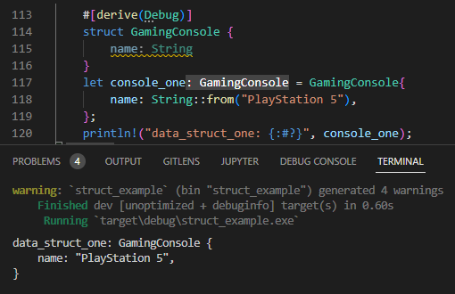
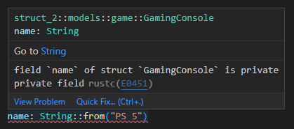

Pada chapter ini kita akan belajar tentang struct.

## A.23.1. Konsep Struct

Struct (kependekan dari *structure*) adalah tipe data custom yang dengannya kita bisa mengumpulkan beberapa definisi tipe data lalu menjadikannya sebagai satu buah tipe data dalam struktur tertentu.

Contoh analogi seperti sebuah mobil. Mobil memiliki roda, mesin, tempat kemudi, dan banyak lainnya. Mobil pada contoh ini adalah struct, sedang isi dari mobil tersebut biasa disebut dengan *attribute* atau *property* atau *field*.

Selain property, mobil juga bisa melakukan aksi, contohnya seperti jalan, belok kanan, berhenti. Aksi tersebut pada contoh ini adalah yang disebut dengan *method*. Method sendiri adalah fungsi yang merupakan property sebuah struct.

> Chapter ini fokus pada pembahasan struct beserta property-nya. Topik tentang method dibahas pada chapter selanjutnya, yaitu [Method](/basic/method).

## A.23.2. Pembuatan struct

Keyword `struct` digunakan untuk membuat custom type struct. Notasi penulisannya seperti ini:

```rust
struct NamaStruct {
    property_satu: String,
    property_dua: u64,
    // ...
}
```

Contoh, sebuah struct bernama `User` yang memiliki 4 buah property:

- `name` bertipe `String`
- `sign_in_count` bertipe numerik `u64`
- `affliation` bertipe vektor `Vec<String>`
- `active` bertipe boolean

```rust
struct User {
    name: String,
    sign_in_count: u64,
    affliation: Vec<String>,
    active: bool,
}
```

Struct adalah *hanya definisi structure*-nya saja, struct tidak menampung nilai atau value. Contoh pada struct `User` di atas bisa dilihat bahwa yang didefinisikan hanya nama struct dan property (beserta tipe datanya). Tidak ada pengisian nilai sama sekali.

> Notasi `Vec<String>` merupakan salah satu contoh penerapan generics. Topik ini nantinya dibahas lebih detail pada chapter [Generics](/basic/generics).

Struct merupakan tipe data data custom, yang berarti tipe data tersebut bisa digunakan dalam pembuatan variabel. Sebagai contoh dibawah ini, sebuah variabel bernama `user_one` didefinisikan dengan tipe adalah struct `User` yang telah dibuat.

```rust
struct User {
    name: String,
    sign_in_count: u64,
    affliation: Vec<String>,
    active: bool,
}

fn main() {
    let user_one = User{
        name: String::from("Orgrim Doomhammer"),
        sign_in_count: 12,
        affliation: vec![
            String::from("Warchief of the Horde"),
            String::from("Blackrock Chieftain"),
            String::from("The Doomhammer"),
        ],
        active: false,
    };

    println!("name: {}", user_one.name);
    println!("sign-in count: {}", user_one.sign_in_count);
    println!("affliation: {:?}", user_one.affliation);
    println!("is active? {}", user_one.active);
}
```

Jalankan program di atas, lihat hasilnya.



Variabel `user_one` didefinisikan tipe datanya adalah struct `User`. Notasinya penulisannya:

```rust
let user_one = User{
    // property_satu: value,
    // property_dua: value,
    // ...
};
```

Deklarasi variabel bertipe data struct mewajibkan isi masing-masing property harus dituliskan beserta nilainya. Sebagai contoh variabel `user_one` yang bertipe struct `User` di atas, dalam statement bisa dilihat ke-empat property milik struct `User` dituliskan beserta nilainya.

```rust
let user_one = User{
    name: String::from("Orgrim Doomhammer"),
    sign_in_count: 12,
    affliation: vec![
        String::from("Warchief of the Horde"),
        String::from("Blackrock Chieftain"),
        String::from("The Doomhammer"),
    ],
    active: false,
};
```

> Variabel yang tipe data-nya adalah struct biasa disebut dengan *object* atau *instance*.

### ◉ Fungsi `String::from()`

Pada chapter [Module System → Path & Item](/basic/path-item#-stdstringstringnew) kita telah sedikit mengenal fungsi `String::new()` yang kegunaannya adalah untuk membuat data string kosong bertipe data `String`.

Selain fungsi tersebut, ada juga fungsi `String::from()` yang kegunaannya juga untuk pembuatan data string bertipe `String`, tapi dengan isi ditentukan lewat argumen pemanggilan fungsi.

```rust
let a = "";
// variabel `a` bertipe data `&str`, isi value-nya ""

let b = String::new();
// variabel `b` bertipe data `String`, isi value-nya ""

let c = "hello";
// variabel `c` bertipe data `&str`, isi value-nya "hello"

let d = String::from("world");
// variabel `d` bertipe data `String`, isi value-nya "world"
```

Untuk sekarang, boleh menggunakan kesimpulan berikut:

- Hasil dari `String::new()` adalah sama dengan literal string `""` tapi bertipe data `String` (bukan `&str`)
- Hasil dari `String::from("hello")` adalah sama dengan literal string `"hello"` tapi bertipe data `String` (bukan `&str`)

Sebenarnya perbedaannya tidak hanya itu saja, nantinya kita pelajari lebih detail pada chapter [String Literal (&str) vs. String Custom Type](/basic/string-slice-vs-string-literal).

### ◉ *Naming convention* struct

Sesuai anjuran di [halaman dokumentasi Rust](https://rust-lang.github.io/api-guidelines/naming.html), upper camel case digunakan dalam penamaan struct dan camel case untuk penamaan property-nya. Contoh:

```rust
struct User {
    name: String,
    sign_in_count: u64,
    affliation: Vec<String>,
    active: bool,
}
```

## A.23.3. Mutable struct

Penentuan *mutability* sebuah struct dilakukan dengan cara menambahkan keyword `mut` seperti pada umumnya variabel. Contohnya bisa dilihat pada variabel `user_two` berikut:

```rust
let mut user_two: User = User{
    name: String::from("Varian Wrynn"),
    sign_in_count: 12,
    affliation: vec![
        String::from("High King of the Alliance"),
        String::from("King of Stormwind"),
        String::from("Champion of the Crimson Ring"),
    ],
    active: false,
};

user_two.name = String::from("Anduin Wrynn");
user_two.affliation.pop();
user_two.active = true;

println!("name: {}", user_two.name);
println!("sign-in count: {}", user_two.sign_in_count);
println!("affliation: {:?}", user_two.affliation);
println!("is active? {}", user_two.active);
```

Pada contoh di atas, `user_two` adalah object struct yang bisa diubah nilainya (mutable). Perubahan nilai struct bisa dilakukan pada property, contohnya seperti property `name`, `affliation`, dan `active` yang dicontohkan diubah nilainya.

Atau bisa juga perubahannya pada value struct itu sendiri, diganti dengan value baru.

```rust
let mut user_two = User{
    name: String::from("Varian Wrynn"),
    sign_in_count: 12,
    affliation: vec![
        String::from("High King of the Alliance"),
        String::from("King of Stormwind"),
        String::from("Champion of the Crimson Ring"),
    ],
    active: false,
};

user_two = User{
    name: String::from("Anduin Wrynn"),
    sign_in_count: 12,
    affliation: vec![
        String::from("High King of the Alliance"),
        String::from("King of Stormwind"),
    ],
    active: true,
};
```

## A.23.4. Macam-macam notasi deklarasi variabel struct

### ◉ *type inference* / *manifest typing*

Metode deklarasi *type inference* ataupun *manifest typing* bisa digunakan dalam variabel struct.

```rust
struct Car {
    brand: String,
    model: String,
}

let car_one = Car{
    brand: String::from("Toyota"),
    model: String::from("Sprinter Trueno AE86"),
};

let car_two: Car = Car{
    brand: String::from("BMW"),
    model: String::from("M3 GTR"),
};
```

### ◉ Variabel struct tanpa *predefined value*

Variabel struct boleh didefinisikan tanpa *predefined value*, jadi cukup tipe datanya saja yang ditentukan saat deklarasi variabel. Contoh:

```rust
let mut car_three: Car;
car_three = Car{
    brand: String::from("Audi"),
    model: String::from("Le Mans Quattro"),
};
```

### ◉ Variabel struct dengan nilai berasal dari struct lain

Jika ada kebutuhan untuk membuat variabel object struct yang nilai property-nya sebagian adalah berasal dari variabel struct lain, bisa manfaatkan syntax `..`.

```rust
let mut car_three: Car;
car_three = Car{
    brand: String::from("Audi"),
    model: String::from("Le Mans Quattro"),
};
println!("{} {}", car_three.brand, car_three.model);

let mut car_four: Car;
car_four = Car{
    brand: String::from("Audi Brand"),
    ..car_three
};
println!("{} {}", car_four.brand, car_four.model);
```

Pada contoh di atas, variabel `car_four` property `brand`-nya diisi dengan `"Audi Brand"`. Sedangkan property-property lainnya nilai didapat dari nilai propery milik `car_three`.



Coba jalankan program, akan terlihat nilai dari variabel `car_four` untuk property selain `brand` adalah sama dengan nilai property-property `car_three`.

### ◉ *Field init shorthand*

Jika ada variabel yang namanya sama persis dengan nama property sebuah struct, maka dalam deklarasi variabel struct bisa menggunakan teknik penulisan seperti berikut:

```rust
let model = String::from("Corvette C1");

let car_five = Car{
    brand: String::from("Chevrolet"),
    model,
};
```

Cukup tulis nama variabelnya saja tanpa value.

Teknik *shorthand* ini bisa juga digunakan dalam fungsi. Contoh dibawah ini ada fungsi bernama `new_car` yang memiliki nama parameter adalah sama persis dengan nama property struct `Car`.

```rust
fn new_car(brand: String, model: String) -> Car {
    Car{
        brand,
        model,
    }
}

fn main() {
    let car_six = new_car(
        String::from("Chevrolet"),
        String::from("Corvette C6")
    );
    // ...
}
```

### ◉ Deklarasi nilai struct secara horizontal

Umumnya, operasi *assignment* nilai struct dituliskan secara vertikal. Untuk struct yang property-nya sedikit biasanya dituliskan secara horizontal contohnya seperti di bawah ini:

```rust
struct Point {
    x: f32,
    y: f32,
}

let point_one = Point { x: 3.14, y: 8.0 };
```

### ◉ *Destructuring assignment*

Teknik penulisan ini bisa dipakai dalam case dimana nilai property struct perlu ditampung ke variabel baru. Contoh:

```rust
let point_one = Point { x: 3.14, y: 8.0 };

let Point { x: x_one, y: y_one } = point_one;
println!("x_one: {}", x_one);
println!("y_one: {}", y_one);
```

- Variabel `x_one` di atas akan menampung nilai dari `point_one.x`
- Variabel `y_one` di atas akan menampung nilai dari `point_one.y`

Jika tidak semua property struct perlu untuk ditampung ke variabel baru, maka gunakan `_` untuk property yang nilainya tidak ditampung. Contoh:

```rust
let point_one = Point { x: 3.14, y: 8.0 };

let Point { x: _, y: y_one } = point_one;
println!("y_one: {}", y_one);
```

## A.23.5. *Unit-like structs*

*Unit-like structs* adalah struct yang didefinisikan tanpa property. Cara deklrasinya bisa dilihat pada contoh berikut:

```rust
struct StructOne;

let data_one = StructOne;
```

Teknik pembuatan struct ini berguna ketika ada case dimana ada kebutuhan untuk mengimplementasikan sebuah trait ke suatu tipe data. Lebih jelasnya akan dibahas pada chapter [Traits](/basic/traits).

## A.23.6. Debugging value struct menggunakan `#[derive(Debug)]`

*By default*, error akan muncul saat berusaha menampilkan nilai variabel struct (bukan nilai property-nya, tapi nilai variabel struct-nya) menggunakan macro `println`. Ini disebabkan karena data yang bisa ditampilkan menggunakan macro `println` harus memiliki trait `Debug` (atau `Display`).


Lalu jika ingin melihat nilai property struct bagaimana solusinya? Bisa dengan menampilkan nilai property satu per satu, tapi pastinya butuh effort.

Cara yang lebih elegan adalah dengan menggunakan attribute `#[derive(Debug)]`. Penerapannya cukup dengan menuliskan atribut tersebut tepat di atas deklarasi struct. Contoh:

```rust
#[derive(Debug)]
struct GamingConsole {
    name: String
}

let console_one = GamingConsole{
    name: String::from("PlayStation 5"),
};

println!("data_struct_one: {:#?}", console_one);
```



> - Lebih detailnya mengenai traits dibahas pada chapter [Traits](/basic/traits)
> - Lebih detailnya mengenai attribute dibahas pada chapter [Attributes](/basic/attributes)

## A.23.7. Tuple struct

Tuple struct adalah struct yang didefinisikan dengan gaya tuple. Property pada tuple struct diakses menggunakan notasi pengaksesan tuple item.

Pada contoh berikut tuple struct `Color` didefinisikan dengan isi 3 buah item yang kesemuanya bertipe data `i32`. Lalu tipe data tuple struct tersebut digunakan untuk membuat variabel baru bernama `red`.

```rust
struct Color(i32, i32, i32);

let red = Color(255, 0, 0);

println!("{:?} {:?} {:?}", red.0, red.1, red.2);
```

Bisa dilihat di contoh, property diakses menggunakan nomor indeks dengan notasi penulisan `variable.index`.

Contoh lainnya, tuple struct `SomeTupleStruct` berikut dideklarasikan memiliki item ke-1 bertipe `i32` dan item ke-2 bertipe boolean.

```rust
struct SomeTupleStruct(i32, bool);

let some_data = SomeTupleStruct(0, false);

println!("{:?} {:?}", some_data.0, some_data.1);
```

## A.23.8. Struct property visibility

Sekarang mari kita coba praktikkan satu program lagi, namun kali ini sedikit berbeda, struct kita definisikan sebagai module item.

Silakan siapkan program dengan struktur seperti berikut:

```bash title="package source code structure"
my_package
│─── Cargo.toml
└─── src
     │─── main.rs
     ├─── models.rs
     └─── models
          └─── game.rs
```

Lalu isi file program dengan kode di bawah ini. Sebuah struct dengan path `models::game::GamingConsole`, dan satu buah object di fungsi `main` yang dibuat dari struct tersebut. Pastikan definisi semua module item adalah publik (ada keyword `pub`).

```rust title="src/main.rs"
mod models;

fn main() {
    let ps5 = models::game::GamingConsole{
        name: String::from("PS 5")
    };
    println!("{:#?}", ps5);
}
```

```rust title="src/models.rs"
pub mod game;
```

```rust title="src/models/game.rs"
#[derive(Debug)]
pub struct GamingConsole {
    name: String
}
```

Ada yang aneh, baris kode pembuatan variabel object `ps5` terdeteksi sebagai error. Padahal definisi submodule dan item-nya sudah publik semua.



Jika dilihat dari keterangan error, sebenarnya cukup jelas bagian mana yang menjadi sumber masalah, yaitu field `name` yang terdeteksi sebagai private property.

Struct jika didefinisikan di file yang sama dengan statement pemanggilan struct tersebut tidak akan menghasilkan error. Tetapi jika definisi struct-nya terpisah dari statement pemanggilan struct (seperti contoh di atas), maka field dari struct tersebut harus publik.

Caranya membuat field sebagai publik adalah dengan menambahkan keyword `pub` pada property struct. Silakan ubah definisi struct `GamingConsole` menjadi seperti berikut:

```rust
// before
pub struct GamingConsole {
    name: String
}

// after
pub struct GamingConsole {
    pub name: String
}
```

Bisa dilihat keyword `pub` ditambahkan pada deklarasi property struct. yang sebelumnya `name: String` sekarang ada keyword `pub` didepannya.

> Lebih jelasnya mengenai visibility property dibahas pada chapter [Module System → Visibility & Privacy](/basic/visibility-privacy)

## A.23.9. Tuple struct property visibility

Lalu bagaimana dengan tuple struct? apakah property-nya juga harus didefinisikan publik agar bisa diakses dari tempat lain? Jawabannya ada di praktik berikut:

```bash title="package source code structure"
my_package
│─── Cargo.toml
└─── src
     │─── main.rs
     ├─── models.rs
     └─── models
          └─── color.rs
```

```rust title="src/main.rs"
mod models;

fn main() {
    let red = models::color::Color(255, 255, 0);
    println!("{:#?}", red);
}
```

```rust title="src/models.rs"
pub mod color;
```

```rust title="src/models/color.rs"
#[derive(Debug)]
pub struct Color(i32, i32, i32);
```


Yap, error yang mirip juga muncul. Jadi jawaban dari pertanyaan sebelumnya adalah iya, property tuple struct juga harus publik agar bisa diakses dari tempat lain.

Cara deklarasi tuple struct dengan property publik adalah dengan menambahkan keyword `pub` di masing-masing deklarasi parameter tuple struct. Contoh:

```rust
// before
pub struct Color(i32, i32, i32);

// after
pub struct Color(pub i32, pub i32, pub i32);
```

Jalankan program untuk melihat hasilnya, error tidak muncul.

> Lebih jelasnya mengenai visibility property dibahas pada chapter [Module System → Visibility & Privacy](/basic/visibility-privacy)

## A.23.10. Generic pada struct

Pembahasan mengenai generic pada struct ada pada chapter [Generics](/basic/generics#a365-generics-struct).

---

## Catatan chapter 📑

### ◉ Source code praktik

<pre>
    <a href="https://github.com/novalagung/dasarpemrogramanrust-example/tree/master/struct">
        github.com/novalagung/dasarpemrogramanrust-example/../struct
    </a>
</pre>

### ◉ Referensi

- https://doc.rust-lang.org/book/ch05-00-structs.html
- https://doc.rust-lang.org/book/ch05-01-defining-structs.html
- https://doc.rust-lang.org/std/keyword.struct.html
- https://doc.rust-lang.org/rust-by-example/custom_types/structs.html
