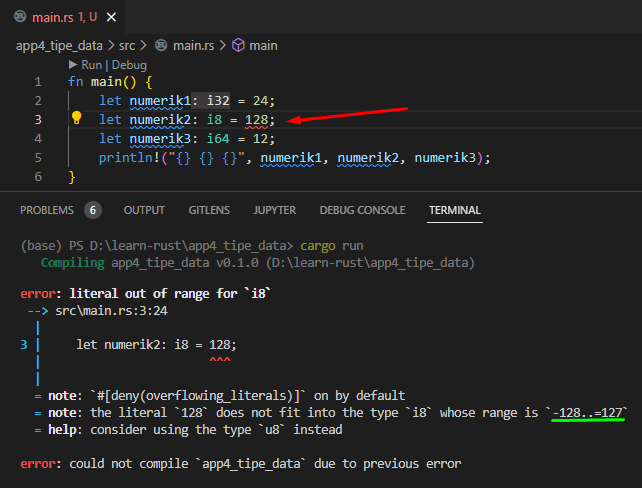

Tipe data di Rust dikategorikan menjadi beberapa group, salah satunya adalah group tipe data primitif scalar atau biasa disebut **scalar types**. Pada chapter ini kita akan mempelajarinya.

Tipe data scalar sendiri merupakan tipe data primitif yang isinya hanya 1 nilai. Rust memiliki 4 tipe scalar, yaitu integers, floating-point, boolean, dan character.

## A.5.1. Signed integers

Signed integer merupakan tipe data numerik/integer yang bisa menampung nilai positif dan juga negatif. Ada beberapa tipe data singed integer tersedia di Rust yang dibedakan sesuai size-nya.

Tipe data ini keyword-nya ditandai dengan huruf awalan `i`, contohnya `i8`, yang dimana tipe ini adalah tipe data numerik integer dengan range value yang bisa ditampung adalah mulai dari angka **−128** (didapat dari −(2<sup>7</sup>) hingga **127** (didapat dari 2<sup>7</sup>-1).

Contoh:

```rust
let numerik1 = 24;
let numerik2: i8 = 2;
let numerik3: i64 = 12;

println!("{} | {} | {}", numerik1, numerik2, numerik3);
// output ==> 24 | 2 | 12
```

Dengan menggunakan teknik deklarasi *type inference*, maka default angka numerik tipe datanya adalah `i32`.

Range value pada tipe data itu cukup penting untuk diperhatikan, jika ada sebuah variabel yang tipe datanya pasti dan diisi dengan nilai di luar kapasitas yang bisa ditampung, maka akan muncul error. Contoh, tipe data `i8`, jika diisi nilai `128` maka error.



Umumnya, tipe data `i32` cukup untuk kebutuhan menampung nilai, tapi ada banyak case dimana kita perlu tipe dengan size yang lebih besar seperti `i64`.

Berikut merupakan list tipe data signed integers yang ada di Rust. Tidak perlu dihafal.

| Tipe data | Deskripsi |
| - | - |
| `i8` | −(2<sup>7</sup>) hingga (2<sup>7</sup>)-1 |
| `i16` | −(2<sup>15</sup>) hingga (2<sup>15</sup>)-1 |
| `i32` | −(2<sup>31</sup>) hingga (2<sup>31</sup>)-1 |
| `i64` | −(2<sup>63</sup>) hingga (2<sup>63</sup>)-1 |
| `i128` | −(2<sup>127</sup>) hingga (2<sup>127</sup>)-1 |
| `isize` | tipe pointer |

> Lebih jelasnya tentang tipe data **pointer** dibahas pada chapter terpisah, [Pointer & References](/basic/pointer-references)

Kita juga bisa mengetahui nilai mininal dan maximal tipe data signed integers dengan cara `tipedata::MIN` atau `tipedata::MAX`.

Contoh:

```rust
let min_i8 = i8::MIN;
let max_i8 = i8::MAX;

println!("{} | {}", min_i8, max_i8);
// output ==> -128 | 127
```

## A.5.2. Unsigned integers

Perbedaan antara signed dan unsigned adalah pada range value yang ditampung, size-nya sama, hanya angka minimal dan maksimalnya berbeda.

Unsigned di sini maksudnya adalah hanya bisa menampung angka mulai dari 0. Tipe data unsigned tidak bisa menampung angka negatif (jika dipaksa akan memunculkan error).

Berikut list tipe data unsigned integer pada Rust:

| Tipe data | Deskripsi |
| - | - |
| `u8` | 0 hingga (2<sup>8</sup>)-1 |
| `u16` | 0 hingga (2<sup>16</sup>)-1 |
| `u32` | 0 hingga (2<sup>32</sup>)-1 |
| `u64` | 0 hingga (2<sup>64</sup>)-1 |
| `u128` | 0 hingga (2<sup>128</sup>)-1 |
| `usize` | tipe pointer |

> Lebih jelasnya tentang tipe data **pointer** dibahas pada chapter terpisah, [Pointer & References](/basic/pointer-references)

Contoh penerapan unsigned integer:

```rust
let numerik4: u32 = 28;
let numerik5: u8 = 16;
let numerik6: u64 = 42;

println!("{} | {} | {}", numerik4, numerik5, numerik6);
// output ==> 28 | 16 | 42
```

Kita juga bisa mengetahui nilai mininal dan maximal tipe data unsigned integers dengan cara `tipedata::MIN` atau `tipedata::MAX`.

Contoh:

```rust
let min_u8 = u8::MIN;
let max_u8 = u8::MAX;

println!("{} | {}", min_u8, max_u8);
// output ==> 0 | 255
```

Catatan saja, variabel yang dideklarasikan dengan predefined value adalah numerik, by default tipe datanya adalah `i32` (signed).

## A.5.3. Floating point

Floating point adalah tipe data yang mendukung nilai dibelakang koma, contohnya seperti `3.14`. Di Rust ada dua tipe data floating point, yaitu `f34` dan `f64`. Contoh penggunaan:

```rust
let fp1: f32 = 3.14;
let fp2: f64 = 3.1415926535;

println!("{} | {:.5}", fp1, fp2);
// output ==> 3.14 | 3.14159
```

O iya, jumlah digit di belakang koma bisa diatur saat diprint menggunakan `println`. Caranya dengan menggunakan notasi `{:.n}`. Sebagai contoh `{:.5}` maka akan menampilkan hanya 5 digit dibelakang koma.

> Dalam penerapan definisi variabel sekaligus nilai, jika nilai dituliskan dalam desimal seperti contohnya `24`, maka tipe data variabel penampung adalah numerik.
>
> Jika dituliskan dalam notasi floating point, contohnya `3.14`, maka tipe data variabel penampung adalah float.

Kita juga bisa mengetahui nilai mininal dan maximal tipe data floating point dengan cara `tipedata::MIN` atau `tipedata::MAX`.

Contoh:

```rust
let min_f32 = f32::MIN;
let max_f32 = f32::MAX;

println!("min_f32={} | max_f32={}", min_f32, max_f32);
// output ==> min_f32=-340282350000000000000000000000000000000 | max_f32=340282350000000000000000000000000000000
```

Catatan saja, variabel yang dideklarasikan dengan predefined value adalah floating point, by default tipe datanya adalah `f64`.

## A.5.4. Bool

Tipe data `bool` menerima dua pilihan nilai saja, `true` atau `false`.

```rust
let b1 = true;
let b2 = false;

println!("{} | {}", b1, b2);
// output ==> true | false
```

## A.5.5. Char

Tipe `char` menampung sebuah data (unicode), contohnya seperti `'n'`, `'-'`, `'2'`. Penulisan literal untuk tipe ini menggunakan notasi `''`, diapit tanda petik satu.

```rust
let c1 = 'n';
let c2 = '-';
let c3 = '2';

println!("{} | {} | {}", c1, c2, c3);
// output ==> n | - | 2
```

## A.5.6. Pointer scalar

Deklarasi tipe data pointer cukup mudah, yaitu dengan menuliskan deklarasinya seperti biasa tapi ditambahkan karakter `&`.

```rust
let ptr1: &i32 = &24;
println!("{}", ptr1);
// output ==> 24
```

Perihal apa itu tipe data pointer dan apa kegunaan prefix `&` akan dibahas pada chapter terpisah, yaitu [Pointer & References](/basic/pointer-references).

## A.5.7. Tipe data primitive compound

Selain beberapa tipe data yang sudah dibahas di atas, ada juga jenis tipe data primitif jenis lainnya, yaitu primitive compound yang di antaranya adalah [Array](/basic/array), [Slice](/basic/slice), [Tuple](/basic/tuple), dan [String](/basic/tipe-data-custom-type-string-slice). Tipe-tipe tersebut dibahas pada chapter terpisah.

---

## Catatan chapter 📑

### ◉ Source code praktik

<pre>
    <a href="https://github.com/novalagung/dasarpemrogramanrust-example/tree/master/tipe_data_primitive_scalar">
        github.com/novalagung/dasarpemrogramanrust-example/../tipe_data_primitive_scalar
    </a>
</pre>

### ◉ Chapter relevan lainnya

- [Tipe Data → String Literal (&str)](/basic/tipe-data-string-literal)
- [Array](/basic/array)
- [Slice (Basic)](/basic/slice)
- [Tuple](/basic/tuple)
- [Tipe Data → String Custom Type](/basic/tipe-data-custom-type-string-slice)

### ◉ Referensi

- https://doc.rust-lang.org/rust-by-example/primitives.html
- https://doc.rust-lang.org/std/fmt/index.html#syntax
- https://en.wikipedia.org/wiki/Integer_(computer_science)

---
