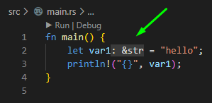
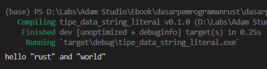
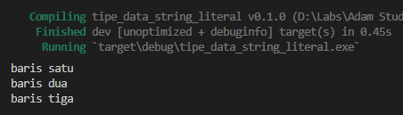
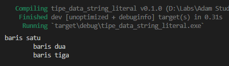
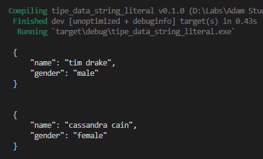

String adalah tipe data penting dalam pemrograman manapun. Biasanya tiap bahasa punya cara berbeda dalam meng-handle tipe ini. Di bahasa Rust, ada dua jenis tipe data string:

- Tipe string literal (kadang disebut dengan string slice, atau `&str`). Tipe data ini ada pada nilai yang dideklarasikan dengan diapit tanda petik dua (string literal), contohnya `"Hello, world!"`.
- Tipe `String` yang merupakan tipe data custom atau *custom types* yang merupakan sebuah struct. Lebih jelasnya akan kita bahas pada chapter terpisah.

Chapter ini hanya fokus pada string literal, dengan level pembahasan yang tidak terlalu advance.

## A.6.1. String literal atau `&str`

> Kita tidak akan bahas terlalu low-level untuk topik ini, karena memang masih di chapter awal-awal.

Rust adalah bahasa yang *statically typed*, tipe data harus diketahui saat kompilasi. Setiap pendefinisian variabel, entah itu dengan di-specify tipe datanya (contoh: `let x: i32 = 5`) atau menggunakan teknik *type inference* (contoh: `let x = 5`), tipe datanya akan diketahui di awal saat kompilasi program.

Begitu juga pada tipe string. Sebagai contoh, statement `let y = "hello"`, variabel `y` di sini memiliki tipe data, yaitu `&str`.

Apa itu tipe `&str`? Tipe `str` merupakan salah satu tipe primitif yang ada di Rust. Penulisan `&str` menandakan bahwa tipe tersebut adalah **pointer `str`**.

> Untuk pembahasan lebih detail mengenai tanda `&` pada tipe data akan dibahas pada chapter terpisah, [Pointer & References](/basic/pointer-references)

Untuk kawan-kawan yang menggunakan VSCode dengan ekstensi `rust-analyzer`, tipe data variabel bisa terlihat saat definisi.



Ok, sampai sini yang paling penting adalah dipahami dulu bahwa string literal tipe datanya adalah `&str`. Jadi selanjutnya kalau melihat tipe data `&str` jangan bingung, itu berarti string.

## A.6.2. Escape karakter menggunakan `\`

Tanda `\` digunakan untuk *escape* beberapa karakter string.

Silakan perhatikan contoh berikut. Variabel `var2` isinya adalah string yang di dalamnya ada beberapa karakter yang di escape, yaitu tanda `"` dan baris baru atau newline.

```rust
let var2 = "hello \
    \"rust\" \
    and \
    \"world\"";
println!("{}", var2);
```

Coba jalankan kode di atas.



Karena semua baris baru pada contoh di atas di-escape, jadinya string akan tetap 1 baris. Tanda `"` juga tetap muncul karena di-escape.

## A.6.3. Multiline string literal

Penulisan string banyak baris atau *multiline string* adalah sama seperti penulisan string biasa, yaitu langsung tulis saja string dengan diapit tanda `"`, tambahkan baris baru di dalam string tersebut sesuai kebutuhan.

```rust
let var3 = "baris satu
baris dua
baris tiga";
println!("{}", var3);
```

Hasilnya adalah sesuai dengan string yang sudah didefinisikan.



Perlu diketahui bahwa karakter spasi, baris baru, dan lainnya adalah **tidak dihiraukan**, jadi jika kawan-kawan menuliskan string multiline seperti ini ...

```rust
let var4 = "baris satu
    baris dua
    baris tiga";
println!("{}", var4);
```

... maka hasilnya juga sesuai dengan yang ditulis, yaitu ada 4 karakter spasi di baris ke-2 dan ke-3.



## A.6.4. Raw string

Raw string adalah istilah untuk string yang tidak meng-*escape* karakter apapun. Di Rust, string literal bisa didefinisikan dengan menuliskan string diapit `r#"` dan `"#`. Contoh:

```rust
let var5 = r#"
    {
        "name": "tim drake",
        "gender": "male"
    }
"#;
println!("{}", var5);
```

Kode di atas hasilnya adalah ekuivalen dengan kode dibawah ini, yang dimana string didefinisikan dengan meng-escape karakter `"` menggunakan `\`.

```rust
let var6 = "
    {
        \"name\": \"cassandra cain\",
        \"gender\": \"female\"
    }
";
println!("{}", var6);
```



## A.6.5. Pembahasan lanjutan tentang string

**String adalah salah satu topik yang sangat luas cakupan pembahasannya**, tidak cukup jika dirangkum dalam 1 chapter. Selain itu, bisa bikin makin bingung jika dibahas sekarang.

Penulis anjurkan untuk mempelajari chapter-chapter berikutnya secara urut terlebih dahulu.

---

## Catatan chapter 📑

### ◉ Source code praktik

<pre>
    <a href="https://github.com/novalagung/dasarpemrogramanrust-example/tree/master/tipe_data_string_literal">
        github.com/novalagung/dasarpemrogramanrust-example/../tipe_data_string_literal
    </a>
</pre>

### ◉ Chapter relevan lainnya

- [Pointer & References](/basic/pointer-references)
- [String Literal (&str) vs. String Custom Type](/basic/string-slice-vs-string-literal)
- [Tipe Data ➜ String Custom Type](/basic/tipe-data-custom-type-string-slice)

### ◉ Referensi

- https://doc.rust-lang.org/reference/tokens.html#raw-string-literals
- https://doc.rust-lang.org/std/str/index.html
- https://web.mit.edu/rust-lang_v1.25/arch/amd64_ubuntu1404/share/doc/rust/html/book/first-edition/strings.html
