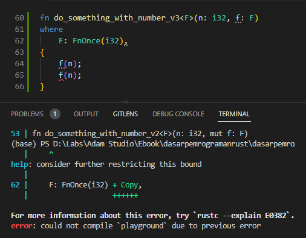
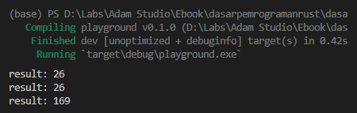

Chapter ini merupakan topik lanjutan dari chapter sebelumnya, disini kita akan bahas beberapa jenis trait yang digunakan di closure.

Rust memiliki 3 buah trait yang otomatis ter-implement pada closure, yaitu `Fn`, `FnMut`, dan `FnOnce`. Ketiga trait ini juga otomatis ter-implement pada fungsi yang didefinisikan menggunakan keyword `fn`.

## A.47.1. Trait `Fn`

`Fn` sudah kita terapkan beberapa kali saat praktek pembuatan closure di chapter sebelumnya. Fn adalah trait ([std::ops::Fn](https://doc.rust-lang.org/std/ops/trait.Fn.html)), yang dipakai oleh Rust untuk menandai bahwa suatu closure bisa dipanggil berkali-kali dengan catatan di dalam closure tersebut tidak ada operasi mutable terhadap variabel yang scope-nya berada di luar block closure.

Contoh penerapan trait `Fn` bisa dilihat pada kode berikut. Trait tersebut secara otomatis ter-implement pada closure `pow`.

```rust
let pow_number = |n: i32| n.pow(2);

println!("pow_number(2): {}", pow_number(2));
println!("pow_number(3): {}", pow_number(3));
println!("pow_number(4): {}", pow_number(4));
```

Contoh penerapan trait `Fn` lainnya pada fungsi yang memiliki parameter closure:

```rust
fn main() {
    let result = do_something_with_number_v1(13, |d: i32| d * 2);
    println!("result: {result}");
}

fn do_something_with_number_v1<F>(n: i32, f: F) -> i32
where
    F: Fn(i32) -> i32, // <----- Fn digunakan
{
    // Statement `f(n)` bisa dipanggil berkali-kali
    return f(n);
}
```

## A.47.2. Trait `FnMut`

Trait `FnMut` ([std::ops::FnMut](https://doc.rust-lang.org/std/ops/trait.FnMut.html)) merupakan trait yang menjadikan suatu closure bisa diakses berkali-kali dan bisa me-mutate atau mengubah data suatu variabel yang berada di luar scope block closure. Trait ini juga otomatis ter-implement pada closure yang di dalamnya ada kode pengaksesan variabel yang berada di luar scope block closure.

Contoh penerapannya silakan lihat closure `square_x` berikut. Closure tersebut di-dalamnya mengubah nilai `x` yang dideklarasikan di luar blcok closure, oleh karenanya trait `FnMut` otomatis ter-implement.

```rust
let mut x = 5;
{
    let mut square_x = || x *= x;
    square_x();
}
println!("result: {}", x);
```

Contoh lain penerapan `FnMut` pada fungsi yang memiliki parameter closure:

```rust
fn main() {
    let mut number = 1;
    do_something_with_number_v2(14, |x| number += x);
    println!("number: {number}");
}

fn do_something_with_number_v2<F>(n: i32, mut f: F)
where
    F: FnMut(i32), // <----- FnMut digunakan
{
    // Statement `f(n)` berisi kode yang mengubah isi variavel `number` (mutable).
    // `f(n)` bisa dipanggil berkali-kali
    f(n);
}
```

Parameter ke-2 fungsi `do_something_with_number_v2` adalah closure yang me-mutate nilai `number`, berarti terjadi mutable borrow karena variabel `number` berada di luar block closure. Karena alasan tersebut maka closure harus dideklarasikan menggunakan `FnMut` (bukan `Fn`).

Jika dipaksa deklarasi menggunakan `Fn`, hasilnya pasti error.


`FnMut` merupakan supertrait dari `Fn`, artinya closure dengan trait `Fn` juga bisa digunakan sebagai argument pemanggilan fungsi dimana parameter fungsi tersebut bertipe `FnMut`.

> Lebih jelasnya mengenai supertrait dibahas pada chpater [Supertrait](/wip/supertrait)

## A.47.3. Trait `FnOnce`

Trait `FnOnce` ([std::ops::FnOnce](https://doc.rust-lang.org/std/ops/trait.FnOnce.html)) adalah trait yang menjadikan suatu closure hanya boleh di akses sekali saja, dan closure tersebut bisa berisi operasi mutable ataupun tidak.

Contoh penerapan `FnOnce` pada fungsi yang memiliki parameter closure.

```rust
fn main() {
    let mut number = 1;
    do_something_with_number_v3(14, |x| number += x);
    println!("number: {number}");
}

fn do_something_with_number_v3<F>(n: i32, f: F)
where
    F: FnOnce(i32), // <----- FnOnce digunakan
{
    f(n);
}
```

Jika closure dengan tipe `FnOnce` dipaksa diakses dua kali, pasti muncul error. Contohnya bisa dilihat pada parameter `f` berikut.



> Lebih jelasnya mengenai supertrait dibahas pada chpater [Supertrait](/wip/supertrait)

## A.47.4. Relasi antara trait function dengan function

Trait `Fn`, `FnMut`, dan juga `FnOnce` tidak hanya ter-implement pada closure, tapi juga ter-implement pada fungsi juga (secara otomatis).

Contohnya bisa dilihat pada contoh berikut. Fungsi `do_something_with_number_v1` dipanggil 3 kali.

- Pemanggilan pertama, argument `f` diisi dengan closure `|d: i32| d * 2`
- Pemanggilan kedua, argument `f` diisi dengan fungsi `double`
- Pemanggilan ketiga, argument `f` diisi dengan fungsi `pow_number`

```rust
fn main() {
    let result = do_something_with_number_v1(13, |d: i32| d * 2);
    println!("result: {result}");
    
    let result = do_something_with_number_v1(13, double);
    println!("result: {result}");
    
    let result = do_something_with_number_v1(13, pow_number);
    println!("result: {result}");
}

fn do_something_with_number_v1<F>(n: i32, f: F) -> i32
where
    F: Fn(i32) -> i32,
{
    return f(n);
}

fn double(d: i32) -> i32 {
    d * 2
}

fn pow_number(d: i32) -> i32 {
    d.pow(2)
}
```

Dari contoh di atas terbukti bahwa fungsi `double` dan juga `pow_number` memenuhi kriteria tipe `F` yaitu `Fn(i32) -> i32`.



---

## Catatan chapter 📑

### ◉ Source code praktek

<pre>
    <a href="https://github.com/novalagung/dasarpemrogramanrust-example/tree/master/trait_function">
        github.com/novalagung/dasarpemrogramanrust-example/../trait_function
    </a>
</pre>

### ◉ Chapter relevan lainnya

- [Function](/basic/function)
- [Traits](/basic/traits)
- [Closures](/basic/closures)

### ◉ Referensi

- https://doc.rust-lang.org/book/ch13-01-closures.html
- https://doc.rust-lang.org/beta/rust-by-example/fn/closures.html
- https://doc.rust-lang.org/std/ops/trait.Fn.html
- https://doc.rust-lang.org/std/ops/trait.FnMut.html
- https://doc.rust-lang.org/std/ops/trait.FnOnce.html

---
