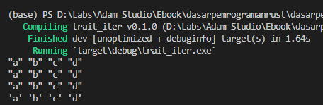
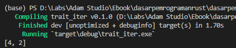
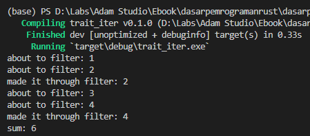
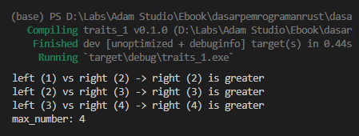

Iterator adalah salah satu trait dan tipe data custom penting pada Rust programming, gunanya untuk iterasi data. Di chapter ini kita akan mempelajarinya beserta beberapa module item lainnya yang masih relevan dengan topik Iterator.

## A.48.1. `Iterator` & `IntoIterator`

`Iterator` adalah sebuah nama yang dipakai sebagai nama module item dalam **Rust Standard Library** maupun **Rust Core Library**, digunakan untuk iterasi data dan operasi lain yang berhubungan dengannya.

Iterator sendiri merupakan istilah untuk object atau trait yang bisa diiterasi, baik menggunakan keyword `for in` ataupun menggunakan method iterator seperti `for_each` (yang juga akan kita bahas disini).

### ◉ Trait `Iterator` & `IntoIterator`

Dalam perulangan menggunakan keyword `for in`, tipe data variabel yang digunakan harus memiliki trait `Iterator`. Jika tidak, pasti error muncul.

Tipe data slice di Rust by default mengadopsi trait bernama `IntoIterator`, yang trait ini digunakan untuk konversi data bertipe slice ke bentuk iterator.

Dalam praktiknya, tidak perlu mengakses method tertentu untuk mendapatkan object iterator suatu data. Cukup gunakan variabel tipe data slice pada keyword `for in`, maka proses konversi ke bentuk iterator akan dilakukan oleh Rust secara otomatis dibalik layar.

Contoh:

```rust
// array
let data_arr = ["a", "b", "c", "d"];
for e in &data_arr {
    print!("{e:?} ")
}

println!();

// vector
let data_vec = vec!["a", "b", "c", "d"];
for e in &data_vec {
    print!("{e:?} ")
}

println!();

// slice
let data_vec = vec!["a", "b", "c", "d"];
let data_slice_vec = &data_vec[..];
for e in data_slice_vec {
    print!("{e:?} ")
}
```

Dianjurkan untuk selalu menggunakan teknik [Borrowing](/basic/borrowing) dalam penggunaan keyword `for in` pada tipe data yang karakteristiknya adalah [Move Semantics](/basic/ownership#a344-copy-semantics-vs-move-semantics), hal ini karena dalam penerapan keyword tersebut, terjadi proses konversi tipe data dengan trait `IntoIterator` ke bentuk `Iterator`.

Jika data yang digunakan bukan data borrow, maka pasti owner berpindah.

### ◉ Struct `Iterator`

Selain trait `Iterator`, ada juga tipe data struct bernama sama, yaitu `Iterator`. Perbedaan antara trait vs struct `Iterator` adalah tipe struct `Iterator` memiliki beberapa method untuk keperluan iterasi object. Jadi dengan memanfaatkan method-method tersebut, kita bisa melakukan iterasi data dan operasi sejenisnya tanpa menggunakan `for in`.

Semua tipe data slice bisa dikonversi ke tipe data `Iterator`, caranya dengan mengakses method `iter` (atau method `chars` khusus untuk tipe data `String`).

Dari object iterator tersebut, perulangan bisa dilakukan via keyword `for in`, atau dengan memanfaatkan method bernama `for_each`. Perbedaannya pada iterasi menggunakan `for_each`, block perulangan dituliskan dalam bentuk closure.

```rust
// array
let data_arr = ["a", "b", "c", "d"];
let iterator_arr = data_arr.iter();
iterator_arr.for_each(|e| {
    print!("{e:?} ")
});

println!();

// vector
let data_vec = vec!["a", "b", "c", "d"];
data_vec.iter().for_each(|e| {
    print!("{e:?} ")
});

println!();

// slice from vector
let data_vec = vec!["a", "b", "c", "d"];
let data_slice_vec = &data_vec[..];
data_slice_vec.iter().for_each(|e| {
    print!("{e:?} ")
});

println!();

// slice from String
let data_str = "abcd".to_string();
let data_borrow_str = &data_str;
data_borrow_str.chars().for_each(|e| {
    print!("{e:?} ")
});

println!();
```

Bisa dilihat pada contoh di atas, data slice diambil objek Iterator-nya menggunakan method `iter` (atau `chars` khusus untuk tipe data `String`), kemudian di-iterasi menggunakan method `for_each`.



## A.48.2. Pemanfaatan tipe data `Iterator`

Tipe data `Iterator` memiliki cukup banyak method untuk keperluan operasi data iterator, contohnya seperti `for_each`, `map`, `filter`, dan lainnya.

### ◉ Praktik ke-1

Sebagai contoh, kita akan buat sebuah program sederhana yang melakukan operasi kuadrat pada elemen tiap-tiap array.

```rust
let data_arr = [1, 3, 5];

let doubles: Vec<i32> = data_arr
    .iter()
    .map(|e| e * e)
    .collect();

println!("{doubles:?}");
```


Penjelasan:

1. Variabel `data_arr` yang bertipe data `[i32; 3]` dikonversi ke tipe data `Iterator` menggunakan method `iter`.
1. Object `Iterator` kemudian di-iterasi menggunakan method `map` dan nilai baliknya dijadikan *replacement* data elemen tersebut.
1. Object `Iterator` kemudian di-collect data-nya ke bentuk `Vec<i32>` menggunakan method `collect`.

### ◉ Praktik ke-2

Contoh lain penerapan method iterator bisa dilihat pada kode berikut:

```rust
let data_vec = vec!["1", "2", "3", "4", "a"];

let numbers: Vec<i32> = data_vec
    .iter()
    .map(|e| -> i32 {
        match e.parse::<i32>() {
            Ok(n) => n,
            Err(_) => 0,
        }
    })
    .filter(|e| *e > 0 && *e % 2 == 0)
    .rev()
    .collect::<Vec<i32>>();

println!("{numbers:?}");
```

Program di atas melakukan beberapa hal:

1. Data `data_vec` yang merupakan koleksi string di-konversi menjadi object `Iterator` menggunakan method `iter`.

1. Kemudian method `map` diakses. Setiap elemen `data_vec` di-iterasi, kemudian dikonversi dari `String` ke `i32`, lalu dijadikan *replacement* data elemen tersebut. Jika proses konversi gagal, maka angka `0` digunakan sebagai data element tersebut.
    - Sampai sini, data yang sebelumnya `["1", "2", "3", "4", "a"]` sekarang menjadi `[1, 2, 3, 4, 0]`.

1. Selanjutnya, dilakukan proses filtering menggunakan method `filter` dengan kondisi `*e > 0 && *e % 2 == 0` yang kurang lebih artinya, jika nilai *dereference* `e` lebih besar dari `0` dan nilai tersebut adalah genap, maka filter bernilai `true`.
    - Sampai sini, data yang sebelumnya `[1, 2, 3, 4, 0]` sekarang menjadi `[2, 4]`.

1. Kemudian, data kolektif tersebut dibalik urutan elemennya menggunakan method `rev`.
    - Sampai sini, data yang sebelumnya `[2, 4]` sekarang menjadi `[4, 2]`.

1. Terakhir data di-collect menggunakan method `collect` dengan ditentukan tipe data masing-masing elemen adalah `Vec<i32>`.

Hasilnya ketika di run:



## A.48.3. Method tipe data `Iterator`

### ◉ Method `iter`, `iter_mut`, `into_iter`

Ketiga method ini berguna untuk konversi data slice ke bentuk `Iterator`, perbedannya:

- Method `iter` mengembalikan data `Iterator` yang isinya adalah reference (`&T`) setiap element. Contoh penerapan:

    ```rust
    let data_vec = vec![1, 2, 3, 4];
    
    data_vec.iter().for_each(|d| {
        println!("{}", *d * 2)
    });
    
    for d in &data_vec {
        println!("{}", *d * 2)
    }
    ```

- Method `iter_mut` mengembalikan data `Iterator` yang isinya adalah mutable reference (`&mut T`) setiap element. Contoh penerapan:

    ```rust
    let mut data_vec = vec![1, 2, 3, 4];
    
    data_vec.iter_mut().for_each(|d| {
        *d = *d * 2;
    });
    println!("{:?}", data_vec);
    
    for d in &mut data_vec {
        *d = *d * 2;
    }
    println!("{:?}", data_vec);
    ```

- Method `into_iter` mengkonversi data slice ke bentuk `Iterator` (*move semantics*).

    ```rust
    let data_vec = vec![1, 2, 3, 4];
    
    data_vec.into_iter().for_each(|d| {
        println!("{}", d * 2)
    });
    
    // statement di bawah ini menghasilkan error,
    // karena ownership `data_vec` telah berpindah setelah method `into_iter` dipanggil
    
    // println!("{}", data_vec)
    ```

### ◉ Method `collect`

Method ini digunakan untuk *collecting* data Iterator ke bentuk tertentu. Contoh penerapannya bisa dilihat pada kode berikut ini.

Data `data_vec` yang merupakan vektor bertipe `Vec<i32>` dikonversi ke bentuk `Iterator` kemudian di-collect datanya.

```rust
let data_vec: Vec<i32> = vec![1, 2, 3, 4];

let result: Vec<&i32> = data_vec.iter().collect();
println!("{:?}", result);
// [1, 2, 3, 4]
```

Method `iter` menghasilkan object `Iterator` yang menampung reference `&T` setiap element slice. Hal ini membuat penerapan method `collect` menghasilkan data bertipe `Vec<&i32>` (bukan `Vec<i32>`).

### ◉ Method `map`

Method `map` digunakan untuk mapping element setiap data iterator ke nilai baru.

Sebelumnya kita telah mempelajari method `iter` dan `collect` yang keduanya jika dikombinasikan dan digunakan pada tipe data `Vec<i32>` hasilnya adalah data bertipe `Vec<&i32>`. Dengan memanfaatkan method `map`, tipe data setiap element bisa di-mapping ke nilai baru dengan tipe data berbeda, misalnya menjadi `Vec<i32>`.

```rust
let data_vec: Vec<i32> = vec![1, 2, 3, 4];

let result1: Vec<&i32> = data_vec.iter().collect();
println!("{:?}", result1);
// [1, 2, 3, 4]

let result2: Vec<i32> = data_vec
    .iter()
    .map(|d: &i32| -> i32 { *d })
    .collect();
println!("{:?}", result2);
// [1, 2, 3, 4]
```

Contoh lainnya bisa dilihat pada *section* [A.48.2. Pemanfaatan tipe data `Iterator`](/basic/trait-iterator#a482-pemanfaatan-tipe-data-iterator) dimana dilakukan mapping data slice numerik ke bentuk yang sama tapi nilai setiap element adalah kuadrat, dan juga ke bentuk lain dengan tipe data berbeda.

### ◉ Method `rev`

`rev` kependekan dari *reverse*, digunakan untuk membalikan urutan data slice.

```rust
let data_vec = vec![1, 2, 3, 4];
println!("{:?}", data_vec);
// [1, 2, 3, 4]

let result: Vec<&i32> = data_vec.iter().rev().collect();
println!("{:?}", result);
// [4, 3, 2, 1]
```

### ◉ Method `filter`

Method `filter` digunakan untuk memfilter element data slice. Data kolektif diiterasi kemudian dicek menggunakan closure, jika nilai balik bertipe `true` maka elemen tersebut masuk dalam dalam hasil filter, selebihnya maka dianggap tidak memenuhi kondisi filter dan elemen di-*exclude*.

```rust
let data_vec = vec![1, 2, 3, 4];

let odd: Vec<&i32> = data_vec.iter().filter(|d| *d % 2 != 0).collect();
println!("odd numbers: {:?}", odd);
// odd numbers: [1, 3]

let even: Vec<&i32> = data_vec.iter().filter(|d| *d % 2 == 0).collect();
println!("even numbers: {:?}", even);
// odd numbers: [2, 4]
```

### ◉ Method `cloned`

Digunakan untuk *cloning* data slice secara keseluruhan tanpa mengubah tipe data. Hasilnya adalah data dengan skema sama persis (dalam bentuk `Iterator`) tapi berbeda owner.

```rust
let data_vec = vec![1, 2, 3, 4];
let result: Vec<i32> = data_vec.iter().cloned().collect();
println!("{:?}", result);
// [1, 2, 3, 4]
```

### ◉ Method `copied`

Secara *high-level* `copied` menghasilkan output yang sama dengan `cloned`. Namun jika dibahas dari sisi management memory-nya, ada perbedaan yang cukup besar.

```rust
let data_vec = vec![1, 2, 3, 4];
let result: Vec<i32> = data_vec.iter().copied().collect();
println!("{:?}", result);
// [1, 2, 3, 4]
```

> Lebih detailnya mengenai clone vs copy akan dibahas pada chapter [Copy, Clone, Move, Drop](/wip/copy-clone-move-drop)

### ◉ Method `cmp`

`cmp` kependekan dari *compare*, digunakan untuk membandingkan 2 buah data iterasi dengan nilai balik bertipe enum `Ordering`. Dari tipe data enum tersebut nantinya bisa dicek apakah 2 buah data slice tersebut sama (secara *Lexicographical*).

```rust
let data_vec1 = vec![1, 2, 3, 4];
let data_vec2 = vec![1, 2, 3, 4];
let result = data_vec1.iter().cmp(data_vec2.iter());
println!("{:?}", result.is_eq());
// true
```

Enum `Ordering` memiliki beberapa method, salah satunya adalah `is_eq` yang mengembalikan nilai `true` jika dua buah data slice tersebut adalah sama.

> Lebih detailnya mengenai `Ordering` akan dibahas pada chapter [Enum Ordering](/wip/enum-ordering)

### ◉ Method `count`

Digunakan untuk melihat size dari elemen Iterator.

```rust
let data_vec = vec![1, 2, 3, 4];
let length = data_vec.iter().count();
println!("{:?}", length);
// 4
```

### ◉ Method `eq`, `ne`, `gt`, `ge`, `lt`, `le`

6 Method ini digunakan untuk komparasi dua buah slice. Penggunakan 6 method ini merupakan alternatif selain menggunakan method `cmp`.

Sebagai contoh, penerapan method `eq` berikut untuk untuk mengecek apakah 2 buah data slice adalah sama (secara *Lexicographical*).

```rust
let data_vec1 = vec![1, 2, 3, 4];
let data_vec2 = vec![1, 2, 3, 4];
let result = data_vec1.iter().eq(data_vec2.iter());
println!("{:?}", result);
// true
```

Kode di atas adalah ekuivalen dengan kode berikut:

```rust
let data_vec1 = vec![1, 2, 3, 4];
let data_vec2 = vec![1, 2, 3, 4];
let result = data_vec1.iter().cmp(data_vec2.iter());
println!("{:?}", result.is_eq());
// true
```

Berikut merupakan kegunaan tiap-tiap method di atas:

- Method `eq` digunakan untuk *equal lexicographical comparison*
- Method `ne` digunakan untuk *not equal lexicographical comparison*
- Method `gt` digunakan untuk *greater than lexicographical comparison*
- Method `ge` digunakan untuk *greater than or equal lexicographical comparison*
- Method `lt` digunakan untuk *lower than lexicographical comparison*
- Method `le` digunakan untuk *lower than or equal lexicographical comparison*

### ◉ Method `find`

Digunakan untuk mencari apakah suatu elemen ada atau tidak dengan kondisi pencarian dituliskan dalam bentuk closure. Nilai balik method ini bertipe `Option`.

Sebagai contoh, perhatikan kode berikut. Method `find` digunakan untuk mencari elemen yang nilainya adalah `4`.

```rust
let data_vec = vec![1, 2, 3, 4];
let result = match data_vec.iter().find(|d: &&i32| **d == 4) {
    Some(d) => *d,
    None => 0
};
println!("{:?}", result);
// 4
```

### ◉ Method `last`

Digunakan untuk mengambil elemen terakhir data Iterator. Method `last` ini mengembalikan nilai balik bertipe `Option`.

```rust
let data_vec = vec![1, 2, 3, 4];
let result: &i32 = data_vec.iter().last().unwrap();
println!("{:?}", result);
// 4
```

Satu hal yang unik perihal notasi closure method `find`, parameter closure adalah bertipe `&&T`. Dari tipe tersebut, untuk mengambil *underlying value* gunakan operator *dereference* dua kali. Contohnya pada kode di atas, `d` bertipe data `&&i32`, untuk mengambil nilai sebenarnya digunakan `**d`.

### ◉ Method `fold`

Method ini digunakan untuk mengkonversi setiap element `Iterator` menjadi sebuah akumulator yang direpresentasikan oleh 1 buah variabel.

> konsep `fold` milik Rust mirip seperti `reduce` pada bahasa pemrograman lain

Pada contoh berikut, kita coba terapkan method `fold` untuk grouping data vector `data_vec` menjadi 1 buah data bertipe `NumberCategory`.

- Data numerik genap elemen `data_vec` masuk ke property `even` milik `NumberCategory`.
- Data numerik ganjil elemen `data_vec` masuk ke property `odd` milik `NumberCategory`.

Dalam penerapannnya, parameter pertama method `fold` diisi dengan *initial value*, dan parameter ke-2 isinya closure untuk akumulasi data.

```rust
#[derive(Debug)]
struct NumberCategory {
    even: Vec<i32>,
    odd: Vec<i32>,
}

let data_vec = vec![1, 2, 3, 4];

let data_grouped = data_vec.iter().fold(
    NumberCategory{ even: Vec::new(), odd: Vec::new() }, 
    |mut group, each| {
        if *each % 2 == 0 {
            group.even.push(*each)
        } else {
            group.odd.push(*each)
        }
        group
    }
);

println!("{:?}", data_grouped);
```

Pada kode di atas, data `each` di-cek nilainya, jika genap maka dimasukan dalam `group.even`, dan sisanya masuk `group.odd`.


### ◉ Method `inspect`

Biasanya digunakan sewaktu debugging, untuk inspeksi flow pemanggilan method-method milik Iterator. Contoh penerapannya:

```rust
let data_vec = vec![1, 2, 3, 4];

let result = data_vec.iter()
    .cloned()
    .inspect(|x| println!("about to filter: {x}"))
    .filter(|x| x % 2 == 0)
    .inspect(|x| println!("made it through filter: {x}"))
    .fold(0, |sum, i| sum + i);

println!("sum: {:?}", result);
// sum: 10
```



### ◉ Method `sum`

Digunakan untuk mencari total/summary data slice numerik.

```rust
let data_vec = vec![1.1, 2.2, 3.3, 4.5];
let result: f64 = data_vec.iter().sum();
println!("sum: {:?}", result);
// sum: 11.1
```

### ◉ Method `reduce`

Method ini digunakan untuk mengiterasi setiap element array dengan setiap iterasi menampilkan data element ke-`n` dan element ke-`n+1`.

Contoh penerapan sederhananya pada pencarian angka numerik terbesar, yang kode-nya bisa dilihat berikut ini:

```rust
let data_vec = vec![1, 2, 3, 4];

let max_number = data_vec.iter().reduce(|left, right| {
    print!("left ({left}) vs right ({right})");

    if *left >= *right { 
        println!(" -> left ({left}) is greater");
        left
    } else {
        println!(" -> right ({right}) is greater");
        right
    }
});

match max_number {
    Some(n) => println!("max_number: {:?}", n),
    None => println!("no data found"),
}
```



### ◉ Method `min`, `max`

Method `min` digunakan untuk mencari elemen terkecil pada Iterator, dan `max` untuk mencari elemen terbesar. Keduanya mengembalikan nilai balik bertipe `Option`.

```rust
let data_vec = vec![1, 2, 3, 4];

let min = data_vec.iter().min().unwrap();
println!("min: {min}");
// min: 1

let max = data_vec.iter().max().unwrap();
println!("max: {max}");
// max: 4
```

## A.48.4. Method lainnya

### ◉ Method `sort` milik `Vec<T>`

Method `sort` bukanlah property Iterator, melainkan milik tipe data vector. Kegunaan method ini adalah untuk sorting urutan elemen vector.

```rust
let mut data_vec = vec![2, 3, 1, 4];
println!("before: {data_vec:?}");
// before: [2, 3, 1, 4]

data_vec.sort();
println!("after: {data_vec:?}");
// after: [1, 2, 3, 4]
```

---

## Catatan chapter 📑

### ◉ Source code praktik

<pre>
    <a href="https://github.com/novalagung/dasarpemrogramanrust-example/tree/master/trait_iterator">
        github.com/novalagung/dasarpemrogramanrust-example/../trait_iterator
    </a>
</pre>

### ◉ Chapter relevan lainnya

- [Traits](/basic/traits)
- [Vector](/basic/vector)

### ◉ Work in progress

- Desugar iterator

### ◉ Referensi

- https://doc.rust-lang.org/std/iter/index.html
- https://doc.rust-lang.org/std/iter/trait.Iterator.html
- https://becomebetterprogrammer.com/rust-iter-vs-iter_mut-vs-into_iter/
- https://blog.thoughtram.io/iterators-in-rust/
- https://blog.logrocket.com/rust-iterators-closures-deep-dive/

---
