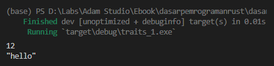
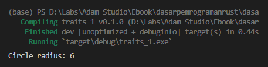

Trait jika diartikan dalam bahasa Indonesia artinya adalah sifat. Chapter ini akan membahas tentang apa itu trait, apa kegunaannya, dan bagaimana cara penerapannya di Rust programming.

Pembahasan chapter ini cukup panjang. Makin mendekati akhir pembahasan, makin berat yang dibahas. Penulis anjurkan jika nantinya setelah section [A.36.4. Trait sebagai tipe parameter](/basic/traits#a424-trait-sebagai-tipe-parameter) dirasa cukup susah untuk dipahami, silakan lanjut ke chapter berikutnya dulu, dan nanti bisa kembali ke pembahasan chapter ini lagi.

> Chapter ini butuh tambahan detail

## A.36.1. Konsep traits

Di Rust kita bisa mendefinisikan trait/sifat, isinya adalah definisi header method yang bisa di-share ke banyak tipe data.

Trait isinya hanya definisi header method (bisa diartikan method tanpa isi). Ketika ada tipe data yang meng-implement suatu trait, maka tipe tersebut wajib untuk menuliskan implementasi method sesuai dengan header method yang ada di trait.

Ada dua bagian penting dalam trait yang harus diketahui:

1. Deklarasi trait
2. Implementasi trait ke tipe data

Perihal point pertama, intinya kita bisa menciptakan trait sesuai kebutuhan. Terlepas dari itu, Rust juga menyediakan cukup banyak traits yang di-implement ke banyak tipe data yang ada di Rust standard library. Beberapa diantaranya:

- Trait `std::fmt::Debug`, digunakan agar data bisa di-print menggunakan formatted print `{:?}`.
- Trait `std::iter::Enumerate`, digunakan agar data bisa di-iterasi menggunakan keyword `for`.
- Trait `std::ops::Add`, di-implementasikan agar data bisa digunakan pada operasi aritmatik penambahan `+`.

> Pada bahasa pemrograman lain, contohnya Java, konsep trait mirip dengan `interface`

Ok, biar lebih jelas, mari lanjut pembelajaran menggunakan contoh. Kita mulai dengan pembahasan tentang cara implementasi trait. Contoh yang digunakan adalah implementasi salah satu trait milik Rust standard library, yaitu trait `std::fmt::Debug`.

## A.36.2. Implementasi trait

Kita pilih trait `std::fmt::Debug` milik Rust standard library untuk belajar cara implementasi trait pada tipe data.

Kegunaan dari trait ini adalah: jika di-implement ke tipe data tertentu maka data dengan tipe tersebut bisa di-print via macro `println` atau macro printing lainnya, dengan menggunakan formatted print `{:?}`.

Trait `Debug` ini diimplementasikan ke pada banyak tipe data yang di Rust standard library, baik itu tipe primitif maupun non-primitif. Contohnya bisa dilihat pada kode berikut:

```rust
let number = 12;
println!("{:?}", number);

let text = String::from("hello");
println!("{:?}", text);
```



Dua variabel di atas sukses di-print tanpa error, karena tipe data `i32` dan `String` *by default* sudah implement trait `std::fmt::Debug`.

> Jika tertarik untuk pengecekan lebih lanjut, silakan lihat di halaman dokumentasi tipe data [i32](https://doc.rust-lang.org/std/primitive.i32.html) dan [String](https://doc.rust-lang.org/std/string/struct.String.html).

Bagaimana dengan custom type yang kita buat sendiri? Misalnya struct.

```rust
fn main() {
    let circle_one = Circle{raidus: 6};
    println!("{:?}", circle_one);
}

struct Circle {
    raidus: i32,
}
```


Hasilnya error, karena struct `Circle` yang dibuat tidak implement trait `std::fmt::Debug`.

Solusi agar tidak error adalah dengan mengimplementasikan trait `std::fmt::Debug` ke tipe `Circle`, dengan itu semua data bertipe `Circle` akan bisa di-print menggunakan formatted print `{:?}`.

> Selain via implementasi trait, tipe data custom bisa di-print dengan cara menambahkan atribut `#[derive(Debug)]` pada definisi tipe data-nya. Namun kita tidak membahas itu pada chapter ini.

Langkah pertama untuk implementasi trait adalah mencari tau terlebih dahulu spesifikasi trait yang ingin diimplementasikan. Trait `std::fmt::Debug` adalah traits milik Rust standard library, maka harusnya spesifikasi bisa dilihat di dokumentasi Rust.

> https://doc.rust-lang.org/std/fmt/trait.Debug.html

Pada URL dokumentasi bisa dilihat kalau trait `Debug` memiliki struktur kurang lebih seperti berikut:

```rust
pub trait Debug {
    fn fmt(&self, f: &mut Formatter<'_>) -> Result<(), Error>;
}
```

Trait `Debug` mempunyai satu spesifikasi method, bernama `fmt` yang detail strukturnya bisa dilihat di atas.

Kita akan implement trait `Debug` ini ke tipe `Circle`, maka wajib hukumnya untuk menuliskan implementasi method sesuai dengan yang ada di trait `Debug`.

Di bawah ini adalah contoh cara implementasi trait.

```rust
struct Circle {
    raidus: i32,
}

impl std::fmt::Debug for Circle {
    fn fmt(&self, f: &mut std::fmt::Formatter<'_>) -> std::fmt::Result {
        write!(f, "Circle radius: {}", self.raidus)
    }
}

fn main() {
    let circle_one = Circle{raidus: 6};
    println!("{:?}", circle_one);
}
```

Ketika program di run, hasilnya sukses tanpa error. Artinya implementasi trait `Debug` pada tipe data struct `Circle` adalah sukses.



Cara implementasi trait ke struct `Circle` memang step-nya agak panjang, tapi penulis yakin lama-kelamaan pasti terbiasa. Ok, sekarang kita bahas satu per satu kode di atas.

### ◉ Struct `Circle`

Block kode definisi struct `Circle` cukup straightforward, isinya hanya 1 property bernama `radius` bertipe `i32`.

### ◉ Block kode `impl X for Y`

Notasi penulisan implementasi trait adalah `impl X for Y`, dimana `X` adalah trait yang ingin diimplementasikan dan `Y` adalah tipe data tujuan implementasi.

Pada contoh di atas, trait `Debug` diimplementasikan ke custom type struct `Circle`. Maka statement-nya adalah:

```rust
impl std::fmt::Debug for Circle {
    // ...
}
```

### ◉ Block kode method dalam `impl`

Block kode `impl` harus diikuti dengan implementasi method. Pada contoh ini, method `fmt` milik trait `Debug` wajib untuk diimplementasikan. Spesifikasi method ini adalah `fn fmt(&self, f: &mut Formatter<'_>) -> Result<(), Error>` (lebih jelasnya silakan lihat dokumentasi).

Silakan copy method tersebut kemudian paste ke dalam block kode `impl` yang sudah ditulis, kemudian tambahkan block kurung kurawal.

```rust
impl std::fmt::Debug for Circle {
    fn fmt(&self, f: &mut std::fmt::Formatter<'_>) -> std::fmt::Result {
        // ...
    }
}
```

Kemudian tulis implementasi method `fmt` dalam block method. Tulis statement macro `write` untuk data string (yang ingin di-print) dengan tujuan adalah variabel `f`.

Di contoh, format `Circle radius: {}` digunakan. Dengan ini nantinya saat printing data, yang muncul adalah text `Circle radius: {}`.

```rust
impl std::fmt::Debug for Circle {
    fn fmt(&self, f: &mut std::fmt::Formatter<'_>) -> std::fmt::Result {
        write!(f, "Circle radius: {}", self.raidus)
    }
}
```

> Tips untuk pengguna visual studio code dengan rust-analyzer extension ter-install, setelah selesai menulis block kode `impl`, cukup jalankan `ctrl+space` atau `cmd+space` untuk men-trigger autocomplete suggestion. Kemudian klik opsi method yang ada disitu, maka kode implementasi method langsung muncul dengan sendirinya.

### ◉ Macro `write`

Macro ini digunakan untuk menuliskan sebuah data ke object tertentu. Pada contoh kita gunakan untuk menulis string `Circle radius: {}` ke variabel `f` yang bertipe `std::fmt::Formatter<'_>`.

Notasi penulisan macro `write`:

```rust
// notasi penulisan
write!(variabel_tujuan, data_yang_ingin_di_print, arg1, arg2, ...);

// contoh penerapan
write!(f, "Circle radius: {}", self.raidus);
```

### ◉ Print data menggunakan formatted print `{:?}`

Step terakhir adalah print variabel `circle` menggunakan macro `println`. Hasilnya sukses, tidak error seperti sebelumnya.

### ◉ Print data menggunakan formatted print `{}`

Coba tambahkan statement `println`, tetapi kali ini gunakan formatted print `{}`, apakah hasilnya juga tidak error?


Hasilnya error, karena trait `std::fmt::Debug` hanya berguna untuk formatted print `{:?}`. Agar data bertipe `Circle` bisa di-print menggunakan formatted print `{}` maka trait `std::fmt::Display` harus di-implementasikan juga.

Ubah kode dengan menambahkan implementasi trait `Display`. Hasilnya kurang lebih seperti ini:

```rust
struct Circle {
    raidus: i32,
}

impl std::fmt::Debug for Circle {
    fn fmt(&self, f: &mut std::fmt::Formatter<'_>) -> std::fmt::Result {
        write!(f, "Circle radius: {}", self.raidus)
    }
}

impl std::fmt::Display for Circle {
    fn fmt(&self, f: &mut std::fmt::Formatter<'_>) -> std::fmt::Result {
        write!(f, "Circle radius: {}", self.raidus)
    }
}
```

> - Link dokumentasi trait `Debug` https://doc.rust-lang.org/std/fmt/trait.Debug.html
> - Link dokumentasi trait `Display` https://doc.rust-lang.org/std/fmt/trait.Display.html

## A.36.3. Membuat custom trait

Pada section di atas kita telah membahas bagaimana cara implementasi traits ke tipe data. Pada bagian ini kita akan belajar tentang cara membuat definisi trait (membuat custom trait).

Masih sama dengan metode sebelumnya, pembelajaran dilakukan dengan praktek. Kita gunakan skenario praktek berikut pada program selanjutnya:

1. Buat struct bernama `Circle`.
2. Buat struct bernama `Square`.
3. Buat trait bernama `Area` dengan isi satu buah method untuk menghitung luas bangun datar (`calculate`).
4. Implementasikan trait `Area` ke dua struct tersebut.

Ok, mari mulai praktekan skenario di atas. Pertama siapkan project dengan struktur berikut:

```bash title="package source code structure"
my_package
│─── Cargo.toml
└─── src
     │─── calculation_spec.rs
     │─── two_dimensional.rs
     └─── main.rs
```

Module `calculation_spec` berisi definisi trait `Area`. Trait ini punya visibility akses publik, isinya hanya satu buah definisi method header bernama `calculate`. Trait ini nantinya diimplementasikan ke struct `Circle` dan juga `Square`, agar nantinya kedua struct tersebut memiliki method `calculate` yang berguna untuk kalkulasi luas bangun datar 2d.

```rust title="src/calculation_spec.rs"
pub trait Area {
    fn calculate(&self) -> f64;
}
```

Kemudian siapkan file `two_dimensional`, isinya dua buah struct: `Circle` dan `Square`. Pada file yang sama, siapkan juga block kode implementasi trait `Area`. Dengan ini maka kedua struct tersebut wajib untuk memiliki method bernama `calculate` dengan isi adalah operasi perhitungan aritmatika untuk mencari luas bangun datar.

```rust title="src/two_dimensional.rs"
pub struct Circle {
    pub radius: i32,
}

impl crate::calculation_spec::Area for Circle {
    fn calculate(&self) -> f64 {
        // PI * (r ^ 2)
        // ada operasi casting ke tipe f64 karena self.radius bertipe i32
        3.14 * (self.radius.pow(2) as f64)
    }
}

pub struct Square {
    pub length: i32,
}

impl crate::calculation_spec::Area for Square {
    fn calculate(&self) -> f64 {
        // (s ^ 2)
        // ada operasi casting ke tipe f64 karena self.length bertipe i32
        self.length.pow(2) as f64
    }
}
```

Bisa dilihat pada kode di atas, deklarasi struct beserta property memiliki visibility publik. Idealnya, saat sturct tersebut digunakan di fungsi `main` nantinya tidak akan ada error terkait visibility akses.

Selanjutnya, pada file `main.rs` siapkan kode yang isinya registrasi module `calculate_spec` dan `two_dimensional`, juga definisi fungsi `main` dengan isi statement pembuatan 2 variabel object untuk masing-masing tipe data struct `Circle` dan `Square`.

```rust title="src/main.rs"
mod calculation_spec;
mod two_dimensional;

use crate::calculation_spec::Area;

fn main() {
    let circle_one = two_dimensional::Circle{ radius: 10 };
    println!("circle area: {}", circle_one.calculate());

    let square_one = two_dimensional::Square{ length: 5 };
    println!("square area: {}", square_one.calculate());
}
```

Method `calculate` milik object bertipe `Circle` dan `Square` diakses untuk kemudian di-print.

Coba jalankan program.


Hmm, error. Padahal trait `Area` sudah publik, dan struct `Circle` & `Square` beserta property-nya juga sudah publik. Tapi masih error.

Error ini disebabkan oleh trait `Area` yang belum di-import di crate root (main). Meskipun kita tidak mengakses trait tersebut secara langsung (melainkan via method `calculate` milik struct `Circle` dan `Square`), diharuskan untuk meng-import-nya juga.

> Detail error beserta solusi dari error ini sebenarnya bisa dilihat di error message. Bagaimana Rust menginformasikan error sangat luar biasa informatif.

Ok, sekarang ubah isi file `main.rs` menjadi seperti ini, kemudian jalankan ulang program. Hasilnya tidak ada error.

```rust title="src/main.rs"
mod calculation_spec;
mod two_dimensional;

use crate::calculation_spec::Area; // <------- tambahkan statement import module

fn main() {
    let circle_one = two_dimensional::Circle{ radius: 10 };
    println!("circle area: {}", circle_one.calculate());

    let square_one = two_dimensional::Square{ length: 5 };
    println!("square area: {}", square_one.calculate());
}
```

O iya, ada beberapa hal baru pada penerapan kode di atas, berikut adalah pembahasannya:

### ◉ Method `pow` untuk operasi pangkat

Method `pow` adalah item milik tipe data numerik (`i8`, `i16`, `i32`, ...) yang fungsinya untuk operasi pangkat.

```rust
3.pow(2); // ===> 3 pangkat 2
8.pow(5); // ===> 8 pangkat 5
```

### ◉ Keyword `as` untuk casting tipe data

Keyword `as` digunakan untuk casting tipe data. Keyword ini bisa diterapkan pada beberapa jenis tipe data, salah satunya adalah semua tipe data numerik.

```rust
1024 as f32; // ===> 1024 dikonversi ke tipe f32, hasinya adalah 1024.0
3.14 as i32; // ===> 3.14 dikonversi ke tipe i32, hasinya 3 karena ada pembulatan
```

## A.36.4. Trait sebagai tipe parameter

Trait bisa digunakan sebagai tipe data parameter sebuah fungsi, contoh notasi penulisannya bisa dilihat pada kode berikut:

```rust
fn calculate_and_print_result(name: String, item: &impl Area) {
    println!("{} area: {}", name, item.calculate());
}
```

Manfaat penerapan trait sebagai tipe data parameter fungsi adalah saat pemanggilan fungsi, parameter tersebut bisa diisi dengan argument data bertipe apapun dengan catatan tipe dari data tersebut mengimplementasikan trait yang sama dengan yang digunakan pada parameter.

Misalnya, pada fungsi `calculate_and_print_result` di atas yang parameter ke-2 bertipe `&impl Area`, nantinya saat fungsi tersebut dipanggil, kita bisa sisipi parameter ke-2 dengan object `circle_one` ataupun `circle_two`.

```rust
let circle_one = two_dimensional::Circle{ radius: 10 };
calculate_and_print_result("circle".to_string(), &circle_one);

let square_one = two_dimensional::Square{ length: 5 };
calculate_and_print_result("square".to_string(), &square_one);
```

> `&impl Area` ini tipe data pointer ya, tipe non-pointer-nya adalah `impl Area`. Disini digunakan tipe data pointer untuk antisipasi *move semantics* pada tipe data custom type (borrowing).

Dimisalkan, fungsi tersebut parameter `item`-nya bisa menampung beberapa jenis traits, kira-kira apakah bisa dibuat seperti itu? Misalnya ada trait lain bernama `Circumference`, dan parameter `item` milik fungsi `calculate_and_print_result` harus bisa menampung data baik dari tipe yang implement trait `Area` ataupun trait `Circumference`.

Hal seperti itu bisa, caranya dengan menggunakan notasi penulisan berikut:

```rust
fn calculate_and_print_result(name: String, item: &(impl Area + Circumference)) {
    println!("{} area: {}", name, item.calculate());
    println!("{} circumference: {}", name, item.calculateCircumference());
}
```

Tambahkan tanda `()` sebelum `impl NamaTrait`, lalu ganti `NamaTrait` dengan traits apa saja yang diinginkan dengan separator tanda `+`.

## A.36.5. Trait bound syntax

Penerapan trait sebagai parameter fungsi juga bisa dituliskan dalam notasi yang memanfaatkan generic. Teknik penulisan ini disebut dengan *trait bound syntax*.

Contohnya bisa dilihat pada kode berikut. Ada generic bernama `T` yang merepresentasikan trait `Area`, kemudian pada definisi parameter ke-2 fungsi (yaitu parameter `item`) tipenya menggunakan `&T`. Tipe `&T` disini adalah ekuivalen dengan `&impl Area`.

```rust
fn calculate_and_print_result2<T: Area>(name: String, item: &T) {
    println!("{} area: {}", name, item.calculate());
}
```

Dimisalkan jika ada lebih dari satu trait yang digunakan sebagai tipe data paramater (misalnya trait `Area` dan `Circumference`), maka penulisannya seperti ini:

```rust
fn calculate_and_print_result2<T: Area + Circumference>(name: String, item: &T) {
    println!("{} area: {}", name, item.calculate());
    println!("{} circumference: {}", name, item.calculateCircumference());
}
```

Satu tambahan contoh lagi untuk ilustrasi yang lebih kompleks:

```rust
fn some_function<T: Display + Clone, U: Clone + Debug>(t: &T, u: &U) -> i32 {
    // ...
}
```

Pada contoh di atas fungsi `some_function` memiliki 2 generics param, yaitu `T` dan `U`.

- `T` merepresentasikan trait `Display` dan `Clone`
- `U` merepresentasikan trait `Clone` dan `Debug`

> Lebih jelasnya mengenai generics dibahas pada chapter [Generics](/basic/generics)

## A.36.6. Trait `where` clause

Ada lagi alternatif penulisan trait bound syntax, yaitu menggunakan keyword `where`. Contoh pengaplikasiannya bisa dilihat pada kode berikut. Semua definisi fungsi di bawah ini adalah ekuivalen.

```rust
fn calculate_and_print_result(name: String, item: &(impl Area + Circumference)) {
    println!("{} area: {}", name, item.calculate());
    println!("{} circumference: {}", name, item.calculateCircumference());
}

fn calculate_and_print_result2<T: Area + Circumference>(name: String, item: &T) {
    println!("{} area: {}", name, item.calculate());
    println!("{} circumference: {}", name, item.calculateCircumference());
}

fn calculate_and_print_result3<T>(name: String, item: &T) where T: Area + Circumference {
    println!("{} area: {}", name, item.calculate());
}

fn calculate_and_print_result4<T>(name: String, item: &T)
where
    T: Area + Circumference,
    // ... other generic params if exists
{
    println!("{} area: {}", name, item.calculate());
}
```

> Lebih jelasnya mengenai generics dibahas pada chapter [Generics](/basic/generics)

## A.36.7. Trait sebagai return type

Trait bisa juga digunakan sebagai tipe data return value. Caranya gunakan notasi penulisan `impl NamaTrait` sebagai tipe data.

Contohnya bisa dilihat pada kode berikut. Ada dua fungsi baru dideklarasikan:

1. Fungsi `new_circle` dengan return type adalah `impl Area`, dan data yang dikembalikan adalah bertipe `two_dimensional::Circle`.
1. Fungsi `new_square` dengan return type adalah `impl Area`, dan data yang dikembalikan adalah bertipe `two_dimensional::Square`.

```rust
fn main() {
    let circle_one = new_circle(5);
    calculate_and_print_result4("circle".to_string(), &circle_one);

    let square_one = new_square(10);
    calculate_and_print_result4("square".to_string(), &square_one);
}

fn new_circle(radius: i32) -> impl Area {
    let data = two_dimensional::Circle{
        radius
    };
    data
}

fn new_square(length: i32) -> impl Area {
    two_dimensional::Square{
        length
    }
}

fn calculate_and_print_result4<T>(name: String, item: &T)
where
    T: Area,
{
    println!("{} area: {}", name, item.calculate());
}
```

Salah satu konsekuensi dalam penerapan trait sebagai return type adalah: tipe data milik nilai yang dikembalikan terdeteksi sebagai tipe trait. Contohnya variabel `circle_one` di atas, tipe data-nya bukan `Circle`, melainkan `impl Area`.

Tipe data aslinya tetap bisa diakses, tapi butuh tambahan effort. Lebih jelasnya dibahas pada chapter [Trait → Conversion (From & Into)](/wip/trait-conversion-from-into).

---

## Catatan chapter 📑

### ◉ Source code praktek

<pre>
    <a href="https://github.com/novalagung/dasarpemrogramanrust-example/tree/master/traits">
        github.com/novalagung/dasarpemrogramanrust-example/../traits
    </a>
</pre>

### ◉ Work in progress

- Pembahasan tentang trait associated types
- Pembahasan tentang trait bounds untuk implementasi method kondisional
- Pembahasan tentang trait overloading

### ◉ Referensi

- https://doc.rust-lang.org/book/ch10-02-traits.html
- https://doc.rust-lang.org/std/primitive.i32.html
- https://doc.rust-lang.org/std/fmt/trait.Debug.html
- https://doc.rust-lang.org/std/fmt/trait.Display.html
- https://doc.rust-lang.org/std/string/struct.String.html

---
