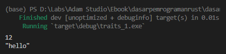
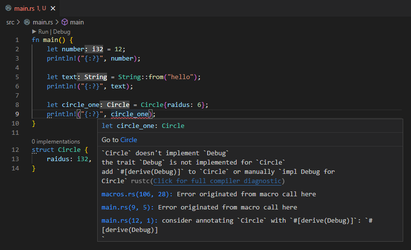
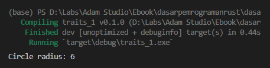
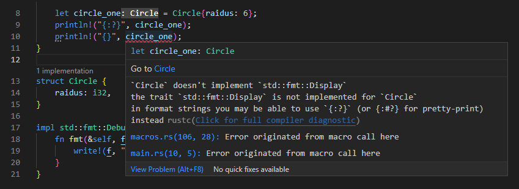

Trait jika diartikan dalam Bahasa Indonesia artinya adalah sifat. Chapter ini akan membahas tentang apa itu trait, apa kegunaannya, dan bagaimana cara penerapannya di Rust programming.

## A.36.1. Konsep traits

Di Rust kita bisa mendefinisikan trait/sifat, isinya adalah definisi header method yang bisa di-share ke banyak tipe data.

Trait isinya hanya definisi header method (bisa diartikan method tanpa isi). Ketika ada tipe data yang meng-implement suatu trait, maka tipe tersebut wajib untuk menuliskan implementasi method sesuai dengan header method yang ada di trait.

> Pada bahasa pemrograman lain, contohnya Java, konsep trait mirip dengan `interface`

Ada dua bagian penting dalam trait yang harus diketahui:

1. Deklarasi trait
2. Implementasi trait ke tipe data

Perihal point pertama, intinya kita bisa menciptakan trait sesuai kebutuhan. Terlepas dari itu, Rust juga menyediakan cukup banyak traits yang diimplement ke banyak tipe data yang ada di Rust standard library. Beberapa di antaranya:

- Trait `std::fmt::Debug`, digunakan agar data bisa di-print menggunakan formatted print `{:?}`.
- Trait `std::iter::Iterator`, digunakan untuk operasi iterasi data.
- Trait `std::ops::Add`, diimplementasikan agar data bisa digunakan pada operasi aritmatik penambahan `+`.

Ok, biar lebih jelas, mari lanjut pembelajaran menggunakan contoh. Kita mulai dengan pembahasan tentang cara implementasi trait. Contoh yang digunakan adalah implementasi salah satu trait milik Rust standard library, yaitu trait `std::fmt::Debug`.

### ◉ Jenis traits berdasarkan tempat dideklarasikannya

Berdasarkan tempat dimana traits dibuat, ada 2 jenis traits:

- **External traits** (atau foreign traits).

    Yaitu traits yang tempat dideklarasikannya berada di luar crate kode yang ditulis. Misalnya, trait `std::fmt::Debug` dan `std::ops::Add`, keduanya merupakan external traits yang berada di crate `std` atau crate Rust Standard Library.

    Pada kasus seperti ini, kita biasanya hanya fokus ke cara memakai external traits yang sudah ada.

- **Local traits**.

    Adalah traits yang kita ciptakan di crate yang berada di dalam package/project yang sedang kita kerjakan.

Chapter ini fokusnya adalah pembahasan tentang dasar implementasi **external traits** dan cara kerjanya. Setelah itu, kita juga akan lihat sedikit contoh `local trait` supaya bedanya lebih terasa.

### ◉ Aturan penting dalam implementasi trait

Di Rust ada aturan yang perlu diingat:

- `external trait` boleh diimplementasikan ke `local type`
- `local trait` boleh diimplementasikan ke tipe apa pun
- `external trait` tidak boleh diimplementasikan ke `external type`

Aturan ini biasanya disebut *orphan rule* atau *coherence rule*.

Kalau dibahas dengan bahasa sederhana, Rust ingin mencegah dua crate berbeda saling berebut implementasi untuk trait dan type yang sama. Dengan begitu, perilaku program tetap jelas dan tidak ambigu.

Kalau kita tetap ingin memakai `external trait` pada `external type`, solusinya adalah memakai *wrapper pattern*. Caranya, kita bungkus type external tersebut ke type local buatan kita sendiri, lalu implementasikan trait ke wrapper itu.

Contoh sederhananya:

```rust
struct Wrapper(Vec<String>);

impl std::fmt::Display for Wrapper {
    fn fmt(&self, f: &mut std::fmt::Formatter<'_>) -> std::fmt::Result {
        write!(f, "{:?}", self.0)
    }
}
```

Pada contoh di atas:

- `Vec<String>` adalah `external type`
- `Display` adalah `external trait`
- `Wrapper` adalah `local type`

Karena `Wrapper` adalah type lokal, kita bebas mengimplementasikan trait ke sana.

Pemakaiannya di `main` bisa seperti ini:

```rust
fn main() {
    let v = Wrapper(vec![String::from("a"), String::from("b")]);
    println!("{}", v);
}
```

Output:

> ["a", "b"]

### ◉ Contoh local trait

Sekarang kita coba kebalikannya: membuat trait sendiri, lalu mengimplementasikannya ke type yang sudah ada.

Misalnya kita punya trait sederhana bernama `Message`:

```rust
trait Message {
    fn log(&self);
}
```

Lalu kita implementasikan ke `String`:

```rust
impl Message for String {
    fn log(&self) {
        println!("{}", self);
    }
}
```

Karena `Message` adalah `local trait`, kita boleh mengimplementasikannya ke type `String` yang berasal dari standard library.

Pemakaiannya di `main` akan terlihat seperti ini:

```rust
fn main() {
    let s = String::from("hello");
    s.log();
}
```

Output:

> hello

## A.36.2. Implementasi trait

Kita pilih trait `std::fmt::Debug` milik Rust standard library untuk belajar cara implementasi trait pada tipe data.

Kegunaan dari trait ini adalah: jika diimplement ke tipe data tertentu maka data dengan tipe tersebut bisa di-print via macro `println` atau macro printing lainnya, dengan menggunakan formatted print `{:?}`.

Trait `Debug` ini diimplementasikan ke pada banyak tipe data yang di Rust standard library, baik itu tipe primitif maupun non-primitif. Contohnya bisa dilihat pada kode berikut:

```rust
let number = 12;
println!("{:?}", number);

let text = String::from("hello");
println!("{:?}", text);
```



Dua variabel di atas sukses di-print tanpa error, karena tipe data `i32` dan `String` *by default* sudah implement trait `std::fmt::Debug`.

> Jika tertarik untuk pengecekan lebih lanjut, silakan lihat di halaman dokumentasi tipe data [i32](https://doc.rust-lang.org/std/primitive.i32.html) dan [String](https://doc.rust-lang.org/std/string/struct.String.html).

Bagaimana dengan custom type yang kita buat sendiri? Misalnya struct.

```rust
fn main() {
    let circle_one = Circle{radius: 6};
    println!("{:?}", circle_one);
}

struct Circle {
    radius: i32,
}
```



Hasilnya error, karena struct `Circle` yang dibuat tidak implement trait `std::fmt::Debug`.

Solusi agar tidak error adalah dengan mengimplementasikan trait `std::fmt::Debug` ke tipe `Circle`, dengan begitu semua data bertipe `Circle` akan bisa di-print menggunakan formatted print `{:?}`.

> Selain via implementasi trait, tipe data custom bisa di-print dengan cara menambahkan atribut `#[derive(Debug)]` pada definisi tipe data-nya. Namun kita tidak membahas itu pada chapter ini.

Langkah pertama untuk implementasi trait adalah mencari tau terlebih dahulu spesifikasi trait yang ingin diimplementasikan. Trait `std::fmt::Debug` adalah traits milik Rust standard library, maka harusnya spesifikasi bisa dilihat di dokumentasi Rust.

> https://doc.rust-lang.org/std/fmt/trait.Debug.html

Pada URL dokumentasi bisa dilihat kalau trait `Debug` memiliki struktur kurang lebih seperti berikut:

```rust
pub trait Debug {
    fn fmt(&self, f: &mut Formatter<'_>) -> Result<(), Error>;
}
```

Trait `Debug` mempunyai satu spesifikasi method, bernama `fmt` yang detail strukturnya bisa dilihat di atas.

Kita akan implement trait `Debug` ini ke tipe `Circle`, maka wajib untuk menuliskan implementasi method sesuai dengan yang ada di trait `Debug`.

Di bawah ini adalah contoh cara implementasi trait.

```rust
struct Circle {
    radius: i32,
}

impl std::fmt::Debug for Circle {
    fn fmt(&self, f: &mut std::fmt::Formatter<'_>) -> std::fmt::Result {
        write!(f, "Circle radius: {}", self.radius)
    }
}

fn main() {
    let circle_one = Circle{radius: 6};
    println!("{:?}", circle_one);
}
```

Ketika program di-run, hasilnya sukses tanpa error. Artinya implementasi trait `Debug` pada tipe data struct `Circle` adalah sukses.



Cara implementasi trait ke struct `Circle` memang step-nya agak panjang, tapi penulis yakin lama-kelamaan pasti terbiasa. Ok, sekarang kita bahas satu per satu kode di atas.

### ◉ Struct `Circle`

Block kode definisi struct `Circle` cukup straightforward, isinya hanya 1 property bernama `radius` bertipe `i32`.

### ◉ Block kode `impl X for Y`

Notasi penulisan implementasi trait adalah `impl X for Y`, yang mana `X` adalah trait yang ingin diimplementasikan dan `Y` adalah tipe data tujuan implementasi.

Pada contoh di atas, trait `Debug` diimplementasikan ke custom type struct `Circle`. Maka statement-nya adalah:

```rust
impl std::fmt::Debug for Circle {
    // ...
}
```

### ◉ Block kode method dalam `impl`

Block kode `impl` harus diikuti dengan implementasi method. Pada contoh ini, method `fmt` milik trait `Debug` wajib untuk diimplementasikan. Spesifikasi method ini adalah `fn fmt(&self, f: &mut Formatter<'_>) -> Result<(), Error>` (lebih jelasnya silakan lihat dokumentasi).

Silakan copy method tersebut kemudian paste ke dalam block kode `impl` yang sudah ditulis, kemudian tambahkan block kurung kurawal.

```rust
impl std::fmt::Debug for Circle {
    fn fmt(&self, f: &mut std::fmt::Formatter<'_>) -> std::fmt::Result {
        // ...
    }
}
```

Kemudian tulis implementasi method `fmt` dalam block method. Di sini kita memakai macro `write` untuk menulis data string yang ingin di-print ke variabel `f`.

Di contoh, format `Circle radius: {}` digunakan. Dengan ini nantinya saat printing data, yang muncul adalah text `Circle radius: {}`.

```rust
impl std::fmt::Debug for Circle {
    fn fmt(&self, f: &mut std::fmt::Formatter<'_>) -> std::fmt::Result {
        write!(f, "Circle radius: {}", self.radius)
    }
}
```

> Tips untuk pengguna visual studio code dengan rust-analyzer extension ter-install: setelah selesai menulis block kode `impl`, cukup jalankan `ctrl+space` atau `cmd+space` untuk men-trigger autocomplete suggestion. Kemudian klik opsi method yang ada di situ, maka kode implementasi method langsung muncul dengan sendirinya.

### ◉ Macro `write`

Macro ini digunakan untuk menuliskan sebuah data ke object tertentu. Pada contoh kita gunakan untuk menulis string `Circle radius: {}` ke variabel `f` yang bertipe `std::fmt::Formatter<'_>`.

Notasi penulisan macro `write`:

```rust
// notasi penulisan
write!(variabel_tujuan, data_yang_ingin_di_print, arg1, arg2, ...);

// contoh penerapan
write!(f, "Circle radius: {}", self.radius);
```

### ◉ Print data menggunakan formatted print `{:?}`

Step terakhir adalah print variabel `circle` menggunakan macro `println`. Hasilnya sukses, tidak error seperti sebelumnya.

### ◉ Print data menggunakan formatted print `{}`

Coba tambahkan statement `println`, tetapi kali ini gunakan formatted print `{}`, apakah hasilnya juga tidak error?



Hasilnya error, karena trait `std::fmt::Debug` hanya berguna untuk formatted print `{:?}`. Kalau ingin `Circle` bisa di-print dengan `{}`, maka trait `std::fmt::Display` juga harus diimplementasikan.

Ubah kode dengan menambahkan implementasi trait `Display`. Hasilnya kurang lebih seperti ini:

```rust
struct Circle {
    radius: i32,
}

impl std::fmt::Debug for Circle {
    fn fmt(&self, f: &mut std::fmt::Formatter<'_>) -> std::fmt::Result {
        write!(f, "Circle radius: {}", self.radius)
    }
}

impl std::fmt::Display for Circle {
    fn fmt(&self, f: &mut std::fmt::Formatter<'_>) -> std::fmt::Result {
        write!(f, "Circle radius: {}", self.radius)
    }
}
```

> - Link dokumentasi trait `Debug` https://doc.rust-lang.org/std/fmt/trait.Debug.html
> - Link dokumentasi trait `Display` https://doc.rust-lang.org/std/fmt/trait.Display.html

> Lebih detail tentang trait bound, wrapper pattern, dan aturan implementasi trait untuk type lokal maupun external ada di chapter [Traits ➜ Advanced](/basic/advanced-traits).

---

## Catatan chapter 📑

### ◉ Source code praktik

<pre>
    <a href="https://github.com/novalagung/dasarpemrogramanrust-example/tree/master/traits">
        github.com/novalagung/dasarpemrogramanrust-example/../traits
    </a>
</pre>

### ◉ Work in progress

- Pembahasan tentang trait bounds untuk implementasi method kondisional
- Pembahasan tentang trait overloading

### ◉ Referensi

- https://doc.rust-lang.org/book/ch10-02-traits.html
- https://doc.rust-lang.org/std/fmt/trait.Debug.html
- https://doc.rust-lang.org/std/fmt/trait.Display.html
- https://doc.rust-lang.org/std/string/struct.String.html
