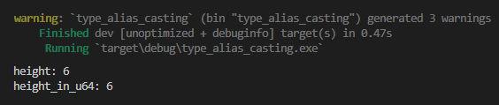
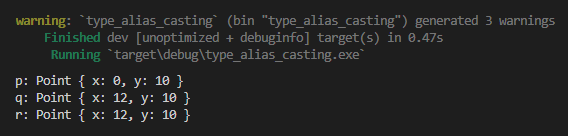
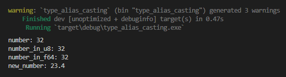
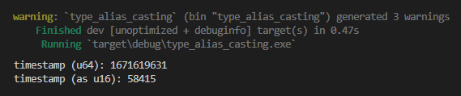
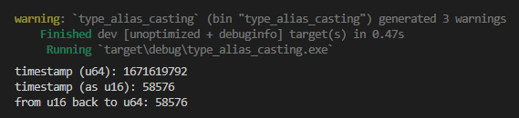

Chapter ini membahas tentang type alias dan juga casting (explicit conversion) pada tipe data primitif scalar.

> Pembahasan mengenai conversion pada tipe data non-primitif scalar (seperti struct dan enum) dibahas pada chapter [Trait ➜ Conversion (From & Into)](#/wip/trait-conversion-from-into)

## A.27.1. Type Alias

Type alias adalah pemberian nama baru ke suatu tipe data. Cara pembuatan alias sangat mudah yaitu menggunakan keyword `type`.

Berikut adalah 2 contoh penerapan type alias untuk membuat tipe data baru:

```rust
type Inch = u64;
```

Tipe data `Inch` di atas adalah tipe baru yang merupakan alias dari tipe `u64`.

```rust
#[derive(Debug)]
struct Point {
    x: i32,
    y: i32,
}
type Coordinate = Point;
```

Struct `Point` di atas dibuat memiliki 2 item (`x` dan `y`). Dari struct tersebut dibuat tipe data baru bernama `Coordinate` yang merupakan alias dari `Point`.

## A.27.2. Casting tipe data & alias

Casting adalah pengubahan tipe data tertentu ke tipe data lain yang keduanya masih compatible. Metode casting bisa diterapkan antara tipe data asli dan alias, dan juga antar tipe data scalar lainnya (yang memang compatible satu sama lain).

Pada contoh berikut, tipe data `Inch` di cast ke tipe data `u64` menggunakan keyword `as`.

```rust
let height: Inch = 6;
println!("height: {height}");

let height_in_u64 = height as u64;
println!("height_in_u64: {height_in_u64}");
```



Contoh lainnya bisa dilihat pada kode berikut, variabel `p` dibuat menggunakan struct `Point`, kemudian di-cast ke tipe `Coordinate` sebagai data mutable lalu diubah nilai itemnya, dan terakhir di-cast sekali lagi ke tipe `Point`.

```rust
let p = Point{ x: 0, y: 10 };
println!("p: {:?}", p);

let mut q: Coordinate = p as Coordinate;
q.x = 12;
println!("q: {:?}", q);

let r: Point = q as Point;
println!("r: {:?}", r);
```



> Operasi assignment dan type casting pada custom type `struct` membuat owner-nya berpindah. Perpindahan owner ini disebut dengan *move semantics*.
>
> Lebih jelasnya perihal topik ini dibahas pada chapter [Ownership](/basic/ownership).

## A.27.3. Casting antar tipe scalar

Casting antar tipe data numerik dilakukan dengan cara yang sama seperti casting antar tipe data dan alias. Contoh:

```rust
let number = 32;
println!("number: {number}");

let number_in_u8 = number as u8;
println!("number_in_u8: {number_in_u8}");

let number_in_f64 = number as f64;
println!("number_in_f64: {number_in_f64}");

let new_number = 23.4 as f32;
println!("new_number: {new_number}");
```



Tipe data integer, unsigned integer, dan floating point bisa di-cast satu sama lain.

> Selain itu, tipe `char` juga bisa di-cast ke tipe lainnya (selain tipe float)

## A.27.4. Konsekuensi casting tipe numerik

Salah satu hal yang harus diperhatikan dalam casting adalah pemilihan tipe data beserta size yang tepat.

Setiap tipe data memiliki besaran alokasi memory yang berbeda. Sebagai contoh, tipe data `u64` bisa menampung angka yang jauh lebih besar dibanding `u16`.

Bagaimana jika misalnya ada data numerik yang angkanya cukup besar dan hanya bisa ditampung pada tipe data `u64` (atau tipe data lainnya yang size-nya lebih besar), kemudian tipe tersebut di-cast ke tipe data yang lebih kecil contohnya `u16`?

Sebagai contoh pada kode berikut, variabel `timestamp` bertipe `u64` menampung data unix timestamp waktu sekarang. Data tersebut di cast ke tipe yang lebih kecil yaitu `u16`.

```rust
use std::time::{SystemTime, UNIX_EPOCH};

let timestamp: u64 = SystemTime::now().duration_since(UNIX_EPOCH).unwrap().as_secs();

println!("timestamp (u64): {timestamp}");
println!("timestamp (as u16): {}", timestamp as u16);
```



Bisa dilihat hasilnya angka menjadi lebih kecil, ini karena `u16` tidak bisa menampung nilai numerik sebesar `u64`. Lalu bagaimana jika angka tersebut di-cast lagi ke tipe `u64`?

```rust
let timestamp: u64 = SystemTime::now().duration_since(UNIX_EPOCH).unwrap().as_secs();
println!("timestamp (u64): {timestamp}");
println!("timestamp (as u16): {}", timestamp as u16);
println!("from u16 back to u64: {}", (timestamp as u16) as u64);
```



Hasilnya adalah nilai tetap tidak akan kembali seperti semula. Jadi silakan berhati-hati dalam melakukan operasi casting antar tipe data numerik.

### ◉ Module `std::time`

`SystemTime` dan `UNIX_EPOCH` keduanya merupakan item milik module `std::time`.

Pengaksesan `SystemTime::now()` mengembalikan data waktu sekarang, dan jika di chain dengan method `duration_since(UNIX_EPOCH)` hasilnya adalah data duration bertipe `Result<Duration, SystemTimeError>`.

Dari data tersebut bisa kita chain lagi dengan method `unwrap` dan `as_second` untuk mengambil datanya dalam bentuk `u64`.

> - Lebih jelasnya mengenai module `std::time` dibahas pada chapter [DateTime](/basic/datetime)
> - Lebih jelasnya mengenai tipe data `Result` dibahas pada chapter [Tipe Data ➜ Result](/basic/result-type)

---

## Catatan chapter 📑

### ◉ Source code praktik

<pre>
    <a href="https://github.com/novalagung/dasarpemrogramanrust-example/tree/master/type_alias_casting">
        github.com/novalagung/dasarpemrogramanrust-example/../type_alias_casting
    </a>
</pre>

### ◉ Referensi

- https://doc.rust-lang.org/rust-by-example/types/alias.html
- https://doc.rust-lang.org/rust-by-example/types/cast.html
