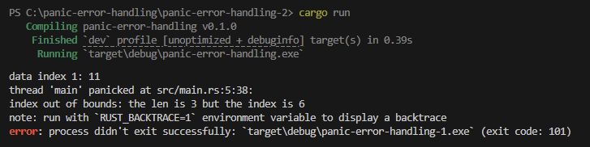
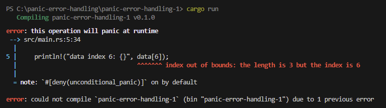
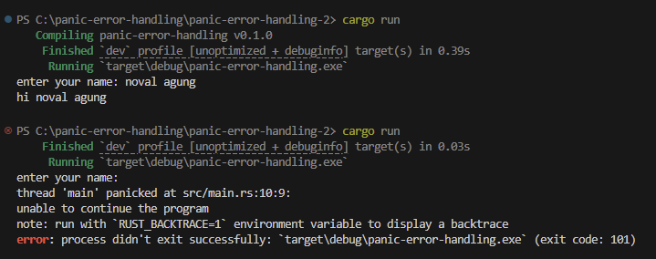

Error handling atau penanganan error adalah salah satu aspek penting dalam pemrograman selalu umum. Rust mengenal 2 jenis error yaitu **unrecoverable error (panic error)** dan **recoverable error**. Pembahasan chapter ini fokus pada unrecoverable error atau panic error.

## A.54.1. Unrecoverable error (RUNTIME error & COMPILE-TIME error)

*Unrecoverable error* adalah error yang tidak bisa ditangani, entah itu karena memang disengaja atau karena ada bug fatal yang menyebabkan program mendapati error jenis ini sehingga program *crash* dan berhenti secara paksa.

Salah satu operasi yang menyebabkan panic adalah pengaksesan elemen vector menggunakan index di luar kapasitas vector. Contoh:

```rust
fn main() {
    let data = vec![10, 11, 23];

    println!("data index 1: {}", data[1]);
    println!("data index 6: {}", data[6]);
    println!("data index 2: {}", data[2]);
}
```

Pengaksesan index ke-6 vector `data` menghasilkan panic karena vector tersebut hanya berisi 3 elemen.



Apa yang bisa dilakukan ketika panic muncul?

- Jika panic muncul ketika program sudah di production, program akan crash karena bug pengaksesan error di atas.
- Jika panic muncul saat pengembangan, maka bisa diperbaiki kodenya, bisa dengan menambahkan pengecekan kapasitas index vector atau lainnya.

### ◉ Perbedaan panic saat pengaksesan vector dan error saat pengaksesan array

Coba ubah kode di atas, tipe data variabel `data` ubah dari vector ke array. Lalu jalankan ulang program.

```rust
fn main() {
    let data = [10, 11, 23];

    println!("data index 1: {}", data[1]);
    println!("data index 6: {}", data[6]);
    println!("data index 2: {}", data[2]);
}
```

Error masih muncul, tapi pesan error-nya berbeda.



2 program yang dijalankan keduanya error tapi error-nya sangat berbeda.

<table>
<tr>
<td>Pengaksesan elemen vector di luar kapastias memunculkan error saat <b>RUNTIME</b>. Penjelasannya:</td>
</tr>
<tr>
<td>

- **RUNTIME error** menandakan kode program sudah berhasil dikompilasi dan program juga berhasil di eksekusi.
    - Silakan lihat gambar pertama, ada keterangan *Finished* dan *Running*.
    - Error ini masuk kategori **panic-level error** atau **panic**.
- Error muncul ketika baris kode `println!("data index 6: {}", data[6]);` dieksekusi.
- Kode sebelum baris tersebut masih sempat dieksekusi.
    - Silakan lihat gambar pertama, output `data index 1: 11` sempat muncul sebelum error.
- Tipe data vector tidak tidak mampu mengetahui kapasitas datanya saat kompilasi, inilah kenapa error bisa lolos kompilasi.

</td>
</tr>
</table>

<table>
<tr>
<td>Sedangkan pengaksesan elemen array di luar kapastias memunculkan error saat <b>COMPILE TIME</b>. Penjelasannya:</td>
</tr>
<tr>
<td>

- **COMPILE TIME error** menandakan kode program gagal dikompilasi dan tidak sampai dieksekusi.
    - Silakan lihat gambar ke-dua, ada keterangan *Compiling* diikuti dengan error, dan keterangan `could not compile`.
    - Error ini masuk kategori **compile-time-level error** atau cukup **error**.
- Error muncul saat compiler memproses baris kode `println!("data index 6: {}", data[6]);`.
- Tipe data array kapasitasnya sudah bisa diketahui oleh compiler saat kompilasi, menyebabkan proses kompilasi gagal.

</td>
</tr>
</table>

## A.54.2. Macro `panic!()`

Telah kita pelajari bahwa panic muncul karena *flaw* atau cacat program, disebabkan oleh bug di kode program. Selain itu, panic bisa dimunculkan dengan sengaja menggunakan macro `panic!()`.

Cara penggunaannya cukup dengan memanggil macro tersebut diikuti dengan argument berisi string keterangan panic errornya.

Pada contoh berikut, program sederhana dibuat untuk menangkap inputan nama user untuk kemudian di-print. Jika user tidak menginputkan apapun, maka panic sengaja dimunculkan via pemanggilan macro `panic!()`.

```rust
use std::io;
use std::io::Write;

fn main() {
    print!("enter your name: ");
    let _ = io::stdout().flush();

    let name = read_entry();
    if name.is_empty() {
        panic!("unable to continue the program");
    }

    println!("hi {}", name);
}

pub fn read_entry() -> String {
    let mut message = String::new();
    let reader_res = io::stdin().read_line(&mut message);

    if reader_res.is_err() {
        return message;
    }

    message.trim().to_string()
}
```

Output program:



Program dieksekusi 2 kali:

1. Eksekusi pertama, inputan `noval agung` digunakan. Hasilnya program berjalan sesuai desain.
2. Pada eksekusi ke-2, tidak ada inputan yang ditulis, dan langsung tekan tombol enter, hasilnya panic sengaja dimunculkan via macro `panic!()` dengan pesan `unable to continue the program`.

### ◉ Statement `io::stdout().flush()`

Dibanding dengan beberapa chapter sebelumnya yang juga ada praktek menangkap inputan user, kode program yang ditulis kali ini disisipi statement baru yaitu `io::stdout().flush()`. Kode tersebut berguna untuk mem-*flush* output STDOUT yang muncul, karena default output STDOUT adalah di-*buffer* oleh Rust.

Jika tidak di-flush, ada kemungkinan text `enter your name: ` muncul setelah user mengisi inputan lalu menekan tombol *enter*.

> Untuk menggunakan stdout flush, path `std::io::Write` harus di-import terlebih dahulu.

---

## Catatan chapter 📑

### ◉ Source code praktik

<pre>
    <a href="https://github.com/novalagung/dasarpemrogramanrust-example/tree/master/unrecoverable_panic_error">
        github.com/novalagung/dasarpemrogramanrust-example/../unrecoverable_panic_error
    </a>
</pre>

### ◉ Chapter relevan lainnya

- [Error ➜ Recoverable Error & Error Handling](#)

### ◉ Referensi

- https://doc.rust-lang.org/book/ch09-01-unrecoverable-errors-with-panic.html
- https://doc.rust-lang.org/book/ch09-03-to-panic-or-not-to-panic.html
