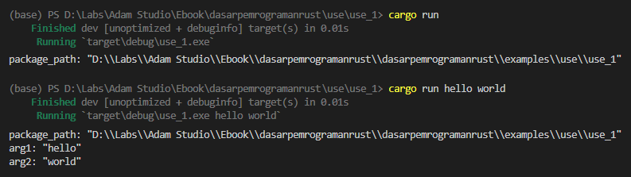
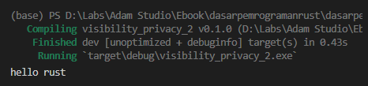

Keyword `use` digunakan untuk dua hal, yaitu *import* path dan *re-export* path. Sebenarnya kita telah mempelajari kedua penerapan tersebut pada beberapa chapter sebelumnya. Pada chapter ini kita akan ulang lagi pembahasan agar lebih jelas.

## A.29.1. Keyword `use` untuk import path

Untuk bisa menggunakan sebuah item dari crate lain, entah itu dari rust standard library crate maupun 3rd-party, caranya cukup dengan menuliskan path item. Contohnya bisa dilihat dibawah ini, fungsi `current_dir` digunakan untuk mengambil path dari current directory. Fungsi tersebut merupakan item dari module `std::env`, maka untuk mengaksesnya kita harus menuliskan path secara lengkap.

```rust
let package_path = std::env::current_dir().unwrap();
println!("package_path: {:?}", package_path);
```

Selain cara di atas, bisa juga gunakan keyword `use` untuk meng-import fungsi `current_dir` ke kode program, dengannya kita tidak perlu menulis path secara lengkap. Contoh:

```rust
use std::env::current_dir;

fn main() {
    let package_path = current_dir().unwrap();
    println!("package_path: {:?}", package_path);
}
```


> Di contoh, pengaksesan current directory di-chain dengan method `unwrap` karena nilai balik fungsi `current_dir` adalah bertipe `std::io::Result`.
>
> Lebih jelasnya mengenai tipe tersebut dibahas pada chapter terpisah, [Tipe Data → Result](/basic/result-type)

### ◉ Import items dari module yang sama

Pada contoh selanjutnya ini, kita akan coba praktekan penerapan fungsi `std::env::args` untuk mengambil *argument* saat eksekusi program, kemudian menampilkannya ke layar.

Ok, berarti akan ada 2 path yang akan di-import:

```rust
use std::env::current_dir;
use std::env::args;
```

Ada notasi penulisan import path lainnya yang bisa digunakan jika path-nya memiliki parent segment yang sama. Contohnya seperti di atas, kedua fungsi tersebut memiliki parent segment path yang sama yaitu `std::env`. Yang seperti ini bisa dituliskan juga dengan notasi penulisan import berikut:

```rust
use std::env::{current_dir, args};
```

Ok, lanjut ke praktik. Silakan tulis kode berikut:

```rust
use std::env::{current_dir, args};

fn main() {
    let package_path = current_dir().unwrap();
    println!("package_path: {:?}", package_path);

    for i in 1..=args().len() {
        let each_arg = args().nth(i);
        if each_arg != None {
            println!("arg{}: {:?}", i, each_arg.unwrap());
        }
    }
}
```

Fungsi `std::env::args` digunakan untuk mengambil argument eksekusi program baik eksekusi via `cargo run` ataupun via pemanggilan binary. Fungsi tersebut nilai baliknya adalah iterator, jadi bisa digunakan dalam blok kode `for in` dengan mudah.

Statement `args().nth(i)` mengembalikan nilai argument pada index ke-`i` dalam tipe `Option`, dan nilai tersebut bisa saja tidak ada (direpresentasikan dengan keyword `None`). Oleh karena itu penting untuk dicek terlebih dahulu menggunakan keyword `if`. Jika memang nilainya adalah selain `None`, gunakan `unwrap` untuk mengambil nilainya dalam tipe data `String`.

> - Lebih jelasnya mengenai Iterator akan dibahas pada chapter terpisah, [Trait → Iterator](/wip/trait-iterator).
> - Lebih jelasnya mengenai tipe `Option` akan dibahas pada chapter terpisah, [Tipe Data → Option](/basic/option-type).

Silakan coba jalankan menggunakan dua command, yang pertama `cargo run`, kemudian `cargo run tulis argumen di sini dengan pembatas spasi`.

Bisa dilihat pada gambar berikut, jika ada argument disisipkan dalam eksekusi program, maka ditampilkan. Pada gambar berikut dicontohkan argument yang dipakai adalah `hello` dan `world`.



> Lebih jelasnya mengenai Iterator dibahas pada chapter terpisah, [Trait → Iterator](/wip/trait-iterator)

## A.29.2. Keyword `use` untuk re-export path

Re-export item adalah sebuah cara untuk mem-*bypass* pengaksesan item yang secara hirarki memang tidak bisa diakses dari luar module (bisa jadi karena visibility item ataupun parent module nya adalah private). Dengan teknik ini, maka item pasti bisa diakses dari luar module.

Item yang di-re-export akan menjadi item milik *current module* dimana statement re-export tersebut ditulis.

Keyword `pub use` digunakan untuk operasi re-export. Notasi penulisannya bisa dilihat di bawah ini:

```rust
// pub use the_path
pub use self::sub_module::say_hello_message;

// pub use the_path as exported_name;
pub use self::sub_module::say_hello_message as say_hello;
```

Contoh penerapan bisa dilihat pada kode berikut. Submodule `sub_module` milik module `messaging` adalah private module, yang didalamnya ada item dengan visibility publik.

Agar `say_hello_message` tidak bisa diakses dari *crate root* karena `sub_module` yang merupakan module scope item tersebut adalah private. Agar item tersebut bisa diakses dari publik, maka bisa dengan menggunakan teknik *re-export*.

```rust title="src/messaging.rs"
pub use self::sub_module::say_hello_message;

mod sub_module {

    pub fn say_hello_message() {
        println!("hello rust")
    }
}
```

```rust title="src/main.rs"
mod messaging;

fn main() {
    messaging::say_hello_message();
}
```



Bisa dilihat item `say_hello_message` sekarang bisa diakses dari fungsi `main` via path `messaging::say_hello_message` setelah di-re-export.

O iya, jika suatu item ingin di-re-export dengan nama berbeda, tambahkan keyword `as` diikuti alias atau nama item export. Contoh:

```rust title="src/messaging.rs"
pub use self::sub_module::say_hello_message as say_hello;

mod sub_module {

    pub fn say_hello_message() {
        println!("hello rust")
    }
}
```

```rust title="src/main.rs"
mod messaging;

fn main() {
    messaging::say_hello();
}
```

---

## Catatan chapter 📑

### ◉ Source code praktik

<pre>
    <a href="https://github.com/novalagung/dasarpemrogramanrust-example/tree/master/use">
        github.com/novalagung/dasarpemrogramanrust-example/../use
    </a>
</pre>

### ◉ Referensi

- https://doc.rust-lang.org/std/keyword.use.html
- https://doc.rust-lang.org/reference/items/use-declarations.html

---
