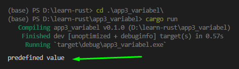
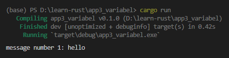
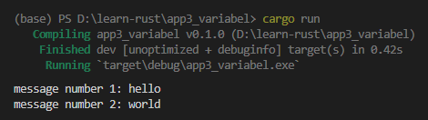

Rust merupakan bahasa yang kalau dikategorikan berdasarkan *type system*-nya adalah *statically typed*, yang artinya semua tipe data harus diketahui saat kompilasi (compile time).

Pada chapter ini kita akan belajar mengenai variabel pada Rust, cara deklarasinya, dan juga mengenai *immutability* variabel.

## A.4.1. Deklarasi variabel menggunakan `let`

Keyword `let` digunakan untuk deklarasi variabel. Notasinya kurang lebih seperti berikut. Di contoh ini sebuah variabel bernama `nama_variabel` didefinisikan dan diisi nilainya dengan sebuah string `"predefined value"`.

```rust
fn main() {
    let nama_variabel = "predefined value";
    println!(nama_variabel);
}
```

Ok, sekarang coba jalankan, dan lanjut ke pembahasan dibawah.

### ◉ Aturan penamaan variabel (naming convention)

[*Naming convention*](https://rust-lang.github.io/api-guidelines/naming.html) variabel di Rust adalah **snake case**. Nama variabel dituliskan dalam huruf kecil dengan separator tanda garis bawah atau underscore (`_`). Contohnya seperti: `nama_variabel`, `hasil_operasi_pembagian`, `kota_kelahiran`, dll.

### ◉ Macro `println` untuk print string


Error? kok bisa?

Perlu diketahui bahwa pada penggunaan macro `println`, parameter pertama wajib diisi dengan sebuah **string literal**. Contohnya seperti `"Hello, world!"`. String literal yang ditampung terlebih dahulu dalam variabel, kemudian variabel-nya di print, akan menghasilkan error, contohnya seperti di atas.

Solusinya bagaimana? ya tetap menggunakan string literal, tapi dengan menerapkan teknik **formatted print**.

Sekarang ubah kode menjadi seperti ini:

```rust
let nama_variabel = "predefined value";
println!("{}", nama_variabel);
```

Bisa dilihat argument pertama statement macro `println` adalah string literal `"{}"`. String `{}` pada macro tersebut akan di-replace dengan isi argument setelahnya, yaitu `nama_variabel`.

Jika dijalankan, maka hasilnya tidak ada error dan menampilkan output sesuai harapan.



Ok sekarang kembali ke topik, yaitu perihal variabel.

## A.4.2. *Immutability* pada variabel

Tulis kode berikut. Ada 2 variabel yang dideklarasikan, `message_number` yang isinya numerik, dan `message1` yang isinya string.

```rust
let message_number = 1;
let message1 = "hello";
println!("message number {}: {}", message_number, message1);
```

Jalankan, hasilnya tidak ada error, aman.



> O iya, jika ingin menampilkan banyak variabel via macro `println`, manfaatkan string `{}`.
>
> Tulis `{}` sejumlah variabel yang ingin ditampilkan, pada output string `{}` akan di-replace oleh variabel yang disisipkan pada argument saat pemanggilan macro `println` secara berurutan.
>
> Pada contoh di atas, string `"message number {}: {}"`<br /> ... akan menjadi `"message number {message_number}: {message1}"`<br /> ... kemudian menghasilkan `"message number 1: hello"`

Sekarang ubah isi `message_number` menjadi `2` lalu siapkan juga variabel `message2`, kurang lebih kodenya menjadi seperti berikut, kemudian jalankan.

```rust
let message_number = 1;
let message1 = "hello";
println!("message number {}: {}", message_number, message1);

message_number = 2;
let message2 = "world";
println!("message number {}: {}", message_number, message2);
```


Error? kok bisa?

Perlu diketahui, bahwa *by default* semua variabel adalah *immutable*. Immutable itu artinya gak bisa di ubah nilai/value-nya. Jadi mirip seperti konstanta.

> Variabel immutable mirip seperti konstanta, tapi sebenarnya berbeda. Akan kita bahas lebih detail di beberapa chapter berbeda perihal perbedaannya.

Lalu bagaimana cara agar nilai variabel bisa diubah? Caranya dengan menambahkan keyword `mut` (yang merupakan kependekan dari *mutable*) saat pendefinisian variabel tersebut.

## A.4.3. Keyword `mut`

Ok, mari kita coba, ubah statement deklarasi variabel `message_number`, tambahkan keyword `mut`. Lalu jalankan ulang program.

```rust
let mut message_number = 1;
let message1 = "hello";
println!("message number {}: {}", message_number, message1);

message_number = 2;
let message2 = "world";
println!("message number {}: {}", message_number, message2);
```



Ok, sekarang tidak muncul error.

Dengan menggunakan keyword `let mut` pada pendefinisian `message_number`, membuat variabel tersebut menjadi mutable atau bisa diubah nilainya.

### ◉ Argument parameter macro `println`

Selanjutnya, coba tambahkan lagi 1 message baru pada program yang sudah dibuat, lalu run.

```rust
let mut message_number = 1;
let message1 = "hello";
println!("message number {}: {}", message_number, message1);

message_number = 2;
let message2 = "world";
println!("message number {}: {}", message_number, message2);

message_number = 3;
let message3: i8 = 24;
println!("message number {1}: {0}", message3, message_number);
```


Jika dilihat ada yg berbeda pada cara deklarasi variabel `message3` dan juga pada statement `println` untuk `message3` yang disitu digunakan `{1}` dan `{0}`, tidak seperti sebelumnya yg menggunakan `{}`. Kita akan bahas yg ke-2 terlebih dahulu.

- Jika menggunakan `{}`, maka string akan di-replace sesuai urutan argument pada pemanggilan `println`.
- Jika menggunakan `{0}`, maka string akan di-replace dengan data pada argument ke `1` pemanggilan fungsi `println`, yang pada contoh di atas adalah `message3`.
- Jika menggunakan `{1}`, maka string akan di-replace dengan data pada argument ke `2` pemanggilan fungsi `println`, yang pada contoh di atas adalah `message_number`.
- Jika menggunakan `{n}`, maka string akan di-replace dengan data pada argument ke `n+1` pemanggilan fungsi `println`.

Dengan ini maka 3 statement berbeda berikut akan menghasilkan output yang sama:

```rust
println!("message number {}: {}", message_number, message3);
println!("message number {0}: {1}", message_number, message3);
println!("message number {1}: {0}", message3, message_number);
```

Sekarang perihal perbedaan cara deklarasi `message3` akan kita bahas dibawah ini.

## A.4.4. *Type Inference* vs *Manifest Typing*

Rust mendukung dua metode deklarasi variabel, yaitu *type inference* dan *manifest typing*.

### ◉ Metode *Type Inference*

Penulisan variabel dengan metode ini ditandai dengan tidak menuliskan tipe data secara jelas/eksplisit. Contoh:

```rust
let var1 = "hello" // compiler akan secara cerdas mendeteksi var1 tipe data nya string
let var2 = 12      // compiler akan secara cerdas mendeteksi var2 tipe data nya numerik
```

Metode deklarasi yang selama ini sudah kita terapkan adalah *type inference*.

### ◉ Metode *Manifest Typing*

Metode ini mewajibkan programmer untuk menuliskan secara jelas/eksplisit tipe data variabel. Contoh seperti ditandai dengan menu tidak menuliskan tipe data secara jelas/eksplisit. Contoh seperti pada praktik sebelumnya, yaitu pendefinisian `message3`.

```rust
let message3: i8 = 24;
```

Notasi penulisan tipe data adalah `namavariabel: tipedata`. Contoh seperti di atas, yaitu `let message3: i8 = 24` artinya variabel `message3` didefinisikan memiliki tipe data `i8`.

`i8` merupakan salah satu tipe data dari sekian banyak tipe data yang ada di Rust. Lebih jelasnya kita akan bahas pada chapter selanjutnya.

## A.4.5. Deklarasi variabel tanpa *predefined value*

Sesuai dengan penjelasan di [dokumentasi spesifikasi Rust](https://doc.rust-lang.org/error-index.html#E0381), **tidak diperbolehkan mendeklarasikan variabel tanpa predefined value**. Jika dipaksa akan muncul error pada baris kode yang menggunakan variabel tersebut.

## A.4.6. Deklarasi banyak variabel dalam satu statement

Di Rust memungkinkan untuk mendefinisikan banyak variabel dalam 1 baris statement. Notasi penulisannya seperti berikut:

```rust
let (var1, var2) = (24, "hello");
println!("var1: {0}", var1); // hasilnya => var1: 24
println!("var2: {0}", var2); // hasilnya => var2: hello
```

Pendefinisian banyak variabel dalam 1 statement dilakukan dengan menuliskan semua variabelnya dengan separator tanda `,` dan diapit tanda kurung `()`.

Sebagai contoh di atas 2 variabel didefinisikan, yaitu `var1` dan `var2`, dan keduanya memilik value yang berbeda tipe-datanya.

Bisa juga saat definisi variabel sekaligus ditentukan tipe data variabel, notasi penulisan bisa dilihat pada contoh kode berikut:

```rust
let (var3, var4): (i8, i8) = (32, 12);
println!("var3: {0}", var3); // hasilnya => var3: 32
println!("var4: {0}", var4); // hasilnya => var4: 12
```

Dengan notasi ini bisa juga untuk definisi variabel *mutable*. Cukup tambahkan keyword `mut` pada variabel yang ingin bisa diubah nilainya.

```rust
let (var5, mut var6, var7): (i8, i8, i8) = (64, 12, 4);
println!("var5: {0}", var5); // hasilnya => var5: 64
println!("var6: {0}", var6); // hasilnya => var6: 12
var6 = 24;
println!("var6: {0}", var6); // hasilnya => var6: 24
println!("var7: {0}", var7); // hasilnya => var7: 4
```

## A.4.7. Deklarasi variabel dengan tipe data ditentukan dari value

Ini merupakan salah satu alternatif cara penulisan untuk men-specify tipe data variabel, caranya dengan menuliskan tipe data tepat setelah value, contohnya seperti berikut:

```rust
let data1 = 24i8;
println!("data1: {0}", data1); // hasilnya => data1: 24
```

Variabel `data` didefinisikan dengan predefined value adalah numerik `24` dengan tipe data `i8`, penulisan value nya menjadi `24i8`.

Boleh juga menggunakan separator `_` dalam penulisan value-nya sebagai pembatas antara nilai dan tipe data, contoh:

```rust
let data1 = 24_i8;
println!("data1: {0}", data1); // hasilnya => data1: 24
```

## A.4.8. Variable *Shadowing*

Di Rust ada konsep bernama **variable shadowing**. Shadowing sendiri adalah pendefinisan ulang variabel yang sebelumnya sudah didefinisikan. Biasanya teknik ini dipakai untuk isolasi variabel dalam sebuah blok kode.

Contoh shadowing bisa dilihat pada kode berikut:

```rust
let x = 5;
println!("x: {}", x); // hasilnya => x: 5

let x = x + 1;
println!("x: {}", x); // hasilnya => x: 6
```

Lebih jelasnya akan kita bahas pada chapter terpisah, yaitu [Shadowing](/basic/shadowing).

---

## Catatan chapter 📑

### ◉ Work in progress

- Variabel `_`

### ◉ Source code praktik

<pre>
    <a href="https://github.com/novalagung/dasarpemrogramanrust-example/tree/master/variabel">
        github.com/novalagung/dasarpemrogramanrust-example/../variabel
    </a>
</pre>

### ◉ Chapter relevan lainnya

- [Shadowing](/basic/shadowing)
- [Macro](/wip/macro)
- [Formatted Print](/wip/formatted-print)

### ◉ Referensi

- https://doc.rust-lang.org/book/ch03-01-variables-and-mutability.html
- https://doc.rust-lang.org/rust-by-example/hello/print.html
- https://doc.rust-lang.org/rust-by-example/variable_bindings/scope.html
- https://doc.rust-lang.org/reference/variables.html
- https://rust-lang.github.io/api-guidelines/naming.html
- https://stackoverflow.com/questions/38045700/how-do-i-declare-multiple-mutable-variables-at-the-same-time

---
