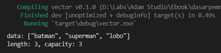
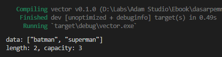
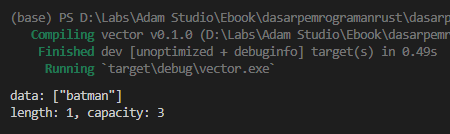
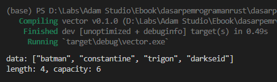
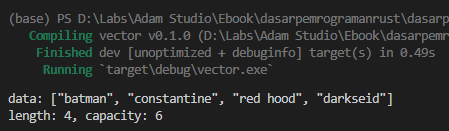
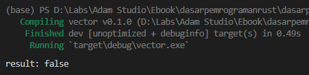
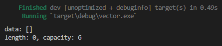
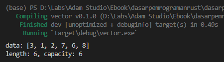
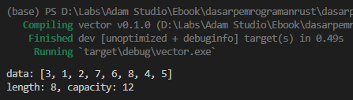
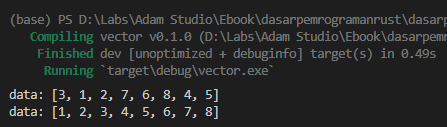

Pada chapter ini kita akan belajar tetang tipe data *Vector*. Vector adalah tipe data seperti array tapi dinamis. Dinamis di sini artinya bisa bertambah dan berkurang kapanpun sesuai kebutuhan.

Vector sangat mirip seperti array, yang karakteristiknya adalah tipe data elemen wajib sama, punya informasi size, elemen-nya bisa diakses atau diubah. Salah satu perbedaan vector dibanding array adalah jumlah elemen pada vector bisa bertambah lebih dari kapasitas yang sudah ditentukan.

Vector memiliki 3 buah atribut yg penting untuk diketahui:

- pointer ke data asli
- lebar atau size
- kapasitas (representasi dari seberapa banyak memori di-booking untuk data vector tersebut)

Vector bisa bertambah jumlah isinya selama size di bawah kapasitas yang sudah dialokasikan. Jika suatu ketika vector isinya bertambah lebih banyak dari jumlah alokasi maksimal kapasitas, maka vector akan dialokasikan ulang dengan kapasitas yang lebih besar.

## A.16.1. Tipe data `Vec<T>`

`Vec<T>` adalah tipe data yang merepresentasikan vector, yang mana `T` adalah generics. Vector datanya dialokasikan di heap memory.

> - Lebih jelasnya mengenai generic dibahas pada chapter [Generics](/basic/generics)
> - Lebih jelasnya mengenai heap dibahas pada chapter [Basic Memory Management](/basic/basic-memory-management)

Langsung saja kita praktikkan.

### ◉ Deklarasi vektor, size, dan capacity

Ada beberapa cara yang bisa dipakai untuk membuat data vector. Salah satunya adalah menggunakan macro `vec`, penulisannya seperti pembuatan array hanya saja perlu ditambahi prefix `vec!`. Contoh:

```rust
let mut data_one = vec!["batman", "superman", "lobo"];

println!("data: {:?}", data_one);
println!("length: {}, capacity: {}", data_one.len(),  data_one.capacity());
```



Pada contoh di atas variabel `data_one` adalah sebuah vector yang isinya 3 elemen, yaitu literal string `batman`, `superman`, dan `lobo`. Vector `data_one` dideklarasikan menggunakan macro `vec` kemudiaan diikuti notasi penulisan yang mirip seperti array.

> Lebih jelasnya mengenai macro dibahas pada chapter [Macro](#/wip/macro)

Pembuatan vector menggunakan teknik ini hasilnya adalah data vector yang `size` dan `capacity` nya adalah sesuai dengan *predefined value*, yang pada konteks ini adalah 3.

Umumnya vector dideklarasikan dengan keyword `mut` agar bisa diubah nilainya, karena tujuan disediakannya tipe data ini adalah untuk bisa mengakomodir tipe data array tetapi dinamis (bisa manipulasi datanya).

Perihal method `len` dan `capacity`:

- Method `len` digunakan untuk mencari tahu size atau jumlah elemen yang ada pada sebuah vector
- Method `capacity` digunakan untuk mencari tahu kapasitas atau jumlah maksimum elemen yang ada pada sebuah vector

> O iya, kode program di atas akan menghasilkan warning saat di-run. Hal ini dikarenakan variabel `data_one` yang didefinisikan mutable belum diubah nilainya. Hiraukan saja, karena selanjutnya kita akan manipulasi data variabel tersebut.

### ◉ Method `pop` ➜ menghapus elemen terakhir

Oke, selanjutnya mari kita oprek variabel `data_one` yang sudah ditulis.

Tipe data `Vec<T>` memiliki method `pop` yang fungsinya menghapus data elemen terakhir. Mari gunakan method ini pada `data_one`.

```rust
data_one.pop();

println!("data: {:?}", data_one);
println!("length: {}, capacity: {}", data_one.len(),  data_one.capacity());
```



Bisa dilihat pada contoh di atas, setelah menggunakan method `pop`, isi `data_one` menjadi 2 elemen saja. Elemen terakhir (yaitu string `lobo`) dihapus. Efeknya, atribut size menjadi 2, tapi kapasitas tetap 3.

### ◉ Method `remove` ➜ menghapus elemen index ke `I`

Method `remove` adalah salah satu method lainnya yang ada pada tipe data `Vec<T>`. Kegunaan dari method `remove` adalah untuk menghapus elemen pada indeks tertentu.

```rust
data_one.remove(1);

println!("data: {:?}", data_one);
println!("length: {}, capacity: {}", data_one.len(),  data_one.capacity());
```



Dicontohkan di atas elemen indeks ke-`1` dihapus dengan cara memanggil method `remove` lalu menyisipkan indeks elemen sebagai parameter pemanggilan method. Hasilnya elemen `superman` dihapus dari vector.

### ◉ Method `push` ➜ menambahkan elemen baru

Sekarang isi dari vector `data_one` tinggal 1 elemen, mari kita tambahkan 3 elemen baru dengan memanfaatkan method `push`.

Method `push` fungsinya adalah untuk menambahkan elemen baru pada vector.

```rust
data_one.push("constantine");
data_one.push("trigon");
data_one.push("darkseid");

println!("data: {:?}", data_one);
println!("length: {}, capacity: {}", data_one.len(),  data_one.capacity());
```



Bisa dilihat sekarang `data_one` isinya adalah 4 elemen dan atribut size-nya cocok, yaitu `4`. Namun ada yang aneh, kenapa kapasitas jadi `6` padahal di awal kapasitas adalah 3.

### ◉ Realokasi vector

Perubahan kapasitas atau realokasi vector terjadi ketika sebuah vector isinya bertambah lebih banyak dari jumlah alokasi maksimal kapasitas.

Lalu apa efeknya? secara high level bisa dibilang tidak ada, namun kalau dibahas lebih rinci, efeknya adalah di sisi alokasi space untuk menampung elemen. Proses realokasi menghasilkan vector yang baru dengan kapasitas lebih besar.

### ◉ Mengubah value sebuah elemen menggunakan notasi `[i]`

Sama seperti array, vector juga bisa dimodifikasi nilai elemennya dengan menggunakan notasi `[i]`.

Pada contoh berikut elemen indeks ke-`2` diubah nilainya dari `trigon` ke `red hood`.

```rust
data_one[2] = "red hood";

println!("data: {:?}", data_one);
println!("length: {}, capacity: {}", data_one.len(),  data_one.capacity());
```



### ◉ Method `is_empty` ➜ mengecek apakah vector kosong

Method `is_empty` digunakan untuk mengidentifikasi apakah sebuah vector isinya kosong atau tidak.

```rust
let is_vector_empty = data_one.is_empty();
println!("result: {:?}", is_vector_empty);
```



### ◉ Method `clear` ➜ mengosongkan isi vector

Method `clear` digunakan untuk mengosongkan sebuah vektor.

```rust
data_one.clear();
println!("data: {:?}", data_one);
println!("length: {}, capacity: {}", data_one.len(),  data_one.capacity());
```



### ◉ Method `append` ➜ concatenation/penggabungan vector

Method `append` digunakan untuk menggabungkan dua buah vector. Penggunaannya cukup mudah, panggil saja method nya lalu sisipkan *mutable reference* dari vector satunya.

```rust
let mut result_one = vec![3, 1, 2];

let mut data_two = vec![7, 6, 8];
result_one.append(&mut data_two);

println!("data: {:?}", result_one);
println!("length: {}, capacity: {}", result_one.len(),  result_one.capacity());
```



Pada contoh di atas `result_one` adalah vector mutable dengan isi 3 elemen. Kemudian dideklarasikan `data_two` yang isinya juga vector 3 elemen. Vector `data_two` dimasukkan kedalam vector `result_one` dengan menggunakan method `append`, dengan ini maka isi `result_one` adalah gabungan dari `result_one` yang lama dan `data_two`.

Proses append vector mengharuskan parameter method `append` diisi dengan *mutable reference* dari vector yang ingin dimasukkan. Cara untuk mengambil *mutable reference* adalah dengan menggunakan keyword `&mut`.

Ok, selanjutnya tambahkan lagi isi `result_one` dengan vector lain.

```rust
result_one.append(&mut vec![4, 5]);

println!("data: {:?}", result_one);
println!("length: {}, capacity: {}", result_one.len(),  result_one.capacity());
```



Proses penggabungan vector pada contoh ke-dua di atas sedikit berbeda. Method `append` parameternya adalah langsung *mutable reference* dari literal vector. Ini merupakan salah satu cara yang bisa digunakan dalam penggabungan vector.

### ◉ Method `sort` ➜ untuk mengurutkan vector

Method `sort` digunakan untuk mengurutkan elemen vector.

```rust
println!("data: {:?}", result_one);
result_one.sort();
println!("data: {:?}", result_one);
```



## A.16.2. Macam deklarasi vektor

Ada beberapa cara deklarasi vector. Pada contoh berikut dua buah vector dideklarasikan menggunakan macro `vec!`.

```rust
let mut vector_4 = vec![1, 2, 3];
let mut vector_5: Vec<i64> = vec![1, 2, 3];
```

Vector `vector_4` didefinisikan dengan cara yang sudah kita terapkan sebelumnya, yaitu menggunakan macro `vec`. Vector `vector_5` juga didefinisikan dengan cara yang sama, hanya saja pada vector ini tipe datanya ditentukan secara eksplisit yaitu `Vec<i64>`.

`Vec<i64>` Artinya adalah vector dengan tipe data elemen adalah `i64`. Dengan notasi penulisan `Vec<T>` bisa ditentukan tipe data elemen yang diinginkan.

Cara deklarasi vector selanjutnya adalah pembuatan vector dengan isi kosong. Deklarasi vector ini mewajibkan tipe data vector dituliskan secara eksplisit, dikarenakan tipe data tidak bisa diidentifikasi dari isinya (karena isinya kosong). Contoh:

```rust
let mut vector_7: Vec<&str> = vec![];
let mut vector_8: Vec<&str> = Vec::new();
```

Vector `vector_7` dan `vector_8` keduanya bertipe vector dengan isi atau elemen bertipe data literal string `&str`.

Deklarasi vector kosong bisa dilakukan dengan macro `vec` yang ditulis tanpa isi, atau bisa menggunakan `Vec::new()`.

## A.16.3. Iterasi data vector

Keyword `for in` bisa digunakan untuk iterasi vector. Cara penerapannya seperti pada array atau slice.

```rust
let vec_eight = vec![1, 2, 3];
for e in vec_eight {
    print!("{e} ");
}

// 1 2 3
```

```rust
let vec_nine = vec![1, 2, 3];
for i in 0..vec_nine.len() {
    print!("{} ", vec_nine[i]);
}

// 1 2 3
```

Keyword perulangan lainnya juga bisa digunakan.

## A.16.4. Ownership tipe data vector

Salah satu atribut vector yang penting untuk diketahui adalah, pemilik data sebenarnya (atau owner). Agar lebih jelas, silakan coba terlebih dahulu kode berikut.

```rust
let vec_ten = vec![1, 2, 3];
for e in vec_ten {
    print!("{e} ");
}
for i in 0..vec_ten.len() {
    print!("{} ", vec_ten[i]);
}
```


Terlihat sekilas tidak ada kode yang bermasalah dari program di atas, tapi error, aneh.

Di Rust, ownership atau kepemilikan data adalah hal yang sangat penting. Saking pentingnya, beberapa orang menyebut Rust sebagai bahasa yang *value oriented*.

Dalam kasus kode program vector di atas, ketika keyword `for in` digunakan untuk mengiterasi vector `vec_ten`, membuat pemilik data vektor berpindah ke variabel `e`. Hal ini efeknya adalah ketika kita berusaha mengakses variabel yang sama setelah perulangan selesai, maka yang muncul adalah error, karena value-nya sudah berpindah.

> Perpindahan owner disebut dengan *move semantics*. Lebih jelasnya nanti dibahas pada chapter [Ownership](/basic/ownership)

Solusi untuk antisipasi error ini adalah dengan cara meminjam value yang sebenarnya dari owner, untuk kemudian digunakan dalam perulangan. Caranya dengan menggunakan teknik *borrowing* menggunakan operator `reference` yaitu `&`. Data sebenarnya milik owner dipinjam untuk dipergunakan di perulangan.

> - Lebih jelasnya mengenai reference dibahas pada chapter [Pointer & References](/basic/pointer-references)
> - Lebih jelasnya mengenai borrowing dibahas pada chapter [Borrowing](/basic/borrowing)

Silakan ubah kode yang sebelumnya ...

```rust
for e in vec_ten {
    print!("{e} ");
}
```

... menjadi seperti ini, kemudian run, maka error akan hilang.

```rust
for e in &vec_ten {
    print!("{e} ");
}
```

Salah satu alternatif cara lainnya untuk antisipasi value berpindah tempat adalah dengan menggunakan method `iter` untuk mengkonversi vector menjadi iterator. Jadi yang di-iterasi bukan vector-nya, melainkan objek iterator yang dibuat dari vector tersebut.

```rust
for e in vec_ten.iter() {
    print!("{e} ");
}
```

> - Lebih jelasnya mengenai *ownership* dibahas pada chapter [Ownership](/basic/ownership)
> - Lebih jelasnya mengenai *borrowing* dibahas pada chapter [Borrowing](/basic/borrowing)

## A.16.5. Vector slice

Seperti array, slice juga bisa dibuat dari vector. Cara penerapannya juga sama persis. Contoh:

```rust
let vec_population = vec![2, 1, 3];
let vec_sample = &vec_population[0..1];
println!("{:?}", vec_sample); // [2]
```

Semua operasi slice bisa diterapkan di vector.

## A.16.6. Tipe data `VecDeque<T>`

Tipe data `VecDeque<T>` adalah sama seperti `Vec<T>` plus mendukung operasi menambah dan mengurangi elemen dari dua sisi secara efisien.

Pada tipe data `Vec<T>`, ada method `pop` yang fungsinya menghapus data elemen terakhir dan method `push` untuk menambah elemen baru dari kanan. Tipe data `VecDeque` memiliki bebebrapa method tambahan, yaitu:

- method `pop_front` untuk hapus data elemen pertama atau paling kiri (indeks ke-0)
- method `push_front` untuk menambah data dari kiri (indeks ke-0)
- method `pop_back` untuk hapus data elemen pertama atau paling kanan (indeks terakhir)
- method `push_back` untuk menambah data dari kanan (indeks terakhir)

Contoh penerapan:

```rust
use std::collections::VecDeque;

let mut vec_10 = VecDeque::from(vec!["a", "b", "c"]);

vec_10.pop_front();
vec_10.push_front("z");
println!("data: {:?}", vec_10);

vec_10.pop_back();
vec_10.push_back("h");
println!("data: {:?}", vec_10);
```


Tipe data `VecDeque<T>` tidak otomatis di-import. Kita perlu mengimport path di mana tipe data tersebut berada menggunakan keyword `use`.

```rust
use std::collections::VecDeque;
```

Cara membuat vector `VecDeque<T>` bisa menggunakan `VecDeque::from` dengan parameter diisi data vectornya, seperti pada kode program yang sudah ditulis.

---

## Catatan chapter 📑

### ◉ Source code praktik

<pre>
    <a href="https://github.com/novalagung/dasarpemrogramanrust-example/tree/master/vector">
        github.com/novalagung/dasarpemrogramanrust-example/../vector
    </a>
</pre>

### ◉ Referensi

- https://doc.rust-lang.org/std/macro.vec.html
- https://doc.rust-lang.org/std/vec/struct.Vec.html
- https://doc.rust-lang.org/rust-by-example/std/vec.html
- https://doc.rust-lang.org/std/collections/struct.VecDeque.html
- https://stackoverflow.com/questions/36672845/in-rust-is-a-vector-an-iterator
- https://stackoverflow.com/questions/28800121/what-do-i-have-to-do-to-solve-a-use-of-moved-value-error
- https://stackoverflow.com/questions/43036279/what-does-it-mean-to-pass-in-a-vector-into-a-for-loop-versus-a-reference-to-a
